# Drawing Geometric Shapes (Shape)

The drawing component is used to render shapes on a page. The Shape component serves as the parent component for all drawing components, encapsulating common properties supported by all drawing components. For specific usage, please refer to [Shape](../reference/arkui-cj/cj-graphic-drawing-shape.md).

## Creating Drawing Components

Drawing components can be created in the following two forms:

- Drawing components use Shape as the parent component to achieve SVG-like effects. The interface call is as follows:

  ```cangjie
  init()

  init(target: PixelMap)
  ```

  This interface is used to create drawing components with a parent component, where `target` specifies the drawing target. It allows rendering graphics onto a specified PixelMap object. If not set, the graphics will be drawn on the current drawing target.

  ```cangjie
  Shape() {
      Rect().width(300).height(50)
  }
  ```

- Drawing components can be used independently to render specified shapes on a page. There are 7 types of drawing components: [Circle](../reference/arkui-cj/cj-graphic-drawing-circle.md), [Ellipse](../reference/arkui-cj/cj-graphic-drawing-ellipse.md), [Line](../reference/arkui-cj/cj-graphic-drawing-line.md), [Path](../reference/arkui-cj/cj-graphic-drawing-path.md), and [Rect](../reference/arkui-cj/cj-graphic-drawing-rect.md). Taking the Circle interface as an example:

  ```cangjie
  Circle()

  Circle(width!: Length, height!: Length)
  ```

  This interface is used to draw a circle on the page, where `width` sets the circle's width and `height` sets its height. The circle's diameter is determined by the smaller of the two dimensions.

  ```cangjie
  Circle(width: 150, height: 150)
  ```

  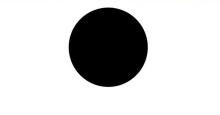

## Shape Viewport

```cangjie
viewPort(x!: Length, y!: Length, width!: Length, height!: Length)
```

The shape viewport specifies a rectangle in user space that maps to the viewport boundaries established for the associated SVG element. The viewport property includes four optional parameters: `x` and `y` represent the top-left corner coordinates, while `width` and `height` define its dimensions.

The following three examples illustrate the usage of viewport:

- Scaling graphics using the viewport.

 <!-- run -->

  ```cangjie
  package ohos_app_cangjie_entry

  import ohos.base.*
  import ohos.arkui.component.*
  import ohos.arkui.state_management.*
  import ohos.arkui.state_macro_manage.*

  @Entry
  @Component
  class EntryView {
      func build() {
          Column() {
              Row() {
                  Column {
                      // Draw a circle with width and height of 75
                      Text('Original Size Circle Component')
                      Circle(width: 75, height: 75).fill(0XE87361)
                  }
              }
              Row() {
                  Column {
                      // Create a Shape component with width and height of 150, yellow background, and a viewport of 75x75. Fill the viewport with a blue rectangle and draw a circle with a diameter of 75 inside it.
                      // After drawing, the viewport will scale up by a factor of 2 based on the component dimensions.
                      Text('Scaled-Up Circle Component in Shape')
                      Shape() {
                          Rect().width(100.percent).height(100.percent).fill(0X0097D4)
                          Circle(width: 75, height: 75).fill(0XE87361)
                      }
                      .viewPort(x: 0, y: 0, width: 75, height: 75)
                      .width(150)
                      .height(150)
                      .backgroundColor(0XF5DC62)
                  }
                  Column {
                      // Create a Shape component with width and height of 150, yellow background, and a viewport of 300x300. Fill the viewport with a green rectangle and draw a circle with a diameter of 75 inside it.
                      // After drawing, the viewport will scale down by a factor of 2 based on the component dimensions.
                      Text('Scaled-Down Circle Component in Shape')
                      Shape() {
                          Rect().width(100.percent).height(100.percent).fill(0XBDDB69)
                          Circle(width: 75, height: 75).fill(0XE87361)
                      }
                      .viewPort(x: 0, y: 0, width: 300, height: 300)
                      .width(150)
                      .height(150)
                      .backgroundColor(0XF5DC62)
                  }
              }
          }.width(100.percent)
      }
  }
  ```

  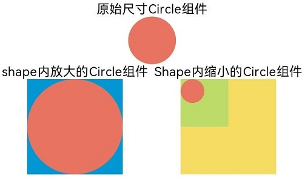

- Create a Shape component with width and height of 300, yellow background, and a viewport of 300x300. Fill the viewport with a blue rectangle and draw a circle with a radius of 75 inside it.

 <!-- run -->

  ```cangjie
  package ohos_app_cangjie_entry

  import ohos.base.*
  import ohos.arkui.component.*
  import ohos.arkui.state_management.*
  import ohos.arkui.state_macro_manage.*

  @Entry
  @Component
  class EntryView {
      func build() {
          Column() {
              Shape() {
                  Rect().width(100.percent).height(100.percent).fill(0X0097D4)
                  Circle( width: 150, height: 150 ).fill(0XE87361)
              }
              .viewPort(x: 0, y: 0, width: 300, height: 300)
              .width(300)
              .height(300)
              .backgroundColor(0XF5DC62)
          }.width(100.percent)
      }
  }
  ```

  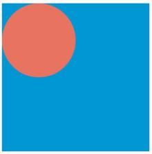

- Create a Shape component with width and height of 300, yellow background, and a viewport of 300x300. Fill the viewport with a blue rectangle and draw a circle with a radius of 75 inside it. Translate the viewport 150 units right and 150 units down.

 <!-- run -->

  ```cangjie
  package ohos_app_cangjie_entry

  import ohos.base.*
  import ohos.arkui.component.*
  import ohos.arkui.state_management.*
  import ohos.arkui.state_macro_manage.*

  @Entry
  @Component
  class EntryView {
      func build() {
          Column() {
              Shape() {
                  Rect().width(100.percent).height(100.percent).fill(0X0097D4)
                  Circle( width: 150, height: 150 ).fill(0XE87361)
              }
              .viewPort(x: -150, y: -150, width: 300, height: 300)
              .width(300)
              .height(300)
              .backgroundColor(0XF5DC62)
          }.width(100.percent)
      }
  }
  ```

  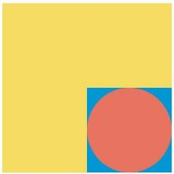

## Custom Styles

Drawing components support style customization through various properties.

- Use [fill](../reference/arkui-cj/cj-graphic-drawing-common.md#func-fillresourcecolor) to set the fill color of the component.

  ```cangjie
  Path()
      .width(100)
      .height(100)
      .commands('M150 0 L300 300 L0 300 Z')
      .fill(0xE87361)
      .strokeWidth(0)
  ```

  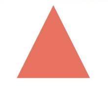

- Use [stroke](../reference/arkui-cj/cj-graphic-drawing-common.md#func-strokeresourcecolor) to set the border color of the component.

  ```cangjie
  Path()
      .width(100)
      .height(100)
      .fillOpacity(0.0)
      .commands('M150 0 L300 300 L0 300 Z')
      .stroke(Color.Red)
  ```

  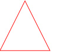

- Use [strokeOpacity](../reference/arkui-cj/cj-graphic-drawing-common.md#func-strokeopacityappresource) to set the border transparency.

  ```cangjie
  Path()
      .width(100)
      .height(100)
      .fillOpacity(0.0)
      .commands('M150 0 L300 300 L0 300 Z')
      .stroke(Color.Red)
      .strokeWidth(10)
      .strokeOpacity(0.2)
  ```

  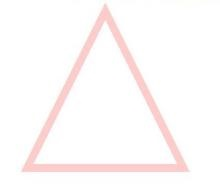

- Use [antiAlias](../reference/arkui-cj/cj-graphic-drawing-common.md#func-antialiasbool) to enable or disable anti-aliasing. The default value is `true` (anti-aliasing enabled).

  ```cangjie
  // Enable anti-aliasing
  Circle()
      .width(150)
      .height(200)
      .fillOpacity(0.0)
      .strokeWidth(5)
      .stroke(Color.Black)
  ```

  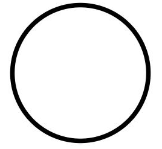

  ```cangjie
  // Disable anti-aliasing
  Circle()
      .width(150)
      .height(200)
      .fillOpacity(0.0)
      .strokeWidth(5)
      .stroke(Color.Black)
      .antiAlias(false)
  ```

  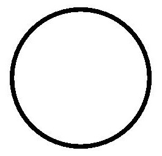

## Usage Examples

### Drawing a Closed Path

Draw a closed path at point (-80, -5) within a Shape, with fill color 0x317AF7, line width 3, red border, and sharp corners (default).

 <!-- run -->

```cangjie
package ohos_app_cangjie_entry

import kit.ArkUI.*
import ohos.arkui.state_macro_manage.*

@Entry
@Component
class EntryView {
    func build() {
        Column(space: 10) {
            Shape() {
                Path().width(200).height(60).commands('M0 0 L400 0 L400 150 Z')
            }
            .viewPort( x: -80, y: -5, width: 500, height: 300 )
            .fill(0x317AF7)
            .stroke(Color.Red)
            .strokeWidth(3)
            .strokeLineJoin(LineJoinStyle.Miter)
            .strokeMiterLimit(5.0)
        }.width(100.percent).margin( top: 15 )
    }
}
```

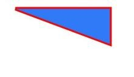

### Drawing a Circle and a Ring

Draw a circle with a diameter of 150 and a ring with a diameter of 150 and a red dashed border (when width and height differ, the shorter dimension determines the diameter).

 <!-- run -->

```cangjie
package ohos_app_cangjie_entry

import kit.ArkUI.*
import ohos.arkui.state_macro_manage.*

@Entry
@Component
class EntryView {
    func build() {
        Column(space: 10) {
            // Draw a circle with a diameter of 150
            Circle( width: 150, height: 150 )
            // Draw a ring with a diameter of 150 and a red dashed border
            Circle()
                .width(150)
                .height(200)
                .fillOpacity(0.0)
                .strokeWidth(3)
                .stroke(Color.Red)
                .strokeDashArray([1, 2])
        }.width(100.percent).margin( top: 15 )
    }
}
```

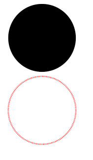