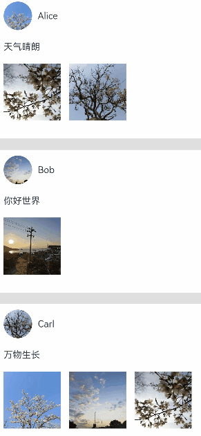

# Shared Element Transition (One-Shot Effect)

Shared element transition is an animation effect that matches the position and size of identical or similar elements during interface switching, also known as the one-shot effect.

As shown in the following example, when clicking an image, it disappears while a new image appears at another position with identical content. A one-shot transition effect can be applied between them. The left image shows the effect without one-shot transition, while the right image demonstrates the effect with one-shot transition. The one-shot effect creates a coordinated appearance and disappearance between elements, making content switching appear fluid and natural rather than abrupt.

|||
| ---- | ---- |

There are multiple implementation methods for the one-shot effect. During actual development, appropriate methods should be selected based on specific scenarios.

Below is a comparison of different implementation approaches:

| One-Shot Implementation Method | Characteristics | Applicable Scenarios |
| :----- | :----- | :----- |
| Directly modifying the original container without creating a new one | No route jumping occurs. Both expanded and collapsed states need to be implemented within a single component, with the component hierarchy remaining unchanged after expansion. | Suitable for simple scenarios with minimal transition overhead, such as opening pages that don't require loading large amounts of data or components. |
| Using geometryTransition for shared element transition | Leverages system capabilities. Both pre- and post-transition components call the geometryTransition interface with the same ID, while placing the transition logic within the animateTo animation closure. The system automatically adds one-shot transition effects between them. | The system adjusts the width, height, and position of the two bound components to identical values while switching their opacity to achieve the one-shot transition effect. To ensure smooth animation, it's necessary to guarantee no abrupt changes when adding width/height animations to nodes bound with geometryTransition. This method is suitable for scenarios with minimal overhead when creating new nodes. |

## Modifying Original Components Without Creating New Ones

This method doesn't create new containers but triggers [transition](../../../en/application-dev/reference/arkui-cj/cj-animation-transition.md#func-transition) by adding or removing components from existing containers, combined with component [property animations](./cj-attribute-animation-apis.md) to achieve the one-shot effect.

For scenarios where the same container expands while sibling components disappear or appear, the one-shot effect can be achieved by applying property animations to the container's width, height, and position changes before and after expansion, while configuring appear/disappear transition animations for sibling components. The basic steps are:

1. Construct the page to be expanded and build interfaces for both normal and expanded states using state variables.

2. Expand the target page, control the disappearance or appearance of sibling components through state variables, and implement transition effects for sibling components by binding appear/disappear transitions.

Taking the scenario of clicking a card to display detailed content as an example:

 <!--run-->

```cangjie
package ohos_app_cangjie_entry

import kit.ArkUI.*
import ohos.arkui.ui_context.*
import ohos.arkui.state_macro_manage.*
import ohos.resource_manager.*
import std.collection.ArrayList

let storage: LocalStorage = LocalStorage()

class PostData{
    public var avatar: AppResource = @r(app.media.foreground)
    public var name: String = ""
    public var message: String = ""
    public var images: Array<AppResource> = []

    public init(avatar: AppResource,name:String,message: String,images: Array<AppResource>) {
        this.avatar = avatar
        this.name = name
        this.message = message
        this.images = images
    }
}

@Entry
@Component
class EntryView {
    @State var isExpand: Bool = false
    @State @Watch[onItemClicked] var selectedIndex: Int64 = -1

    private var allPostData: Array<PostData> = [
        PostData(@r(app.media.startIcon),"Alice","天气晴朗",[@r(app.media.startIcon), @r(app.media.startIcon)] ),
        PostData(@r(app.media.startIcon),"Bob","你好世界",[@r(app.media.startIcon)]),
        PostData(@r(app.media.startIcon),"Carl","万物生长",[@r(app.media.startIcon),@r(app.media.startIcon),@r(app.media.startIcon)])
        ]

    private func onItemClicked():Unit {
        if(this.selectedIndex<0){
            return
        }
        getUIContext().animateTo(
            AnimateParam(duration: 350,curve: Curve.Friction),
            {
                => this.isExpand = !this.isExpand
            }
        )
    }

    func build() {
        Column(){
            ForEach(this.allPostData,itemGeneratorFunc:{postData: PostData,index: Int64
                    =>
                    // When a post is clicked, other posts will disappear from the tree
                    if(!this.isExpand || this.selectedIndex==index){
                        Column(){
                           Post(data:postData,selecteIndex: this.selectedIndex,index: index)
                        }
                        .width(100.percent)
                        // Add opacity and displacement transition effects for appearing/disappearing posts
                        .transition(TransitionEffect.OPACITY
                                    .combine(TransitionEffect.translate(TranslateOptions(x:250.0,y:250.0,z:250.0)))
                                    .animation(AnimateParam(duration: 350,curve: Curve.Friction)))
                    }
                }
             )
        }
        .size(width: 100.percent, height: 100.percent)
        .backgroundColor(Color.Gray)
    }
}

@Component
class Post{
    @Link var selecteIndex:Int64

    @Prop var data:PostData
    @Prop var index:Int64

    @State var itemHeight: Int64 = 250
    @State var isExpand: Bool = false
    @State var expandImageSize: Int64 = 100
    @State var avatarSize: Int64 = 50

    public func build(){
        Column(){
            Row(){
                Image(this.data.avatar)
                    .size(width: this.avatarSize,height: this.avatarSize)
                    .borderRadius(this.avatarSize/2)
                    .clip(true)
                Text(this.data.name)
            }.justifyContent(FlexAlign.Start)

            Text(this.data.message)

            Row(){
                ForEach(this.data.images,itemGeneratorFunc:{imageResource: AppResource,index: Int64
                        =>
                        Image(imageResource).size(width: this.expandImageSize,height: this.expandImageSize)
                        }
                    )
            }
            if(this.isExpand){
                Column(){
                    Text("Comment Section")
                    // Add appear/disappear transition effects for comment section text
                    .transition(TransitionEffect.OPACITY.animation(AnimateParam(duration: 350,curve: Curve.Friction)))
                    .padding(top: 10)
                }.transition(TransitionEffect.asymmetric(TransitionEffect.opacity(0.99).animation(AnimateParam(duration: 350,curve: Curve.Friction)),TransitionEffect.OPACITY.animation(AnimateParam(duration:0))))
                .size(width: 100.percent, height: 20.percent)
            }
        }
        .backgroundColor(Color.White)
        .size(width: 100.percent, height: this.itemHeight)
        .alignItems(HorizontalAlign.Start)
        .padding(left:10,top:10)
        .onClick{
            evt =>
                this.selecteIndex = -1
                this.selecteIndex = this.index
                getUIContext().animateTo(AnimateParam(duration:350,curve:Curve.Friction),{
                    =>
                    // Apply width/height animations to expanded posts, and add animations for avatar and image sizes
                    this.isExpand = !this.isExpand
                    if(this.isExpand){
                        this.itemHeight = 780
                        this.avatarSize = 75
                    }else{
                        this.itemHeight = 250
                        this.avatarSize = 50
                    }

                    if(this.isExpand && this.data.images.size > 0){
                        this.expandImageSize = (360 - (this.data.images.size + 1)*15)/this.data.images.size
                    }else{
                        this.expandImageSize = 100
                    }
                })
        }
    }
}
```


## Using geometryTransition for Shared Element Transition

[geometryTransition](../../../en/application-dev/reference/arkui-cj/cj-animation-geometrytransition.md) is used for implicit shared element transitions within components, providing smooth context inheritance during view state switching.

To use geometryTransition, bind two components that need the one-shot effect with the same ID through the geometryTransition interface. When one component disappears while another appears, the system will automatically add the one-shot transition effect between them.

The implementation approach of geometryTransition binding two objects distinguishes it from other methods, making it most suitable for achieving one-shot effects between two different objects.

### Basic Usage of geometryTransition

For achieving one-shot effects between two elements on the same page, here's a simple example of using the geometryTransition interface:

 <!-- run-->

```cangjie
package ohos_app_cangjie_entry

import kit.ArkUI.*
import ohos.arkui.ui_context.*
import ohos.arkui.state_macro_manage.*
import kit.LocalizationKit.*

@Entry
@Component
class EntryView {
    @State var isShow: Bool = false
    func build() {
        Stack(alignContent: Alignment.Center) {
            if (this.isShow) {
                Image(@r(app.media.startIcon))
                    .autoResize(false)
                    .clip(true)
                    .width(200)
                    .height(200)
                    .borderRadius(100)
                    .geometryTransition("picture")
                    .transition(TransitionEffect.OPACITY)
                    .id("item1")
            } else {
                Column() {
                    Column() {
                        Image(@r(app.media.startIcon))
                            .width(100.percent).height(100.percent)
                    }.width(100.percent).height(100.percent)
                }
                .width(100)
                .height(100)
                // geometryTransition synchronizes corner radius, but only for the bound container itself
                // It won't affect the borderRadius of child components within the container
                .borderRadius(20)
                .clip(true)
                .position(x:40,y:40)
                .geometryTransition("picture")
                // transition ensures nodes aren't immediately destroyed when leaving, setting general transition effects
                .transition(TransitionEffect.OPACITY)
                .id("item2")
            }
        }
        .onClick({
            event => getUIContext().animateTo(AnimateParam(duration:1000,curve:Curve.Linear), ({=>this.isShow = !this.isShow}))
        })
        .size(width:100.percent,height:100.percent)
    }
}
```


### Combining geometryTransition with Modal Transitions

In more scenarios, one-shot effects need to be applied between elements from different pages. This can be achieved by combining geometryTransition with modal transition interfaces. Taking the example of clicking an avatar to display a personal information page:

 <!--run-->

```cangjie
package ohos_app_cangjie_entry

import kit.ArkUI.*
import ohos.arkui.ui_context.*
import ohos.arkui.state_macro_manage.*
import ohos.resource_manager.AppResource
import std.collection.ArrayList
import kit.PerformanceAnalysisKit.Hilog

let storage: LocalStorage = LocalStorage()

class PostData{
    public var avatar: AppResource = @r(app.media.foreground)
    public var name: String = ""
    public var message: String = ""
    public var images: Array<AppResource> = []

    public init(avatar: AppResource,name:String,message: String,images: Array<AppResource>) {
        this.avatar = avatar
        this.name = name
        this.message = message
        this.images = images
    }
}

@Entry
@Component
class EntryView {
    @State var isPersonalPageShow: Bool = false;
    @State var selectedIndex: Int = 0
    @State var alphaValue: Float64 = 1.0

    private var allPostData: Array<PostData> = [
        PostData(@r(app.media.startIcon),"Alice","天气晴朗",[@r(app.media.startIcon), @r(app.media.startIcon)] ),
        PostData(@r(app.media.startIcon),"Bob","你好世界",[@r(app.media.startIcon)]),
        PostData(@r(app.media.startIcon),"Carl","万物生长",[@r(app.media.startIcon),@r(app.media.startIcon),@r(app.media.startIcon)])
        ]

    public func onAppear() {
        Hilog.info(0, "cangjie", "BindContentCover onAppear.")
    }
    public func onDisappear() {
        Hilog.info(0, "cangjie", "BindContentCover onDisappear.")
    }

    private func onAvatarClicked(index: Int):Unit {
        this.selectedIndex = index
        getUIContext().animateTo(
            AnimateParam(duration: 350,curve: Curve.Friction),
            {
                =>
                this.isPersonalPageShow = !this.isPersonalPageShow
                this.alphaValue = 0.0
            }
        )
    }

    private func onPersonalPageBack(index: Int):Unit{
        getUIContext().animateTo(AnimateParam(duration: 350,curve: Curve.Friction),{
            =>
            this.isPersonalPageShow = !this.isPersonalPageShow;
            this.alphaValue = 1.0;
        })
    }

    @Builder
    public func PersonalPageBuilder(){
        Column(){
            Image(this.allPostData[this.selectedIndex].avatar)
            .size(width:200,height:200)
            .borderRadius(100)
            // Configure shared element effect for avatar, matching the ID of the clicked avatar
            .geometryTransition(this.selectedIndex.toString())
            .clip(true)
            .transition(TransitionEffect.opacity(0.99))

            Text(this.allPostData[this.selectedIndex].name)
            // Add appear transition effect for text
            .transition(TransitionEffect.asymmetric(
                TransitionEffect.OPACITY.combine(TransitionEffect.translate(TranslateOptions(x:100,y:100,z:100))),
                TransitionEffect.OPACITY.animation(AnimateParam(duration: 0))))

            Text("Hello, I'm ${this.allPostData[this.selectedIndex].name}")
            .transition(TransitionEffect.asymmetric(
                TransitionEffect.OPACITY.combine(TransitionEffect.translate(TranslateOptions(x:100,y:100,z:100))),
                TransitionEffect.OPACITY.animation(AnimateParam(duration: 0))))
        }
        .padding(20)
        .size(width:360,height:780)
        .backgroundColor(Color.White)
        .onClick{
            evt =>
            this.onPersonalPageBack(this.selectedIndex)
        }
        .transition(TransitionEffect.asymmetric(
            TransitionEffect.opacity(0.99),TransitionEffect.OPACITY
        ))
    }

    func build() {
        Column(){
            ForEach(this.allPostData,itemGeneratorFunc:{postData: PostData,index: Int
                =>
                Column(){
                    Post(data:postData,index: index,postOnAvatarClicked: this.onAvatarClicked)
                    }.width(100.percent)
                }
             )
        }
        .size(width: 100.percent, height: 100.percent)
        .backgroundColor(Color.Gray)
        .bindContentCover(this.isPersonalPageShow, this.PersonalPageBuilder,
            options: ContentCoverOptions(
            modalTransition: ModalTransition.None,
            onAppear: onAppear,
            onDisappear: onDisappear)
            )
        .opacity(this.alphaValue)
    }
}

@Component
class Post{
    @Prop var data: PostData
    @Prop var index: Int

    @State var expandImageSize: Int = 100
    @State var avatarSize: Int = 50

    let postOnAvatarClicked: (Int) -> Unit

    public func build(){
         Column(){
            Row(){
                Image(this.data.avatar)
                .size(width: this.avatarSize,height: this.avatarSize)
                .borderRadius(this.avatarSize/2)
                .clip(true)
                .onClick{
                        evt =>
                        this.postOnAvatarClicked(this.index)
                }
                // Bind shared element transition ID for avatar
                .geometryTransition(this.index.toString(),followWithoutTransition: true)
                .transition(TransitionEffect.OPACITY.animation(AnimateParam(duration: 350,curve: Curve.Friction)))

                Text(this.data.name)
            }
.justifyContent(FlexAlign.Center)

            Text(this.data.message)

            Row(){
                ForEach(this.data.images, {imageResource: AppResource, index: Int
                    =>
                    Image(imageResource)
                    .size(width:100, height:100)
                    })
            }
         }
        .backgroundColor(Color.White)
        .size(width:100.percent, height:250)
        .alignItems(HorizontalAlign.Start)
        .padding(left:10, top:10)
    }
}
```

The effect is that after clicking the avatar on the homepage, a modal page pops up to display personal information, with a seamless transition animation between the avatars on both pages:


