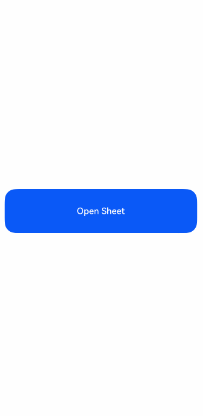

# Bind Sheet Modal (bindSheet)

[Sheet Modal (bindSheet)](../reference/arkui-cj/cj-universal-attribute-sheettransition.md#func-bindsheetbool----unit-sheetoptions) is by default a non-fullscreen popup interaction page in modal form, allowing partial visibility of the underlying parent view, helping users maintain their parent view context while interacting with the sheet modal.

Sheet modals are suitable for displaying simple tasks or information panels, such as personal information, text introductions, share panels, schedule creation, content addition, etc. If you need to display a sheet modal that may affect the parent view, the sheet modal supports configuration as a non-modal interaction form.

Sheet modals exhibit different behavioral capabilities on devices with varying widths. Developers with different form factor requirements across device widths should refer to the ([preferType](../reference/arkui-cj/cj-common-types.md#class-sheetoptions)) property. The bindSheet can be used to construct sheet transition effects, as detailed in [Modal Transition](./cj-modal-transition.md). For complex or lengthy user flows, consider alternative transition methods instead of sheet modals, such as [Full Modal Transition](./cj-contentcover-page.md).

## Usage Constraints

- Without scenarios requiring secondary confirmation or custom close behaviors, it is not recommended to use the [shouldDismiss/onWilDismiss](../reference/arkui-cj/cj-common-types.md#class-sheetoptions) interface.

## Lifecycle

The sheet modal provides lifecycle functions to notify users of the popup's lifecycle states. The lifecycle triggers occur in the following order: onWillAppear -> onAppear -> onWillDisappear -> onDisappear.

| Name | Type | Description |
|:---|:---|:---|
| onWillAppear | () -> Unit | Callback function before the sheet modal appears (before animation starts). |
| onAppear | () -> Unit | Callback function after the sheet modal appears (after animation ends). |
| onWillDisappear | () -> Unit | Callback function before the sheet modal disappears (before animation starts). |
| onDisappear | () -> Unit | Callback function after the sheet modal disappears (after animation ends). |

## Using Nested Scroll Interaction

Operation priority when sliding in the sheet modal content area:

1. Content is at the top (handled as this state when content is not scrollable)  
   Swipe up: Priority is given to expanding the sheet level upwards. If no level can be expanded, scroll the content.  
   Swipe down: Priority is given to collapsing the sheet level downwards. If no level can be collapsed, close the sheet.

2. Content is in the middle position (scrollable up and down)  
   Swipe up/down: Priority is given to scrolling the content until it reaches the bottom/top of the page.

3. Content is at the bottom position (when content is scrollable)  
   Swipe up: Displays a bounce effect in the content area without switching levels.  
   Swipe down: Scrolls the content until it reaches the top.

The default nested mode for the sheet modal's interaction is: {Forward: PARENT_FIRST, Backward: SELF_FIRST}

If developers wish to define scroll containers such as List or Scroll in the sheet content's builder and combine them with the sheet modal's interaction capabilities, they need to set nested scroll properties for the scroll container in the vertical direction.

```cangjie
.nestedScroll(
    NestedScrollOptions(
        // Nested scroll option when the scrollable component scrolls towards the end (upward gesture)
        NestedScrollMode.ParentFirst,
        // Nested scroll option when the scrollable component scrolls towards the start (downward gesture)
        NestedScrollMode.SelfFirst,
    )
)
```

Complete example code:

 <!-- run -->

```cangjie
package ohos_app_cangjie_entry
import kit.ArkUI.*
import ohos.arkui.state_macro_manage.*
import kit.LocalizationKit.*

@Entry
@Component
class EntryView {
    @State var isShowSheet: Bool = false
    private var items: Array<Int64> = [0, 1, 2, 3, 4, 5, 6, 7, 8, 9]

    @Builder
    func SheetBuilder() {
        Column() {
            // Step 1: Custom scroll container
            List(space: 10) {
                ForEach(
                    this.items,
                    itemGeneratorFunc: {
                        item: Int64, _: Int64 => ListItem() {
                            Text(item.toString())
                                .fontSize(16)
                                .fontWeight(FontWeight.Bold)
                        }
                        .width(90.percent)
                        .height(80.vp)
                        .backgroundColor(Color.Blue)
                        .borderRadius(10)
                    }
                )
            }
            .alignListItem(ListItemAlign.Center)
            .margin(top: 10)
            .width(100.percent)
            .height(900.px)
            // Step 2: Set nested scroll properties for the scrollable component
            .nestedScroll(
                NestedScrollOptions(
                    NestedScrollMode.ParentFirst,
                    NestedScrollMode.SelfFirst,
                )
            )

            Text("Non-scrollable area")
                .width(100.percent)
                .backgroundColor(Color.Gray)
                .layoutWeight(1)
                .textAlign(TextAlign.Center)
                .align(Alignment.Top)
        }
        .width(100.percent)
        .height(100.percent)
    }

    func build() {
        Column() {
            Button("Open Sheet")
                .width(90.percent)
                .height(80.vp)
                .onClick({
                    evt => this.isShowSheet = !this.isShowSheet
                })
                .bindSheet(
                    this.isShowSheet,
                    this.SheetBuilder,
                    options: SheetOptions(
                        detents: [SheetSize.Medium, SheetSize.Large, FitContent],
                        preferType: SheetType.Bottom,
                        title: {=> Text("Nested Scroll Scenario")}
                    )
                )
        }
        .width(100.percent)
        .height(100.percent)
        .justifyContent(FlexAlign.Center)
    }
}
```



## Secondary Confirmation Capability

It is recommended to use the onWillDismiss interface, which supports handling secondary confirmation or custom close behaviors in the callback.

```cangjie
// Step 1: Declare the onWillDismiss callback
onWillDismiss: {
    // Step 2: Confirm secondary callback interaction capability, here using AlertDialog to prompt "Do you want to close the sheet modal?"
    dismissSheetAction: DismissSheetAction => {
        AlertDialog.show(
            AlertDialogParamWithButtons(
                "text",
                title: 'Do you want to close the sheet modal?',
                primaryButton: AlertDialogButtonOptions(
                    value: 'cancel',
                    action: {
                        => Hilog.info(0, "cangjie", "Callback when the cancel button is clicked")
                    }
                ),
                secondaryButton: AlertDialogButtonOptions(
                    value: 'ok',
                    // Step 3: Confirm the logic for closing the sheet modal, here as the AlertDialog's Button callback
                    action: {
                        => {
                            // Step 4: When the logic in Step 3 is triggered, call dismiss() to close the sheet modal
                            dismissSheetAction.dismiss(),
                            Hilog.info(0, "cangjie", "Callback when the ok button is clicked")
                        }
                    }
                ),
                cancel: {
                    => Hilog.info(0, "cangjie", "AlertDialog Closed callbacks")
                }
            )
        )
    }
}
```


## Blocking Specific Close Behaviors

Since the onWillDismiss interface is declared, all close behaviors of the sheet modal require dismiss handling. Custom close logic can be implemented using if statements or similar logic.

The following example shows the sheet modal closing only when swiped down.

```cangjie
onWillDismiss: {
    dismissSheetAction: DismissSheetAction => {
        if (dismissSheetAction.reason == DismissReason.SLIDE_DOWN) {
            dismissSheetAction.dismiss() // Register dismiss behavior
        }
    }
}
```

Similarly, you can combine the onWillSpringBackWhenDismiss interface to achieve a better swipe-down experience.

Analogous to onWillDismiss, when onWillSpringBackWhenDismiss is declared, the bounce-back operation during a swipe-down requires handling with SpringBackAction.springBack(). Without this logic, there will be no bounce-back.

The specific code is as follows, where the sheet modal does not bounce back when swiped down.

```cangjie
onWillDismiss: {
    dismissSheetAction: DismissSheetAction => {
        if (dismissSheetAction.reason == DismissReason.SLIDE_DOWN) {
            dismissSheetAction.dismiss() // Register dismiss behavior
        }
    }
}

onWillSpringBackWhenDismiss: {
    springBackAction: SpringBackAction => {
        // No springBack is registered, so the sheet modal does not bounce back when pulled down
    }
}
```