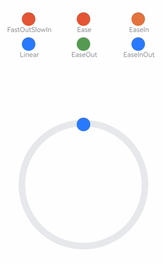

# Traditional Curves

Traditional curves are based on mathematical formulas, creating animation curves whose shapes align with developers' expectations. Represented by cubic Bézier curves, adjusting the control points of the curve can alter its shape, thereby producing animation effects such as ease-in and ease-out. For the same traditional curve, due to its lack of physical meaning, its shape remains unchanged regardless of user interactions, lacking the naturalness and liveliness of physical animations. It is recommended to prioritize physical curves for creating animations, reserving traditional curves as auxiliary tools for rare necessary scenarios.

ArkUI provides traditional curve interfaces such as Bézier curves and step curves. Developers can refer to [Interpolation Calculation](../reference/arkui-cj/cj-apis-curves.md) for details.

Examples and effects of traditional curves are as follows:

<!--run-->

```cangjie
package ohos_app_cangjie_entry

import kit.ArkUI.*
import ohos.arkui.state_macro_manage.*

class MyCurve {
    let title: String
    let curve: Curve
    let color: ResourceColor

    public init(title: String, curve: Curve, color: ResourceColor) {
        this.title = title
        this.curve = curve
        this.color = color
    }
}

let myCurves: Array<MyCurve> = [
    MyCurve(' FastOutSlowIn', Curve.FastOutSlowIn, 0xD94838),
    MyCurve(' Ease', Curve.Ease, 0xD94838),
    MyCurve(' EaseIn', Curve.EaseIn, 0xDB6B42),
    MyCurve(' Linear', Curve.Linear, 0x317AF7),
    MyCurve(' EaseOut', Curve.EaseOut, 0x5BA854),
    MyCurve(' EaseInOut', Curve.EaseInOut, 0x317AF7)
]

@Entry
@Component
class EntryView {
    @State var dRotate: Float32 = 0.0

    func build() {
        Column() {
            Grid() {
                ForEach(myCurves,itemGeneratorFunc: {
                        item: MyCurve, _: Int64 =>
                        GridItem() {
                            Column() {
                                Row()
                                    .width(30)
                                    .height(30)
                                    .borderRadius(15)
                                    .backgroundColor(item.color)
                                Text(item.title)
                                    .fontSize(15)
                                    .fontColor(0x909399)
                            }.width(100.percent)
                        }
                    })
            }
            .columnsTemplate('1fr 1fr 1fr')
            .rowsTemplate('1fr 1fr 1fr 1fr 1fr')
            .padding(10)
            .width(100.percent)
            .height(300)
            .margin(top: 50)

            Stack() {
                Row()
                    .width(290)
                    .height(290)
                    .border(width: 15, color: 0xE6E8EB, radius: 145)

                ForEach(myCurves, itemGeneratorFunc: { item: MyCurve, idx: Int64 =>
                        Column() {
                            Row()
                                .width(30)
                                .height(30)
                                .borderRadius(15)
                                .backgroundColor(item.color)
                        }
                        .width(20)
                        .height(300)
                        .rotate(angle: this.dRotate)
                        .animation(AnimateParam(duration: 2000, curve: item.curve, delay: 100, iterations: -1))
                    }
                )
            }
            .width(100.percent)
            .height(200)
            .onClick({evt => this.dRotate = 360.0})
        }
        .width(100.percent)
    }
}
```

