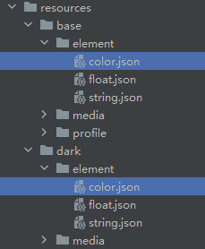

# Dark/Light Mode Adaptation  

## Overview  

The current system supports both dark and light display modes. To provide users with a better experience, applications should adapt to these modes.  

## Application Follows System Dark/Light Mode  

1. **Color Adaptation**  

    - **Custom Resource Implementation**  

      Add a dark mode qualifier directory (named `dark`) under the `resources` directory and create a `color.json` file to configure color resources for dark mode. For details, refer to [Resource Classification and Access](#).  

      **Directory Structure Example**  

        

      For example, developers can define the same color names in these two `color.json` files but assign different color values.  

      **base/element/color.json**:  
      ```json
      {
        "color": [
          {
            "name": "app_title_color",
            "value": "#000000"
          }
        ]
      }
      ```  

      **dark/element/color.json**:  
      ```json
      {
        "color": [
          {
            "name": "app_title_color",
            "value": "#FFFFFF"
          }
        ]
      }
      ```  

    - **Using System Resources**  

      Developers can directly use system-preset resources, i.e., layered parameters. The same resource ID may have different values under various configurations such as device type or dark/light mode. By leveraging system resources, different developers can create applications with a consistent visual style without defining two sets of color resources. The system automatically switches colors based on the mode.  

      For example, developers can use the system's primary text color to define text colors in the application:  

      ```cangjie
      Text('Use system-defined colors')
        .fontColor(@r(sys.color.ohos_id_color_text_primary))
      ```  

2. **Image Resource Adaptation**  

    Use resource qualifier directories. Similar to color adaptation, place the corresponding dark mode images in the `dark/media` directory. Load the images using `$r` with the resource key, and the system will automatically switch to the appropriate resource file during mode changes.  

    For simple SVG icons, the [`fillColor`](./cj-graphics-display.md#display-vector-graphics) property can be used with system resources to modify the icon's color. This avoids the need for two sets of image resources while achieving dark/light mode adaptation.  

    ```cangjie
    Image(@r(app.media.pic_svg))
      .width(50)
      .fillColor(@r(sys.color.ohos_id_color_text_primary))
    ```  

3. **Web Component Adaptation**  

    The Web component supports dark mode configuration for frontend pages. Refer to [Web Component Dark Mode](../../../en/application-dev/web/cj-web-set-dark-mode.md) for configuration details.