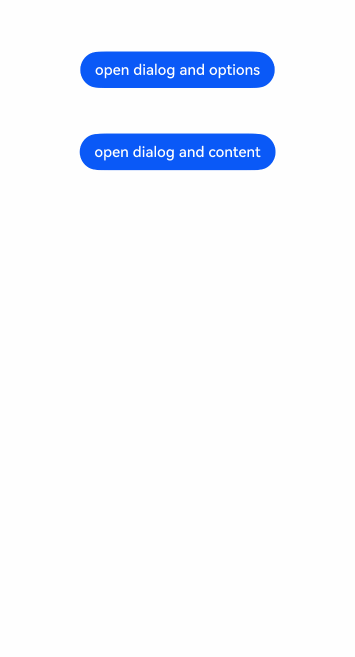

# Global Custom Dialog Independent of UI Components (openCustomDialog)

<!--Del-->
> **Note:**
>
> Currently in the beta phase.
<!--DelEnd-->

Due to the numerous limitations of [CustomDialogController](../reference/arkui-cj/cj-dialog-customdialog.md#class-customdialogcontroller), which does not support dynamic creation or dynamic updates.

> **Note:**
>
> The dialog ([openCustomDialog](../reference/arkui-cj/cj-apis-uicontext-promptaction.md#func-opencustomdialogcustomdialogoptions-int32---unit)) provides two parameter-passing methods for creating custom dialogs:
>
> - openCustomDialog (with CustomDialogOptions parameter): Encapsulating content through CustomDialogOptions decouples it from the UI interface, offering more flexible invocation to meet developers' encapsulation needs. It provides greater flexibility, allowing fully customizable dialog styles, and enables dynamic updates of dialog parameters using the updateCustomDialog method after the dialog is opened.
>
> - openCustomDialog (with lambda expression): Passing a lambda expression allows users to include callbacks or other component methods within openCustomDialog.

## Lifecycle

The dialog provides lifecycle functions to notify users of its lifecycle. The lifecycle triggers occur in the following sequence: onWillAppear -> onDidAppear -> onWillDisappear -> onDidDisappear.

| Name            | Type | Description |
| :----------------- | :------ | :---------------------------- |
| onDidAppear    | () -> Unit  | Callback event when the dialog appears. |
| onDidDisappear |() -> Unit  | Callback event when the dialog disappears. |
| onWillAppear    | () -> Unit | Callback event before the dialog's display animation. |
| onWillDisappear | () -> Unit | Callback event before the dialog's exit animation. |

## Opening and Closing Custom Dialogs

> **Note:**
>
> For detailed variable definitions, refer to the [Complete Example](#complete-example).

- Create customdialog.

   Customdialog is used to define the content of the custom dialog.

    ```cangjie
    @Builder
    func CustomDialog() {
        Column() {
            Text("Hello").height(50.vp)
            Button("Close").onClick({
                evt => getUIContext().getPromptAction().closeCustomDialog(customdialogId)
            })
        }.margin(10.vp)
    }
    ```

- Open a custom dialog.

   Dialogs opened via the openCustomDialog interface use content of type CustomDialogOptions, where this.CustomDialog represents the custom dialog content.

    <!-- run -->

    ```cangjie
    package ohos_app_cangjie_entry

    import ohos.base.*
    import ohos.arkui.component.*
    import ohos.arkui.ui_context.*
    import ohos.arkui.state_management.*
    import ohos.arkui.state_macro_manage.*

    var customdialogId: Int32 = 0

    @Entry
    @Component
    class EntryView {

        @Builder
        func CustomDialog() {
            Column() {
                Text("Hello Content").height(60.vp)
                Button("Close").onClick({
                    evt => getUIContext().getPromptAction().closeCustomDialog(customdialogId)
                })
            }.margin(10.vp)
        }

        func build(){
            Button("open dialog and options")
                .margin(top: 50)
                .onClick({
                    evt => getUIContext().getPromptAction().openCustomDialog(
                        CustomDialogOptions(builder: this.CustomDialog),
                        {
                            id => customdialogId = id
                        }
                    )
                })
        }
    }
    ```

- Close the custom dialog.

   The closeCustomDialog interface requires passing the CustomDialogId corresponding to the dialog to be closed.

    <!-- run -->

    ```cangjie
    package ohos_app_cangjie_entry

    import ohos.base.*
    import ohos.arkui.component.*
    import ohos.arkui.ui_context.*
    import ohos.arkui.state_management.*
    import ohos.arkui.state_macro_manage.*

    var customdialogId: Int32 = 0

    @Entry
    @Component
    public class EntryView {
        @Builder
        func CustomDialog() {
            Column() {
                Text("Hello Content").height(60.vp)
                Button("Close").onClick({
                    evt => getUIContext().getPromptAction().closeCustomDialog(customdialogId)
                })
            }.margin(10.vp)
        }
        func build() {
            Column() {
                Button("open dialog and update content")
                    .margin(top: 50)
                    .onClick(
                        {
                            evt => getUIContext().getPromptAction().openCustomDialog(
                                CustomDialogOptions(builder: this.CustomDialog),
                                {
                                    id => customdialogId = id
                                }
                            )
                        })
            }
        }
    }
    ```

## Complete Example

 <!-- run -->

```cangjie
package ohos_app_cangjie_entry

import ohos.base.*
import ohos.arkui.component.*
import ohos.arkui.ui_context.*
import ohos.arkui.state_management.*
import ohos.arkui.state_macro_manage.*

var customdialogId: Int32 = 0

@Entry
@Component
public class EntryView {
    @Builder
    func CustomDialog() {
        Column() {
            Text("Hello ").height(70.vp)
            Button("Close").onClick({
                evt => getUIContext().getPromptAction().closeCustomDialog(customdialogId)
            })
        }.margin(15.vp)
    }
    @Builder
    func CustomDialog1() {
        Column() {
            Text("Hello Content").height(60.vp)
            Button("Close").onClick({
               evt => getUIContext().getPromptAction().closeCustomDialog(customdialogId)
            })
        }.margin(10.vp)
    }
    func build() {
        Flex(justifyContent: FlexAlign.Center, alignItems: ItemAlign.Center) {
            Column(){
            Button("open dialog and options")
                .margin(top: 50)
                .onClick({
                        evt => getUIContext().getPromptAction().openCustomDialog(
                            CustomDialogOptions(builder: this.CustomDialog),
                            {
                                id => customdialogId = id
                            }
                        )
                    })
            Button("open dialog and content")
                .margin(top: 50)
                .onClick({
                        evt => getUIContext().getPromptAction().openCustomDialog(
                            CustomDialogOptions(builder: this.CustomDialog1),
                            {
                                id => customdialogId = id
                            }
                        )
                    })
        }.width(100.percent).padding(top:5)}
    }
}
```

