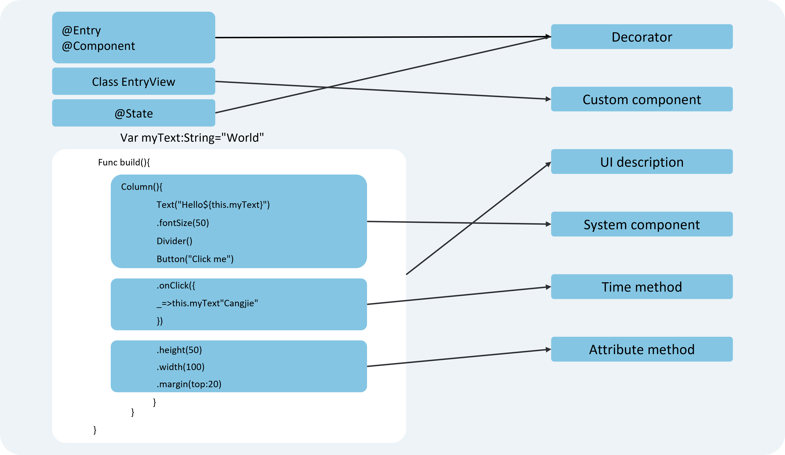

# Overview of Basic Syntax

<!--Del-->
> **Note:**
>
> Currently in the beta phase.
<!--DelEnd-->

After gaining a preliminary understanding of the Cangjie language, this section illustrates its fundamental components through a concrete example. As shown in the figure below, when a developer clicks a button, the text content changes from "Hello World" to "Hello Cangjie."

**Figure 1** Example Effect  

In this example, the basic components of Cangjie are as follows.

**Figure 2** Basic Components of Cangjie  

> **Note:**  
>
> Custom variables must not duplicate the names of basic universal attributes/events.

- **Macros**: Used to modify classes, structures, methods, and variables, endowing them with special meanings. In the example above, `@Entry`, `@Component`, and `@State` are all macros. [`@Component`](./cj-create-custom-components.md#component) denotes a custom component, [`@Entry`](./cj-create-custom-components.md#entry) indicates that the custom component is an entry component, and [`@State`](../state_management/cj-macro-state.md) represents a state variable within the component, where changes to the state variable trigger UI updates.

- **[UI Description](./cj-declarative-ui-description.md)**: Describes the structure of the UI in a declarative manner, such as the code block within the `build()` method.

- **[Custom Components](./cj-create-custom-components.md)**: Reusable UI units that can combine other components, such as the `class EntryView` decorated with `@Component` in the example.

- **System Components**: Built-in foundational and container components in the ArkUI framework that developers can directly invoke, such as `Column`, `Text`, `Divider`, and `Button` in the example.

- **[Attribute Methods](../../reference/arkui-cj/cj-universal-attributes.md)**: Components can configure multiple attributes through chained calls, such as `fontSize()`, `width()`, `height()`, and `backgroundColor()`.

- **[Event Methods](../../reference/arkui-cj/cj-universal-events.md)**: Components can set response logic for multiple events through chained calls, such as `onClick()` following `Button`.

In addition, Cangjie extends various syntax paradigms to make development more convenient:

- [`@Builder`](./cj-macro-builder.md)/[`@BuilderParam`](./cj-macro-builderparam.md): Special methods for encapsulating UI descriptions, enabling fine-grained encapsulation and reuse of UI descriptions.