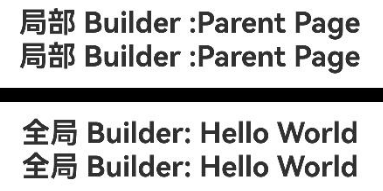

# @BuilderParam Macro: Referencing @Builder Functions

<!--Del-->
> **Note:**
>
> Currently in the beta phase.
<!--DelEnd-->

When developers create custom components and want to add specific functionalities—such as adding a click-to-navigate operation to a designated custom component—embedding the event method directly within the component would result in all instances of that custom component inheriting the functionality. To address this issue, ArkUI introduces the @BuilderParam macro. @BuilderParam is used to decorate variables that point to @Builder methods (i.e., @BuilderParam is designed to receive @Builder functions). Developers can initialize custom components by passing parameters to the @BuilderParam-decorated custom builder function in various ways (e.g., parameter modification, parent component initialization, etc.). Inside the custom component, specific functionalities can be added by invoking @BuilderParam. This macro declares an element for arbitrary UI descriptions, similar to a slot placeholder.

Before reading this document, it is recommended to review: [@Builder](./cj-macro-builder.md).

## Macro Usage Instructions

### Initializing @BuilderParam-Decorated Methods

Methods decorated with @BuilderParam can only be initialized by custom builder functions (methods decorated with @Builder).

Use a global custom builder function to initialize @BuilderParam locally.

```cangjie
package ohos_app_cangjie_entry
import kit.ArkUI.*
import ohos.arkui.state_macro_manage.*

@Builder func overBuilder() {}

@Component
class Child {
    // Initialize @BuilderParam using a global custom builder function
    @BuilderParam var customOverBuilderParam: () -> Unit = overBuilder

    func build(){}
}
```

## Constraints

The following constraints apply when using @BuilderParam:

- The decorated variable can only be initialized using an @Builder function.
- The type of the decorated variable must be a function type with a return type of Unit.
- The variable type must be explicitly annotated in the declaration.
- It can only decorate class member variables; decorating global variables is prohibited (otherwise, a compilation error will occur).
- The decorated class member variable (with visibility consistent with the private modifier) is only allowed for use within the class.
- The decorated variable can be either mutable or immutable. Mutability follows Cangjie syntax, where variables marked with `let`/`var` keywords are immutable and mutable variables, respectively.

## Usage Scenarios

### Parameter Initialization for Components

Methods decorated with @BuilderParam can be either parameterized or non-parameterized, but they must match the type of the referenced @Builder method.

 <!-- run -->

```cangjie
package ohos_app_cangjie_entry
import kit.ArkUI.*
import ohos.arkui.state_macro_manage.*

class Tmp{
    var label: String = ''
    init(label: String) {
        this.label = label
    }
}

@Builder func overBuilder(tmp: Tmp) {
    Text(tmp.label)
        .width(400)
        .height(50)
        .backgroundColor(Color.Green)
}

@Component
class Child {
    var label: String = 'Child'
    // Non-parameterized type, where the referenced customBuilder is also non-parameterized
    @BuilderParam var customBuilderParam: () -> Unit
    // Parameterized type, where the referenced overBuilder is also a parameterized method
    @BuilderParam var customOverBuilderParam: (Tmp) -> Unit = overBuilder

    func build() {
        Column() {
            this.customBuilderParam()
            this.customOverBuilderParam(Tmp("  global Builder label"))
        }
    }
}

@Entry
@Component
class EntryView {
    var label: String = 'Parent'

    @Builder func componentBuilder() {
        Text(this.label)
    }

    func build() {
        Column() {
            this.componentBuilder()
            Child(customBuilderParam: this.componentBuilder)
        }
    }
}
```


**Figure 1** Example Effect Diagram

### Initializing @BuilderParam Using Global and Parent Component @Builder

In custom components, variables decorated with @BuilderParam receive content passed from the parent component via @Builder for initialization.

 <!-- run -->

```cangjie
package ohos_app_cangjie_entry
import kit.ArkUI.*
import ohos.arkui.state_macro_manage.*

@Builder func customBuilder() {}

@Component
class ChildPage {
    var label: String = 'Child Page'

    @BuilderParam var customBuilderParam: () -> Unit = customBuilder

    func build() {
        Column() {
            this.customBuilderParam()
        }
    }
}

let builder_value: String = 'Hello World'

@Builder func overBuilder() {
    Row() {
        Text('Global Builder: ${builder_value}')
            .fontSize(20)
            .fontWeight(FontWeight.Bold)
    }
}

@Entry
@Component
class EntryView{
    var label: String = 'Parent Page'

    @Builder func componentBuilder() {
        Row(){
            Text('Local Builder :${this.label}')
                .fontSize(20)
                .fontWeight(FontWeight.Bold)
        }
    }

    func build() {
        Column() {
            // When this.componentBuilder() is called, `this` refers to the ParentPage component decorated by @Entry, so the label variable's value is "Parent Page".
            this.componentBuilder()
            ChildPage(
                // Pass this.componentBuilder to the @BuilderParam customBuilderParam of the child component ChildPage.
                customBuilderParam: this.componentBuilder
                )
        Line()
            .width(1000)
            .height(10)
            .backgroundColor(0x000000).margin(10)
        // When the global overBuilder() is called, the displayed content is "Hello World".
        overBuilder()
        ChildPage(
            // Pass the global overBuilder to the @BuilderParam customBuilderParam of the child component ChildPage, so the displayed content is "Hello World".
            customBuilderParam: overBuilder
        )
    }
  }
}
```



**Figure 3** Example Effect Diagram

## Common Issues

### @BuilderParam Macro Initialization Value Must Be @Builder

Using a variable decorated with the @State macro to initialize a child component's @BuilderParam and ChildBuilder variables will result in compilation error messages.

**Counterexample**

```cangjie
package ohos_app_cangjie_entry
import kit.ArkUI.*
import ohos.arkui.state_macro_manage.*

@Builder func globalBuilder() {
    Text('Hello World')
}
@Entry
@Component
class EntryView {
    @State var message: String = "";
    func build() {
        Column() {
        // The child component ChildBuilder receives a variable decorated with @State, causing compilation and editing errors
        ChildPage(ChildBuilder: this.message)
        }
    }
}

@Component
class ChildPage {
    @BuilderParam var ChildBuilder: () -> Unit = globalBuilder;
    func build() {
        Column() {
        this.ChildBuilder()
        }
    }
}
```

Using the global @Builder-decorated globalBuilder() to initialize the ChildBuilder variable decorated with @BuilderParam in the child component results in no compilation errors, and the functionality works as expected.

**Correct Example**

 <!-- run -->

```cangjie
package ohos_app_cangjie_entry
import kit.ArkUI.*
import ohos.arkui.state_macro_manage.*

@Builder func globalBuilder() {
    Text('Hello World')
}
@Entry
@Component
class EntryView {
    func build() {
        Column() {
            ChildPage(ChildBuilder: globalBuilder)
        }
    }
}

@Component
class ChildPage {
    @BuilderParam var ChildBuilder: () -> Unit = globalBuilder;
    func build() {
        Column() {
        this.ChildBuilder()
        }
    }
}
```