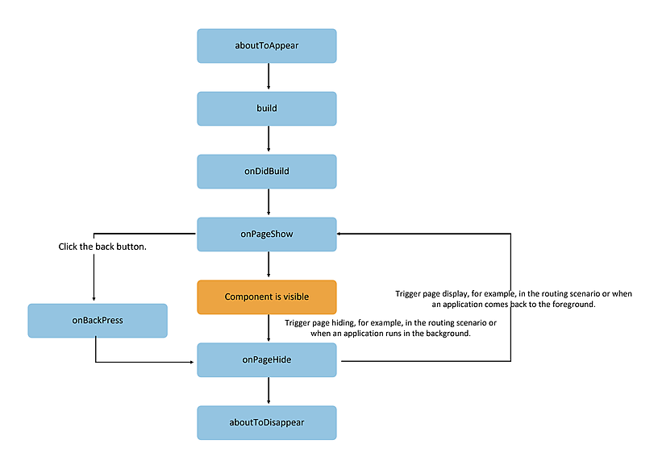

# Page and Custom Component Lifecycle

Before proceeding, it's essential to clarify the relationship between custom components and pages:

- **Custom Component**: A UI unit decorated with `@Component`, which can combine multiple system components to achieve UI reuse and can invoke component lifecycle methods.

- **Page**: The UI page of an application. It can consist of one or more custom components. The component decorated with `@Entry` serves as the entry component of the page, i.e., the root node of the page. A page can have only one `@Entry`. Only components decorated with `@Entry` can invoke page lifecycle methods.

**Page Lifecycle** refers to the lifecycle of components decorated with `@Entry` and provides the following lifecycle interfaces:

**Component Lifecycle** refers to the lifecycle of general custom components decorated with `@Component` and provides the following lifecycle interfaces:

The lifecycle flow is illustrated in the diagram below, which depicts the lifecycle of components (pages) decorated with `@Entry`.



Based on the above flowchart, this document provides a detailed explanation from the perspectives of initial creation, re-rendering, and deletion of custom components.

## Custom Component Creation and Rendering Process

1. **Creation of Custom Components**: Instances of custom components are created by the ArkUI framework.

2. **Initialization of Member Variables**: Member variables of custom components are initialized using local default values or parameters passed through constructors, following the order of member variable definitions.

3. If the developer has defined `aboutToAppear`, the `aboutToAppear` method is executed.

4. **First Rendering**: During the initial rendering, the `build` method is executed to render system components. If a child component is a custom component, an instance of the custom component is created. During the initial rendering, the framework records the mapping relationship between state variables and components. When state variables change, the framework drives the refresh of related components.

5. If the developer has defined `onDidBuild`, the `onDidBuild` method is executed.

## Custom Component Re-rendering

When an event handler is triggered (e.g., a click event is set and triggered) and changes a state variable, or when properties in `LocalStorage`/`AppStorage` are modified, causing bound state variables to change their values:

1. The framework observes the changes and initiates re-rendering.

2. Based on the two maps maintained by the framework (as described in [Custom Component Creation and Rendering Process](#custom-component-creation-and-rendering-process), Step 4), the framework identifies which UI components are managed by the state variable and their corresponding update functions. The update functions of these UI components are executed to achieve minimal updates.

## Custom Component Deletion

If the branch of an `if` component changes or the array length in a `ForEach` loop rendering changes, the component will be deleted:

1. Before deletion, the `aboutToDisappear` lifecycle function is called, marking the node for destruction. ArkUI's node deletion mechanism works as follows: the backend node is directly removed from the component tree, the backend node is destroyed, and the frontend node is dereferenced. When the frontend node has no references, it is reclaimed.

2. The custom component and its variables are deleted. If it has synchronized variables (e.g., `@Link`, `@Prop`, `@StorageLink`), they are deregistered from the [synchronization source](../state_management/cj-state-management-overview.md).

It is not recommended to perform asynchronous operations within the `aboutToDisappear` lifecycle. If asynchronous operations (e.g., `spawn` or callback methods) are used in `aboutToDisappear`, the custom component will be retained in the closure of `spawn` until the callback method completes. This behavior prevents garbage collection of the custom component.

The following example demonstrates the timing of lifecycle method calls:

<!-- run -->

```cangjie
// Index.cj
package ohos_app_cangjie_entry

import kit.ArkUI.*
import ohos.arkui.state_macro_manage.*
import ohos.arkui.ui_context.*
import kit.PerformanceAnalysisKit.Hilog

@Entry
@Component
class EntryView {
    @State var showChild: Bool = true
    @State var btnColor: Color = Color(0xFF007DFF)

    // Only components decorated with @Entry can invoke page lifecycle methods
    protected override func onPageShow() {
        Hilog.info(0, "cangjie", "Index onPageShow")
    }

    // Only components decorated with @Entry can invoke page lifecycle methods
    protected override func onPageHide() {
        Hilog.info(0, "cangjie", "Index onPageHide")
    }

    // Only components decorated with @Entry can invoke page lifecycle methods
    protected override func onBackPress() {
        Hilog.info(0, "cangjie", "Index onBackPress")
        this.btnColor = Color(0xFFEE0606)
        // Returning true means the page handles the back logic itself, without routing; returning false means using the default routing back logic.
        return true
    }

    // Component lifecycle
    protected override func aboutToAppear() {
        Hilog.info(0, "cangjie", "EntryView aboutToAppear")
    }

    // Component lifecycle
    protected override func onDidBuild() {
        Hilog.info(0, "cangjie", "EntryView onDidBuild")
    }

    // Component lifecycle
    protected override func aboutToDisappear() {
        Hilog.info(0, "cangjie", "EntryView aboutToDisappear")
    }

    func build() {
        Column {
            // When this.showChild is true, create the Child component and execute Child aboutToAppear
            if (this.showChild) {
                Child()
            }

            Button("delete Child")
            .margin(20)
            .backgroundColor(this.btnColor)
            .onClick({
                _ =>
                // When this.showChild is false, delete the Child component and execute Child aboutToDisappear
                this.showChild = false
            })

            // Push to the Page page and execute onPageHide
            Button("push to next page")
            .onClick({
                _ =>
                getUIContext().getRouter().pushUrl(url: "Page")
            })
        }
    }
}

@Component
class Child {
    @State var title: String = "Hello World"

    // Component lifecycle
    protected override func aboutToAppear() {
        Hilog.info(0, "cangjie", "Child aboutToAppear")
    }

    // Component lifecycle
    protected override func onDidBuild() {
        Hilog.info(0, "cangjie", "Child onDidBuild")
    }

    // Component lifecycle
    protected override func aboutToDisappear() {
        Hilog.info(0, "cangjie", "Child aboutToDisappear")
    }

    func build() {
        Text(this.title)
        .fontSize(50)
        .margin(20)
        .onClick({
            _ =>
            this.title = "Hello ArkUI"
        })
    }
}
```
<!-- run -->

```cangjie
// Page.cj
package ohos_app_cangjie_entry

import kit.ArkUI.*
import ohos.arkui.state_macro_manage.*
import kit.PerformanceAnalysisKit.Hilog

@Entry
@Component
class Page {
    @State var textColor: Color = Color.Black
    @State var num: Int64 = 0

    // Only components decorated with @Entry can invoke page lifecycle methods
    protected override func onPageShow() {
        this.num = 5
    }

    // Only components decorated with @Entry can invoke page lifecycle methods
    protected override func onPageHide() {
        Hilog.info(0, "cangjie", "Page onPageHide")
    }

    // Only components decorated with @Entry can invoke page lifecycle methods
    protected override func onBackPress() {
        this.textColor = Color.Gray
        this.num = 0
        return false
    }

    // Component lifecycle
    protected override func aboutToAppear() {
        this.textColor = Color.Blue
    }

    func build() {
        Column {
            Text("num value: " + this.num.toString())
            .fontSize(30)
            .fontWeight(FontWeight.Bold)
            .fontColor(this.textColor)
            .margin(20)
            .onClick({
                _ =>
                this.num += 5
            })
        }
        .width(100.percent)
    }
}
```

In the above example, the Index page contains two custom components: `EntryView`, decorated with `@Entry` and serving as the entry component (root node of the page), and `Child`, a subcomponent of `EntryView`. Only nodes decorated with `@Entry` can make page-level lifecycle methods effective. Therefore, the page lifecycle functions (`onPageShow`/`onPageHide`/`onBackPress`) for the current Index page are declared in `EntryView`. Both `EntryView` and its subcomponent `Child` declare their respective component-level lifecycle functions (`aboutToAppear`/`onDidBuild`/`aboutToDisappear`).

- **Cold Start Initialization Flow**: `EntryView aboutToAppear` --> `EntryView build` --> `EntryView onDidBuild` --> `Child aboutToAppear` --> `Child build` --> `Child onDidBuild` --> `Index onPageShow`.

- **Click "delete Child"**: The `if`-bound `this.showChild` becomes `false`, deleting the `Child` component and executing `Child aboutToDisappear`.

- **Click "push to next page"**: The `router.pushUrl` interface is called to navigate to another page. The current Index page is hidden, and `Index onPageHide` is executed. Here, `router.pushUrl` is called, so the Index page is hidden but not destroyed, and only `onPageHide` is called. After navigating to the new page, the initialization lifecycle flow for the new page begins.

- **If `router.replaceUrl` is called**: The current Index page is destroyed. As mentioned earlier, component destruction involves directly removing the subtree from the component tree. Thus, the lifecycle flow becomes: new page initialization lifecycle flow, followed by `Index onPageHide` --> `EntryView aboutToDisappear` --> `Child aboutToDisappear`.

- **Click the back button**: Triggers the page lifecycle `Index onBackPress`, and returning to the previous page causes the current Index page to be destroyed.

- **Minimize the app or send it to the background**: Triggers `Index onPageHide`. The current Index page is not destroyed, so `aboutToDisappear` is not executed. When the app returns to the foreground, `Index onPageShow` is executed.

- **Exit the app**: Executes `Index onPageHide` --> `EntryView aboutToDisappear` --> `Child aboutToDisappear`.