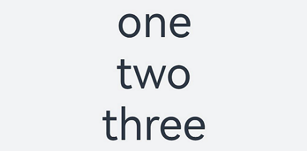
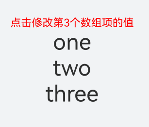
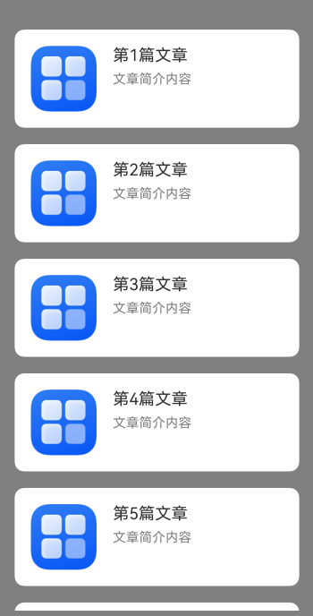
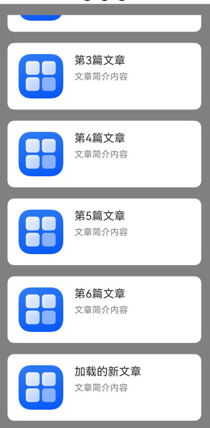
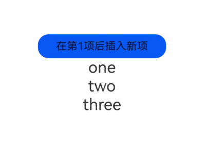
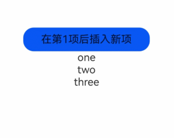
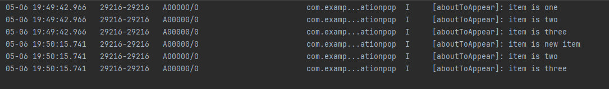

# ForEach: Loop Rendering

The ForEach interface performs loop rendering based on array-type data and must be used in conjunction with container components. The components returned by the interface should be child components that are allowed to be included within the parent container component of ForEach. For example, the ListItem component requires that the parent container component of ForEach must be a [List component](../../reference/arkui-cj/cj-scroll-swipe-list.md).

## Key Generation Rules

During ForEach loop rendering, the system generates a unique and persistent key value for each array element to identify the corresponding component. When this key value changes, Cangjie will consider the array element as replaced or modified and will create a new component based on the new key value.

ForEach provides a parameter called keyGenerator, which is a function that allows developers to customize the key generation rules. If the developer does not define a keyGenerator function, the ArkUI framework will use the default key generation function.

The ArkUI framework has a specific set of judgment rules for ForEach key generation, primarily related to the second parameter index of the itemGenerator function and the second parameter index of the keyGenerator function.

> **Note:**
>
> The ArkUI framework will issue a warning for duplicate key values. In scenarios where the UI is updated, if duplicate key values occur, the framework may not function properly. For details, refer to [Unexpected Rendering Results](#unexpected-rendering-results).

## Component Creation Rules

After determining the key generation rules, the second parameter itemGenerator function of ForEach will create components for each array item in the data source based on the key generation rules. Component creation includes two scenarios: [First Rendering of ForEach](#first-rendering) and [Non-First Rendering of ForEach](#non-first-rendering).

## First Rendering

During the first rendering of ForEach, a unique key value is generated for each array item in the data source according to the aforementioned key generation rules, and the corresponding component is created.

<!-- run -->

```cangjie
package ohos_app_cangjie_entry
import kit.ArkUI.*
import ohos.arkui.state_macro_manage.*

@Component
class ChildItem {
    @Prop var item: String
    func build() {
        Text(this.item)
        .fontSize(50)
    }
}

@Entry
@Component
class EntryView {
    @State var simpleList: Array<String> = ['one', 'two','three']
    func build() {
        Row() {
            Column() {
                ForEach(this.simpleList,itemGenerator: {item: String,idx:Int64 =>
            ChildItem(item: item)}, keyGenerator: {item: String, idx: Int64 => return item})
            }
            .justifyContent(FlexAlign.Center)
            .width(100.percent)
            .height(100.percent)
        }
        .height(100.percent)
        .backgroundColor(Color.White)
    }
}
```

The running effect is shown in the figure below.

Figure 1 First Rendering Effect of ForEach Data Source Without Duplicate Values


In the above code, the key generation rule is the return value item of the keyGenerator function. During ForEach loop rendering, key values one, two, and three are generated sequentially for the data source array items, and the corresponding ChildItem components are created and rendered on the interface.

When different array items generate the same key value according to the key generation rules, the framework's behavior is undefined. For example, in the following code, when ForEach renders the same data item two, only one ChildItem component is created, and multiple components with the same key value are not created.

<!-- run -->

```cangjie
package ohos_app_cangjie_entry
import kit.ArkUI.*
import ohos.arkui.state_macro_manage.*

@Component
class ChildItem {
    @Prop var item: String
    func build() {
        Text(this.item)
        .fontSize(50)
    }
}

@Entry
@Component
class EntryView {
    @State var simpleList: Array<String> = ['one', 'two','two','three']
    func build() {
        Row() {
            Column() {
                ForEach(this.simpleList,itemGenerator: {item: String,idx:Int64 =>
                    ChildItem(item: item)}, keyGenerator: {item: String, idx: Int64 => return item})
            }
            .justifyContent(FlexAlign.Center)
            .width(100.percent)
            .height(100.percent)
        }
        .height(100.percent)
        .backgroundColor(Color.White)
    }
}
```

Figure 2 First Rendering Effect of ForEach Data Source With Duplicate Values



In this example, the final key generation rule is item. When ForEach traverses the data source simpleList and reaches the item two at index 1, a component with the key value two is generated and marked according to the final key generation rule. When it reaches the item two at index 2, the key value for the current item is also two according to the final key generation rule, and no new component is created.

## Non-First Rendering

During non-first rendering of the ForEach component, it checks whether the newly generated key values existed in the previous rendering. If a key value does not exist, a new component is created; if the key value exists, no new component is created, and the component corresponding to that key value is rendered directly. For example, in the following code sample, clicking an event modifies the third item of the array to "new three," which triggers non-first rendering of the ForEach component.

<!-- run -->

```cangjie
package ohos_app_cangjie_entry
import kit.ArkUI.*
import ohos.arkui.state_macro_manage.*

@Component
class ChildItem {
    @Prop var item: String
    func build() {
        Text(this.item)
        .fontSize(50)
    }
}

@Entry
@Component
class EntryView {
    @State var simpleList: ObservedArrayList<String> = ObservedArrayList<String>(['one', 'two','three'])
    func build() {
        Row() {
            Column() {
                Text("Click to modify the value of the 3rd array item")
                .fontSize(24)
                .fontColor(Color.Red)
                .onClick({evt=>
                this.simpleList[2] = 'new three'
                })
                ForEach(this.simpleList,itemGenerator: {item: String,idx:Int64 =>
                ChildItem(item: item)}, keyGenerator: {item: String, idx: Int64 => return item})
            }
            .justifyContent(FlexAlign.Center)
            .width(100.percent)
            .height(100.percent)
        }
        .height(100.percent)
        .backgroundColor(Color.White)
    }
}
```

The running effect is shown in the figure below.

Figure 3 Non-First Rendering Effect of ForEach



From this example, it can be seen that [@State](../state_management/cj-macro-state.md) can monitor changes in the simple data type array data source simpleList.

1. When the simpleList array items change, ForEach is triggered to re-render.
2. ForEach traverses the new data source ['one', 'two', 'new three'] and generates the corresponding key values one, two, and new three.
3. Among these, the key values one and two existed in the previous rendering, so ForEach reuses the corresponding components and renders them. For the third array item "new three," since the key value new three generated by the key generation rule item did not exist in the previous rendering, ForEach creates a new component for this array item.

## Usage Scenarios

The main application scenarios of the ForEach component during development include: [Unchanged Data Source](#unchanged-data-source) and [Changes in Data Source Array Items](#changes-in-data-source-array-items) (such as insert and delete operations).

## Unchanged Data Source

In scenarios where the data source remains unchanged, the data source can directly use basic data types. For example, during page loading, a skeleton screen list can be used for rendering.

<!-- run -->

```cangjie
package ohos_app_cangjie_entry
import kit.ArkUI.*
import ohos.arkui.state_macro_manage.*

@Builder
func textArea(width: Int64, height:Int64) {
    Row()
    .width(width)
    .height(height)
    .backgroundColor(Color.White)
}

@Component
class ArticleSkeletonView {
    func build() {
        Row() {
            Column() {
                textArea(80, 80)
            }
            .margin(right: 20 )
            Column() {
                textArea(60, 20)
                textArea(50, 20)
            }
            .alignItems(HorizontalAlign.Start)
            .justifyContent(FlexAlign.SpaceAround)
            .height(100)
        }
        .padding(20)
        .borderRadius(12)
        .backgroundColor(Color.Gray)
        .height(120)
        .width(100.percent)
        .justifyContent(FlexAlign.SpaceBetween)
        .margin(top: 20)
    }
}

@Entry
@Component
class EntryView {
    @State var simpleList: Array<Int64> = [1, 2, 3, 4, 5]
    func build() {
        Column() {
            ForEach(this.simpleList, itemGenerator: {item: Int64,idx:Int64 =>ArticleSkeletonView()}
            )
        }
        .padding(20)
        .width(100.percent)
        .height(100.percent)
    }
}
```

The running effect is shown in the figure below.

Figure 4 Skeleton Screen Rendering Effect


## Changes in Data Source Array Items

In scenarios where data source array items change, such as array insert, delete operations, or changes in the index positions of array items, the data source should be an object array type, and the unique ID of the object should be used as the final key value. For example, when loading the next page of data by swiping up on the page, new data items are added to the end of the data source array, thereby increasing the length of the data source array.

<!-- run -->

```cangjie
package ohos_app_cangjie_entry
import kit.ArkUI.*
import ohos.arkui.state_macro_manage.*
import std.collection.ArrayList
import kit.LocalizationKit.*
import kit.PerformanceAnalysisKit.Hilog
import ohos.resource.__GenerateResource__

class Article {
    var id: String
    var title: String
    var brief: String
    init(id: String, title: String, brief: String) {
        this.id = id
        this.title = title
        this.brief = brief
    }
}

@Builder
func textArea(width: Int64, height:Int64) {
    Row()
    .width(width)
    .height(height)
    .backgroundColor(Color.White)
}

@Component
class ArticleCard {
    @Prop var article: Article
    func build() {
        Row(){
        // Here 'app.media.icon' is only an example. Developers should replace it themselves; otherwise, imageSource creation failure will prevent subsequent normal execution.
        Image(@r(app.media.startIcon))
        .width(80)
        .height(80)
        .margin(right:20)
        Column() {
            Text(this.article.title)
            .fontSize(20)
            .margin(bottom:8)
            Text(this.article.brief)
            .fontSize(16)
            .fontColor(Color.Gray)
            .margin(bottom: 8)
        }
        .alignItems(HorizontalAlign.Start)
        .width(80.percent)
        .height(100.percent)
        }
        .padding(20)
        .borderRadius(12)
        .backgroundColor(Color.White)
        .height(120)
        .width(100.percent)
        .justifyContent(FlexAlign.SpaceBetween)
        .margin(top: 20)
    }
}

@Entry
@Component
class EntryView {
    @State var isListReachEnd: Bool = false
    @State var articleList: ObservedArrayList<Article> = ObservedArrayList<Article>([
        Article('001', 'Article 1', 'Article brief content'),
        Article('002', 'Article 2', 'Article brief content'),
        Article('003', 'Article 3', 'Article brief content'),
        Article('004', 'Article 4', 'Article brief content'),
        Article('005', 'Article 5', 'Article brief content'),
        Article('006', 'Article 6', 'Article brief content')
    ])
    func loadMoreArticles() {
        this.articleList.append(Article('007', 'Newly loaded article', 'Article brief content'))
            Hilog.info(0,"here","here")
    }
    func build() {
        Column(space: 5) {
            List() {
                ForEach(this.articleList, itemGenerator: {item: Article,idx:Int64  =>
                    ListItem() {
                        ArticleCard(article: item)
                    }
                    }, keyGenerator: {item: Article, idx: Int64 => return item.id})
            }
            .onReachEnd( {=>
                this.isListReachEnd = true
            })
        .padding(20)
        .scrollBar(BarState.Off)
        }
        .width(100.percent)
        .height(100.percent)
        .backgroundColor(Color.Gray)
    }
}
```

The initial running effect (left image) and the effect after swiping up to load more (right image) are shown below.

Figure 5 Running Effect of Data Source Array Item Changes

 

In this example, the ArticleCard component, as a child component of the ArticleListView component, receives an Article object through the @Prop decorator to render the article card.

1. When the list scrolls to the bottom and the swipe distance exceeds the specified 80, the loadMoreArticles() function is triggered. This function adds a new data item to the end of the articleList data source, thereby increasing the length of the data source.
2. The data source is decorated with @State, allowing the ArkUI framework to detect changes in the data source length and trigger ForEach to re-render.

## Usage Recommendations

- To ensure the uniqueness of key values, for object data types, it is recommended to use the unique id within the object data as the key value.
- Avoid including the data item index index in the final key generation rules to prevent [Unexpected Rendering Results](#unexpected-rendering-results) and [Reduced Rendering Performance](#reduced-rendering-performance). If the business indeed requires the use of index, such as when the list needs conditional rendering based on index, developers must accept the performance overhead caused by ForEach recreating components after changing the data source.
- Basic data type items do not have a unique ID attribute. If the basic data type itself is used as the key value, it must be ensured that the array items are not duplicated. Therefore, for scenarios where the data source may change, it is recommended to convert the basic data type array into an object data type array with a unique ID attribute and then use the unique ID attribute as the key value.
- The significance of the index parameter in the above restriction rules is: index is the developer's final means to ensure the uniqueness of key values; when modifying data items, since the item parameter in itemGenerator is immutable, the index value must be used to modify the data source, thereby triggering UI re-rendering.
- When ForEach is used within container components such as [List](../../reference/arkui-cj/cj-scroll-swipe-list.md), [Grid](../../reference/arkui-cj/cj-scroll-swipe-grid.md), and [Swiper](../../reference/arkui-cj/cj-scroll-swipe-swiper.md), it should not be mixed with LazyForEach. Taking List as an example, it is not recommended to include both ForEach and LazyForEach.
- For array items that are object data types, it is not recommended to replace old array items with new ones that have identical content.

## Non-Recommended Cases

If developers do not fully understand the key generation rules when using ForEach, incorrect usage may occur. Incorrect usage can lead to functional issues, such as [Unexpected Rendering Results](#unexpected-rendering-results), as well as performance issues, such as [Reduced Rendering Performance](#reduced-rendering-performance).

### Unexpected Rendering Results

In this example, by setting the third parameter keyGenerator function of ForEach, the custom key generation rule is defined as the string type value of the data source index index. After clicking the "Insert new item after the 1st item" text component in the parent component EntryView, the interface will display unexpected results.

<!-- run -->

```cangjie
package ohos_app_cangjie_entry
import kit.ArkUI.*
import ohos.arkui.state_macro_manage.*
import std.collection.ArrayList
import kit.LocalizationKit.*
import kit.PerformanceAnalysisKit.Hilog

@Component
class ChildItem {
    @Prop var item: String
    func build() {
        Text(this.item)
        .fontSize(30)
    }
}

@Entry
@Component
class EntryView {
    @State var simpleList: ObservedArrayList<String> =ObservedArrayList(['one', 'two', 'three'])
    func build() {
        Column() {
            Button() {
                Text('Insert new item after the 1st item').fontSize(30)
            }
            .onClick({ evt =>
                this.simpleList.insert(1,'new item')
            })
            ForEach(this.simpleList, itemGenerator: {item: String ,idx:Int64 =>ChildItem(item: item)
            },keyGenerator: {item: String, index: Int64 => index.toString()}
            )
        }
    .justifyContent(FlexAlign.Center)
    .width(100.percent)
    .height(100.percent)
    .backgroundColor(Color.White)
    }
}
```

The initial rendering effect and the rendering effect after clicking the "Insert new item after the 1st item" text component are shown below.

Figure 6 Unexpected Rendering Results



During the first rendering of ForEach, the created key values are "0", "1", and "2" in sequence.

After inserting a new item, the data source simpleList becomes ['one', 'new item', 'two', 'three'], and the framework detects the change in the length of the @State-decorated data source, triggering ForEach to re-render.

ForEach traverses the new data source in sequence. When traversing### Reduced Rendering Performance

In this example, the third parameter `keyGenerator` function of `ForEach` is in its default state. When clicking the "Insert new item after the first item" text component, `ForEach` will need to recreate components for the second array item and all subsequent items.

<!-- run -->

```cangjie
package ohos_app_cangjie_entry
import kit.ArkUI.*
import ohos.arkui.state_macro_manage.*
import std.collection.ArrayList
import kit.LocalizationKit.*
import kit.PerformanceAnalysisKit.Hilog

@Component
class ChildItem {
    @Prop var item: String
    protected override func aboutToAppear() {
    Hilog.info(0,"0","[aboutToAppear]: item is ${this.item}")
    }
    func build() {
        Text(this.item)
        .fontSize(30)
    }
}

@Entry
@Component
class EntryView {
    @State var simpleList: ObservedArrayList<String> =ObservedArrayList(['one', 'two', 'three'])
    func build() {
        Column() {
            Button() {
            Text('Insert new item after the first item').fontSize(30)
            }
            .onClick({
                evt =>this.simpleList.insert(1,'new item')
            })
            ForEach(this.simpleList, itemGenerator: {item: String ,idx:Int64 =>
            ChildItem(item: item)}
            )
        }
    .justifyContent(FlexAlign.Center)
    .width(100.percent)
    .height(100.percent)
    .backgroundColor(Color.White)
    }
}
```

The initial rendering effect of the above code and the rendering effect after clicking the "Insert new item after the first item" text component are shown in the following figure.

Figure 7: Example of Reduced Rendering Performance



After clicking the "Insert new item after the first item" text component, the log printing results in DevEco Studio are as follows.

Figure 8: Log Printing for Reduced Rendering Performance Example



After inserting the new item, `ForEach` creates corresponding `ChildItem` components for the three array items `new item`, `two`, and `three`, and executes the `aboutToAppear()` lifecycle function of the components. This is because:

1. During the initial rendering of `ForEach`, the generated keys are `0__one`, `1__two`, and `2__three` in sequence.
2. After inserting the new item, the data source `simpleList` changes to `['one', 'new item', 'two', 'three']`. The ArkUI framework detects the length change of the `@State`-decorated data source and triggers `ForEach` to re-render.
3. `ForEach` traverses the new data source sequentially. When traversing the data item `one`, it generates the key `0__one`, which already exists, so no new component is created. When traversing the data item `new item`, it generates the key `1__new item`, which does not exist, so a new component with the content `new item` is created and rendered. When traversing the data item `two`, it generates the key `2__two`, which does not exist, so a new component with the content `two` is created and rendered. Finally, when traversing the data item `three`, it generates the key `3__three`, which does not exist, so a new component with the content `three` is created and rendered.

Although the rendering result of this example meets expectations, every time a new array item is inserted, `ForEach` recreates components for all subsequent array items. When the data source is large or the component structure is complex, the inability to reuse components will lead to poor performance. Therefore, unless necessary, it is not recommended to leave the third parameter `keyGenerator` function in its default state or include the data item index `index` in the key generation rules.

The correct way to write `ForEach` for efficient rendering is:

```cangjie
ForEach(this.simpleList, itemGenerator: {item: String ,idx:Int64 =>ChildItem(item: item)}, keyGenerator: {item: String, index: Int64 => item})
```

The third parameter `keyGenerator` is provided. In this example, different keys are generated for different data items in the data source, and the same key is generated for the same data item each time.