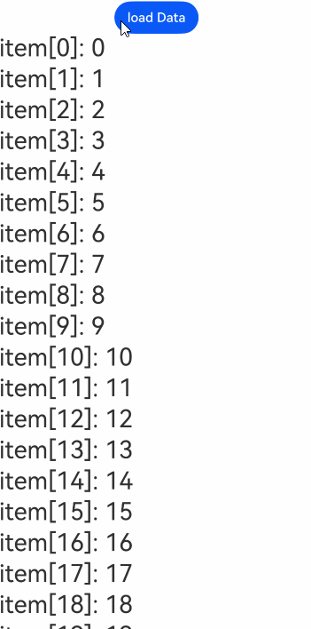

# LazyForEach: Data Lazy Loading

<!--Del-->
> **Note:**
>
> Currently in the beta phase.
<!--DelEnd-->

For API parameter descriptions, see: [LazyForEach API Parameters](../../reference/arkui-cj/cj-state-rendering-lazyforeach.md).

LazyForEach iterates through the provided data source on demand and creates corresponding components during each iteration. When used within a scrollable container, the framework creates components on demand based on the visible area of the container. When components scroll out of the visible area, the framework destroys and recycles them to reduce memory usage.

## Usage Restrictions

- LazyForEach must be used within container components. Only [List](../../reference/arkui-cj/cj-scroll-swipe-list.md), [Grid](../../reference/arkui-cj/cj-scroll-swipe-grid.md), and [Swiper](../../reference/arkui-cj/cj-scroll-swipe-swiper.md) support lazy loading (with the `cachedCount` property configurable to load only the visible portion and a small buffer of adjacent data). Other components load all data at once.
- LazyForEach relies on generated key values to determine whether to refresh child components. If key values remain unchanged, LazyForEach cannot refresh the corresponding child components.
- When using LazyForEach within a container component, only one LazyForEach is allowed. For example, in a List, it is not recommended to include ListItem, ForEach, and LazyForEach simultaneously, nor to include multiple LazyForEach instances.
- LazyForEach must create exactly one child component per iteration; the child component generator function must have exactly one root component.
- Generated child components must be allowed within the parent container component of LazyForEach.
- LazyForEach can be included in if/else conditional rendering statements, and conditional rendering can also be used within LazyForEach.
- The key generator must produce unique values for each data item. Duplicate keys may cause rendering issues for UI components with the same key.
- LazyForEach must use a DataChangeListener object for updates. Reassigning the first parameter `dataSource` will cause exceptions. When `dataSource` uses state variables, changes to the state variables will not trigger UI refreshes in LazyForEach.
- For high-performance rendering, when updating the UI via the `onDataChange` method of the DataChangeListener object, a different key value must be generated to trigger component refresh.
- LazyForEach must be used with the `@Reusable` decorator to enable node reuse. Usage: Apply the [@Reusable](../paradigm/cj-macro-reusable.md) decorator to the components in the LazyForEach list. See [Usage Rules](../paradigm/cj-macro-reusable.md).

## Key Generation Rules

During LazyForEach rendering, the system generates a unique and persistent key value for each item to identify the corresponding component. When this key changes, the ArkUI framework treats the array element as replaced or modified and creates a new component based on the new key.

LazyForEach provides a `keyGenerator` parameter, a function that allows developers to customize key generation rules. If no `keyGenerator` is defined, ArkUI uses the default function: `{data: T, idx: Int64 => return "\${viewID} - \${idx} - \${uniqueKey_}"}`, where `viewId` is generated during compilation and remains consistent within the same LazyForEach component.

## Component Creation Rules

After determining the key generation rules, LazyForEach's second parameter, `itemGenerator`, creates components for each array item in the data source. Component creation occurs in two scenarios: [First Render](#first-render) and [Non-First Render](#non-first-render).

### First Render

#### Generating Unique Keys

During the first render, LazyForEach generates unique keys for each array item based on the key generation rules and creates corresponding components.

```cangjie
/** BasicDataSource code is provided in the appendix at the end of the document: Generic array BasicDataSource code **/

class MyDataSource <: BasicDataSource<String> {
    public MyDataSource(let data: ArrayList<String>) {
        super(data)
    }
}

@Entry
@Component
public class EntryView {
    let dataSource: MyDataSource = MyDataSource(ArrayList<String>())
    let random: Random = Random(3)
    @State var message: String = ""

    protected override func aboutToAppear() {
        for (i in 0..100) {
            let index = this.dataSource.totalCount()
            dataSource.data.add(i.toString())
            dataSource.notifyDataAdd(index)
        }
    }

    public func build(): Unit {
        Column() {
            Row() {
                Text(this.message).width(300.px)
            }
            List(space: 3) {
                LazyForEach(dataSource, itemGenerator: { item: String, index: Int64 =>
                        ListItem() {
                            Text("item[${index}]: ${item}").fontSize(30).onAppear({=> this.message="appear:" + item})
                        }
                    }, keyGenerator: { item: String, index: Int64 => item}
                )
            }.cachedCount(5)

        }.height(100.percent).height(100.percent)
    }
}
```

In this code, the key generation rule is the `item` returned by the `keyGenerator` function. During rendering, it generates keys like `item[0]: 0`, `item[1]: 1`, ..., `item[100]: 100` and creates corresponding ListItem child components.

The rendering effect is shown below.

**Figure 1** LazyForEach Normal First Render


#### Error Rendering with Duplicate Keys

When different data items generate the same key, the framework's behavior is unpredictable. For example, in the following code, LazyForEach renders data items with identical keys. During scrolling, LazyForEach preloads components entering or exiting the current page. Since new and destroyed components share the same key, the framework may incorrectly reuse cached components, causing rendering issues.

```cangjie
/** BasicDataSource code is provided in the appendix at the end of the document: Generic array BasicDataSource code **/

class MyDataSource <: BasicDataSource<String> {
    public MyDataSource(let data: ArrayList<String>) {
        super(data)
    }
}

@Entry
@Component
public class EntryView {
    let dataSource: MyDataSource = MyDataSource(ArrayList<String>())
    @State var message: String = ""

    protected override func aboutToAppear() {
        for (i in 0..100) {
            let index = this.dataSource.totalCount()
            dataSource.data.add(i.toString())
            dataSource.notifyDataAdd(index)
        }
    }

    public func build(): Unit {
        Column() {
            Row() {
                Text(this.message).width(300.px)
            }
            List(space: 3) {
                LazyForEach(dataSource, itemGenerator: { item: String, index: Int64 =>
                        ListItem() {
                            Text("item[${index}]: ${item}").fontSize(30).onAppear({=> this.message="appear:" + item})
                        }
                    }, keyGenerator: { item: String, index: Int64 => return "samekey"}
                )
            }.cachedCount(5)

        }.height(100.percent).height(100.percent)
    }
}
```

The rendering effect is shown below.

**Figure 2** LazyForEach with Duplicate Keys


### Non-First Render

When the LazyForEach data source changes and requires re-rendering, developers should call the corresponding listener methods based on the data source changes to notify LazyForEach of updates. Usage scenarios are as follows.

#### Adding Data

```cangjie
/** BasicDataSource code is provided in the appendix at the end of the document: Generic array BasicDataSource code **/

class MyDataSource <: BasicDataSource<String> {
    public MyDataSource(let data: ArrayList<String>) {
        super(data)
    }

    public func pushData(str: String): Unit {
        this.data.add(str)
        this.notifyDataAdd(this.data.size - 1)
    }
}

@Entry
@Component
public class EntryView {
    let dataSource: MyDataSource = MyDataSource(ArrayList<String>())
    let random: Random = Random(3)

    public func build(): Unit {
        Column() {
            Row() {
                Button("load Data").onClick({ =>
                    for (i in 0..10) {
                        dataSource.pushData(i.toString())
                    }
                })

                Button("add Data").onClick({ =>
                    // Click to append child components
                    dataSource.pushData(dataSource.totalCount().toString())
                })
            }
            List(space: 3) {
                LazyForEach(dataSource, itemGenerator: { item: String, index: Int64 =>
                        ListItem() {
                            Text("item[${index}]: ${item}").fontSize(30)
                        }
                    }
                )
            }.cachedCount(5)

        }.height(100.percent).height(100.percent)
    }
}
```

When clicking the "add Data" button, the `pushData` method of `dataSource` is called, which appends data to the end of the data source and invokes `notifyDataAdd`. Inside `notifyDataAdd`, `listenerItem.onDataAdd` is called, notifying LazyForEach of the data addition, which then creates a new child component at the specified index.

The rendering effect is shown below.

**Figure 3** LazyForEach Adding Data


#### Deleting Data

```cangjie
/** BasicDataSource code is provided in the appendix at the end of the document: Generic array BasicDataSource code **/

class MyDataSource <: BasicDataSource<String> {
    public MyDataSource(let data: ArrayList<String>) {
        super(data)
    }

    public func pushData(str: String): Unit {
        this.data.add(str)
        this.notifyDataAdd(this.data.size - 1)
    }

    public func deleteData(index: Int64): Unit {
        this.data.remove(at: index)
        this.notifyDataDelete(index)
    }

    public func getAllData(): ArrayList<String> {
        return data
    }
}

@Entry
@Component
public class EntryView {
    let dataSource: MyDataSource = MyDataSource(ArrayList<String>())

    func findIndex(arrayList: ArrayList<String>, value: String): Int64 {
        for (i in 0..arrayList.size) {
            if (arrayList[i]==value) {
                return i
            }
        }
        return -1
    }

    public func build(): Unit {
        Column() {
            Row() {
                Button("load Data").onClick({ =>
                    for (i in 0..100) {
                        dataSource.pushData(i.toString())
                    }
                })
            }
            List(space: 3) {
                LazyForEach(dataSource, itemGenerator: { item: String, index: Int64 =>
                        ListItem() {
                            Text("item[${index}]: ${item}").fontSize(30)
                        }.onClick({ _ =>
                            // Click to delete child components
                            this.dataSource.deleteData(findIndex(this.dataSource.getAllData(),item))
                        })
                    }, keyGenerator: { item: String, index: Int64 => return item}
                )
            }.cachedCount(5)

        }.height(100.percent).height(100.percent)
    }
}
```

When clicking a ListItem element, the `deleteData` method of `dataSource` is called, which removes data from the data source and invokes `notifyDataDelete`. Inside `notifyDataDelete`, `listenerItem.onDataDelete` is called, notifying LazyForEach of the data deletion, which then removes the child component at the specified index.

The rendering effect is shown below.

**Figure 4** LazyForEach Deleting Data


#### Swapping Data

```cangjie
/** BasicDataSource code is provided in the appendix at the end of the document: Generic array BasicDataSource code **/

class MyDataSource <: BasicDataSource<String> {
    public MyDataSource(let data: ArrayList<String>) {
        super(data)
    }

    public func pushData(str: String): Unit {
        this.data.add(str)
        this.notifyDataAdd(this.data.size - 1)
    }

    public func deleteData(index: Int64): Unit {
        this.data.remove(at: index)
        this.notifyDataDelete(index)
    }

    public func getAllData(): ArrayList<String> {
        return data
    }

    public func moveData(from: Int64, to: Int64): Unit {
        let temp: String = this.data[from]
        this.data[from] = this.data[to]
        this.data[to] = temp
        this.notifyDataMove(from, to)
    }
}

@Entry
@Component
public class EntryView {
    let dataSource: MyDataSource = MyDataSource(ArrayList<String>())
    var moved: ArrayList<Int64> = ArrayList<Int64>()

    func findIndex(arrayList: ArrayList<String>, value: String): Int64 {
        for (i in 0..arrayList.size) {
            if (arrayList[i]==value) {
                return i
            }
        }
        return -1
    }

    public func build(): Unit {
        Column() {
            Row() {
                Button("load Data").onClick({ =>
                    for (i in 0..100) {
                        dataSource.pushData(i.toString())
                    }
                })
            }
            List(space: 3) {
                LazyForEach(dataSource, itemGenerator: { item: String, index: Int64 =>
                        ListItem() {
                            Text("item[${index}]: ${item}").fontSize(30)
                        }.onClick({ _ =>
                            this.moved.add(findIndex(this.dataSource.getAllData(),item))
                            if (this.moved.size == 2) {
                                // Click to swap child components
                                this.dataSource.moveData(this.moved[0], this.moved[1])
                                this.moved.clear()
                            }
                        })
                    }, keyGenerator: { item: String, index: Int64 => return item}
                )
            }.cachedCount(5)

        }.height(100.percent).height(100.percent)
    }
}
```

When clicking a LazyForEach child component for the first time, the index of the data to be moved is stored in the `moved` member variable. Clicking another child component moves the first-clicked component to this position. The `moveData` method of `dataSource` is called, which moves the data to the target position and invokes `notifyDataMove`. Inside `notifyDataMove`, `listenerItem.onDataMove` is called, notifying LazyForEach of the data movement, which then swaps the child components at the `from` and `to` indices.

The rendering effect is shown below.

**Figure 5** LazyForEach Swapping Data


#### Modifying Single Data

```cangjie
/** BasicDataSource code is provided in the appendix at the end of the document: Generic array BasicDataSource code **/

class MyDataSource <: BasicDataSource<String> {
    public MyDataSource(let data: ArrayList<String>) {
        super(data)
    }

    public func pushData(str: String): Unit {
        this.data.add(str)
        this.notifyDataAdd(this.data.size - 1)
    }

    public func deleteData(index: Int64): Unit {
        this.data.remove(at: index)
        this.notifyDataDelete(index)
    }

    public func getAllData(): ArrayList<String> {
        return data
    }

    public func moveData(from: Int64, to: Int64): Unit {
        let temp: String = this.data[from]
        this.data[from] = this.data[to]
        this.data[to] = temp
        this.notifyDataMove(from, to)
    }

    public func changeData(index: Int64, str: String): Unit {
        this.data[index]=str
        this.notifyDataChange(index)
    }
}

@Entry
@Component
public class EntryView {
    let dataSource: MyDataSource = MyDataSource(ArrayList<String>())

    func findIndex(arrayList: ArrayList<String>, value: String): Int64 {
        for (i in 0..arrayList.size) {
            if (arrayList[i]==value) {
                return i
            }
        }
        return -1
    }

    public func build(): Unit {
        Column() {
            Row() {
                Button("load Data").onClick({ =>
                    for (i in 0..100) {
                        dataSource.pushData(i.toString())
                    }
                })
            }
            List(space: 3) {
                LazyForEach(dataSource, itemGenerator: { item: String, index: Int64 =>
                        ListItem() {
                            Text("item[${index}]: ${item}").fontSize(30)
                        }.onClick({ _ =>
                            this.dataSource.changeData(findIndex(this.dataSource.getAllData(), item), item+"0")
                    })
                }, keyGenerator: { item: String, index: Int64 => return item})

        }.cachedCount(5)

        }.height(100.percent).height(100.percent)
    }
}
```

When clicking a LazyForEach child component, the current data is modified, and the `changeData` method of `dataSource` is called, which invokes `notifyDataChange`. Inside `notifyDataChange`, `listenerItem.onDataChange` is called, notifying LazyForEach of the data modification, which then rebuilds the child component at the specified index.

The rendering effect is shown below.

**Figure 6** LazyForEach Modifying Single Data



#### Modifying Multiple Data

```cangjie
/** BasicDataSource code is provided in the appendix at the end of the document: Generic array BasicDataSource code **/

class MyDataSource <: BasicDataSource<String> {
    public MyDataSource(let data: ArrayList<String>) {
        super(data)
    }

    public func pushData(str: String): Unit {
        this.data.add(str)
        this.notifyDataAdd(this.data.size - 1)
    }

    public func reloadData(): Unit {
        this.notifyDataReload()
    }

    public func modifyAllData(): Unit {
        for (i in 0..this.data.size) {
            this.data[i] += "0"
        }
    }
}

@Entry
@Component
public class EntryView {
    let dataSource: MyDataSource = MyDataSource(ArrayList<String>())

    func findIndex(arrayList: ArrayList<String>, value: String): Int64 {
        for (i in 0..arrayList.size) {
            if (arrayList[i]==### Unexpected Rendering Results

```cangjie
/** BasicDataSource code can be found in the appendix at the end of the document: BasicDataSource code for generic type arrays **/

class MyDataSource <: BasicDataSource<String> {
    public var data: ArrayList<String> = ArrayList<String>()
    public MyDataSource() {
        super(this.data)
    }

    public func pushData(stringData: String): Unit {
        this.data.add(stringData)
        this.notifyDataAdd(this.data.size - 1)
    }

    public func deleteData(index: Int64): Unit {
        this.data.remove(at: index)
        this.notifyDataDelete(index)
    }
}

@Entry
@Component
public class EntryView {
    let dataSource: MyDataSource = MyDataSource()

    protected override func aboutToAppear() {
        for (i in 0..20) {
              this.dataSource.pushData("Hello ${i}")
        }
    }

    public func build(): Unit {
        Column() {
            List(space: 3) {
                LazyForEach(dataSource, itemGenerator: { item: String, index: Int64 =>
                        ListItem() {
                            Text(item)
                                .fontSize(50)
                        }.onClick({ _ =>
                            // Click to delete child component
                            this.dataSource.deleteData(index)
                        })
                        .margin(left: 10, right: 10)
                }, keyGenerator: { item: String, index: Int64 => return item})
            }.cachedCount(5)
        }.height(100.percent)
        .width(100.percent)
    }
}
```

**Figure 11** Unexpected LazyForEach Data Deletion


When clicking child components multiple times, it is observed that the deleted component is not necessarily the one clicked. The reason is that after deleting a child component, the indices of subsequent data items should be decremented by 1. However, the child components corresponding to these subsequent data items still use the initially assigned indices, and the `index` in `itemGenerator` does not update accordingly, leading to unexpected deletion results.

The fixed code is shown below.

```cangjie
/** BasicDataSource code can be found in the appendix at the end of the document: BasicDataSource code for generic type arrays **/

class MyDataSource <: BasicDataSource<String> {
    public var data: ArrayList<String> = ArrayList<String>()
    public MyDataSource() {
        super(this.data)
    }

    public func pushData(stringData: String): Unit {
        this.data.add(stringData)
        this.notifyDataAdd(this.data.size - 1)
    }

    public func deleteData(index: Int64): Unit {
        this.data.remove(at: index)
        this.notifyDataDelete(index)
    }

    public func reloadData(): Unit {
        this.notifyDataReload()
    }
}

@Entry
@Component
public class EntryView {
    let dataSource: MyDataSource = MyDataSource()

    protected override func aboutToAppear() {
        for (i in 0..20) {
              this.dataSource.pushData("Hello ${i}")
        }
    }

    public func build(): Unit {
        Column() {
            List(space: 3) {
                LazyForEach(dataSource, itemGenerator: { item: String, index: Int64 =>
                        ListItem() {
                            Text(item)
                                .fontSize(50)
                        }.onClick({ _ =>
                            // Click to delete child component
                            this.dataSource.deleteData(index)
                            // Reset indices for all child components
                            this.dataSource.reloadData()
                        })
                        .margin(left: 10, right: 10)
                }, keyGenerator: { item: String, index: Int64 => return item + index.toString()})
            }.cachedCount(5)
        }.height(100.percent)
        .width(100.percent)
    }
}
```

After deleting a data item, the `reloadData` method is called to rebuild subsequent data items, thereby updating their indices. To ensure the `reloadData` method rebuilds data items, new keys must be generated for them. Here, `item + index.toString()` is used to guarantee that data items following the deleted one are rebuilt. Alternatively, using `item + DateTime.now().toString()` would generate new keys for all data items, causing all of them to be rebuilt. This approach achieves the same effect but with slightly worse performance.

**Figure 12** Fixed LazyForEach Data Deletion Issue


### Screen Flickering in List

Calling `onDataReloaded` in the `onScrollIndex` method of `List` may cause screen flickering.

```cangjie
/** BasicDataSource code can be found in the appendix at the end of the document: BasicDataSource code for generic type arrays **/

class MyDataSource <: BasicDataSource<String> {
    public MyDataSource(let data: ArrayList<String>) {
        super(data)
    }

    public func pushData(stringData: String): Unit {
        this.data.add(stringData)
        this.notifyDataAdd(this.data.size - 1)
    }

    public func operateData(): Unit {
        let totalCount = this.data.size
        let batch = 5
        for (i in totalCount..totalCount+batch) {
            this.data.add("Hello ${i}")
        }
        this.notifyDataReload()
    }
}

@Entry
@Component
public class EntryView {
    let dataSource: MyDataSource = MyDataSource(ArrayList<String>())

    protected override func aboutToAppear() {
        for (i in 0..10) {
            this.dataSource.pushData("Hello ${i}")
        }
    }

    public func build(): Unit {
        Column() {
            List(space: 3) {
                LazyForEach(dataSource, itemGenerator: { item: String, index: Int64 =>
                        ListItem() {
                            Text(item)
                                .width(100.percent)
                                .height(80)
                                .backgroundColor(Color.Gray)
                                .fontSize(30)
                        }.margin(left: 10, right: 10)
                    }
                )
            }.cachedCount(10)
            .onScrollIndex({start: Int32, end: Int32, center: Int32 =>
                if (Int64(end) == this.dataSource.totalCount() - 1) {
                        this.dataSource.operateData()
                }
            })

        }.height(100.percent).height(100.percent)
    }
}
```

When scrolling to the bottom of the `List`, the flickering effect is shown below.


Using `onDatasetChange` instead of `onDataReloaded` not only fixes the flickering issue but also improves loading performance.

```cangjie
/** BasicDataSource code can be found in the appendix at the end of the document: BasicDataSource code for generic type arrays **/

class MyDataSource <: BasicDataSource<String> {
    public MyDataSource(let data: ArrayList<String>) {
        super(data)
    }

    public func pushData(stringData: String): Unit {
        this.data.add(stringData)
        this.notifyDataAdd(this.data.size - 1)
    }

    public func operateData(): Unit {
        let totalCount = this.data.size
        let batch = 5
        for (i in totalCount..totalCount+batch) {
            this.data.add("Hello ${i}")
        }
        this.notifyDatasetChange(ArrayList<DataOperation>([
                DataAddOperation(Int32(totalCount - 1), count: Int32(batch), key: "", keys: [""])
            ]))
    }
}

@Entry
@Component
public class EntryView {
    let dataSource: MyDataSource = MyDataSource(ArrayList<String>())

    protected override func aboutToAppear() {
        for (i in 0..10) {
            this.dataSource.pushData("Hello ${i}")
        }
    }

    public func build(): Unit {
        Column() {
            List(space: 3) {
                LazyForEach(dataSource, itemGenerator: { item: String, index: Int64 =>
                        ListItem() {
                            Text(item)
                                .width(100.percent)
                                .height(80)
                                .backgroundColor(Color.Gray)
                                .fontSize(30)
                        }.margin(left: 10, right: 10)
                    }
                )
            }.cachedCount(10)
            .onScrollIndex({start: Int32, end: Int32, center: Int32 =>
                if (Int64(end) == this.dataSource.totalCount() - 1) {
                        this.dataSource.operateData()
                }
            })

        }.height(100.percent).height(100.percent)
    }
}
```


## Appendix

### BasicDataSource Code for Generic Type Arrays

```cangjie
// BasicDataSource implements the IDataSource interface for managing listener registrations and notifying LazyForEach of data updates
public open class BasicDataSource<T> <: IDataSource<T> {
    public BasicDataSource(let data_: ArrayList<T>) {}
    public var listenerOp: ArrayList<DataChangeListener> = ArrayList<DataChangeListener>()
    public func totalCount(): Int {
        return data_.size
    }
    public func getData(index: Int): T {
        return data_[index]
    }

    // This method is called by the framework to register a DataChangeListener for LazyForEach components
    public func onRegisterDataChangeListener(listener: DataChangeListener): Unit {
        for (listeneritem in listenerOp) {
            if (refEq(listeneritem, listener)) {
                return
            }
        }
        listenerOp.add(listener)
    }

    // This method is called by the framework to unregister a DataChangeListener for LazyForEach components
    public func onUnregisterDataChangeListener(listener: DataChangeListener): Unit {
        var index = 0
        while (index < listenerOp.size) {
            let listeneritem = listenerOp[index]
            if (refEq(listeneritem, listener)) {
                listenerOp.remove(at: index)
            } else {
                index++
            }
        }
    }

    // Notifies LazyForEach components to reload all child components
    public func notifyDataReload(): Unit {
        for (listeneritem in listenerOp) {
            listeneritem.onDataReloaded()
        }
    }

    // Notifies LazyForEach components that data at the specified index has changed and requires rebuilding the child component
    public func notifyDataChange(index: Int64): Unit {
        for (listeneritem in listenerOp) {
            listeneritem.onDataChange(index)
        }
    }

    // Notifies LazyForEach components to add a child component at the specified index
    public func notifyDataAdd(index: Int64): Unit {
        for (listeneritem in listenerOp) {
            listeneritem.onDataAdd(index)
        }
    }

    // Notifies LazyForEach components to delete the child component at the specified index
    public func notifyDataDelete(index: Int64): Unit {
        for (listeneritem in listenerOp) {
            listeneritem.onDataDelete(index)
        }
    }

    // Notifies LazyForEach components to swap child components between the specified from and to indices
    public func notifyDataMove(from: Int64, to: Int64): Unit {
        for (listeneritem in listenerOp) {
            listeneritem.onDataMove(from, to)
        }
    }

    public func notifyDatasetChange(operations: ArrayList<DataOperation>): Unit {
        for (listeneritem in listenerOp) {
            listeneritem.onDatasetChange(operations)
        }
    }
}
```