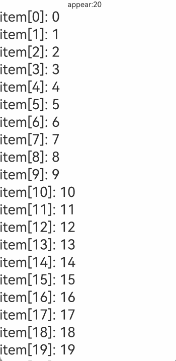
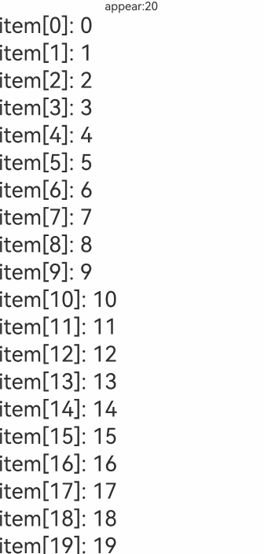
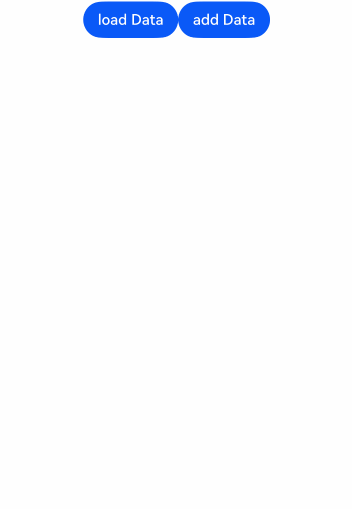
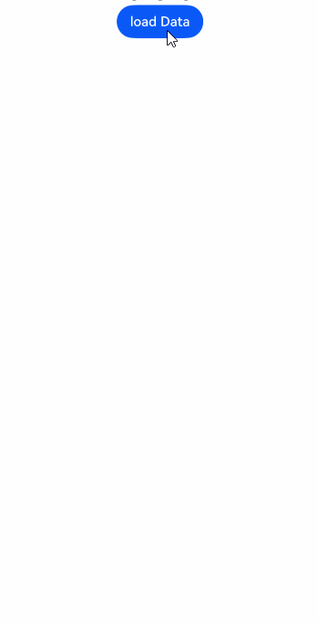
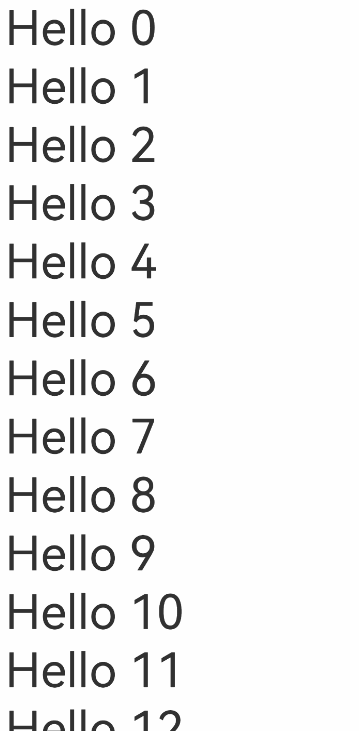
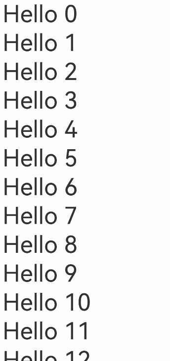
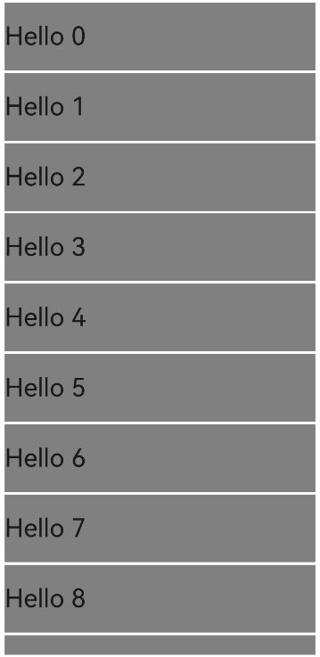
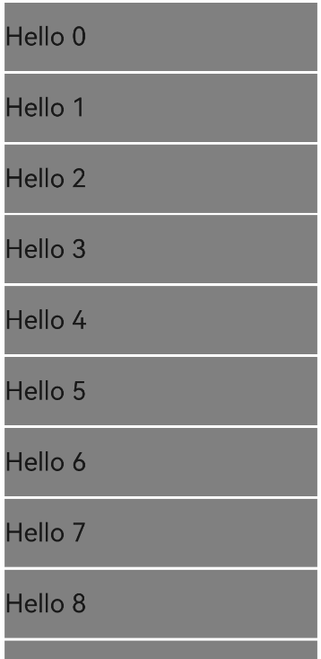

# LazyForEach: Lazy Data Loading

For API parameter descriptions, see: [LazyForEach API Parameters](../../../../en/application-dev/reference/arkui-cj/cj-state-rendering-lazyforeach.md).

LazyForEach iterates through a provided data source on demand and creates corresponding components during each iteration. When used within a scrollable container, the framework creates components on demand based on the visible area of the container. When components scroll out of the visible area, the framework destroys and recycles them to reduce memory usage.

## Usage Restrictions

- LazyForEach must be used within container components. Only [List](../../../../en/application-dev/reference/arkui-cj/cj-scroll-swipe-list.md), [Grid](../../../../en/application-dev/reference/arkui-cj/cj-scroll-swipe-grid.md), and [Swiper](../../../../en/application-dev/reference/arkui-cj/cj-scroll-swipe-swiper.md) components support lazy data loading (configurable via the `cachedCount` property, which loads only the visible portion and a small buffer of adjacent data). Other components still load all data at once.
- LazyForEach relies on generated key values to determine whether to refresh child components. If the key values remain unchanged, LazyForEach cannot trigger the refresh of corresponding child components.
- When using LazyForEach within a container component, only one LazyForEach is allowed. For example, in a List, it is not recommended to include ListItem, ForEach, and LazyForEach simultaneously, nor is it recommended to include multiple LazyForEach instances.
- During each iteration, LazyForEach must create exactly one child component; that is, the child component generator function of LazyForEach must have exactly one root component.
- The generated child components must be allowed within the parent container component of LazyForEach.
- LazyForEach can be included within if/else conditional rendering statements, and conditional rendering statements can also appear within LazyForEach.
- The key generator must generate a unique value for each data item. If key values are identical, it will cause rendering issues for UI components with the same keys.
- LazyForEach must use a DataChangeListener object for updates. Reassigning the first parameter `dataSource` will cause exceptions. When `dataSource` uses state variables, changes to the state variables will not trigger UI refreshes in LazyForEach.
- For high-performance rendering, when updating the UI via the `onDataChange` method of the DataChangeListener object, a different key value must be generated to trigger component refreshes.
- LazyForEach must be used with the `@Reusable` decorator to enable node reuse. Usage: Apply the [@Reusable](../paradigm/cj-macro-reusable.md) decorator to the components in the LazyForEach list. See [Usage Rules](../paradigm/cj-macro-reusable.md).

## Key Generation Rules

During LazyForEach's iterative rendering, the system generates a unique and persistent key value for each item to identify the corresponding component. When this key value changes, the ArkUI framework treats the array element as replaced or modified and creates a new component based on the new key value.

LazyForEach provides a `keyGenerator` parameter, which is a function that allows developers to customize key generation rules. If the developer does not define a `keyGenerator` function, the ArkUI framework uses the default key generation function: `{data: T, idx: Int64 => return "\${viewID} - \${idx} - \${uniqueKey_}"}`. The `viewId` is generated during the compiler transformation process and remains consistent within the same LazyForEach component.

## Component Creation Rules

After determining the key generation rules, LazyForEach's second parameter, the `itemGenerator` function, creates components for each item in the data source according to the component creation rules. Component creation includes two scenarios: [First-Time Rendering](#first-time-rendering) and [Non-First-Time Rendering](#non-first-time-rendering).

### First-Time Rendering

#### Generating Different Key Values

During the first-time rendering of LazyForEach, unique key values are generated for each item in the data source according to the key generation rules, and corresponding components are created.

```cangjie
/** BasicDataSource code can be found in the appendix at the end of the document: Generic Array BasicDataSource Code **/

class MyDataSource <: BasicDataSource<String> {
    public MyDataSource(let data: ArrayList<String>) {
        super(data)
    }
}

@Entry
@Component
public class EntryView {
    let dataSource: MyDataSource = MyDataSource(ArrayList<String>())
    let random: Random = Random(3)
    @State var message: String = ""

    protected override func aboutToAppear() {
        for (i in 0..100) {
            let index = this.dataSource.totalCount()
            dataSource.data.add(i.toString())
            dataSource.notifyDataAdd(index)
        }
    }

    public func build(): Unit {
        Column() {
            Row() {
                Text(this.message).width(300.px)
            }
            List(space: 3) {
                LazyForEach(dataSource, itemGeneratorFunc: { item: String, index: Int64 =>
                        ListItem() {
                            Text("item[${index}]: ${item}").fontSize(30).onAppear({=> this.message="appear:" + item})
                        }
                    }, keyGeneratorFunc: { item: String, index: Int64 => item}
                )
            }.cachedCount(5)

        }.height(100.percent).height(100.percent)
    }
}
```

In the above code, the key generation rule is the return value `item` of the `keyGenerator` function. During LazyForEach's iterative rendering, it generates key values `item[0]: 0`, `item[1]: 1`, ..., `item[100]: 100` for the data source items and creates corresponding ListItem child components to render on the interface.

The running effect is shown below.

**Figure 1** Normal First-Time Rendering of LazyForEach



#### Incorrect Rendering with Identical Key Values

When different data items generate identical key values, the framework's behavior becomes unpredictable. For example, in the following code, LazyForEach renders data items with identical key values. During scrolling, LazyForEach preloads child components that scroll into and out of the current view. Since the newly created child components and the original ones have the same key values, the framework may incorrectly reuse cached components, leading to rendering issues.

```cangjie
/** BasicDataSource code can be found in the appendix at the end of the document: Generic Array BasicDataSource Code **/

class MyDataSource <: BasicDataSource<String> {
    public MyDataSource(let data: ArrayList<String>) {
        super(data)
    }
}

@Entry
@Component
public class EntryView {
    let dataSource: MyDataSource = MyDataSource(ArrayList<String>())
    @State var message: String = ""

    protected override func aboutToAppear() {
        for (i in 0..100) {
            let index = this.dataSource.totalCount()
            dataSource.data.add(i.toString())
            dataSource.notifyDataAdd(index)
        }
    }

    public func build(): Unit {
        Column() {
            Row() {
                Text(this.message).width(300.px)
            }
            List(space: 3) {
                LazyForEach(dataSource, itemGeneratorFunc: { item: String, index: Int64 =>
                        ListItem() {
                            Text("item[${index}]: ${item}").fontSize(30).onAppear({=> this.message="appear:" + item})
                        }
                    }, keyGeneratorFunc: { item: String, index: Int64 => return "samekey"}
                )
            }.cachedCount(5)

        }.height(100.percent).height(100.percent)
    }
}
```

The running effect is shown below.

**Figure 2** LazyForEach with Identical Key Values



### Non-First-Time Rendering

When the LazyForEach data source changes and requires re-rendering, developers should call the corresponding methods of the `listener` based on the data source changes to notify LazyForEach of the updates. The usage scenarios are as follows.

#### Adding Data

```cangjie
/** BasicDataSource code can be found in the appendix at the end of the document: Generic Array BasicDataSource Code **/

class MyDataSource <: BasicDataSource<String> {
    public MyDataSource(let data: ArrayList<String>) {
        super(data)
    }

    public func pushData(str: String): Unit {
        this.data.add(str)
        this.notifyDataAdd(this.data.size - 1)
    }
}

@Entry
@Component
public class EntryView {
    let dataSource: MyDataSource = MyDataSource(ArrayList<String>())
    let random: Random = Random(3)

    public func build(): Unit {
        Column() {
            Row() {
                Button("load Data").onClick({ =>
                    for (i in 0..10) {
                        dataSource.pushData(i.toString())
                    }
                })

                Button("add Data").onClick({ =>
                    // Click to append child components
                    dataSource.pushData(dataSource.totalCount().toString())
                })
            }
            List(space: 3) {
                LazyForEach(dataSource, itemGeneratorFunc: { item: String, index: Int64 =>
                        ListItem() {
                            Text("item[${index}]: ${item}").fontSize(30)
                        }
                    }
                )
            }.cachedCount(5)

        }.height(100.percent).height(100.percent)
    }
}
```

When we click the "add Data" button, the `pushData` method of the data source `dataSource` is called first. This method adds data to the end of the data source and calls `notifyDataAdd`. Inside `notifyDataAdd`, the `listenerItem.onDataAdd` method is called, which notifies LazyForEach that data has been added at this index. LazyForEach then creates a new child component at this index.

The running effect is shown below.

**Figure 3** LazyForEach Adding Data



#### Deleting Data

```cangjie
/** BasicDataSource code can be found in the appendix at the end of the document: Generic Array BasicDataSource Code **/

class MyDataSource <: BasicDataSource<String> {
    public MyDataSource(let data: ArrayList<String>) {
        super(data)
    }

    public func pushData(str: String): Unit {
        this.data.add(str)
        this.notifyDataAdd(this.data.size - 1)
    }

    public func deleteData(index: Int64): Unit {
        this.data.remove(at: index)
        this.notifyDataDelete(index)
    }

    public func getAllData(): ArrayList<String> {
        return data
    }
}

@Entry
@Component
public class EntryView {
    let dataSource: MyDataSource = MyDataSource(ArrayList<String>())

    func findIndex(arrayList: ArrayList<String>, value: String): Int64 {
        for (i in 0..arrayList.size) {
            if (arrayList[i]==value) {
                return i
            }
        }
        return -1
    }

    public func build(): Unit {
        Column() {
            Row() {
                Button("load Data").onClick({ =>
                    for (i in 0..100) {
                        dataSource.pushData(i.toString())
                    }
                })
            }
            List(space: 3) {
                LazyForEach(dataSource, itemGeneratorFunc: { item: String, index: Int64 =>
                        ListItem() {
                            Text("item[${index}]: ${item}").fontSize(30)
                        }.onClick({ _ =>
                            // Click to delete child components
                            this.dataSource.deleteData(findIndex(this.dataSource.getAllData(),item))
                        })
                    }, keyGeneratorFunc: { item: String, index: Int64 => return item}
                )
            }.cachedCount(5)

        }.height(100.percent).height(100.percent)
    }
}
```

When we click a ListItem element, the `deleteData` method of the data source `dataSource` is called first. This method adds data to the end of the data source and calls `notifyDataDelete`. Inside `notifyDataDelete`, the `listenerItem.onDataDelete` method is called, which notifies LazyForEach that data has been deleted at this index. LazyForEach then deletes the child component at this index.

The running effect is shown below.

**Figure 4** LazyForEach Deleting Data


#### Swapping Data

```cangjie
/** BasicDataSource code can be found in the appendix at the end of the document: Generic Array BasicDataSource Code **/

class MyDataSource <: BasicDataSource<String> {
    public MyDataSource(let data: ArrayList<String>) {
        super(data)
    }

    public func pushData(str: String): Unit {
        this.data.add(str)
        this.notifyDataAdd(this.data.size - 1)
    }

    public func deleteData(index: Int64): Unit {
        this.data.remove(at: index)
        this.notifyDataDelete(index)
    }

    public func getAllData(): ArrayList<String> {
        return data
    }

    public func moveData(from: Int64, to: Int64): Unit {
        let temp: String = this.data[from]
        this.data[from] = this.data[to]
        this.data[to] = temp
        this.notifyDataMove(from, to)
    }
}

@Entry
@Component
public class EntryView {
    let dataSource: MyDataSource = MyDataSource(ArrayList<String>())
    var moved: ArrayList<Int64> = ArrayList<Int64>()

    func findIndex(arrayList: ArrayList<String>, value: String): Int64 {
        for (i in 0..arrayList.size) {
            if (arrayList[i]==value) {
                return i
            }
        }
        return -1
    }

    public func build(): Unit {
        Column() {
            Row() {
                Button("load Data").onClick({ =>
                    for (i in 0..100) {
                        dataSource.pushData(i.toString())
                    }
                })
            }
            List(space: 3) {
                LazyForEach(dataSource, itemGeneratorFunc: { item: String, index: Int64 =>
                        ListItem() {
                            Text("item[${index}]: ${item}").fontSize(30)
                        }.onClick({ _ =>
                            this.moved.add(findIndex(this.dataSource.getAllData(),item))
                            if (this.moved.size == 2) {
                                // Click to swap child components
                                this.dataSource.moveData(this.moved[0], this.moved[1])
                                this.moved.clear()
                            }
                        })
                    }, keyGeneratorFunc: { item: String, index: Int64 => return item}
                )
            }.cachedCount(5)

        }.height(100.percent).height(100.percent)
    }
}
```

When we first click a child component of LazyForEach, the index of the data to be moved is stored in the `moved` member variable. When we click another child component of LazyForEach, the first clicked child component is moved to this position. The `moveData` method of the data source `dataSource` is called, which moves the corresponding data to the desired position and calls `notifyDataMove`. Inside `notifyDataMove`, the `listenerItem.onDataMove` method is called, which notifies LazyForEach that data needs to be moved between the `from` and `to` indices. LazyForEach then swaps the child components at these indices.

The running effect is shown below.

**Figure 5** LazyForEach Swapping Data



#### Modifying Single Data Item

```cangjie
/** BasicDataSource code can be found in the appendix at the end of the document: Generic Array BasicDataSource Code **/

class MyDataSource <: BasicDataSource<String> {
    public MyDataSource(let data: ArrayList<String>) {
        super(data)
    }

    public func pushData(str: String): Unit {
        this.data.add(str)
        this.notifyDataAdd(this.data.size - 1)
    }

    public func deleteData(index: Int64): Unit {
        this.data.remove(at: index)
        this.notifyDataDelete(index)
    }

    public func getAllData(): ArrayList<String> {
        return data
    }

    public func moveData(from: Int64, to: Int64): Unit {
        let temp: String = this.data[from]
        this.data[from] = this.data[to]
        this.data[to] = temp
        this.notifyDataMove(from, to)
    }

    public func changeData(index: Int64, str: String): Unit {
        this.data[index]=str
        this.notifyDataChange(index)
    }
}

@Entry
@Component
public class EntryView {
    let dataSource: MyDataSource = MyDataSource(ArrayList<String>())

    func findIndex(arrayList: ArrayList<String>, value: String): Int64 {
        for (i in 0..arrayList.size) {
            if (arrayList[i]==value) {
                return i
            }
        }
        return -1
    }

    public func build(): Unit {
        Column() {
            Row() {
                Button("load Data").onClick({ =>
                    for (i in 0..100) {
                        dataSource.pushData(i.toString())
                    }
                })
            }
            List(space: 3) {
                LazyForEach(dataSource, itemGeneratorFunc: { item: String, index: Int64 =>
                        ListItem() {
                            Text("item[${index}]: ${item}").fontSize(30)
                        }.onClick({ _ =>
                            this.dataSource.changeData(findIndex(this.dataSource.getAllData(), item), item+"0")
                    })
                }, keyGeneratorFunc: { item: String, index: Int64 => return item})

        }.cachedCount(5)

        }.height(100.percent).height(100.percent)
    }
}
```

When we click a child component of LazyForEach, the current data is first modified, and then the `changeData` method of the data source `dataSource` is called. Inside this method, `notifyDataChange` is called. Inside `notifyDataChange`, the `listenerItem.onDataChange` method is called, which notifies LazyForEach that data has changed at this index. LazyForEach then rebuilds the child component at this index.

The running effect is shown### Unexpected Rendering Results

```cangjie
/** BasicDataSource code can be found in the appendix at the end of the document: BasicDataSource code for generic type arrays **/

class MyDataSource <: BasicDataSource<String> {
    public var data: ArrayList<String> = ArrayList<String>()
    public MyDataSource() {
        super(this.data)
    }

    public func pushData(stringData: String): Unit {
        this.data.add(stringData)
        this.notifyDataAdd(this.data.size - 1)
    }

    public func deleteData(index: Int64): Unit {
        this.data.remove(at: index)
        this.notifyDataDelete(index)
    }
}

@Entry
@Component
public class EntryView {
    let dataSource: MyDataSource = MyDataSource()

    protected override func aboutToAppear() {
        for (i in 0..20) {
              this.dataSource.pushData("Hello ${i}")
        }
    }

    public func build(): Unit {
        Column() {
            List(space: 3) {
                LazyForEach(dataSource, itemGeneratorFunc: { item: String, index: Int64 =>
                        ListItem() {
                            Text(item)
                                .fontSize(50)
                        }.onClick({ _ =>
                            // Click to delete the child component
                            this.dataSource.deleteData(index)
                        })
                        .margin(left: 10, right: 10)
                }, keyGeneratorFunc: { item: String, index: Int64 => return item})
            }.cachedCount(5)
        }.height(100.percent)
        .width(100.percent)
    }
}
```

**Figure 11** Unexpected LazyForEach Data Deletion



When we click on child components multiple times, we notice that the deleted component is not necessarily the one we clicked. The reason is that after deleting a child component, the indices of all subsequent data items should be decremented by 1. However, the child components corresponding to these subsequent data items still use the initially assigned indices, and the `index` in `itemGenerator` does not update accordingly, leading to unexpected deletion results.

The fixed code is shown below.

```cangjie
/** BasicDataSource code can be found in the appendix at the end of the document: BasicDataSource code for generic type arrays **/

class MyDataSource <: BasicDataSource<String> {
    public var data: ArrayList<String> = ArrayList<String>()
    public MyDataSource() {
        super(this.data)
    }

    public func pushData(stringData: String): Unit {
        this.data.add(stringData)
        this.notifyDataAdd(this.data.size - 1)
    }

    public func deleteData(index: Int64): Unit {
        this.data.remove(at: index)
        this.notifyDataDelete(index)
    }

    public func reloadData(): Unit {
        this.notifyDataReload()
    }
}

@Entry
@Component
public class EntryView {
    let dataSource: MyDataSource = MyDataSource()

    protected override func aboutToAppear() {
        for (i in 0..20) {
              this.dataSource.pushData("Hello ${i}")
        }
    }

    public func build(): Unit {
        Column() {
            List(space: 3) {
                LazyForEach(dataSource, itemGeneratorFunc: { item: String, index: Int64 =>
                        ListItem() {
                            Text(item)
                                .fontSize(50)
                        }.onClick({ _ =>
                            // Click to delete the child component
                            this.dataSource.deleteData(index)
                            // Reset the index indices of all child components
                            this.dataSource.reloadData()
                        })
                        .margin(left: 10, right: 10)
                }, keyGeneratorFunc: { item: String, index: Int64 => return item + index.toString()})
            }.cachedCount(5)
        }.height(100.percent)
        .width(100.percent)
    }
}
```

After deleting a data item, the `reloadData` method is called to rebuild the subsequent data items, thereby updating the index indices. To ensure that `reloadData` rebuilds the data items, new keys must be generated for them. Here, `item + index.toString()` is used to ensure that all subsequent data items are rebuilt. If `item + DateTime.now().toString()` is used instead, all data items will generate new keys, causing all data items to be rebuilt. This approach achieves the same effect but with slightly worse performance.

**Figure 12** Fixed Unexpected LazyForEach Data Deletion



### Screen Flickering in List

Calling `onDataReloaded` in the `onScrollIndex` method of `List` may cause screen flickering.

```cangjie
/** BasicDataSource code can be found in the appendix at the end of the document: BasicDataSource code for generic type arrays **/

class MyDataSource <: BasicDataSource<String> {
    public MyDataSource(let data: ArrayList<String>) {
        super(data)
    }

    public func pushData(stringData: String): Unit {
        this.data.add(stringData)
        this.notifyDataAdd(this.data.size - 1)
    }

    public func operateData(): Unit {
        let totalCount = this.data.size
        let batch = 5
        for (i in totalCount..totalCount+batch) {
            this.data.add("Hello ${i}")
        }
        this.notifyDataReload()
    }
}

@Entry
@Component
public class EntryView {
    let dataSource: MyDataSource = MyDataSource(ArrayList<String>())

    protected override func aboutToAppear() {
        for (i in 0..10) {
            this.dataSource.pushData("Hello ${i}")
        }
    }

    public func build(): Unit {
        Column() {
            List(space: 3) {
                LazyForEach(dataSource, itemGeneratorFunc: { item: String, index: Int64 =>
                        ListItem() {
                            Text(item)
                                .width(100.percent)
                                .height(80)
                                .backgroundColor(Color.Gray)
                                .fontSize(30)
                        }.margin(left: 10, right: 10)
                    }
                )
            }.cachedCount(10)
            .onScrollIndex({start: Int32, end: Int32, center: Int32 =>
                if (Int64(end) == this.dataSource.totalCount() - 1) {
                        this.dataSource.operateData()
                }
            })

        }.height(100.percent).height(100.percent)
    }
}
```

When scrolling to the bottom of the `List`, the flickering effect is as shown below.



Using `onDatasetChange` instead of `onDataReloaded` not only fixes the flickering issue but also improves loading performance.

```cangjie
/** BasicDataSource code can be found in the appendix at the end of the document: BasicDataSource code for generic type arrays **/

class MyDataSource <: BasicDataSource<String> {
    public MyDataSource(let data: ArrayList<String>) {
        super(data)
    }

    public func pushData(stringData: String): Unit {
        this.data.add(stringData)
        this.notifyDataAdd(this.data.size - 1)
    }

    public func operateData(): Unit {
        let totalCount = this.data.size
        let batch = 5
        for (i in totalCount..totalCount+batch) {
            this.data.add("Hello ${i}")
        }
        this.notifyDatasetChange(ArrayList<DataOperation>([
                DataAddOperation(Int32(totalCount - 1), count: Int32(batch), key: "", keys: [""])
            ]))
    }
}

@Entry
@Component
public class EntryView {
    let dataSource: MyDataSource = MyDataSource(ArrayList<String>())

    protected override func aboutToAppear() {
        for (i in 0..10) {
            this.dataSource.pushData("Hello ${i}")
        }
    }

    public func build(): Unit {
        Column() {
            List(space: 3) {
                LazyForEach(dataSource, itemGeneratorFunc: { item: String, index: Int64 =>
                        ListItem() {
                            Text(item)
                                .width(100.percent)
                                .height(80)
                                .backgroundColor(Color.Gray)
                                .fontSize(30)
                        }.margin(left: 10, right: 10)
                    }
                )
            }.cachedCount(10)
            .onScrollIndex({start: Int32, end: Int32, center: Int32 =>
                if (Int64(end) == this.dataSource.totalCount() - 1) {
                        this.dataSource.operateData()
                }
            })

        }.height(100.percent).height(100.percent)
    }
}
```



## Appendix

### BasicDataSource Code for Generic Type Arrays

```cangjie
// BasicDataSource implements the IDataSource interface to manage listener registrations and notify LazyForEach of data updates
public open class BasicDataSource<T> <: IDataSource<T> {
    public BasicDataSource(let data_: ArrayList<T>) {}
    public var listenerOp: ArrayList<DataChangeListener> = ArrayList<DataChangeListener>()
    public func totalCount(): Int {
        return data_.size
    }
    public func getData(index: Int): T {
        return data_[index]
    }

    // This method is called by the framework to add a listener for LazyForEach components to their data source
    public func onRegisterDataChangeListener(listener: DataChangeListener): Unit {
        for (listeneritem in listenerOp) {
            if (refEq(listeneritem, listener)) {
                return
            }
        }
        listenerOp.add(listener)
    }

    // This method is called by the framework to remove a listener for the corresponding LazyForEach component from the data source
    public func onUnregisterDataChangeListener(listener: DataChangeListener): Unit {
        var index = 0
        while (index < listenerOp.size) {
            let listeneritem = listenerOp[index]
            if (refEq(listeneritem, listener)) {
                listenerOp.remove(at: index)
            } else {
                index++
            }
        }
    }

    // Notifies LazyForEach components to reload all child components
    public func notifyDataReload(): Unit {
        for (listeneritem in listenerOp) {
            listeneritem.onDataReloaded()
        }
    }

    // Notifies LazyForEach components that data at the specified index has changed and the corresponding child component needs to be rebuilt
    public func notifyDataChange(index: Int64): Unit {
        for (listeneritem in listenerOp) {
            listeneritem.onDataChange(index)
        }
    }

    // Notifies LazyForEach components to add a child component at the specified index
    public func notifyDataAdd(index: Int64): Unit {
        for (listeneritem in listenerOp) {
            listeneritem.onDataAdd(index)
        }
    }

    // Notifies LazyForEach components to delete the child component at the specified index
    public func notifyDataDelete(index: Int64): Unit {
        for (listeneritem in listenerOp) {
            listeneritem.onDataDelete(index)
        }
    }

    // Notifies LazyForEach components to swap child components between the 'from' and 'to' indices
    public func notifyDataMove(from: Int64, to: Int64): Unit {
        for (listeneritem in listenerOp) {
            listeneritem.onDataMove(from, to)
        }
    }

    public func notifyDatasetChange(operations: ArrayList<DataOperation>): Unit {
        for (listeneritem in listenerOp) {
            listeneritem.onDatasetChange(operations)
        }
    }
}
```