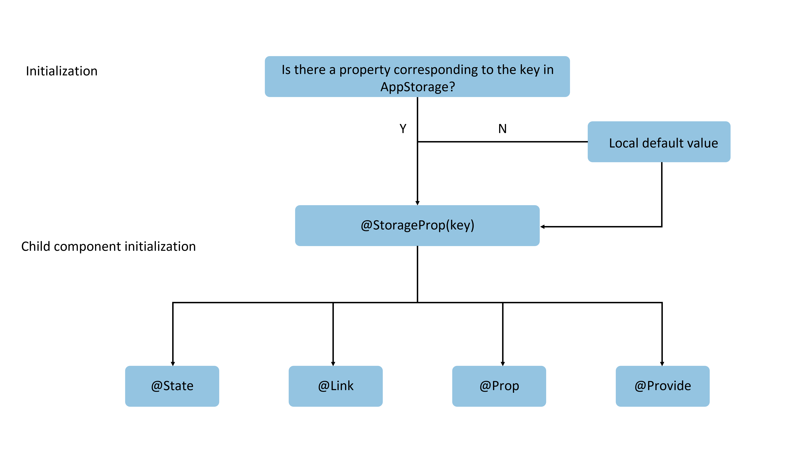
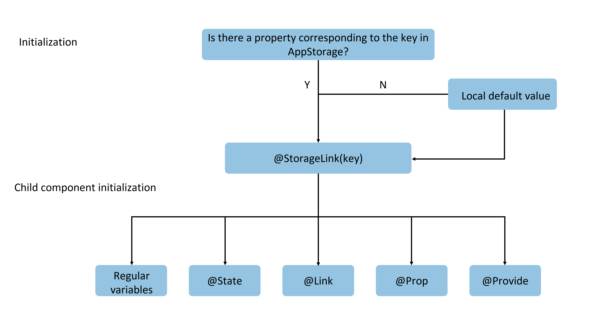

# AppStorage: Application-wide UI State Storage

AppStorage is an application-wide UI state storage that is bound to the application process. It is created by the UI framework when the application starts, providing centralized storage for the application's UI state properties.

Unlike AppStorage, LocalStorage is page-level and typically used for data sharing within a page. AppStorage, however, is application-level global state sharing and serves as the "hub" of the entire application. [PersistentStorage](./cj-persiststorage.md) and [Environment](./cj-environment.md) variables interact with the UI through AppStorage.

> **Note:**
>
> AppStorage only supports pure Cangjie scenarios and is not suitable for mixed ArkTS and Cangjie development scenarios.

This document focuses on the usage scenarios of AppStorage and related macros: @StorageProp and @StorageLink.

AppStorage is designed for application-wide UI state storage, unlike macros such as @State, which can only propagate within the component tree. Its purpose is to provide developers with broader cross-ability basic data sharing. Before reading this document, developers are advised to have a macro-level understanding of AppStorage's role in the state management framework. It is recommended to read [State Management Overview](cj-state-management-overview.md) first.

AppStorage also provides API interfaces, allowing developers to manually trigger additions, deletions, modifications, and queries of AppStorage keys outside custom components. It is recommended to read alongside the [AppStorage API Documentation](../../../../en/application-dev/reference/arkui-cj/cj-state-rendering-appstatemanagement.md#appstorage应用全局的ui状态存储).

## Overview

AppStorage is a singleton created when the application starts. Its purpose is to provide centralized storage for application state data, which is accessible at the application level. AppStorage retains its properties during the application's runtime. Properties are accessed via unique string keys.

AppStorage can synchronize with UI components and can be accessed in application business logic.

Properties in AppStorage can be bidirectionally synchronized. Data can exist locally or on remote devices, with different functionalities such as data persistence (see [PersistentStorage](./cj-persiststorage.md)). This data is implemented in business logic, decoupled from the UI. To use this data in the UI, [@StorageProp](#storageprop) and [@StorageLink](#storagelink) are required.

## @StorageProp

As mentioned earlier, to establish a connection between AppStorage and custom components, the @StorageProp and @StorageLink macros are used. Decorating variables within a component with @StorageProp(key)/@StorageLink(key) links them to AppStorage properties, where `key` identifies the AppStorage property.

When a custom component initializes, the variables decorated with @StorageProp(key)/@StorageLink(key) are initialized using the corresponding property value in AppStorage. Due to differences in application logic, it cannot be guaranteed that the corresponding property exists in AppStorage before component initialization. Therefore, local initialization of these variables is necessary.

@StorageProp(key) establishes one-way data synchronization with the corresponding property in AppStorage. If the property in AppStorage changes, the change is synchronized to @StorageProp, overwriting local modifications.

### Macro Usage Rules

| @StorageProp Variable Macro | Description |
|:---|:---|
| Macro Parameter | `key`: Constant string, required (must be enclosed in quotes). |
| Allowed Variable Types | Class, String, integer, float, Bool, enum types, and arrays of these types.<br>Supports Datetime, Map, and Set types. For nested types, see [Observing Changes and Behavior](#观察变化和行为表现).<br>The type must be specified and should match the corresponding property type in LocalStorage to avoid implicit type conversion, which may cause abnormal application behavior.<br>Any type is not supported. |
| Synchronization Type | One-way: From AppStorage property to component state variable. Once the property in AppStorage changes, local modifications are overwritten. |
| Initial Value of Decorated Variable | Must be specified. If the property does not exist in AppStorage, this initial value initializes the property and stores it in AppStorage. |

### Variable Passing/Access Rules

| Passing/Access | Description |
|:---|:---|
| Initialization and Update from Parent Node | Prohibited. @StorageProp does not support initialization from parent nodes. It can only be initialized by the corresponding property in AppStorage. If the property does not exist, the local default value is used. |
| Initializing Child Nodes | Supported. Can be used to initialize @State, @Link, @Prop, and @Provide. |
| Access Outside Component | No. |

**@StorageProp Initialization Rule Diagram**



### Observing Changes and Behavior

#### Observing Changes

- When decorating Bool, String, integer, or float types, value changes can be observed.
- When decorating a class, object assignments and property changes can be observed (see [Using AppStorage and LocalStorage from UI](#从ui内部使用appstorage和localstorage)).
- When decorating an Array, additions, deletions, and updates to array elements can be observed.
- When decorating a Datetime, overall assignments can be observed. Datetime properties can also be updated via methods like `addYears`, `addMonths`, `addWeeks`, `addMinutes`, `addSeconds`, and `addNanoseconds`. See [Decorating Datetime Variables](#装饰datetime类型变量).
- When decorating a Map, overall assignments can be observed. Map values can be updated via methods like `add`, `clear`, and `remove`. See [Decorating Map Variables](#装饰map类型变量).
- When decorating a Set, overall assignments can be observed. Set values can be updated via methods like `add`, `clear`, and `remove`. See [Decorating Set Variables](#装饰set类型变量).

#### Framework Behavior

- Variables decorated with @StorageProp are immutable.
- If the data decorated with @StorageProp(key) is a state variable, it triggers re-rendering of the custom component.
- When the corresponding property in AppStorage changes, it synchronizes with all data decorated with @StorageProp(key), overwriting local modifications.

## @StorageLink

@StorageLink(key) establishes bidirectional data synchronization with the corresponding property in AppStorage:

1. Local modifications are written back to AppStorage.
2. Changes in AppStorage are synchronized to all properties bound to the corresponding key, including one-way bindings (@StorageProp and variables created via Prop), two-way bindings (@StorageLink and variables created via Link), and other instances (e.g., PersistentStorage).

### Macro Usage Rules

| @StorageLink Variable Macro | Description |
|:---|:---|
| Macro Parameter | `key`: Constant string, required (must be enclosed in quotes). |
| Allowed Variable Types | Class, String, integer, float, Bool, enum types, and arrays of these types.<br>Supports Datetime, Map, and Set types. For nested types, see [Observing Changes and Behavior](#观察变化和行为表现).<br>The type must be specified and should match the corresponding property type in LocalStorage to avoid implicit type conversion, which may cause abnormal application behavior.<br>Any type is not supported. |
| Synchronization Type | Bidirectional: From AppStorage property to custom component, and from custom component to AppStorage property. |
| Initial Value of Decorated Variable | Must be specified. If the property does not exist in AppStorage, this initial value initializes the property and stores it in AppStorage. |

### Variable Passing/Access Rules

| Passing/Access | Description |
|:---|:---|
| Initialization and Update from Parent Node | Prohibited. |
| Initializing Child Nodes | Supported. Can be used to initialize regular variables, @State, @Link, @Prop, and @Provide. |
| Access Outside Component | No. |

**@StorageLink Initialization Rule Diagram**



### Observing Changes and Behavior

#### Observing Changes

- When decorating Bool, String, integer, or float types, value changes can be observed.
- When decorating a class, object assignments and property changes can be observed (see [Using AppStorage and LocalStorage from UI](#从ui内部使用appstorage和localstorage)).
- When decorating an Array, additions, deletions, and updates to array elements can be observed.
- When decorating a Datetime, overall assignments can be observed. Datetime properties can also be updated via methods like `addYears`, `addMonths`, `addWeeks`, `addMinutes`, `addSeconds`, and `addNanoseconds`. See [Decorating Datetime Variables](#装饰datetime类型变量).
- When decorating a Map, overall assignments can be observed. Map values can be updated via methods like `add`, `clear`, and `remove`. See [Decorating Map Variables](#装饰map类型变量).
- When decorating a Set, overall assignments can be observed. Set values can be updated via methods like `add`, `clear`, and `remove`. See [Decorating Set Variables](#装饰set类型变量).

#### Framework Behavior

1. When changes to a variable decorated with @StorageLink(key) are observed, the modifications are synchronized back to the corresponding property in AppStorage.
2. Once the data corresponding to the property key in AppStorage changes, all data bound to this key (including bidirectional @StorageLink and one-way @StorageProp) are synchronized.
3. If the data decorated with @StorageLink(key) is a state variable, its changes not only synchronize back to AppStorage but also trigger re-rendering of the custom component.

## Limitations

1. The parameters of @StorageProp/@StorageLink must be of string type; otherwise, a compilation error occurs.

    ```cangjie
    let storage = AppStorage.setOrCreate("PropA", 47)
    let temp = AppStorage.get<Int64>("PropA").getOrThrow() // 47

    // Incorrect usage, compilation error
    @StorageProp[] let storageProp: Int64 = 1
    @StorageLink[] var storageLink: Int64 = 2

    // Correct usage
    @StorageProp["PropA"] let storageProp: Int64 = 1
    @StorageLink["PropA"] var storageLink: Int64 = 2
    ```

2. @StorageProp and @StorageLink do not support decorating Func-type variables. The framework throws a runtime error.

3. When using AppStorage with [PersistentStorage](./cj-persiststorage.md) and [Environment](./cj-environment.md), note the following:

    a. After creating a property in AppStorage, calling `PersistentStorage.persistProp()` will use the existing value in AppStorage and overwrite the same-named property in PersistentStorage. It is recommended to use the opposite calling order. For an example of incorrect usage, see [Accessing AppStorage Properties Before PersistentStorage](./cj-persiststorage.md#在persistentstorage之后访问appstorage中的属性).

    b. If a property is created in AppStorage before calling `Environment.envProp()` to create a same-named property, the call will fail. Since AppStorage already has the property, Environment variables will not be written to AppStorage. It is recommended to avoid using Environment preset variable names in AppStorage.

4. State macro-decorated variables trigger UI re-rendering when changed. If the variable is not used for UI updates but only for messaging, using an emitter is recommended. See the example in [Avoid Using @StorageLink for Event Notification](#不建议借助@StorageLink的双向同步机制实现事件通知).

5. AppStorage is shared within the same process. Since UIAbility and UIExtensionAbility are separate processes, UIExtensionAbility does not share the main process's AppStorage.

## Usage Scenarios

### Using AppStorage and LocalStorage from Application Logic

AppStorage is a singleton, and all its APIs are static, similar to the non-static methods in LocalStorage.

```cangjie
let temp1 = AppStorage.setOrCreate<Int64>("PropA", 47)

let storage =  LocalStorage()
let temp2 = storage.setOrCreate("PropA", 17)
let propA = AppStorage.get<Int64>("PropA")                  // propA in AppStorage == 47, propA in LocalStorage == 17
let link1 = AppStorage.link<Int64>("PropA").getOrThrow()    // link1.get() == 47
let link2 = AppStorage.link<Int64>("PropA").getOrThrow()    // link2.get() == 47

let value1 = link1.set(48) // Bidirectional sync: link1.get() == link2.get() == prop.get() == 48
let value2 = link1.set(49) // Bidirectional sync: link1.get() == link2.get() == prop.get() == 49

let value3 = storage.get<Int64>("PropA") // == 17
let value4 = storage.set<Int64>("PropA", 101)
let value5 = storage.get<Int64>("PropA") // == 101

let value6 = AppStorage.get<Int64>("PropA") // == 49
let value7 = link1.get() // == 49
let value8 = link2.get() // == 49
```

### Using AppStorage and LocalStorage from UI

The @StorageLink macro works with AppStorage, similar to how @LocalStorageLink works with LocalStorage. This macro creates bidirectional data synchronization with properties in AppStorage.

 <!-- run -->

```cangjie
package ohos_app_cangjie_entry
import kit.ArkUI.*
import ohos.arkui.state_macro_manage.*

class Data{
    var code : Int64
    init(code: Int64){
        this.code = code
    }
}
let temp1 = AppStorage.setOrCreate("PropA", 47)
let temp2 = AppStorage.setOrCreate("PropB", Data(50))

let storage =  LocalStorage()
let res1 = storage.setOrCreate("LinkA", 47)
let res2 = storage.setOrCreate("LinkB", Data(50))

@Entry[storage]
@Component
class EntryView{
    @StorageLink["PropA"] var storageLink : Int64 = 1
    @LocalStorageLink["LinkA"] var localStorageLink : Int64 = 1
    @StorageLink["PropB"] var storageLinkObject : Data = Data(1)
    @LocalStorageLink["LinkB"] var localStorageLinkObject : Data = Data(1)

    func build() {
        Column(){
            Text("From AppStorage ${this.storageLink}")
                .onClick({evt => this.storageLink += 1;})
            Text("From LocalStorage ${this.localStorageLink}")
                .onClick({evt => this.localStorageLink += 1;})
            Text("From AppStorage ${this.storageLinkObject.code}")
                .onClick({evt =>
                    var temp = this.storageLinkObject
                    temp.code += 1
                    this.storageLinkObject = temp;
                    })
            Text("From LocalStorage ${this.localStorageLinkObject.code}")
                .onClick({evt =>
                    var temp = this.localStorageLinkObject
                    temp.code += 1
                    this.localStorageLinkObject = temp;
                    })
        }
    }
}
```

### Avoid Using @StorageLink for Event Notification

It is not recommended to use the bidirectional synchronization mechanism of @StorageLink and AppStorage for event notification. Properties in AppStorage may be bound to components across multiple pages, but event notifications may not need to reach all these components. Additionally, when these @StorageLink-decorated variables are used in the UI, they trigger UI refreshes, causing unnecessary performance overhead.

In the example code, the click event in `TapImage` changes the `tapIndex` property in AppStorage. Due to bidirectional synchronization, the change propagates back to AppStorage, so all custom components bound to `tapIndex` in AppStorage can detect the change. Using @Watch to monitor `tapIndex` changes modifies the state variable `tapColor`, triggering a UI refresh (here, `tapIndex` is not directly bound to the UI, so its changes do not directly trigger UI refreshes).

To use this mechanism for event notification, ensure that variables in AppStorage are not directly bound to the UI and control the complexity of @Watch functions (long execution times may affect UI refresh efficiency).

 <!-- run -->

```cangjie
package ohos_app_cangjie_entry
import kit.ArkUI.*
import ohos.arkui.state_macro_manage.*
import ohos.resource_manager.AppResource
import kit.BasicServicesKit.agent.State
import kit.PerformanceAnalysisKit.Hilog

class ViewData {
    var title: String
    var uri  : AppResource
    var color : Color = Color.Black

    init(title: String,uri  : AppResource){
        this.title = title
        this.uri   = uri
    }
}

@Entry
@Component
class EntryView{
    // "app.media.startIcon" is for illustration only. Replace it with your own resource, or imageSource creation will fail.
    let dataList : Array<ViewData> = [ViewData("flower",@r(app.media.startIcon)),ViewData("OMG",@r(app.media.image))]
    var gridScroller: Scroller = Scroller()

    func build() {
        Column(){
            Grid(scroller: this.gridScroller){
                ForEach(this.dataList, itemGeneratorFunc: {item : ViewData , idx : Int64 =>
                        GridItem(){
                            TapImage(index: idx,uri: item.uri)
                        }
                            .aspectRatio(1.0)
                        })
            }
        }
    }
}

@Component
class TapImage {
    @StorageLink["PropA"] @Watch[onTapIndexChange] var tapIndex : Int64 = -1
    @State var tapColor : Color = Color.Black
    var index: Int64
    var uri: AppResource

    func onTapIndexChange(){
        if(this.tapIndex >= 0 && this.index == this.tapIndex){
            Hilog.info(0, "tapindex", "${this.tapIndex}, index: ${this.index},red")
            this.tapColor = Color.Red
        }else{
            Hilog.info(0, "tapindex", "${this.tapIndex}, index: ${this.index},black")
            this.tapColor = Color.Black
        }
    }
    func build() {
        Column(){
            Image(this.uri)
                .objectFit(ImageFit.Cover)
                .onClick({evt =>this.tapIndex = this.index;})
                .border(width: 5, color: this.tapColor)
        }
    }
}
```

### Decorating DateTime Variables

In the following example, `selectedDate` decorated with @StorageLink is of type DateTime. Clicking the Button changes `selectedDate`, and the view refreshes accordingly.

 <!-- run -->

```cangjie
package ohos_app_cangjie_entry
import kit.ArkUI.*
import ohos.arkui.state_macro_manage.*
import std.time.*

@Entry
@Component
class EntryView {
    @StorageLink["date"] var selectedDate: DateTime = DateTime.ofIn the following example, the `memberSet` decorated with `@StorageLink` is of type `Set<Int64>`. Clicking the Button to change the value of `memberSet` will trigger a view refresh.

<!-- run -->

```cangjie
package ohos_app_cangjie_entry
import kit.ArkUI.*
import ohos.arkui.state_macro_manage.*
import std.collection.HashSet
import std.collection.Set

@Entry
@Component
class EntryView {
    @StorageLink["set"] var message: Set<Int64> = HashSet<Int64>([0, 1, 2, 3, 4])
    func build() {
        Row() {
            Column() {
                ForEach(
                    this.message.toArray(),
                    itemGeneratorFunc: {
                        item: Int64, _: Int64 => Text("${item}")
                            .fontSize(30)
                    }
                )
                Button("init set").onClick({evt =>
                        var temp = this.message
                        temp = HashSet<Int64>([0, 1, 2, 3, 4])
                        this.message = temp
                    })
                Button("add new one").onClick({evt =>
                        var temp = this.message
                        temp.add(5)
                        this.message = temp
                    })
                Button("clear").onClick({evt =>
                        var temp = this.message
                        temp.clear()
                        this.message = temp
                    })
                Button("remove the first one").onClick({evt =>
                        var temp = this.message
                        temp.remove(0)
                        this.message = temp
                    })
            }
                .width(100.percent)
        }
        .height(100.percent)
    }
}
```