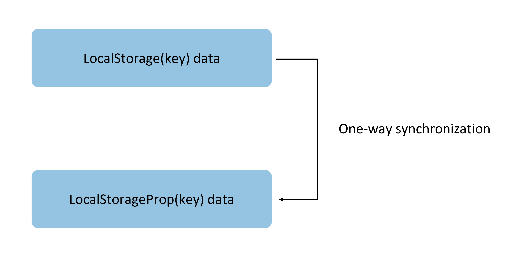
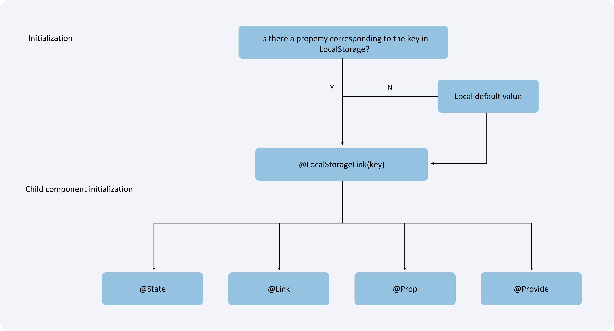
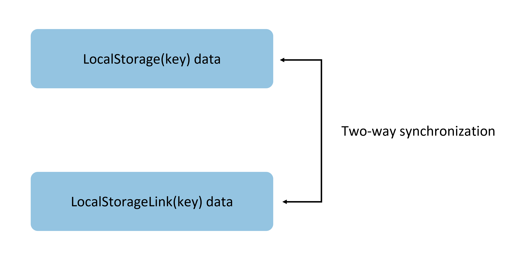

# LocalStorage: Page-Level UI State Storage

LocalStorage is a page-level UI state storage mechanism. The parameters received through the `@Entry` macro allow sharing the same LocalStorage instance within a page. LocalStorage supports state sharing among multiple pages within a UIAbility instance.

This document focuses only on the usage scenarios of LocalStorage and related macros: `@LocalStorageProp` and `@LocalStorageLink`.

Before reading this document, developers are advised to have a basic understanding of the state management framework. It is recommended to review [State Management Overview](cj-state-management-overview.md) beforehand.

LocalStorage also provides API interfaces, enabling developers to manually trigger CRUD operations for the corresponding keys in Storage outside custom components. It is recommended to read this document alongside the [LocalStorage API Documentation](../../reference/arkui-cj/cj-state-rendering-appstatemanagement.md#class-localstorage).

## Overview

LocalStorage is an in-memory "database" provided by Cangjie for constructing page-level state variables.

- Applications can create multiple LocalStorage instances. These instances can be shared within a page or across pages and UIAbility instances.
- The root node of the component tree, i.e., the `@Component` decorated with `@Entry` ([@Entry](../paradigm/cj-create-custom-components.md#entry)), can be assigned a LocalStorage instance. All child component instances of this component will automatically gain access to this LocalStorage instance.
- A `@Component`-decorated component can access at most one LocalStorage instance and AppStorage. Components not decorated with `@Entry` cannot be independently assigned a LocalStorage instance; they can only accept the LocalStorage instance passed down from the parent component via `@Entry`. A single LocalStorage instance can be assigned to multiple components in the component tree.
- All properties in LocalStorage are mutable.

The application determines the lifecycle of LocalStorage objects. When the application releases the last reference to LocalStorage—for example, by destroying the last custom component—LocalStorage will be garbage-collected.

LocalStorage provides two macros based on the synchronization type with `@Component`-decorated components:

- [`@LocalStorageProp`](#localstorageprop): Variables decorated with `@LocalStorageProp` establish a one-way synchronization relationship with a given property in LocalStorage.
- [`@LocalStorageLink`](#localstoragelink): Variables decorated with `@LocalStorageLink` establish a two-way synchronization relationship with a given property in LocalStorage.

## @LocalStorageProp

As mentioned earlier, to establish a connection between LocalStorage and custom components, the `@LocalStorageProp` and `@LocalStorageLink` macros are used. Variables within a component decorated with `@LocalStorageProp(key)`/`@LocalStorageLink(key)` bind to the corresponding property in LocalStorage via the given `key`.

When a custom component initializes, variables decorated with `@LocalStorageProp(key)`/`@LocalStorageLink(key)` bind to the corresponding property in LocalStorage using the provided `key` for initialization. Local initialization is necessary because there is no guarantee that LocalStorage will have the given `key` (this depends on whether the application logic has stored the corresponding property in the LocalStorage instance before component initialization).

`@LocalStorageProp(key)` establishes one-way data synchronization with the property corresponding to `key` in LocalStorage. If the value of the property corresponding to `key` in LocalStorage changes—for example, through the `set` interface—the change will synchronize to `@LocalStorageProp(key)` and overwrite the local value.

### Macro Usage Rules

| @LocalStorageProp Variable Macro | Description |
|:---|:---|
| Macro Parameter | `key`: Constant string, required (the string must be quoted). |
| Allowed Variable Types | `class`, `String`, integer, floating-point, `Bool`, `enum` types, and arrays of these types.<br>Supports `Datetime`, `Map`, and `Set` types. For nested types, see [Observing Changes and Behavior](#observing-changes-and-behavior).<br>The type must be specified. It is recommended to match the type of the corresponding property in LocalStorage; otherwise, implicit type conversion may occur, leading to abnormal application behavior.<br>`Any` is not supported. |
| Synchronization Type | One-way: From the corresponding property in LocalStorage to the component's state variable. Once the given property in LocalStorage changes, it will overwrite the local content. |
| Initial Value of Decorated Variable | Must be specified. If the property does not exist in the LocalStorage instance, this initial value will initialize the property and store it in LocalStorage. |

### Variable Passing/Access Rules

| Passing/Access | Description |
|:---|:---|
| Initialization and Update from Parent Node | Prohibited. `@LocalStorageProp` does not support initialization from a parent node. It can only initialize from the property corresponding to `key` in LocalStorage. If there is no corresponding `key`, the local default value will be used. |
| Initializing Child Nodes | Supported. Can be used to initialize `@State`, `@Link`, `@Prop`, and `@Provide`. |
| External Component Access | No. |

**@LocalStorageProp Initialization Rule Diagram**


### Observing Changes and Behavior

#### Observing Changes

- When the decorated data type is `Bool`, `String`, integer, or floating-point, numerical changes can be observed.
- When the decorated data type is `class`, object assignments and property changes can be observed (see [Using LocalStorage from UI](#using-localstorage-from-ui)).
- When the decorated object is an `Array`, additions, deletions, and updates to array elements can be observed.
- When the decorated object is a `Datetime`, overall assignments to `Datetime` can be observed, and its properties can be updated via `Datetime` interfaces like `addYears`, `addMonths`, `addWeeks`, `addMinutes`, `addSeconds`, and `addNanoseconds`. See [Decorating Datetime Variables](#decorating-datetime-variables).
- When the decorated variable is a `Map`, overall assignments to `Map` can be observed, and its values can be updated via `Map` interfaces like `add`, `clear`, and `remove`. See [Decorating Map Variables](#decorating-map-variables).
- When the decorated variable is a `Set`, overall assignments to `Set` can be observed, and its values can be updated via `Set` interfaces like `add`, `clear`, and `remove`. See [Decorating Set Variables](#decorating-set-variables).

#### Framework Behavior

- Variables decorated with `@LocalStorageProp` are immutable.
- Changes to variables decorated with `@LocalStorageProp` will refresh the associated components in the current custom component.
- Changes to `LocalStorage(key)` will trigger updates to all variables decorated with `@LocalStorageProp` corresponding to `key`, overwriting local changes.



## @LocalStorageLink

If updates to a custom component's state variables need to be synchronized back to LocalStorage, `@LocalStorageLink` is required.

`@LocalStorageLink(key)` establishes two-way data synchronization with the property corresponding to `key` in LocalStorage:

1. Local modifications are written back to LocalStorage.
2. Modifications in LocalStorage are synchronized to all properties bound to the corresponding `key`, including one-way (`@LocalStorageProp` and variables created via `prop`) and two-way (`@LocalStorageLink` and variables created via `link`) bindings.

### Macro Usage Rules

| @LocalStorageLink Variable Macro | Description |
|:---|:---|
| Macro Parameter | `key`: Constant string, required (the string must be quoted). |
| Allowed Variable Types | `class`, `String`, integer, floating-point, `Bool`, `enum` types, and arrays of these types.<br>Supports `Datetime`, `Map`, and `Set` types. For nested types, see [Observing Changes and Behavior](#observing-changes-and-behavior).<br>The type must be specified. It is recommended to match the type of the corresponding property in LocalStorage; otherwise, implicit type conversion may occur, leading to abnormal application behavior.<br>`Any` is not supported. |
| Synchronization Type | Two-way: From the corresponding property in LocalStorage to the custom component, and from the custom component to the corresponding property in LocalStorage. |
| Initial Value of Decorated Variable | Must be specified. If the property does not exist in the LocalStorage instance, this initial value will initialize the property and store it in LocalStorage. |

### Variable Passing/Access Rules

| Passing/Access | Description |
|:---|:---|
| Initialization and Update from Parent Node | Prohibited. `@LocalStorageLink` does not support initialization from a parent node. It can only initialize from the property corresponding to `key` in LocalStorage. If there is no corresponding `key`, the local default value will be used. |
| Initializing Child Nodes | Supported. Can be used to initialize `@State`, `@Link`, `@Prop`, and `@Provide`. |
| External Component Access | No. |

**@LocalStorageLink Initialization Rule Diagram**



### Observing Changes and Behavior

#### Observing Changes

- When the decorated data type is `Bool`, `String`, integer, or floating-point, numerical changes can be observed.
- When the decorated data type is `class`, object assignments and property changes can be observed (see [Using LocalStorage from UI](#using-localstorage-from-ui)).
- When the decorated object is an `Array`, additions, deletions, and updates to array elements can be observed.
- When the decorated object is a `Datetime`, overall assignments to `Datetime` can be observed, and its properties can be updated via `Datetime` interfaces like `addYears`, `addMonths`, `addWeeks`, `addMinutes`, `addSeconds`, and `addNanoseconds`. See [Decorating Datetime Variables](#decorating-datetime-variables).
- When the decorated variable is a `Map`, overall assignments to `Map` can be observed, and its values can be updated via `Map` interfaces like `add`, `clear`, and `remove`. See [Decorating Map Variables](#decorating-map-variables).
- When the decorated variable is a `Set`, overall assignments to `Set` can be observed, and its values can be updated via `Set` interfaces like `add`, `clear`, and `remove`. See [Decorating Set Variables](#decorating-set-variables).

#### Framework Behavior

1. When changes to a `@LocalStorageLink(key)`-decorated variable are observed, the modifications are synchronized back to the property corresponding to `key` in LocalStorage.
2. Once the data corresponding to `key` in LocalStorage changes, all data bound to `key` (including two-way `@LocalStorageLink` and one-way `@LocalStorageProp`) will be updated.
3. If the `@LocalStorageLink(key)`-decorated data itself is a state variable, its changes will not only synchronize back to LocalStorage but also trigger a re-render of the associated custom component.



## Constraints

1. The parameters for `@LocalStorageProp`/`@LocalStorageLink` must be of type `string`; otherwise, a compilation error will occur.

    ```cangjie
    let storage = LocalStorage()
    let temp = storage.setOrCreate("PropA", 48)

    // Incorrect usage, compilation error
    @LocalStorageProp[] let localStorageProp: Int64 = 1
    @LocalStorageLink[] var localStorageLink: Int64 = 2

    // Correct usage
    @LocalStorageProp["PropA"] let localStorageProp: Int64 = 1
    @LocalStorageLink["PropA"] var localStorageLink: Int64 = 2
    ```

2. `@LocalStorageProp` and `@LocalStorageLink` do not support decorating `func`-type variables. The framework will throw a runtime error.
3. After LocalStorage is created, the type of named properties cannot be changed. Subsequent calls to `Set` must use values of the same type.
4. LocalStorage is page-level storage. For an example, see [Sharing a LocalStorage Instance from UIAbility to One or More Views](#sharing-a-localstorage-instance-from-uiability-to-one-or-more-views).

## Usage Scenarios

### Using LocalStorage in Application Logic

```cangjie
let storage = LocalStorage()
let temp = storage.setOrCreate("PropA", 47)             // Create a new instance and initialize with the given object
let propA = storage.get<Int64>("PropA")                 // propA == 47
let link1 = storage.link<Int64>("PropA").getOrThrow()   // link1.get() == 47
let link2 = storage.link<Int64>("PropA").getOrThrow()   // link2.get() == 47

let value1 = link1.set(48) // Two-way sync: link1.get() == link2.get() == prop1.get() == 48
let value2 = link1.set(49) // Two-way sync: link1.get() == link2.get() == prop.get() == 49
```

### Using LocalStorage from UI

In addition to application logic, LocalStorage can be accessed within UI components using the `@LocalStorageProp` and `@LocalStorageLink` macros to retrieve state variables stored in LocalStorage instances.

This example demonstrates `@LocalStorageLink` by:

- Creating a LocalStorage instance `storage` using the constructor.
- Adding `storage` to the top-level `Parent` component via the `@Entry` macro.
- Establishing two-way data synchronization by binding `@LocalStorageLink` to a given property in LocalStorage.

 <!-- run -->

```cangjie
package ohos_app_cangjie_entry
import kit.ArkUI.*
import ohos.arkui.state_macro_manage.*

class Data{
    var code : Int64
    init(code: Int64){
        this.code = code
    }
}
// Create a new instance and initialize with the given object
let storage = LocalStorage()
let res1 = storage.setOrCreate("PropA", 47)
let res2 = storage.setOrCreate("PropB", Data(50))

@Component
class Child{
    // @LocalStorageLink macro establishes two-way binding with "PropA" in LocalStorage
    @LocalStorageLink["PropA"] var childLinkNumber: Int64 = 1
    // @LocalStorageLink macro establishes two-way binding with "PropB" in LocalStorage
    @LocalStorageLink["PropB"] var childLinkObject: Data = Data(0)
    func build() {
        Column(){
            Button("Child from LocalStorage ${this.childLinkNumber}") // Changes sync to "PropA" in LocalStorage and Parent.parentLinkNumber
                .onClick({evt => this.childLinkNumber += 1;})
            Button("Child from LocalStorage ${this.childLinkObject.code}") // Changes sync to "PropB" in LocalStorage and Parent.childLinkObject
                .onClick({evt =>
                    var temp = this.childLinkObject
                    temp.code += 1
                    this.childLinkObject = temp;
                    })
        }
    }
}
// Make LocalStorage accessible from @Component
@Entry[storage]
@Component
class EntryView {
    // @LocalStorageLink macro establishes two-way binding with "PropA" in LocalStorage
    @LocalStorageLink["PropA"] var parentLinkNumber: Int64 = 1
    // @LocalStorageLink macro establishes two-way binding with "PropB" in LocalStorage
    @LocalStorageLink["PropB"] var parentLinkObject: Data = Data(0)
    func build() {
        Column(){
            Button("Parent from LocalStorage ${this.parentLinkNumber}") // Since "PropA" is initialized in LocalStorage, this.parentLinkNumber is 47
                .onClick({evt => this.parentLinkNumber += 1;})
            Button("Parent from LocalStorage ${this.parentLinkObject.code}") // Since "PropB" is initialized in LocalStorage, this.parentLinkObject.code is 50
                .onClick({evt =>
                    var temp = this.parentLinkObject
                    temp.code += 1
                    this.parentLinkObject = temp;
                    })
            // Child components automatically gain access to the Parent's LocalStorage instance.
            Child()
        }
    }
}
```

### Simple One-Way Synchronization Between @LocalStorageProp and LocalStorage

The following example demonstrates one-way synchronization between `@LocalStorageProp`-decorated data and LocalStorage:

 <!-- run -->

```cangjie
package ohos_app_cangjie_entry
import kit.ArkUI.*
import ohos.arkui.state_macro_manage.*

// Create a new instance and initialize with the given object
let storage = LocalStorage()
let temp = storage.setOrCreate("PropA", 47)
// Make LocalStorage accessible from @Component
@Entry[storage]
@Component
class EntryView {
    // @LocalStorageProp macro establishes one-way binding with "PropA" in LocalStorage
    @LocalStorageProp["PropA"] let storageProp1: Int64 = 1
    func build() {
        Column(){
            Button("Parent from LocalStorage ${this.storageProp1}")
                .onClick({evt => storage.set<Int64>("PropA", storageProp1+1)
                    ;})
        }
    }
}
```

### Simple Two-Way Synchronization Between @LocalStorageLink and LocalStorage

The following example demonstrates two-way synchronization between `@LocalStorageLink`-decorated data and LocalStorage:

 <!-- run -->

```cangjie
package ohos_app_cangjie_entry
import kit.ArkUI.*
import ohos.arkui.state_macro_manage.*

// Create a LocalStorage instance
let storage = LocalStorage()
let temp = storage.setOrCreate("PropA", 47)
// Call the link interface to create two-way sync data for "PropA". linkToPropA is a global variable.
let linkToPropA = storage.link<Int64>("PropA").getOrThrow()

// Make LocalStorage accessible from @Component
@Entry[storage]
@Component
class EntryView {
    // @LocalStorageLink("PropA") creates two-way sync data for "PropA" in the Parent component. Initial value is 47 because "PropA" was set to 47 during LocalStorage construction.
    @LocalStorageLink["PropA"] var storageLink: Int64 = 1
    func build() {
        Column(){
            Text("incr @LocalStorageLink variable")
            // Clicking "incr @LocalStorageLink variable" increments this.storageLink by 1, syncing back to storage. Global variable linkToPropA will also sync.
                .onClick({evt => this.storageLink += 1;})
            // Using global variable link### Decorating DateTime Type Variables

In the following example, the `selectedDate` decorated with `@LocalStorageLink` is of type `DateTime`. Clicking the Button changes the value of `selectedDate`, and the view refreshes accordingly.

<!-- run -->

```cangjie
package ohos_app_cangjie_entry
import kit.ArkUI.*
import ohos.arkui.state_macro_manage.*
import std.time.*

let Storage =  LocalStorage()

@Entry[Storage]
@Component
class EntryView {
    @LocalStorageLink["date"] var selectedDate: DateTime = DateTime.of(year: 2003, month: Month.of(6), dayOfMonth: 24)
    @State var count : Int64 = 0
    func build() {
        Column(){
            Button("set selectedDate to 2025-04-21")
                .margin(10)
                .onClick({evt => this.selectedDate = DateTime.of(year: 2025, month: Month.of(4), dayOfMonth: 21);})
             Button("increase the year by 1")
                .margin(10)
                .onClick({evt => this.selectedDate = this.selectedDate.addYears(1);})
            Button("increase the month by 1")
                .margin(10)
                .onClick({evt => this.selectedDate = this.selectedDate.addMonths(1);})
            Button("increase the day by 1")
                .margin(10)
                .onClick({evt => this.selectedDate = this.selectedDate.addDays(1);})
            DatePicker( start: DateTime.of(year: 1970, month: Month.of(1), dayOfMonth: 1),
                        end: DateTime.of(year: 2100, month: Month.of(1), dayOfMonth: 1),
                        selected: this.selectedDate )
        }
        .width(100.percent)
    }
}
```

### Decorating Map Type Variables

In the following example, the `message` decorated with `@LocalStorageLink` is of type `Map<Int64, string>`. Clicking the Button changes the value of `message`, and the view refreshes accordingly.

<!-- run -->

```cangjie
package ohos_app_cangjie_entry
import kit.ArkUI.*
import ohos.arkui.state_macro_manage.*
import std.collection.Map
import std.collection.HashMap

@Entry
@Component
class EntryView {
    @LocalStorageLink["map"] var message: Map<Int64, String> = HashMap<Int64, String>([(0, "a"), (1, "b"), (3, "c")])
    func build() {
        Row() {
            Column() {
                ForEach(
                    this.message.toArray(),itemGeneratorFunc: {item: (Int64, String), _: Int64 =>
                        Text("${item[0]}").fontSize(30)
                        Text("${item[1]}").fontSize(30)
                        Divider()
                    })
                Button("init map").onClick({evt =>
                    this.message = HashMap<Int64, String>([(0, "a"), (1, "b"), (3, "c")])
                })
                Button("add new one").onClick({evt =>
                        var temp = this.message
                        temp.add(4, "d")
                        this.message = temp
                    })
                Button("clear").onClick({evt =>
                        var temp = this.message
                        temp.clear()
                        this.message = temp
                    })
                Button("replace the first one").onClick({evt =>
                        var temp =this.message
                        temp.replace(0,"aa")
                        this.message=temp
                    })
                Button("remove the first one").onClick({evt =>
                        var temp = this.message
                        temp.remove(0)
                        this.message = temp
                })
            }
                .width(100.percent)
        }
        .height(100.percent)
    }
}
```

### Decorating Set Type Variables

In the following example, the `memberSet` decorated with `@LocalStorageLink` is of type `Set<Int64>`. Clicking the Button changes the value of `memberSet`, and the view refreshes accordingly.

<!-- run -->

```cangjie
package ohos_app_cangjie_entry
import kit.ArkUI.*
import ohos.arkui.state_macro_manage.*
import std.collection.HashSet
import std.collection.Set

@Entry
@Component
class EntryView {
    @LocalStorageLink["set"] var message: Set<Int64> = HashSet<Int64>([0, 1, 2, 3, 4])
    func build() {
        Row() {
            Column() {
                ForEach(
                    this.message.toArray(),
                    itemGeneratorFunc: {
                        item: Int64, _: Int64 => Text("${item}")
                            .fontSize(30)
                    }
                )
                Button("init set").onClick({evt =>
                        var temp = this.message
                        temp = HashSet<Int64>([0, 1, 2, 3, 4])
                        this.message = temp
                    })
                Button("add new one").onClick({evt =>
                        var temp = this.message
                        temp.add(5)
                        this.message = temp
                    })
                Button("clear").onClick({evt =>
                        var temp = this.message
                        temp.clear()
                        this.message = temp
                    })
                Button("remove the first one").onClick({evt =>
                        var temp = this.message
                        temp.remove(0)
                        this.message = temp
                    })
            }
                .width(100.percent)
        }
        .height(100.percent)
    }
}
```

### Changing State Variables Outside Custom Components

<!-- run -->

```cangjie
package ohos_app_cangjie_entry
import kit.ArkUI.*
import ohos.arkui.state_macro_manage.*

let storage =  LocalStorage()
let temp = storage.setOrCreate("count", 47)

public class Model {
  let storage: LocalStorage = storage

  public func change(propName: String, value: Int64) {
    this.storage.setOrCreate<Int64>(propName, value)
  }
}

let model: Model = Model()

@Entry[storage]
@Component
class EntryView {
    @LocalStorageLink["count"] var count: Int64 = 0
    func build() {
        Column(){
            Text("count value: ${this.count}")
            Button("change")
                .onClick({evt => model.change("count",this.count+1);})
            }
    }
}
```