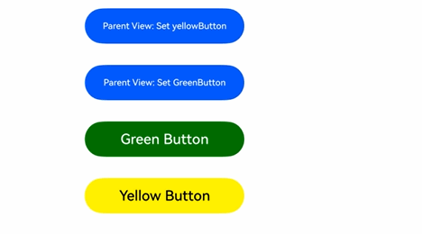
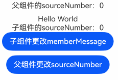
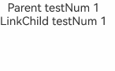
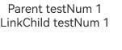

# @Link Macro: Bidirectional Parent-Child Synchronization

Variables decorated with \@Link in child components establish bidirectional data binding with their corresponding data sources in parent components.

Before reading the \@Link documentation, developers are advised to first understand the basic usage of [\@State](./cj-macro-state.md).

## Overview

Variables decorated with \@Link share the same value as their parent component's data source.

## Macro Usage Rules Explanation

|\@Link|Description|
|:---|:---|
|Non-attribute Macro|None.|
|Synchronization Type|Bidirectional synchronization.<br/>State variables in parent components can establish bidirectional synchronization with \@Link-decorated variables in child components. Changes in one party will be detected by the other.|
|Allowed Variable Types|Supports basic data types. For String, Int64, Float64, and Bool types, type specification can be omitted. Other types must be explicitly specified.<br/>Supports Enum, Option types, and struct types (internal modifications are not allowed for struct types).<br/>Supports class types. To observe internal changes, the class must be decorated with [\@Observed](./cj-macro-observed-and-publish.md) during definition, and its properties/nested properties must use [\@Publish](./cj-macro-observed-and-publish.md) to detect changes.<br/>Supports array types. To observe internal changes, use [ObservedArray\<T>](../../../../en/application-dev/reference/arkui-cj/cj-state-rendering-componentstatemanagement.md#class-observedarray) and [ObservedArrayList\<T>](../../../../en/application-dev/reference/arkui-cj/cj-state-rendering-componentstatemanagement.md#class-observedarraylist). For custom array items, use [\@Observed](./cj-macro-observed-and-publish.md) and [\@Publish](./cj-macro-observed-and-publish.md) to observe property assignments. Other array and Collection types (Array, Varray, ArrayList, HashMap, HashSet) support new array assignments but cannot detect internal element changes.<br/>Supports [Color](../../../../en/application-dev/reference/BasicServicesKit/cj-apis-base.md#class-color) type.<br/>For supported scenarios, see [Observing Changes](#观察变化).<br/>Does not support Any.|
|Initial Value of Decorated Variable|\@Link-decorated variables must be initialized using variables provided by the parent component. Local initialization in child components is prohibited.|

## Variable Passing/Access Rules Explanation

|Passing/Access|Description|
|:---|:---|
|Initialization and Updates from Parent Component|Local initialization is prohibited. Initialization occurs when creating the custom component instance, with initial values provided by state variables from the direct parent component. Allows initialization of child \@Link variables using parent [\@State](./cj-macro-state.md), \@Link, [\@Prop](./cj-macro-prop.md), [\@Provide](./cj-macro-provide-and-consume.md), or [\@Consume](./cj-macro-provide-and-consume.md) variables.|
|Initializing Child Components|Can be used as a data source to initialize child components. Supports initializing regular variables, \@State, \@Link, \@Prop, and \@Provide.|
|External Component Access|Private, only accessible within the owning component.|

## Observing Changes and Behavioral Patterns

### Observing Changes

- For basic data types, numerical changes can be observed synchronously. See example in [Simple and Class Object Types with \@Link](#简单类型和类对象类型的link).

- For class types, the class must be decorated with [@Observed](./cj-macro-observed-and-publish.md), and properties requiring change detection must use [@Publish](./cj-macro-observed-and-publish.md). Without [@Observed](./cj-macro-observed-and-publish.md), internal member variable changes cannot be detected. See example in [Simple and Class Object Types with \@Link](#简单类型和类对象类型的link).

- For arrays, individual item changes cannot be detected, but overall changes can. To observe internal changes, use [ObservedArray\<T>](../../../../en/application-dev/reference/arkui-cj/cj-state-rendering-componentstatemanagement.md#class-observedarray) and [ObservedArrayList\<T>](../../../../en/application-dev/reference/arkui-cj/cj-state-rendering-componentstatemanagement.md#class-observedarraylist). See example in [Array Types with \@Link](#数组类型的link).

- Other array and Collection types (Array, Varray, ArrayList, HashMap, HashSet) support new array assignments but cannot detect internal element changes.

### Framework Behavior

\@Link-decorated variables share the lifecycle with their owning custom component.

To understand \@Link initialization and update mechanisms, it's essential to grasp the parent-child relationship and the bidirectional update flow (using parent \@State as an example):

1. **Initial Rendering**: After executing the parent's `build()`, a new child instance is created:
   a. Parent \@State variables must be specified to initialize child \@Link variables, maintaining bidirectional synchronization.
   b. Parent \@State wrapper passes its reference to child \@Link wrapper, which registers its `this` pointer with the parent \@State.

2. **Data Source Updates (Parent \@State changes)**:
   a. Parent \@State updates notify all dependent components (including child \@Link wrappers).
   b. Child \@Link updates then notify its dependent UI elements for refresh.

3. **\@Link Updates (Child changes)**:
   a. Child \@Link updates propagate back to parent \@State via its wrapper's `set` method.
   b. Both components update their dependent UI elements accordingly.

## Constraints

1. \@Link can only decorate child component states, not [\@Entry](../paradigm/cj-create-custom-components.md#自定义组件的基本结构)-decorated root components.

2. \@Link variables are mutable, must be declared with `var`, and require explicit type specification.

3. Local initialization is prohibited. Must be initialized from parent component, otherwise compilation error occurs.

    ```cangjie
    // Wrong - compilation error
    @Link var count: Int64 = 10

    // Correct
    @Link var count: Int64
    ```

4. \@Link variable types must match data source types. See [\@Link Type Mismatch Errors](#link装饰状态变量类型错误).

    **Counter Example**:

    ```cangjie
    class Info {
        var info: String = 'Hello'
    }

    class Cousin {
        var name: String = 'Hello'
    }

    @Component
    class Child {
        // Wrong - type mismatch
        @Link var test: Cousin
        func build() {
            Column() {
                Text(this.test.name)
            }
        }
    }

    @Entry
    @Component
    class EntryView {
        @State var info: Info = Info()
        func build() {
            Column {
                // Wrong - type mismatch
                Child(test: this.info)
            }
        }
    }
    ```

    **Correct Example**:

    ```cangjie
    class Info {
        var info: String = 'Hello'
    }

    @Component
    class Child {
        // Correct
        @Link var test: Info
        func build() {
            Column() {
                Text(this.test.info)
            }
        }
    }

    @Entry
    @Component
    class EntryView {
        @State
        var info: Info = Info()
        func build() {
            Column {
                // Correct
                Child(test: this.info)
            }
        }
    }
    ```

5. \@Link variables can only be initialized by state variables (e.g., \@State), not constants. Otherwise, editor error occurs.

    **Counter Example**:

    ```cangjie
    class Info {
        var info: String = 'Hello'
    }

    @Component
    class Child {
        @Link var mes: String
        @Link var info: String
        func build() {
            Column() {
                Text(this.mes + this.info)
            }
        }
    }

    @Entry
    @Component
    class EntryView {
        @State var mes: String = "Hello"
        @State var info: Info = Info()
        func build() {
            Column {
                // Wrong - regular variables can't initialize @Link
                Child(msg: 'World', info: this.info.info)
            }
        }
    }
    ```

    **Correct Example**:

    ```cangjie
    class Info {
        var info: String = 'Hello'
    }

    @Component
    class Child {
        @Link var mes: String
        @Link var info: Info
        func build() {
            Column() {
                Text(this.mes + this.info.info)
            }
        }
    }

    @Entry
    @Component
    class EntryView {
        @State var message: String = "Hello"
        @State var info: Info = Info()
        func build() {
            Column {
                // Correct
                Child(mes: this.message, info: this.info)
            }
        }
    }
    ```

6. \@Link does not support Function-type variables (compilation error).

## Usage Scenarios

### Simple and Class Object Types with \@Link

In this example, clicking "Parent View: Set yellowButton" or "Parent View: Set GreenButton" in the parent component synchronizes changes to child components.

1. Clicking buttons in child components (GreenButton/YellowButton) updates both child and parent components via bidirectional \@Link-\@State synchronization.

2. Clicking parent buttons updates \@State, which propagates to \@Link-decorated child components.

 <!-- run -->

```cangjie
package ohos_app_cangjie_entry
import kit.ArkUI.*
import ohos.arkui.state_macro_manage.*

@Observed
class GreenButtonState {
    @Publish var width: Int64 = 0
}

@Component
class GreenButton {
    @Link var greenButtonState: GreenButtonState

    func build() {
        Button("Green Button")
            .width(this.greenButtonState.width)
            .height(40)
            .backgroundColor(Color.Green)
            .margin(12)
            .onClick {
                evt => if (this.greenButtonState.width < 700) {
                    // Updates class property - changes propagate to parent
                    this.greenButtonState.width += 60
                } else {
                    // Updates entire class - changes propagate to parent
                    this.greenButtonState = GreenButtonState(width: 180)
                }
            }
    }
}

@Component
class YellowButton {
    @Link var yellowButtonState: Int64

    func build() {
        Button("Yellow Button")
            .width(this.yellowButtonState)
            .height(40)
            .backgroundColor(Color(0xFFFF00))
            .fontColor(Color.Black)
            .margin(12)
            .onClick {
                evt =>
                // Simple type updates propagate to parent
                this.yellowButtonState += 40
            }
    }
}

@Entry
@Component
class EntryView {
    @State var greenButtonState: GreenButtonState = GreenButtonState(width: 180)
    @State var yellowButtonProp: Int64 = 180
    func build() {
        Column() {
            Flex(direction: FlexDirection.Column, alignItems: ItemAlign.Center) {
                // Simple type sync from parent @State to child @Link
                Button("Parent View: Set yellowButton")
                    .width(this.yellowButtonProp)
                    .height(40)
                    .margin(12)
                    .onClick {
                        evt => if (this.yellowButtonProp < 700) {
                            this.yellowButtonProp = this.yellowButtonProp + 100
                        } else {
                            this.yellowButtonProp = 100
                        }
                    }
                // Class type sync from parent @State to child @Link
                Button("Parent View: Set GreenButton")
                    .width(this.greenButtonState.width)
                    .height(40)
                    .margin(12)
                    .onClick {
                        evt => if (this.greenButtonState.width < 700) {
                            this.greenButtonState.width = this.greenButtonState.width + 100
                        } else {
                            this.greenButtonState.width = 100
                        }
                    }
                // Class type initializes @Link
                GreenButton(greenButtonState: this.greenButtonState)
                // Simple type initializes @Link
                YellowButton(yellowButtonState: this.yellowButtonProp)
            }
        }
    }
}
```



### Array Types with \@Link

This example demonstrates how ObservedArrayList\<Int> detects array element additions, deletions, and replacements.

 <!-- run -->

```cangjie
package ohos_app_cangjie_entry
import kit.ArkUI.*
import ohos.arkui.state_macro_manage.*

@Component
class Child{
    @Link var items: ObservedArrayList<Int>

    func build(){
        Column(){
            Button("Button 1: push")
                .margin(12)
                .size(width: 312, height: 40)
                .onClick{
                    evt => this.items.append(this.items.size + 1)
                }

            Button("Button 2: replace whole item")
                .margin(12)
                .size(width: 312, height:40)
                .onClick{
                    ect => this.items = ObservedArrayList<Int>([100,200,300])
                }
        }
    }
}

@Entry
@Component
class EntryView{
    @State var arr: ObservedArrayList<Int> = ObservedArrayList<Int>([1,2,3])
    func build(){
        Column(){
            Child(items: arr)
            ForEach(this.arr,{item: Int,index: Int
                    =>
                    Button("${item}")
                        .margin(12)
                        .size(width: 312,height: 40)
                        .backgroundColor(Color.White)
                        .fontColor(Color.Black)
                    })
        }
    }
}
```


### Modifying Local Variables via Bidirectional Sync

Using [\@Watch](./cj-macro-watch.md) enables local variable modifications during bidirectional synchronization.

In this example, \@Watch modifies \@State variable `sourceNumber` during \@Link synchronization, achieving parent-child variable sync. However, local modifications to \@State variable `memberMessage` don't affect the parent component.

 <!-- run -->

```cangjie
package ohos_app_cangjie_entry
import kit.ArkUI.*
import ohos.arkui.state_macro_manage.*

@Component
class Child {
    @State var memberMessage: String = 'Hello World'
    @Link @Watch[onSourceChange] var sourceNumber: Int64
    func onSourceChange() {
        this.memberMessage = this.sourceNumber.toString()
    }
    func build() {
        Column() {
            Text(this.memberMessage)
            Text("Child's sourceNumber：" + this.sourceNumber.toString())
            Button("Child modifies memberMessage")
              .onClick {
                  evt => this.memberMessage = "Hello memberMessage"
            }
        }
        .margin(10)
    }
}

@Entry
@Component
class EntryView {
    @State var sourceNumber: Int64 = 0;
    func build() {
        Column() {
            Text("Parent's sourceNumber：" + this.sourceNumber.toString())
            Child(sourceNumber: this.sourceNumber)
            Button("Parent modifies sourceNumber")
              .onClick {
                  evt => this.sourceNumber++
            }
        }
    }
}
```

## Frequently Asked Questions

### Type Error in @Link Decorated State Variables

When using the `@Link` decorator on state variables in child components, it is essential to ensure that the variable type exactly matches the data source type. Additionally, the data source must be a state variable decorated with decorators such as `@State`.

【Counterexample】

 <!-- run -->

```cangjie
package ohos_app_cangjie_entry
import kit.ArkUI.*
import ohos.arkui.state_macro_manage.*

@Observed
class Info {
    @Publish var age: Int64
}

@Component
class LinkChild {
    @Link var testNum: Int64
    func build() {
        Column() {
            Text("LinkChild testNum ${this.testNum}")
        }
    }
}

@Entry
@Component
class EntryView {
    @State var info: Info = Info(age: 1)
    func build() {
        Column {
            Text("Parent testNum ${this.info.age}").onClick({
                evt => this.info.age += 1
            })
            // The variable decorated with @Link must match the type of the data source @State
            LinkChild(testNum: this.info.age)
        }
    }
}
```

`@Link var testNum: Int64` is initialized from the parent component's `LinkChild(testNum: this.info.age)`. The data source for `@Link` must be a state variable decorated with a macro. In other words, the data decorated with `@Link` must be of the same type as the data source, e.g., `@Link: T` and `@State: T`. Therefore, this should be modified to `@Link var testNum: Info`, and the initialization from the parent component should be `LinkChild(testNum: this.info)`.



【Correct Example】

 <!-- run -->

```cangjie
package ohos_app_cangjie_entry
import kit.ArkUI.*
import ohos.arkui.state_macro_manage.*

@Observed
class Info {
    @Publish var age: Int64
}

@Component
class LinkChild {
    @Link var testNum: Info
    func build() {
        Column() {
            Text("LinkChild testNum ${this.testNum.age}")
                .onClick({
                evt => this.testNum.age += 1
            })
        }
    }
}

@Entry
@Component
class EntryView {
    @State var info: Info = Info(age: 1)
    func build() {
        Column {
            Text("Parent testNum ${this.info.age}").onClick({
                evt => this.info.age += 1
            })
            // The variable decorated with @Link must match the type of the data source @State
            LinkChild(testNum: this.info)
        }
    }
}
```

