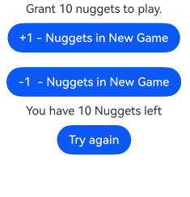
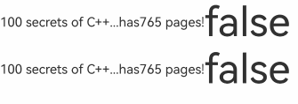
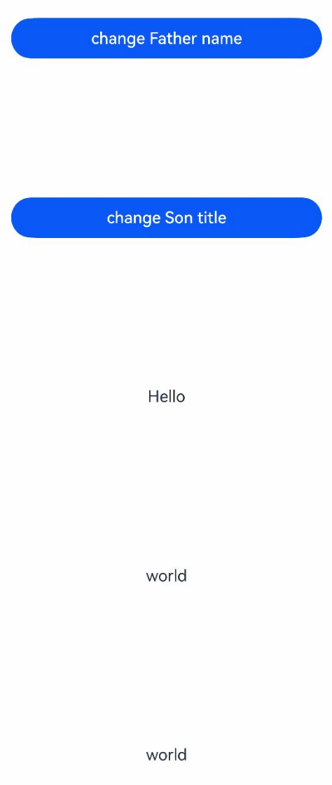

# @Prop Macro: Unidirectional Synchronization Between Parent and Child Components

Variables decorated with \@Prop can establish a unidirectional synchronization relationship with the parent component. \@Prop-decorated variables are mutable, but changes will not be synchronized back to the parent component.

Before reading the \@Prop documentation, developers are advised to first understand the basic usage of [\@State](./cj-macro-state.md).

## Overview

\@Prop-decorated variables establish a unidirectional synchronization relationship with the parent component:

- \@Prop variables can be modified locally, but the changes will not be synchronized back to the parent component.
- When the data source changes, \@Prop-decorated variables will be updated, overriding all local modifications. Therefore, synchronization is from the parent component to the child component (the owning component), and changes in the child component's values will not be synchronized to the parent component.

## Constraints

- \@Prop modifies the state owned by the current component and can only be defined in child components. It cannot be used in custom components decorated with [\@Entry](../paradigm/cj-create-custom-components.md#basic-structure-of-custom-components).
- \@Prop-decorated variables are mutable and must be declared with `var`, and their type must be specified.
- \@Prop prohibits local initialization and must be initialized from the parent component.
- The type of \@Prop-decorated variables must match the data source type, and the data source must be a state variable decorated with a macro (e.g., \@State).

## Macro Usage Rules

|\@Prop|Description|
|:---|:---|
|Non-attribute macro|None.|
|Synchronization type|Unidirectional synchronization: Modifications to the parent component's state variable values will be synchronized to the child component's \@Prop-decorated variables, but modifications to the child component's \@Prop variables will not be synchronized back to the parent component's state variables. For nested scenarios, see [Observing Changes](#observing-changes).|
|Allowed variable types|Supports basic data types. For String, Int64, Float64, and Bool types, the type can be omitted. For other types, the type must be specified.<br/>Supports enum, struct, and Option types. Struct types cannot be modified internally.<br/>Supports class types. To observe internal changes, the class must be decorated with [\@Observed](./cj-macro-observed-and-publish.md) at definition time, and its properties and nested properties must be decorated with [\@Publish](./cj-macro-observed-and-publish.md) to observe changes. The same applies to nested classes. Since classes are reference types, modifying internal variables in the child component when decorated with \@Observed will affect the parent component.<br/>Supports array types. To observe internal changes, use [ObservedArray\<T>](../../../../en/application-dev/reference/arkui-cj/cj-state-rendering-componentstatemanagement.md#class-observedarray) and [ObservedArrayList\<T>](../../../../en/application-dev/reference/arkui-cj/cj-state-rendering-componentstatemanagement.md#class-observedarraylist). When array items are custom types, using [\@Observed](./cj-macro-observed-and-publish.md) and [\@Publish](./cj-macro-observed-and-publish.md) allows observing property assignments within array items. Other array and Collection types, such as Array, Varray, ArrayList, HashMap, and HashSet, support assigning new arrays but cannot observe changes to internal elements.<br/>Supports the [Color](../../../../en/application-dev/reference/BasicServicesKit/cj-apis-base.md#class-color) type.<br/>\@Prop and the [data source](./cj-state-management-overview.md#basic-concepts) types must match. There are three scenarios:<br/>- The types of \@Prop-decorated variables and \@State or other macros must match when synchronizing. See [Parent Component @State to Child Component @Prop Simple Data Type Synchronization](#parent-component-state-to-child-component-prop-simple-data-type-synchronization) for an example.<br/>- When \@Prop-decorated variables synchronize with array items decorated with \@State or other macros, the \@Prop type must match the array item type of the \@State-decorated array, e.g., \@Prop: T and \@State: Array\<T>. See [Parent Component @State Array Item to Child Component @Prop Simple Data Type Synchronization](#parent-component-state-array-item-to-child-component-prop-simple-data-type-synchronization) for an example.<br/>- When the parent component's state variable is a struct or class, the \@Prop-decorated variable must match the property type of the parent component's state variable. See [Synchronization from Parent Component's @State Class Object Property to @Prop Simple Type](#synchronization-from-parent-components-state-class-object-property-to-prop-simple-type) for an example.<br/>For supported scenarios, see [Observing Changes](#observing-changes).|
|Nested passing depth|In component reuse scenarios, it is recommended that \@Prop-decorated nested data does not exceed 5 levels. Excessive nesting can lead to large deep copy space usage and Garbage Collection, causing performance issues.|
|Initial value of decorated variables|\@Prop-decorated variables must be initialized using variables provided by the parent component. Initialization within the child component is not allowed.|

## Variable Passing/Access Rules

|Passing/Access|Description|
|:---|:---|
|Initialization from parent component|When creating a new instance of a component, all \@Prop variables must be initialized. Initialization within the component is not supported. Supports initialization from regular variables in the parent component (assigning regular variables to \@Prop only initializes the value; changes to regular variables will not trigger UI updates. Only state variables can trigger UI updates), [\@State](./cj-macro-state.md), [\@Link](./cj-macro-link.md), \@Prop, [\@Provide](./cj-macro-provide-and-consume.md), [\@Consume](./cj-macro-provide-and-consume.md), [Publish](./cj-macro-observed-and-publish.md), [\@StorageLink](./cj-appstorage.md#storragelink), [\@StorageProp](./cj-appstorage.md#storrageprop), [\@LocalStorageLink](./cj-localstorage.md#localstoragelink), and [\@LocalStorageProp](./cj-localstorage.md#localstorageprop) to initialize \@Prop variables in the child component.|
|Initializing child components|\@Prop supports initializing regular variables, \@State, \@Link, \@Prop, and \@Provide in child components.|
|Access outside component|\@Prop-decorated variables are private and can only be accessed within the component. They cannot be modified by access modifiers.|

## Observing Changes and Behavior

### Observing Changes

\@Prop-decorated data can observe the following changes:

- When the decorated data type is a basic data type, numerical changes can be observed.

    ```cangjie
    // Simple type
    @Prop var count: Int
    // Assignment changes can be observed
    this.count = 1
    ```

- When the decorated data type is a struct, internal modifications are not allowed.

    Declare Person.

    ```cangjie
    struct Person {
        var id: Int64
        var name: String
        public init(id: Int64, name: String) {
            this.id = id
            this.name = name
        }
    }
    ```

    \@Prop decorates struct Person.

    ```cangjie
    // Struct type
    @Prop var person: Person
    ```

    Overall assignment to \@Prop-decorated variables is allowed.

    ```cangjie
    // Struct type assignment
    this.person = Person(2, "muller")
    ```

    Assignment to \@Prop-decorated variables shows that modifications are not allowed.

    ```cangjie
    // Struct property assignment
    this.person.id = 3
    ```

- When the decorated data type is a class, it must be decorated with [\@Observed](./cj-macro-observed-and-publish.md), and properties that need to observe changes internally must be decorated with [\@Publish](./cj-macro-observed-and-publish.md). Without [\@Observed](./cj-macro-observed-and-publish.md), internal changes such as member variables cannot be observed. See [\@Prop Nested Scenarios](#prop-nested-scenarios) for details.

    Declare Person and Model classes.

    ```cangjie
    @Observed
    class Person {
        @Publish var value: String
    }

    @Observed
    class Model {
        @Publish var value: String = ""
        @Publish var name: Person = Person(value: " ")
    }
    ```

    \@Prop decorates Model type.

    ```cangjie
    @Prop var title: Model
    ```

    Assignment to \@Prop-decorated variables.

    ```cangjie
    // Class property assignment
    this.title = Model(value: 'Hi', name: Person(value: 'ArkUI'))
    ```

    Assignments to \@Prop-decorated properties and nested properties can be observed.

    ```cangjie
    // Class property assignment
    this.title.value = 'Hi'
    // Nested property
    this.title.name.value = 'ArkUI'
    ```

- When the decorated object is an array, individual array item changes cannot be observed, but overall changes can. To observe internal changes, use [ObservedArray\<T>](../../../../en/application-dev/reference/arkui-cj/cj-state-rendering-componentstatemanagement.md#class-observedarray) and [ObservedArrayList\<T>](../../../../en/application-dev/reference/arkui-cj/cj-state-rendering-componentstatemanagement.md#class-observedarraylist).

    When \@Prop decorates an ArrayList type array.

    ```cangjie
    @Prop var arrlist: ArrayList<Int16>
    ```

    Overall array changes can be observed.

    ```cangjie
    this.arrlist = ArrayList<Int16>([10,9,8])
    ```

    Array item assignments cannot be observed.

    ```cangjie
    this.arrlist[0] = 10
    ```

    Declare Model class.

    ```cangjie
    @Observed
    class Model {
        @Publish public var value: Int
    }
    ```

    When \@Prop decorates an ObservedArray\<Model> type array.

    ```cangjie
    // ObservedArray array type
    @Prop var title: ObservedArrayList<Model>
    ```

    Array self-assignment can be observed.

    ```cangjie
    // Array assignment
    this.title = ObservedArrayList<Model>([Model(value: 2)])
    ```

    Array item assignments can be observed.

    ```cangjie
    // Array item assignment
    this.title[0] = Model(value: 2)
    ```

    Property assignments within array items can be observed.

    ```cangjie
    // Nested property assignment can be observed
    this.title[0].value = 6
    ```

    When \@Prop decorates an ObservedArrayList\<Model> type array, adding and removing array items can be observed.

    Removing array items can be observed.

    ```cangjie
    // Array item change
    this.title.remove(0)
    ```

    Adding array items can be observed.

    ```cangjie
    // Array item change
    this.title.append(Model(value: 12))
    ```

For \@State and \@Prop synchronization scenarios:

- Use the value of the parent component's \@State variable to initialize the child component's \@Prop variable. When the \@State variable changes, its value will also be synchronized to the \@Prop variable.
- Modifications to \@Prop-decorated variables will not affect the value of the data source \@State-decorated variable.
- Besides \@State, the data source can also be decorated with \@Link or \@Prop, and the synchronization mechanism for \@Prop is the same.
- The data source and \@Prop variable types must match. \@Prop allows simple types and class types.

- When the decorated variable is another array type or Collection type, such as Array, Varray, ArrayList, HashMap, and HashSet, assigning new arrays is supported, but changes to internal elements cannot be observed.
    Take HashSet as an example.

    ```cangjie
    // When \@Prop decorates a HashSet
    @Prop var message: HashSet<Int64>
    ```

    Overall HashSet changes can be observed.

    ```cangjie
    this.message = HashSet<Int64>(1,2,3)
    ```

    Internal HashSet changes cannot be observed.

    ```cangjie
    this.message.add(5)
    ```

### Framework Behavior

To understand the initialization and update mechanism of \@Prop variable values, it is necessary to understand the initial rendering and update process of the parent component and the child component owning \@Prop variables.

1. Initial rendering:
   a. Execute the parent component's build() function to create a new instance of the child component and pass the data source to the child component;
   b. Initialize the child component's \@Prop-decorated variables.

2. Update:
   a. When the child component's \@Prop is updated, the update stays within the current child component and will not be synchronized back to the parent component;
   b. When the parent component's data source is updated, the child component's \@Prop-decorated variables will be reset by the parent component's data source, and all local modifications to \@Prop will be overwritten by the parent component's updates.

> **Note:**
>
> \@Prop-decorated data updates depend on the re-rendering of their owning custom component, so \@Prop cannot refresh when the app enters the background. It is recommended to use \@Link instead.

## Usage Scenarios

### Parent Component @State to Child Component @Prop Simple Data Type Synchronization

The following example demonstrates synchronization from \@State in the parent component to \@Prop in the child component for simple data types. The parent component EntryView's state variable countDownStartValue initializes the \@Prop-decorated count in the child component CountDownComponent. Clicking "Try again" modifies count only within CountDownComponent and does not synchronize back to the parent component EntryView.

Changes to the parent component's state variable countDownStartValue will reset CountDownComponent's count.

 <!-- run -->

```cangjie
package ohos_app_cangjie_entry
import kit.ArkUI.*
import ohos.arkui.state_macro_manage.*

@Component
class CountDownComponent {
    @Prop var count: Int64
    var costOfOneAttempt: Int64 = 1
    func build() {
        Column() {
            if (this.count > 0) {
                Text("You have ${this.count} Nuggets left")
            } else {
                Text('Game over!')
            }
            // @Prop-decorated variables will not sync back to the parent component
            Button("Try again")
                .margin(10)
                .onClick {
                    evt => this.count -= this.costOfOneAttempt
                }
        }
    }
}

@Entry
@Component
class EntryView {
    @State var countDownStartValue: Int64 = 10
    func build() {
        Column {
            Text("Grant ${this.countDownStartValue} nuggets to play.")
            // Parent component data source changes will sync to the child component
            Button("+1 - Nuggets in New Game")
                .margin(10)
                .onClick {
                    evt => this.countDownStartValue += 1
                }
            // Parent component changes will sync to the child component
            Button("-1  - Nuggets in New Game")
                .margin(10)
                .onClick {
                    evt => this.countDownStartValue -= 1
                }
            CountDownComponent(count: this.countDownStartValue, costOfOneAttempt: 2)
        }
    }
}
```



In the above example:

1. When the CountDownComponent child component is first created, its \@Prop-decorated count variable will be initialized from the parent component's \@State-decorated countDownStartValue variable;

2. When the "+1" or "-1" buttons are pressed, the parent component's \@State-decorated countDownStartValue value changes, triggering the parent component to re-render. During re-rendering, the UI components using the countDownStartValue state variable will be refreshed, and the count value in the CountDownComponent child component will be updated unidirectionally;

3. Updating the count state variable value also triggers CountDownComponent's re-rendering. During re-rendering, the if statement condition (this.count > 0) using the count state variable is evaluated, and the UI components in the true branch using the count state variable are executed to update the Text component's UI display;

4. When the "Try again" button in the child component CountDownComponent is pressed, its \@Prop variable count will be modified, but the count value change will not affect the parent component's countDownStartValue value;

5. When the parent component's countDownStartValue value changes, the parent component's modifications will overwrite any local modifications to count in the child component CountDownComponent.

### Parent Component @State Array Item to Child Component @Prop Simple Data Type Synchronization

If the parent component's \@State decorates an array, its array items can also initialize \@Prop. In the following example, the parent component Index's \@State-decorated array arr initializes the \@Prop-decorated value in the child component Child with its array items.

 <!-- run -->

```cangjie
package ohos_app_cangjie_entry
import kit.ArkUI.*
import ohos.arkui.state_macro_manage.*

@Component
class Child {
    @Prop var value: Int64
    func build() {
        Text("${this.value}")
            .fontSize(50.vp)
            .onClick {
                evt => this.value++
            }
    }
}

@Entry
@Component
class EntryView {
    @State var arr: Array<Int64> = [1, 2, 3]
    func build() {
        Row {
            Column {
                Child(value: this.arr[0])
                Child(value: this.arr[1])
                Child(value: this.arr[2])
                Divider().height(5)
                ForEach(
                    this.arr,
                    itemGeneratorFunc: {
                        item: Int64, _: Int64 => Child(value: item)
                    },
                    keyGenerator### Synchronization from \@State Class Object Properties in Parent Component to \@Prop Simple Types

In this example, the `Book` class uses the `\@Observed` macro. Since `class` is a reference type, modifications to the internal variables of the `class` within the child component will affect the parent component when decorated with `\@Observed`. Therefore, changes to any property in `ReaderComp` will result in changes to the `book` object.

<!-- run -->

```cangjie
package ohos_app_cangjie_entry
import kit.ArkUI.*
import ohos.arkui.state_macro_manage.*

@Observed
class Book {
     public var title: String
     public var pages: Int64
     @Publish public var readIt: Bool = false
}

@Component
class ReaderComp {
    @Prop var book: Book
    func build() {
        Row() {
            Text(this.book.title)
            Text("...has${this.book.pages} pages!")
            Text("${this.book.readIt}")
                .fontSize(50.vp)
                .onClick {
                    evt =>
                        this.book.readIt = true
                }
        }
    }
}

@Entry
@Component
class EntryView {
    @State var book: Book = Book(title:'100 secrets of C++',pages: 765)
    func build() {
        Column {
            ReaderComp(book: this.book)
            ReaderComp(book: this.book)
        }
    }
}
```



### Synchronization from \@State Array Items in Parent Component to \@Prop Class Types

In the following example, changes are made to the properties of `Book` objects in the `\@State`-decorated `allBooks` array. The `class Book` must be decorated with `\@Observed`, and the properties of `Book` will be observed. Additionally, `ObservedArrayList` is used to monitor additions, deletions, and modifications of `Book` objects.

<!-- run -->

```cangjie
package ohos_app_cangjie_entry

import kit.ArkUI.*
import kit.PerformanceAnalysisKit.*
import ohos.arkui.state_macro_manage.*

@Observed
class Book {
    public var title: String
    public var pages: Int64
    @Publish public var readIt: Bool = false
}

@Component
class ReaderComp {
    @Prop var book: Book
    func build() {
        Row() {
            Text(this.book.title)
            Text("...has${this.book.pages} pages!")
            Text("${this.book.readIt}").onClick {
                evt => this.book.readIt = true
            }
        }
        .backgroundColor(0x00ff00)
        .width(312)
        .height(40)
        .padding(left: 20, top: 10)
        .borderRadius(20)
        .margin(10)
    }
}

@Entry
@Component
class EntryView {
    @State var allBooks: ObservedArrayList<Book> = ObservedArrayList<Book>(
        [Book(title: "JS", pages: 765), Book(title: "Cangjie", pages: 652), Book(title: "ArkUI", pages: 765)])

    func build() {
        Column {
            Text('library`s all time favorite')
                .width(312)
                .height(40)
                .backgroundColor(0x00ff00)
                .borderRadius(20)
                .margin(12)
                .padding(left: 20)
            ReaderComp(book: this.allBooks[2])
            Divider()
            Text('Books on loan to a reader')
                .width(312)
                .height(40)
                .backgroundColor(0x00ff00)
                .borderRadius(20)
                .margin(12)
                .padding(left: 20)
            ForEach(
                this.allBooks,
                itemGeneratorFunc: {
                    item: Book, _: Int64 => ReaderComp(book: item)
                },
                keyGeneratorFunc: {
                    item: Book, _: Int64 => item.title
                }
            )
            Button("Add new")
                .width(312)
                .height(40)
                .margin(12)
                .onClick({
                    evt => this.allBooks.append(Book(title: "JA", pages: 512))
                })
            Button("Remove first book")
                .width(312)
                .height(40)
                .margin(12)
                .onClick(
                    {
                        evt => if (this.allBooks.size > 0) {
                            this.allBooks.remove(0)
                        } else {
                            Hilog.info(0, "cangjie", "length <= 0")
                        }
                    })
        }
    }
}
```

Instances of classes decorated with `\@Observed` are wrapped by opaque proxy objects. These proxies can detect all property changes within the wrapped object. If such changes occur, the proxy notifies `\@Prop`, and the `\@Prop` object's value is updated.


### \@Prop Nested Scenarios

In nested scenarios, each layer must be decorated with `\@Observed`, and each layer must be received by `\@Prop` to ensure awareness of the nested scenario.

<!-- run -->

```cangjie
package ohos_app_cangjie_entry
import kit.ArkUI.*
import ohos.arkui.state_macro_manage.*

// The following is the data structure for nested class objects.
@Observed
class Son {
    @Publish var title: String
}

@Observed
class Father {
    @Publish var name: String
    @Publish var son: Son
}
// The following component hierarchy presents the data structure for the \@Prop nested scenario.
@Entry
@Component
class EntryView {
    @State var person: Father = Father(name: 'Hello', son: Son(title: 'world'));
    func build() {
        Column {
            Flex(
                direction: FlexDirection.Column, alignItems: ItemAlign.Center,
                    justifyContent: FlexAlign.SpaceBetween) {
                Button('change Father name')
                    .width(312)
                    .height(40)
                    .margin(12)
                    .onClick({
                        evt => this.person.name = 'Hi'
                    })
                Button('change Son title')
                    .width(312)
                    .height(40)
                    .margin(12)
                    .onClick({
                        evt => this.person.son.title = 'ArkUI'
                    })
                Text(this.person.name)
                    .fontSize(16)
                    .margin(12)
                    .width(312)
                    .height(40)
                    .borderRadius(20)
                    .textAlign(TextAlign.Center)
                    .onClick({
                        evt => this.person.name = 'Bye'
                    })
                Text(this.person.son.title)
                    .fontSize(16)
                    .margin(12)
                    .width(312)
                    .height(40)
                    .borderRadius(20)
                    .textAlign(TextAlign.Center)
                    .onClick({
                        evt => this.person.son.title = "JS"
                    })
                Child(child: this.person.son)
            }
        }
    }
}

@Component
class Child {
    @Prop var child: Son
    func build() {
        Column() {
            Text(this.child.title)
                .fontSize(16)
                .margin(12)
                .width(312)
                .height(40)
                .borderRadius(20)
                .textAlign(TextAlign.Center)
                .onClick({
                    evt => this.child.title = "Bye Bye"
                })
        }
    }
}
```

