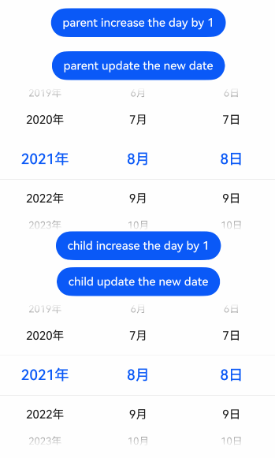
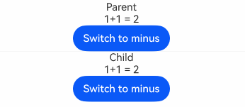
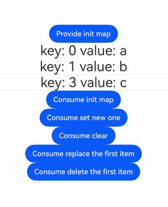
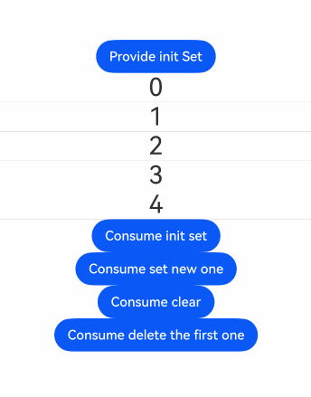

# @Provide and @Consume Macros: Two-Way Synchronization with Descendant Components

<!--Del-->
> **Note:**
>
> Currently in the beta phase.
<!--DelEnd-->

`@Provide` and `@Consume` are used for two-way data synchronization with descendant components, applicable in scenarios where state data needs to be passed across multiple levels. Unlike the parent-child component parameter passing mechanism mentioned earlier, `@Provide` and `@Consume` break free from the constraints of parameter passing, enabling cross-level data transfer.

The variable decorated with `@Provide` resides in the ancestor component and can be understood as a state variable "provided" to descendant components. The variable decorated with `@Consume` resides in descendant components and "consumes (binds)" the variable provided by the ancestor component.

`@Provide` / `@Consume` enables two-way synchronization across component hierarchies. Before reading the documentation on `@Provide` and `@Consume`, developers are advised to have a basic understanding of UI paradigm syntax and custom components. It is recommended to read the following in advance: [Basic Syntax Overview](../paradigm/cj-basic-syntax-overview.md), [Declarative UI Description](../paradigm/cj-declarative-ui-description.md), [Custom Components - Creating Custom Components](../paradigm/cj-create-custom-components.md).

## Overview

State variables decorated with \@Provide / \@Consume have the following characteristics:

- The state variable decorated with \@Provide is automatically available to all its descendant components, meaning the variable is "provided" to its descendants. This demonstrates the convenience of \@Provide, as developers do not need to pass variables multiple times between components.

- Descendants use \@Consume to access the variable provided by \@Provide, establishing two-way data synchronization between \@Provide and \@Consume. Unlike \@State / \@Link, the former can be passed across multi-level parent-child components.

- \@Provide and \@Consume can be bound using the same variable name or alias, but their types must match. Otherwise, implicit type conversion may occur, leading to abnormal application behavior.

```cangjie
// Binding via the same variable name
@Provide
var age: Int64 = 0;
@Consume
var age: Int64;

// Binding via the same variable alias
@Provide["a"]
var id: Float64 = 0.0;
@Consume["a"]
var age: Float64;
```

When \@Provide and \@Consume are bound using the same variable name or alias, the variable decorated with \@Provide and the variable decorated with \@Consume form a one-to-many relationship. If multiple \@Provide-decorated variables with the same name or alias are declared within the same custom component (including its child components), the \@Consume-decorated variable will search upward and match the nearest \@Provide-decorated variable.

Additionally, if an alias is declared in the \@Provide annotation, the \@Consume variable must be bound using the corresponding alias. The \@Provide variable cannot be found by variable name alone.

## Macro Description

The rules for `@State` also apply to `@Provide`. The difference is that `@Provide` also serves as a synchronization source for multi-level descendants.

|\@Provide|Description|
|:---|:---|
|Macro Parameter|Alias: A constant string, optional. If specified, the variable is bound via the alias; if not, it is bound via the variable name.|
|Synchronization Type|Two-way synchronization. Data synchronization from the \@Provide variable to all \@Consume variables and vice versa. The two-way synchronization behavior is the same as the combination of \@State and \@Link.|
|Allowed Variable Types|Cangjie built-in types include basic data types (except Nothing) and custom types, as well as arrays of these types. Function types and DateTime types are supported. The types of \@Provide and \@Consume variables must match. For supported types, refer to Observing Changes.|
|Initial Value of Decorated Variable|The type must be specified, and the initial value must be provided.|
|\@Provide Supports Duplicate Names|Allowed. \@Consume will search upward and match the nearest \@Provide.|

|\@Consume|Description|
|:---|:---|
|Macro Parameter|Alias: A constant string, optional. If an alias is provided, there must be a \@Provide variable with the same alias for successful matching. If no alias is provided, the variable name and type must match.|
|Synchronization Type|Two-way: From the \@Provide variable (see \@Provide) to all \@Consume variables and vice versa. The two-way synchronization behavior is the same as the combination of \@State and \@Link.|
|Allowed Variable Types|Cangjie built-in types include basic data types (except Nothing) and custom types, as well as arrays of these types. Function types and DateTime types are supported. The types of \@Provide and \@Consume variables must match. For supported types, refer to Observing Changes.|
|Initial Value of Decorated Variable|The type must be specified, but no initial value is allowed.|

## Variable Passing/Access Rules

|\@Provide Passing/Access|Description|
|:---|:---|
|Initialization and Update from Parent Component|Optional. Allows regular variables in the parent component (assigning regular variables to \@Provide only initializes the value; changes to regular variables do not trigger UI updates. Only state variables can trigger UI updates), [\@State](./cj-macro-state.md), [\@Link](./cj-macro-link.md), [\@Prop](./cj-macro-prop.md), \@Provide, \@Consume, [\@Publish](./cj-macro-observed-and-publish.md), [\@StorageLink](./cj-appstorage.md#storagelink), [\@StorageProp](./cj-appstorage.md#storageprop), [\@LocalStorageLink](./cj-localstorage.md#localstoragelink), and [\@LocalStorageProp](./cj-localstorage.md#localstorageprop) to initialize child component \@Provide.|
|Initializing Child Components|Allowed. Can be used to initialize \@State, \@Link, \@Prop, \@Provide.|
|Synchronization with Parent Component|No.|
|Synchronization with Descendant Components|Two-way synchronization with \@Consume.|
|Access Outside Component|Private. Can only be accessed within the component.|

|\@Consume Passing/Access|Description|
|:---|:---|
|Initialization and Update from Parent Component|Prohibited. Initialized from \@Provide via the same variable name or alias.|
|Initializing Child Components|Allowed. Can be used to initialize \@State, \@Link, \@Prop, \@Provide.|
|Synchronization with Ancestor Component|Two-way synchronization with \@Provide.|
|Access Outside Component|Private. The decorated variable follows the visibility of the `private` modifier.|

## Observing Changes and Behavior

### Observing Changes

- When the decorated data type is integer, float, boolean, character, or string, changes in value can be observed.

- When the decorated object is a tuple, array, or range, updates to the array elements can be observed.

- When the decorated object is DateTime, the overall assignment of DateTime can be observed. Additionally, DateTime properties can be updated by calling its functions: `addDays(Int64)`, `addHours(Int64)`, `addMinutes(Int64)`, `addMonths(Int64)`, `addNanoseconds(Int64)`, `addSeconds(Int64)`, `addWeeks(Int64)`, `addYears(Int64)`.

 <!-- run -->

```cangjie
package ohos_app_cangjie_entry

import kit.ArkUI.*
import ohos.arkui.state_macro_manage.*
import std.time.*

// Parent component
@Entry
@Component
class EntryView{

    @Provide
    var selectedDate: DateTime = DateTime.of(year:2021,month:8,dayOfMonth:8)

    public func build(){
        Column(){
            Button("parent increase the day by 1")
                .margin(10)
                .onClick({ event
                    => this.selectedDate = this.selectedDate.addDays(1)
                })
            Button("parent update the new date")
                .margin(10)
                .onClick({ event
                    => this.selectedDate = DateTime.of(year:2023,month:7,dayOfMonth:7)
                })
            DatePicker(
                start: DateTime.of(year:1970,month:1,dayOfMonth:1),
                end: DateTime.of(year:2100,month:1,dayOfMonth:1),
                selected: this.selectedDate
            )
           Child()
        }
    }
}

@Component
class Child{

    @Consume
    var selectedDate: DateTime;

    public func build(){
        Column(){
            Button("child increase the day by 1")
                .onClick({ event
                    => this.selectedDate = this.selectedDate.addDays(1)
                })
            Button("child update the new date")
                .margin(10)
                .onClick({ event
                    => this.selectedDate = DateTime.of(year:2023,month:9,dayOfMonth:9)
                })
            DatePicker(
                start: DateTime.of(year:1970,month:1,dayOfMonth:1),
                end: DateTime.of(year:2100,month:1,dayOfMonth:1),
                selected: this.selectedDate
            )
        }
    }
}
```



- When the decorated variable is a HashMap, the overall assignment of the HashMap can be observed. Additionally, the Map's value can be updated by calling its interfaces: `set()`, `clear()`, `remove()`. See [Decorating Map-Type Variables](#decorating-map-type-variables).

- When the decorated variable is a HashSet, the overall assignment of the HashSet can be observed. Additionally, the Set's value can be updated by calling its interfaces: `add()`, `clear()`, `remove()`. See [Decorating Set-Type Variables](#decorating-set-type-variables).

- Function-type variables can be decorated, and changes in their output values can be observed.

 <!-- run -->

```cangjie
package ohos_app_cangjie_entry

import kit.ArkUI.*
import ohos.arkui.state_macro_manage.*

public func returnAdd(a: Int64, b:Int64): Int64{
    return a+b
}

public func returnMinus(a: Int64, b:Int64): Int64{
    return a-b
}

@Entry
@Component
class EntryView{

    @Provide["calc"]
    var Func1: (Int64, Int64) -> Int64 = returnAdd

    @Provide
    var isAdd : Bool = true

    func build(){
        Column{
            Text("Parent")
            Text(
                if(isAdd == true){
                    "1+1 = ${Func1(1,1)}"
                }else{
                    "1-1 = ${Func1(1,1)}"}
            )
            Button(
                if(isAdd == true){
                    "Switch to minus"
                }else{
                    "Switch to add"
                }
            ).onClick({ evt =>
                if(isAdd == true){ Func1 = returnMinus }
                else{ Func1 = returnAdd }
                isAdd = !isAdd
            })
            Divider()
            Child()
        }
    }
}

@Component
class Child{
    @Consume["calc"]
    var Func2: (Int64, Int64) -> Int64

    @Consume
    var isAdd: Bool

    func build(){
        Column{
            Text("Child")
            Text(
                if(isAdd == true){
                    "1+1 = ${Func2(1,1)}"
                }else{
                    "1-1 = ${Func2(1,1)}"}
            )
            Button(
                if(isAdd == true){
                    "Switch to minus"
                }else{
                    "Switch to add"
                }
            ).onClick({ evt =>
                if(isAdd == true){ Func2 = returnMinus }
                else{ Func2 = returnAdd }
                isAdd = !isAdd
            })
        }
    }
}
```



### Framework Behavior

1. Initial Rendering:
   a. The variable decorated with \@Provide is passed to all child components of the \@Provide-decorated component in the form of a Map.
   b. If a child component uses a \@Consume variable, it will search the Map for a \@Provide variable with the corresponding name. If not found, a runtime error will be thrown.
   c. When initializing the \@Consume variable, if a \@Provide variable with the corresponding name/alias is found in the Map, the process is similar to \@State/\@Link. The \@Consume variable will save the corresponding \@Provide variable and register itself with \@Provide.

2. When the \@Provide-decorated data changes:
   a. As seen in the initial rendering step, the child component \@Consume has already registered itself with the parent component. After the parent component \@Provide variable changes, it will traverse and update all dependent system components (elementId) and state variables (\@Consume).
   b. After notifying \@Consume of the update, all system components (elementId) in the child component that depend on \@Consume will be notified. This achieves \@Provide-to-\@Consume state data synchronization.

3. When the \@Consume-decorated data changes:
   As seen in the initial rendering step, the child component \@Consume holds an instance of \@Provide. After \@Consume updates, it calls the update method of \@Provide to synchronize the updated value back to \@Provide, achieving \@Consume-to-\@Provide synchronization.

## Constraints

1. The key parameter for \@Provide / \@Consume must be a String literal; otherwise, a compilation error will occur.

    **Counterexample:**

    ```cangjie
    let change: Int64 = 10;
    @Provide[change]
    var message: String = "Hello"

    let change: String = "10"
    @Provide[change]
    var message: String = "Hello"
    ```

    **Correct Example:**

    ```cangjie
    @Provide["10"]
    var message: String = "Hello"
    ```

2. The variable decorated with \@Consume cannot be initialized locally or via constructor parameters. Initialization of \@Consume variables has no effect. \@Consume can only be initialized by matching the corresponding \@Provide variable via key.

    **Counterexample:**

    ```cangjie
    // Parent component
    @Entry
    @Component
    class EntryView {
        @Provide
        var message: String = "Hello";

        func build() {
            Column() {
                Child()
            }
        }
    }

    @Component
    class Child {
        // Incorrect: Cannot initialize locally
        @Consume
        var msg: String = "Hello";

        func build() {
            Text(this.msg)
        }
    }
    ```

    **Correct Example:**

    ```cangjie
    @Component
    class Child {
        @Consume
        var num: Int64;

        func build() {
            Column() {
                Text("num value: ${this.num}")
            }
        }
    }

    // Parent component
    @Entry
    @Component
    class EntryView {
        // Correct
        @Provide
        var num: Int64 = 10;

        func build() {
            Column() {
                Text("num value: ${this.num}")
                Child()
            }
        }
    }
    ```

3. When \@Provide keys (variable names or aliases) are duplicated, \@Consume will search upward in the component tree and bind to the nearest \@Provide.

    ```cangjie
    // If variable names are duplicated, \@Consume will bind to the last \@Provide-decorated variable.
    // Types must match; otherwise, the framework will throw a runtime error.
    @Provide
    var count: Int32 = 10
    @Provide
    var count: Int64 = 10

    // If aliases are duplicated, \@Consume will bind to the last \@Provide-decorated variable.
    // Similarly, types must match.
    @Provide["a"]
    var count: Int32 = 10
    @Provide["a"]
    var num: Int64 = 10
    ```

4. When initializing a \@Consume variable, if the developer does not define a corresponding \@Provide variable with the matching key, the framework will throw a runtime error, indicating that initialization failed because no \@Provide variable with the corresponding key (variable name or alias) could be found.

    **Counterexample:**

    ```cangjie
    @Component
    class Child{
        @Consume
        var num: Int64

        func build(){
            Column(){
                Text("num value: ${this.num}")
            }
        }
    }

    // Parent component
    @Entry
    @Component
    class EntryView{
        // Incorrect: Missing @Provide
        var num: Int64 = 10;

        func build(){
            Column(){
                Text("num value: ${this.num}")
                Child()
            }
        }
    }
    ```

    **Correct Example:**

    ```cangjie
    @Component
    class Child{
        @Consume
        var num: Int64

        func build(){
            Column(){
                Text("num value: ${this.num}")
            }
        }
    }

    // Parent component
    @Entry
    @Component
    class EntryView{
        // Correct
        @Provide
        var num: Int64 = 10;

        func build(){
            Column(){
                Text("num value: ${this.num}")
                Child()
            }
        }
    }
    ```## Usage Scenarios

The following example demonstrates a two-way state synchronization scenario between parent and child components using `@Provide` and `@Consume`. When clicking the Button within the EntryView and ToDoItem components respectively, changes to `count` will be bidirectionally synchronized between EntryView and ToDoItem.

<!-- run -->

```cangjie
package ohos_app_cangjie_entry

import kit.ArkUI.*
import ohos.arkui.state_macro_manage.*

@Component
class ToDoItem {

    // The @Consume-decorated variable binds to the @Provide-decorated variable in its ancestor component EntryView through the same property name
    @Consume
    var count: Int64;

    func build(){
        Column{
            Text("count(${this.count})")
            Button("count(${this.count}), count + 1")
                .onClick({
                   evt => this.count += 1
            })
        }.width(100.percent)
    }
}

@Component
class ToDoList{
    func build(){
        Row(space: 5){
            ToDoItem()
            ToDoItem()
        }
    }
}

@Component
class ToDoDemo{
    func build(){
        Column{
            ToDoList()
        }
    }
}

@Entry
@Component
class EntryView{
    // The @Provide-decorated variable index is provided by the entry component EntryView to its descendant components
    @Provide
    var count: Int64 = 0;

    func build(){
        Column{
            Button("count(${this.count}), count + 1")
                .onClick({
                   evt => this.count += 1
                })
            ToDoDemo()
        }
    }
}
```


### Decorating Map-Type Variables

In the following example, `message` is of type `HashMap<Int64, String>`. Clicking the Button to change the value of `message` will trigger view updates.

<!-- run -->

```cangjie
package ohos_app_cangjie_entry

import kit.ArkUI.*
import ohos.arkui.state_macro_manage.*
import std.collection.HashMap

@Component
class Child {
    @Consume
    var message: HashMap<Int64, String> = HashMap<Int64, String>()

    @Consume
    var arr: Array<(Int64, String)>

    func build(){
        Column(){
            ForEach(arr,
                { item: (Int64, String), idx: Int64 =>
                    Text("key: ${item[0]} value: ${item[1]}").fontSize(30)
                    Divider()
                },
                keyGeneratorFunc: {item: (Int64, String), idx: Int64
                    => "${idx}_${item[0]}" + item[1]
                })
            Button("Consume init map").onClick({
                evt =>
                    this.message = HashMap<Int64, String>([(0,"a"),(1,"b"),(3,"c")])
                    arr = message.toArray()
            })
            Button("Consume set new one").onClick({
                evt =>
                    this.message.add(4,"d")
                    arr = message.toArray()
            })
            Button("Consume clear").onClick({
                evt =>
                    this.message.clear()
                    arr = message.toArray()
            })
            Button("Consume replace the first item").onClick({
                evt =>
                    this.message.add(0,"aa")
                    arr = message.toArray()
            })
            Button("Consume delete the first item").onClick({
                evt =>
                    this.message.remove(0)
                    arr = message.toArray()
            })
        }
    }
}

@Entry
@Component
class EntryView {
    @Provide
    var message: HashMap<Int64, String> = HashMap<Int64, String>([(0,"a"),(1,"b"),(3,"c")])

    @Provide
    var arr: Array<(Int64, String)> = []

    public override func onPageShow(){
        arr = message.toArray()
    }

    func build(){
        Row(){
            Column(){
                Button("Provide init map").onClick({
                    evt =>
                        this.message = HashMap<Int64,String>([(0,"a"),(1,"b"),(3,"c"),(4,"d")])
                        arr = message.toArray()
                })
                Child()
            }.width(100.percent)
        }.height(100.percent)
    }
}
```



### Decorating Set-Type Variables

In the following example, `message` is of type `HashSet<Int64>`. Clicking the Button to change the value of `message` will trigger view updates.

<!-- run -->

```cangjie
package ohos_app_cangjie_entry

import kit.ArkUI.*
import ohos.arkui.state_macro_manage.*
import std.collection.*

@Component
class Child{
    @Consume
    var message: HashSet<Int64>

    @Consume
    var arr: Array<Int64>

    func build(){
        Column{
            ForEach(arr,{item: Int64, idx: Int64 =>
                Text("${item}").fontSize(30)
                Divider()
            })
            Button("Consume init set").onClick({
                evt =>
                    this.message = HashSet<Int64>([0,1,2,3,4])
                    this.arr = this.message.toArray()
            })
            Button("Consume set new one").onClick({
                evt =>
                    this.message.add(5)
                    this.arr = this.message.toArray()
            })
            Button("Consume clear").onClick({
                evt =>
                    this.message.clear()
                    this.arr = this.message.toArray()
            })
            Button("Consume delete the first one").onClick({
                evt =>
                    this.message.remove(0)
                    this.arr = this.message.toArray()
            })
        }
    }
}

@Entry
@Component
class EntryView{
    public override func onPageShow(){
        arr = message.toArray()
    }

    @Provide
    var message: HashSet<Int64> = HashSet([0,1,2,3,4])

    @Provide
    var arr: Array<Int64> = []

    func build(){
        Row(){
            Column(){
                Button("Provide init Set").onClick({
                    evt =>
                    this.message = HashSet<Int64>([0,1,2,3,4,5])
                    this.arr = this.message.toArray()
                })
                Child()
            }.width(100.percent)
        }.height(100.percent)
    }
}
```

