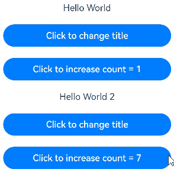
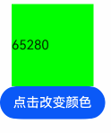
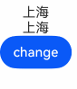
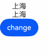

# @State Macro: Component Internal State

Variables decorated with \@State, also known as state variables, can trigger UI component refreshes once they possess state attributes. When the state changes, the UI will undergo corresponding rendering updates.

Among state variable-related macros, \@State is the most fundamental macro that endows variables with state attributes, serving as the data source for most state variables.

Before reading the \@State documentation, developers are advised to have a basic understanding of state management frameworks. It is recommended to review: [State Management Overview](./cj-state-management-overview.md).

## Overview

Variables decorated with \@State, like other decorated variables in declarative paradigms, are private and can only be accessed from within the component. They must specify their type and local initialization upon declaration. Initialization can also be completed using named parameter mechanisms from the parent component.

Variables decorated with \@State have the following characteristics:

- \@State-decorated variables establish one-way data synchronization with \@Prop-decorated variables in child components and two-way data synchronization with \@Link-decorated variables.

- The lifecycle of \@State-decorated variables is the same as that of their custom component.

## Macro Usage Rules

|\@State|Description|
|:---|:---|
|Non-attribute macro|None.|
|Synchronization type|Does not synchronize with any type of variable in the parent component.|
|Allowed variable types|Supports basic data types. For String, Int64, Float64, and Bool types, the type can be omitted. Other types must be explicitly specified.<br/>Supports Enum, Option types, and struct types, but internal modifications within struct types are not allowed.<br/>Supports class types. To observe internal changes, the class must be decorated with [\@Observed](./cj-macro-observed-and-publish.md) at definition, and class properties and nested properties must be decorated with [\@Publish](./cj-macro-observed-and-publish.md) to observe changes.<br/>Supports array types. To observe internal changes, use [ObservedArray\<T>](../../../../en/application-dev/reference/arkui-cj/cj-state-rendering-componentstatemanagement.md#class-observedarray) and [ObservedArrayList\<T>](../../../../en/application-dev/reference/arkui-cj/cj-state-rendering-componentstatemanagement.md#class-observedarraylist). For arrays of custom types, use [\@Observed](./cj-macro-observed-and-publish.md) and [\@Publish](./cj-macro-observed-and-publish.md) to observe property assignments within array items. Other array and Collection types, such as Array, Varray, ArrayList, HashMap, and HashSet, support assigning new arrays but cannot observe internal element changes.<br/>Supports [Color](../../../../en/application-dev/reference/arkui-cj/cj-common-types.md#class-color) type.<br/>For supported scenarios, see [Observing Changes](#observing-changes).<br/>Does not support Any.|
|Initial value of decorated variables|Must be initialized locally.|

## Variable Passing/Access Rules

|Passing/Access|Description|
|:---|:---|
|Initialization from parent component|Optional, can be initialized from the parent component or locally. If initialized from the parent component, the passed value will override local initialization.<br/>Supports initialization from regular variables in the parent component (assigning regular variables to \@State only initializes the value; changes to regular variables do not trigger UI refreshes; only state variables can trigger UI refreshes), \@State, [\@Link](./cj-macro-link.md), [\@Prop](./cj-macro-prop.md), [\@Provide](./cj-macro-provide-and-consume.md), [\@Consume](./cj-macro-provide-and-consume.md), [\@StorageLink](./cj-appstorage.md#storragelink), and [\@StorageProp](./cj-appstorage.md#storrageprop) decorated variables to initialize child component's \@State.|
|Used to initialize child components|\@State-decorated variables support initializing child component's regular variables, \@State, \@Link, \@Prop, and \@Provide.|
|Access outside component|Not supported, can only be accessed within the component.|

## Observing Changes and Behavior

Not all changes to state variables will trigger UI refreshes; only modifications observable by the framework will cause UI updates. This section explains what modifications can be observed and how the framework triggers UI refreshes upon detecting changes, i.e., the framework's behavior.

### Observing Changes

- When the decorated data type is a basic data type, value changes can be observed.

    ```cangjie
    // Simple type
    @State var count: Int = 0
    // Value changes can be observed
    this.count = 1
    ```

- When the decorated data type is a struct, internal modifications are not allowed.

    Declare Person.

    ```cangjie
    struct Person {
        var id: Int64
        var name: String
        public init(id: Int64, name: String) {
            this.id = id
            this.name = name
        }
    }
    ```

    \@State decorates a struct Person type.

    ```cangjie
    // Struct type
    @State var person: Person = Person(1, "Kim")
    ```

    Overall assignment to \@State-decorated variables is allowed.

    ```cangjie
    // Struct type assignment
    this.person = Person(2, "muller")
    ```

    Assignments to \@State-decorated variables will show compiler errors for modifications.

    ```cangjie
    // Struct property assignment
    this.person.id = 3
    ```

- When the decorated data type is a class, it must be decorated with [@Observed](./cj-macro-observed-and-publish.md), and properties requiring change observation must be decorated with [@Publish](./cj-macro-observed-and-publish.md). Without [@Observed](./cj-macro-observed-and-publish.md), internal changes like member variables cannot be observed. For details, see [@Observed Macro and @Publish Macro](./cj-macro-observed-and-publish.md).

    Declare Person and Model classes.

    ```cangjie
    @Observed
    class Person {
        @Publish var value: String
    }

    @Observed
    class Model {
        @Publish var value: String = ""
        @Publish var name: Person = Person(value: " ")
    }
    ```

    \@State decorates a Model type.

    ```cangjie
    @State var title: Model = Model(value: 'Hello', name: Person(value: "World"))
    ```

    Assignments to \@State-decorated variables.

    ```cangjie
    // Class property assignment
    this.title = Model(value: 'Hi', name: Person(value: 'ArkUI'))
    ```

    Assignments to \@State-decorated properties and nested properties can be observed.

    ```cangjie
    // Class property assignment
    this.title.value = 'Hi'
    // Nested property
    this.title.name.value = 'ArkUI'
    ```

- When the decorated object is an array, individual array item changes cannot be observed, but overall changes can. To observe internal changes, use [ObservedArray\<T>](../../../../en/application-dev/reference/arkui-cj/cj-state-rendering-componentstatemanagement.md#class-observedarray) and [ObservedArrayList\<T>](../../../../en/application-dev/reference/arkui-cj/cj-state-rendering-componentstatemanagement.md#class-observedarraylist).

    When \@State decorates an ArrayList type array.

    ```cangjie
    @State var arrlist: ArrayList<Int16> = ArrayList<Int16>([1, 2, 3])
    ```

    Overall array changes can be observed.

    ```cangjie
    this.arrlist = ArrayList<Int16>([10,9,8])
    ```

    Array item assignments cannot be observed.

    ```cangjie
    this.arrlist[0] = 10
    ```

    Declare Model class.

    ```cangjie
    @Observed
    class Model {
        @Publish public var value: Int
    }
    ```

    When \@State decorates an ObservedArray\<Model> type array.

    ```cangjie
    // ObservedArray type
    @State var title: ObservedArrayList<Model> = ObservedArrayList<Model>(ArrayList<Model>([Model(value: 11), Model(value: 1)]))
    ```

    Array assignments can be observed.

    ```cangjie
    // Array assignment
    this.title = ObservedArrayList<Model>(ArrayList<Model>([Model(value: 2)]))
    ```

    Array item assignments can be observed.

    ```cangjie
    // Array item assignment
    this.title[0] = Model(value: 2)
    ```

    Property assignments within array items can be observed.

    ```cangjie
    // Nested property assignment can be observed
    this.title[0].value = 6
    ```

    When \@State decorates an ObservedArrayList\<Model> type array, adding and deleting array items can be observed.

    Deleting array items can be observed.

    ```cangjie
    // Array item change
    this.title.remove(0)
    ```

    Adding array items can be observed.

    ```cangjie
    // Array item change
    this.title.append(Model(value: 12))
    ```

- When the decorated variable is other array or Collection types, such as Array, Varray, ArrayList, HashMap, and HashSet, assigning new arrays is supported, but internal element changes cannot be observed.

    Example with HashSet.

    ```cangjie
    // When \@State decorates a HashSet
    @State var message: HashSet<Int64> = HashSet<Int64>()
    ```

    Overall HashSet changes can be observed.

    ```cangjie
    this.message = HashSet<Int64>(1,2,3)
    ```

    Internal HashSet changes cannot be observed.

    ```cangjie
    this.message.add(5);
    ```

### Framework Behavior

- When a state variable changes, components dependent on that state variable are queried;

- The update methods of components dependent on the state variable are executed, triggering component updates and rendering;

- Components or UI descriptions unrelated to the state variable will not re-render, achieving on-demand page rendering updates.

## Constraints

1. \@State-decorated variables must be initialized; otherwise, a compilation error will occur.

    ```cangjie
    // Incorrect, compilation error
    @State var count: Int

    // Correct
    @State var count: Int = 0
    ```

2. \@State does not support decorating Function-type variables; a compilation error will occur.

## Usage Scenarios

### Decorating Simple Type Variables

The following example shows a simple type decorated with \@State. The variable count becomes a state variable when decorated with \@State, and changes to count trigger Button component refreshes:

- When the state variable count changes, only the Button component associated with it is queried;

- The Button component's update method is executed, achieving on-demand refreshes.

 <!-- run -->

```cangjie
package ohos_app_cangjie_entry
import kit.ArkUI.*
import ohos.arkui.state_macro_manage.*
@Entry
@Component
class EntryView {
    @State var count: Int = 0
    func build() {
        Button("click times: ${count}").onClick({evt => this.count += 1})
    }
}
```


### Decorating Class Object Variables

- The custom component MyComponent defines state variables count and title decorated with \@State, where title is of the custom class Model. If the values of count or title change, UI components using these state variables within MyComponent are queried and re-rendered.

- EntryView contains multiple MyComponent instances. Changes to the internal state of the first MyComponent do not affect the second MyComponent.

 <!-- run -->

```cangjie
package ohos_app_cangjie_entry
import kit.ArkUI.*
import ohos.arkui.state_macro_manage.*

@Observed
class Model {
    @Publish public var value: String
}

@Entry
@Component
class EntryView {
    func build() {
        Column {
            // Parameters specified here will override locally defined default values during initial rendering; not all parameters need initialization from the parent component
            MyComponent(count: 1, increaseBy: 2)
            MyComponent(title: Model(value: 'Hello World 2'), count: 7)
        }
    }
}

@Component
class MyComponent {
    @State var title: Model = Model(value: 'Hello World')
    @State var count: Int64 = 0
    private var increaseBy: Int64 = 1
    func build() {
        Column {
            Text("${this.title.value}").margin(10)
            Button("Click to change title")
                .onClick({ // Updates to \@State variables trigger Text component content updates
                    evt => this.title.value = 'Hello ArkUI'
                })
                .width(300)
                .margin(10)
            Button("Click to increase count = ${this.count}")
                .onClick({
                    // Updates to \@State variables trigger Button component content updates
                    evt => this.count += this.increaseBy
                })
                .width(300)
                .margin(10)
        }
    }
}
```



From this example, the initialization mechanism of \@State variables can be understood:

1. Without external input, default values are used for initialization:

    ```cangjie
    // title is not passed externally; local value Model(value: 'Hello World') is used for initialization
    MyComponent(count: 1, increaseBy: 2)
    // increaseBy is not passed externally; local value 1 is used for initialization
    MyComponent(title: Model(value: 'Hello World 2'), count: 7)
    ```

2. With external input, external values are used for initialization:

    ```cangjie
    // count and increaseBy are passed externally; 1 and 2 are used for initialization, respectively
    MyComponent(count: 1, increaseBy: 2)
    // title and count are passed externally; Model(value: 'Hello World 2') and 7 are used for initialization, respectively
    MyComponent(title: Model(value: 'Hello World 2'), count: 7)
    ```

## Common Issues

### Arrow Functions Failing to Modify State Variables

The `this` object inside an arrow function refers to the object in the scope where the function is defined, not where it is used. Therefore, the current `this.vm` must be passed in to call property assignments on the proxied state variables.

 <!-- run -->

```cangjie
package ohos_app_cangjie_entry
import kit.ArkUI.*
import ohos.arkui.state_macro_manage.*

@Observed
class PlayDetailViewModel {
    @Publish var coverUrl: UInt32
    var changeCoverUrl: (PlayDetailViewModel) -> Unit
}

@Entry
@Component
class EntryView {
    @State var vm: PlayDetailViewModel = PlayDetailViewModel(coverUrl: 0x00ff00,
        changeCoverUrl: {model: PlayDetailViewModel => model.coverUrl = 0x00F5FF})
    func build() {
        Column() {
            Text(this.vm.coverUrl.toString())
                .width(100)
                .height(100)
                .backgroundColor(this.vm.coverUrl)
            Button('Click to change color').onClick(
                {
                    evt =>
                    let self = this.vm
                    this.vm.changeCoverUrl(self)
                }
            )
        }
    }
}
```



### State Variables Only Affect Directly Bound UI Component Refreshes

【Example 1】

 <!-- run -->

```cangjie
package ohos_app_cangjie_entry
import kit.ArkUI.*
import ohos.arkui.state_macro_manage.*

@Observed
class Info {
    @Publish var address: String = 'Hangzhou'
}

@Entry
@Component
class EntryView {
    @State var message: String = 'Shanghai'
    @State var info: Info = Info()
    public func aboutToAppear() {
        this.info.address = this.message
    }
    func build() {
        Column() {
            Text(this.message)
            Text(this.info.address)
            Button('change').onClick({
                evt => this.info.address = 'Beijing'
            })
        }
    }
}
```



In the above example, clicking Button('change') only triggers a refresh of the second Text component because `message` is a simple string type, which is passed by value. Thus, changing `info.address` does not affect `this.message`.

【Example 2】

 <!-- run -->

```cangjie
package ohos_app_cangjie_entry
import kit.ArkUI.*
import ohos.arkui.state_macro_manage.*

@Observed
class Info {
    @Publish var address: String = 'Hangzhou'
}

@Observed
class User {
    @Publish var infomation: Info
}

@Entry
@Component
class EntryView {
    @State var info: Info = Info(address: 'Shanghai')
    @State var user: User = User(infomation: Info(address: 'Tianjin'))
    public func aboutToAppear() {
        this.user.infomation = this.info
    }
    func build() {
        Column() {
            Text(this.info.address)
            Text(this.user.infomation.address)
            Button('change').onClick(
                {
                    evt =>
                    this.user.infomation = Info(address: 'Guangzhou')
                    this.user.infomation.address = 'Beijing'
                }
            )
        }
    }
}
```



In the above example, clicking Button('change') only triggers a refresh of the second Text component. This is because clicking the button first executes `this.user.infomation = Info(address: 'Guangzhou')`, creating a new Info object. Then, `this.user.infomation.address = 'Beijing'` modifies the `address` value of this new Info object, leaving the original Info object's `address` unchanged.### Prohibiting State Variable Modifications Within Build Functions

Modifying state variables within the `build` function is strictly prohibited. State management frameworks will log an `Error`-level message during runtime.

The following example illustrates the rendering process:

1. Create the `Index` custom component.

2. Execute the `build` method of `Index`:
   
   a. Create the `Column` component.
   
   b. Create the `Text` component. During the creation of the `Text` component, `this.count++` is triggered.
   
   c. The change in `count` triggers a refresh of the `Text` component again.
   
   d. The `Text` component is finally rendered.

```cangjie
@Entry
@Component
class EntryView {
    @State var count :Int64 = 1
    func build() {
        Column() {
            // Avoid directly modifying the value of count within the Text component
            Text("${this.count++}")
                .width(50)
                .height(50)
        }
    }
}
```

In the above example, this erroneous behavior does not cause severe consequences. 

However, this practice is fundamentally incorrect and will lead to increasingly significant risks as project complexity grows. See the next example.

```cangjie
@Entry
@Component
class EntryView {
    @State var message: Int = 20;
    func build() {
        Column() {
            Text("${this.message++}")
            Text("${this.message++}")
        }
        .width(50)
        .height(100)
    }
}
```

The rendering process for the above example:

1. Create the first `Text` component, triggering a change in `this.message`.

2. The change in `this.message` triggers a refresh of the second `Text` component.

3. The refresh of the second `Text` component triggers another change in `this.message`, which in turn refreshes the first `Text` component.

4. This creates a cyclic re-rendering loop.

5. The system becomes unresponsive for an extended period, resulting in app freeze.

Therefore, modifying state variables within the `build` function is entirely incorrect.

### Deregistering Callbacks for State Variable Modifications

Developers can register arrow functions in `onPageShow` to modify state variables within components. However, it is crucial to nullify the previously registered function in `aboutToDisappear`. Failure to do so may result in memory leaks because the arrow function captures the `this` instance of the custom component, preventing its release.

<!-- run -->

```cangjie
package ohos_app_cangjie_entry
import kit.ArkUI.*
import ohos.arkui.state_macro_manage.*

@Observed
class Model {
    @Publish var callback: () -> Unit
    func add(callback: () -> Unit) {
        this.callback = callback
    }
    func delete() {
        this.callback = Option<() -> Unit>.None.getOrThrow()
    }
    func call() {
        if (true) {
            this.callback()
        }
    }
}

let model = Model(callback: {=>})

@Entry
@Component
class EntryView {
    @State var count: Int64 = 10

    public override func onPageShow() {
        model.add({=> this.count++})
    }
    func build() {
        Column() {
            Text("count value: ${this.count}")
            Button('change').onClick({
                evt => model.call()
            })
        }
    }
    public func aboutToDisappear(){
        model.delete()
    }
}
```

Alternatively, state variables can be modified outside the custom component using the [LocalStorage](./cj-localstorage.md#custom-component-state-variable-modification) approach.