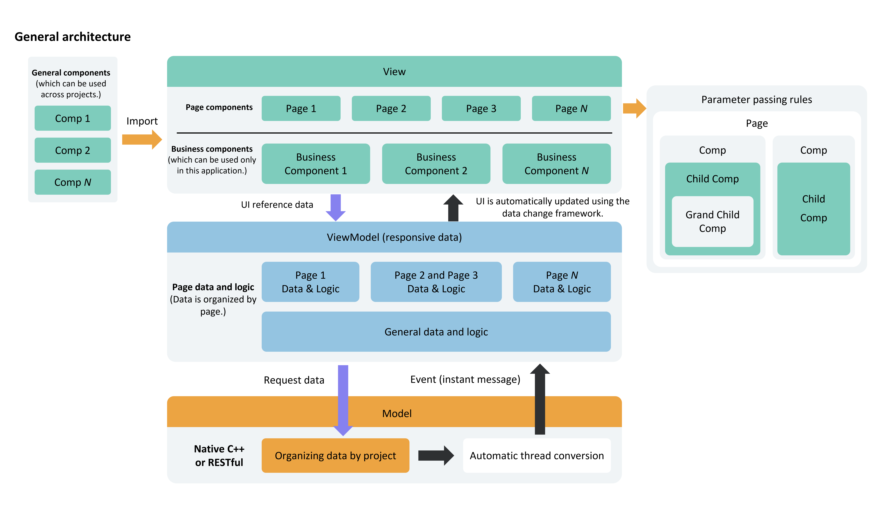

# MVVM Pattern

When developers grasp the basic concepts of state management, they often want to build their own applications. However, if the project structure is not carefully planned during the initial stages of application development, as the project expands and becomes more complex, the increasing number of state variables will lead to intricate relationships between components. At this point, developing any new feature may trigger a chain reaction, and maintenance costs will rise. To address this, this article aims to introduce the MVVM pattern and the relationship between ArkUI's UI development model and MVVM, guiding developers on how to design their project structure to facilitate easier development and maintenance during product iteration and upgrades.

This document covers most of the state management V1 decorators, so it is recommended that developers have a basic understanding of state management V1 before reading this document. It is advisable to review the following beforehand: [State Management Overview](cj-state-management-overview.md) and related documentation on state management V1 decorators.

## Introduction to MVVM Pattern

### Concept

In application development, UI updates need to synchronize in real-time with changes in data state, and this synchronization often determines the performance and user experience of the application. To address the complexity of synchronizing data and UI, ArkUI adopts the Model-View-ViewModel (MVVM) architectural pattern. MVVM divides the application into three core parts: Model, View, and ViewModel, achieving separation of data, view, and logic. Through this pattern, the UI can automatically update as the state changes, eliminating the need for manual handling, thereby more efficiently managing the binding and updating of data and views.

- **Model**: Responsible for storing and managing application data and business logic, without directly interacting with the user interface. Typically, it retrieves data from backend interfaces and serves as the data foundation of the application, ensuring data consistency and integrity.
- **View**: Responsible for displaying data on the user interface and interacting with users, without containing any business logic. It dynamically updates the UI by binding to data provided by the ViewModel layer.
- **ViewModel**: Responsible for managing UI state and interaction logic. As the bridge connecting the Model and View, there is usually one ViewModel per View. The ViewModel monitors changes in Model data, notifies the View to update the UI, and handles user interaction events, converting them into data operations.

ArkUI's UI development model follows the MVVM pattern. With this basic introduction to MVVM concepts, developers can roughly infer the role of state management in MVVM. State management aims to drive updates through data, allowing developers to focus solely on page design without worrying about the entire UI refresh logic. Data maintenance also does not require developer awareness, as state variables automatically handle updates. This is precisely what the ViewModel layer needs to support. Therefore, using the MVVM pattern to develop applications is the most effortless approach for developers.

## ArkUI Development Model Diagram

ArkUI's UI development model is the MVVM pattern, where state variables play the role of ViewModel in the MVVM pattern, refreshing the UI upward and updating data downward. The overall framework is as follows:



### View Layer

- **Page Components**: Most applications are categorized by pages, such as login pages, list pages, edit pages, help pages, and copyright pages. The data required for each page may be entirely different or shared across multiple pages.
- **Business Components**: Functional components that inherently possess part of the application's business capabilities. Typically, these components may be associated with data from the ViewModel of the current project and are not intended to be shared with other projects.
- **General Components**: Like system components, these components are not associated with the ViewModel data of the current application. They can be shared across multiple projects to implement common functionalities.

### ViewModel Layer

**Page Data**: Data organized by pages. When users browse pages, some pages may not be displayed. Therefore, it is best to design this page data in a lazy-loading (on-demand) mode.

**Differences Between ViewModel Layer Data and Model Layer Data**:

- **Model Layer Data**: Organized by the entire project or application, it constitutes the complete business data of the application.
- **ViewModel Layer Data**: Provides data used on specific pages, which may be a subset of the application's business data. Additionally, the ViewModel layer can include auxiliary data for page display, which may be entirely unrelated to the application's business logic and merely facilitates page presentation.

### Model Layer

The Model layer is the original data provider of the application.

## Core Architectural Principles

### No Cross-Layer Access

- The View layer cannot directly call Model layer data; it must use methods provided by the ViewModel.
- Model layer data cannot directly manipulate the UI. The Model layer can only notify the ViewModel layer of data updates, and the ViewModel layer updates the corresponding data.

### Lower Layers Cannot Access Upper Layer Data

Lower-layer data updates upper-layer data through notification patterns. In business logic, lower layers cannot directly write code to access upper-layer data. For example, the ViewModel layer's logic processing should not depend on a value from the View layer interface.

### No Direct Access Between Non-Parent-Child Components

This is a core principle for View layer design. A component should adhere to the following logic:

- Direct access to parent components is prohibited (must use events or subscription capabilities).
- Direct access to sibling components is prohibited. This is because components should only access their visible child nodes (via parameters) and parent nodes (via events or notifications), thereby decoupling components.

The reasons for this design in a component are:

- The child components used by a component are clearly defined and thus can be accessed.
- The parent node where a component is placed is unknown, so accessing the parent node must be done through notifications or events.
- A component cannot know who its sibling nodes are, so it cannot manipulate them.

## Memo Development Practice

This section demonstrates how to design applications using the ArkUI framework through the development of a memo application. This section does not design the code architecture upfront but focuses on immediate feature development based on requirements, without considering future maintenance. It also introduces the decorators needed for feature development.

### State Variables

- The `@State` decorator is the most commonly used decorator for defining state variables, typically serving as the data source for parent components. When developers click, the state variables update, triggering UI refreshes. Removing `@State` disables UI refresh support.

 <!-- run -->

```cangjie
package ohos_app_cangjie_entry

import kit.ArkUI.*
import ohos.arkui.state_macro_manage.*
import std.collection.*
import kit.LocalizationKit.*

@Entry
@Component
class EntryView {
    @State
    var isFinished: Bool = false
    func build(){
        Column{
            Row(){
                Text("All Tasks")
                .fontSize(30)
                .fontWeight(FontWeight.Bold)
            }
            .width(100.percent)
            .margin(top: 40.vp, bottom: 10.vp, left: 50.vp)

            // Tasks
            Row(space: 15){
                if(this.isFinished){
                    // 'app.media.ic_public_todo_filled' is for illustration only. Developers should replace it; otherwise, imageSource creation failure may prevent normal execution.
                    Image(@r(app.media.ic_public_todo_filled))
                    .width(28)
                    .height(28)
                }
                else{
                    // 'app.media.ic_public_todo' is for illustration only. Developers should replace it; otherwise, imageSource creation failure may prevent normal execution.
                    Image(@r(app.media.ic_public_todo))
                    .width(28)
                    .height(28)
                }
                Text('Learn Advanced Mathematics')
                .fontSize(24)
                .fontWeight(FontWeight.Bold)
                .decoration(decorationType: if(this.isFinished){TextDecorationType.LineThrough} else {TextDecorationType.None}, color: Color.Black, decorationStyle: TextDecorationStyle.Solid)
            }
            .width(100.percent)
            .margin(left: 60, top: 15)
            .onClick({event => this.isFinished = !this.isFinished})
        }
        .height(100.percent)
        .width(100.percent)
        .backgroundColor(0x90f1f3f5)
    }
}
```


### Roles of @Prop and @Link

In the above example, all code is written in the `@Entry` component. As more components need to be rendered, the `@Entry` component must be split. For this purpose, child components need to use the `@Prop` and `@Link` decorators:

- `@Prop`: Unidirectional transfer between parent and child components. Child components deep-copy parent component data. They can update from the parent or themselves but will not synchronize with parent component data.
- `@Link`: Bidirectional transfer between parent and child components. Parent component changes notify all `@Link` variables, and `@Link` updates also notify the corresponding parent component variables to refresh.

 <!-- run -->

```cangjie
package ohos_app_cangjie_entry

import kit.ArkUI.*
import ohos.arkui.state_macro_manage.*
import std.collection.*
import kit.LocalizationKit.*

@Component
class TodoComponent {
    func build(){
        Row(){
            Text('All Tasks')
            .fontSize(30)
            .fontWeight(FontWeight.Bold)
        }
        .width(100.percent)
        .margin(top: 40.vp, bottom: 10.vp, left: 50.vp)
    }
}

@Component
class AllChooseComponent {
    @Link var isFinished: Bool;

    func build(){
        Row(){
            Button("Select All", ButtonOptions(shape: ButtonType.Capsule))
            .onClick({event => this.isFinished = !this.isFinished})
            .fontSize(30)
            .fontWeight(FontWeight.Bold)
            .backgroundColor(0xf7f6cc74)
        }
        .width(100.percent)
        .margin(top: 10.vp, left: 60.vp)
    }
}

@Component
class ThingsComponent1 {
    @Prop var isFinished: Bool;

    func build(){
        Row(space: 15) {
            if(this.isFinished){
                // 'app.media.ic_public_todo_filled' is for illustration only. Developers should replace it; otherwise, imageSource creation failure may prevent normal execution.
                Image(@r(app.media.ic_public_todo_filled))
                .width(28)
                .height(28)
            }
            else{
                // 'app.media.ic_public_todo' is for illustration only. Developers should replace it; otherwise, imageSource creation failure may prevent normal execution.
                Image(@r(app.media.ic_public_todo))
                .width(28)
                .height(28)
            }
            Text("Learn Chinese")
            .fontSize(24)
            .fontWeight(FontWeight.Bold)
            .decoration(decorationType: if(this.isFinished){TextDecorationType.LineThrough}else {TextDecorationType.None}, color: Color.Black, decorationStyle: TextDecorationStyle.Solid)
        }
        .width(100.percent)
        .margin(left: 60, top: 15)
        .onClick({event => this.isFinished = !this.isFinished})
    }
}

@Component
class ThingsComponent2 {
    @Prop var isFinished: Bool;

    func build(){
        Row(space: 15){
            if(this.isFinished) {
                // 'app.media.ic_public_todo_filled' is for illustration only. Developers should replace it; otherwise, imageSource creation failure may prevent normal execution.
                Image(@r(app.media.ic_public_todo_filled))
                .width(28)
                .height(28)
            }
            else{
                // 'app.media.ic_public_todo' is for illustration only. Developers should replace it; otherwise, imageSource creation failure may prevent normal execution.
                Image(@r(app.media.ic_public_todo))
                .width(28)
                .height(28)
            }
            Text("Learn Advanced Mathematics")
            .fontSize(24)
            .fontWeight(FontWeight.Bold)
            .decoration(decorationType: if(this.isFinished){TextDecorationType.LineThrough} else {TextDecorationType.None}, color: Color.Black, decorationStyle: TextDecorationStyle.Solid)
        }
        .width(100.percent)
        .margin(left: 60, top: 15)
        .onClick({event => this.isFinished = !this.isFinished})
    }
}

@Entry
@Component
class EntryView {
    @State
    var isFinished: Bool = false;

    func build() {
        Column(){
            // All Tasks
            TodoComponent()
            // Select All
            AllChooseComponent(isFinished: this.isFinished)
            // Task 1
            ThingsComponent1(isFinished: this.isFinished)
            // Task 2
            ThingsComponent2(isFinished: this.isFinished)
        }
        .height(100.percent)
        .width(100.percent)
        .margin(top: 5, bottom: 5)
        .backgroundColor(0x90f1f3f5)
    }
}
```


### Looping Through Components

Although the previous example splits components, it is evident that Component 1 and Component 2 have very similar code. When rendering components with identical settings except for data, the `ForEach` loop should be used for rendering.

After using `ForEach`, redundant code is reduced, and the code structure becomes clearer.

 <!-- run -->

```cangjie
package ohos_app_cangjie_entry

import kit.ArkUI.*
import ohos.arkui.state_macro_manage.*
import kit.LocalizationKit.*

@Component
class TodoComponent {
    func build(){
        Row(){
            Text('All Tasks')
            .fontSize(30)
            .fontWeight(FontWeight.Bold)
        }
        .width(100.percent)
        .margin(top: 40.vp, bottom: 10.vp, left: 50.vp)
    }
}

@Component
class AllChooseComponent {
    @Link var isFinished: Bool;

    func build(){
        Row(){
            Button("Select All", ButtonOptions(shape: ButtonType.Capsule))
            .onClick({event => this.isFinished = !this.isFinished})
            .fontSize(30)
            .fontWeight(FontWeight.Bold)
            .backgroundColor(0xf7f6cc74)
        }
        .width(100.percent)
        .margin(top: 10.vp, left: 60.vp)
    }
}

@Component
class ThingsComponent {
    @Prop var isFinished: Bool;
    @Prop var things: String;
    func build(){
        Row(space: 15){
            if(this.isFinished){
                // 'app.media.ic_public_todo_filled' is for illustration only. Developers should replace it; otherwise, imageSource creation failure may prevent normal execution.
                Image(@r(app.media.ic_public_todo_filled))
                .width(28)
                .height(28)
            }
            else{
                // 'app.media.ic_public_todo' is for illustration only. Developers should replace it; otherwise, imageSource creation failure may prevent normal execution.
                Image(@r(app.media.ic_public_todo))
                .width(28)
                .height(28)
            }
            Text(this.things)
            .fontSize(24)
            .fontWeight(FontWeight.Bold)
            .decoration(decorationType: if(this.isFinished){TextDecorationType.LineThrough}else {TextDecorationType.None}, color: Color.Black, decorationStyle: TextDecorationStyle.Solid)
        }
        .height(8.percent)
        .width(90.percent)
        .border(width: 1)
        .padding(left: 15)
        .opacity(if(this.isFinished){0.3} else{1.0})
        .borderColor(Color.White)
        .borderRadius(25)
        .backgroundColor(Color.White)
        .onClick({event => this.isFinished = !this.isFinished})
    }
}

@Entry
@Component
class EntryView {
    @State var isFinished: Bool = false;
    @State var planList: Array<String> = [
        '7.30 Wake up',
        '8.30 Breakfast',
        '11.30 Lunch',
        '17.30 Dinner',
        '21.30 Supper',
        '22.30 Shower',
        '1.30 Wake up'
        ]

    func build() {
        Column(){
            // All Tasks
            TodoComponent()

            // Select All
            AllChooseComponent(isFinished: this.isFinished)

            List(){
                ForEach(
                    this.planList, {item: String, _:Int64 =>
                        ListItem(){
                            // Tasks
                            ThingsComponent(isFinished: this.isFinished, things: item)
                        }.margin(top: 10.vp).width(100.percent)
                    }
                )
            }.margin(left: 10.vp, right: 10.vp)

        }
        .height(100.percent)
        .width(100.percent)
        .backgroundColor(0x90f1f3f5)
    }
}
```


### Builder Method

The Builder method is used to define methods within components, enabling code reuse within the component.

This example not only uses the `@Builder` method for deduplication but also moves data out. The code is now clearer and more readable. Compared to the initial code, the `@Entry` component primarily handles page construction logic without dealing with extensive content unrelated to page design.

 <!-- run -->

```cangjie
package ohos_app_cangjie_entry

import kit.ArkUI.*
import ohos.arkui.state_macro_manage.*
import kit.LocalizationKit.*

@Observed
class TodoListData{
    var planList: Array<String> = [
        '7.30 Wake up',
        '8.30 Breakfast',
        '11.30 Lunch',
        '17.30 Dinner',
        '21.30 Supper',
        '22.30 Shower',
        '1.30 Wake up'
        ]
}

@Component
class TodoComponent{
    func build() {
        Row() {
            Text('All Tasks')
            .fontSize(30)
            .fontWeight(FontWeight.Bold)
        }
        .width(100.percent)
        .margin(top: 40.vp, bottom: 10.vp, left: 50.vp)
    }
}

@Component
class AllChooseComponent {
    @Link var isFinished: Bool;

    func build() {
        Row(){
            Button("Select All", ButtonOptions(shape: ButtonType.Capsule))
            .onClick({event => this.isFinished = !this.isFinished})
            .fontSize(30)
            .fontWeight## Practical MVVM Development for Memo Apps

[Practical Memo App Development](#Practical-Memo-App-Development) demonstrates how code can be organized without the MVVM pattern. As the main page's code grows increasingly complex, it becomes evident that a proper layering approach is necessary to maintain a clear project structure. This prevents components from referencing each other directly, which could lead to cascading maintenance issues and increased difficulty in future feature updates. This chapter introduces the core file organization pattern of MVVM and demonstrates how to restructure the code from the previous chapter using this architecture.

### Layering Design Techniques

#### Model Layer

The Model layer stores the core data structures of the application. This layer is largely independent of UI development, allowing developers to encapsulate business logic as needed.

#### ViewModel Layer

> **Note:**
>
> The ViewModel layer doesn't just store data—it also provides data services and processing. Many frameworks refer to this layer as "service."

The ViewModel layer serves as the data layer for views. Its design typically has two characteristics:

1. Data is organized by page.
2. Each page's data is lazily loaded.

#### View Layer

The View layer is organized based on requirements, but it should distinguish between three types of components:

- **Page Components**: Provide overall page layout, handle multi-page navigation, and manage foreground/background events.
- **Business Components**: Referenced by pages to construct the page content.
- **Shared Components**: Reusable across multiple projects, independent of the current project.

**Difference between Shared and Business Components**:

Business components include ViewModel layer data and cannot function without it.

Shared components don't contain ViewModel layer data—they receive all necessary data externally. A shared component is a custom component that works as long as external parameters (non-business-specific) are satisfied.

### Code Example

The following demonstrates restructuring the code using the MVVM pattern:

- src
    - main
        - cangjie
            - model
                - thing_model.cj
                - todolist_model.cj
            - view
                - index.cj
                - allchoose_component.cj
                - thing_component.cj
                - todo_component.cj
                - todolist_component.cj
            - view_model
                - thing_viewmodel.cj
                - todolist_viewmodel.cj

File code examples:

- index.cj

    ```cangjie
    package ohos_app_cangjie_entry.view

    import kit.ArkUI.*
    import ohos.arkui.state_macro_manage.*
    import ohos_app_cangjie_entry.view_model.*

    @Entry
    @Component
    class EntryView {
        @State var thingsTodo: TodoListViewModel = TodoListViewModel()

        public func aboutToAppear() {
            this.thingsTodo.loadTasks()
        }

        func build() {
            Column() {
                Row {
                    TodoComponent()
                    AllChooseComponent(thingsViewModel: this.thingsTodo)
                }
                Column() {
                    TodoListComponent(thingViewModelArray: this.thingsTodo.thingViewModelArray)
                }
            }
            .height(100.percent)
            .width(100.percent)
            .backgroundColor(0x90f1f3f5)
        }
    }
    ```

- thing_model.cj

    ```cangjie
    package ohos_app_cangjie_entry.model

    import kit.ArkUI.*
    import ohos.arkui.state_macro_manage.*

    @Observed
    public class ThingModel {
        @Publish public var thingName: String = "Todo"
        @Publish public var isFinish: Bool = false
    }
    ```

- todolist_model.cj

    ```cangjie
    package ohos_app_cangjie_entry.model

    public class TodoListModel {
        public var things: Array<ThingModel> = []

        public init(things: Array<ThingModel>) {
            this.things = things
        }

        public func loadTasks() {
            this.things = [
                ThingModel(thingName: "7.30 Wake up", isFinish: false),
                ThingModel(thingName: "8.30 Breakfast", isFinish: false),
                ThingModel(thingName: "11.30 Lunch", isFinish: false),
                ThingModel(thingName: "17.30 Dinner", isFinish: false),
                ThingModel(thingName: "21.30 Snack", isFinish: false),
                ThingModel(thingName: "22.30 Shower", isFinish: false),
                ThingModel(thingName: "1.30 Sleep", isFinish: false)
                ]
        }
    }
    ```

- allchoose_component.cj

    ```cangjie
    package ohos_app_cangjie_entry.view

    import kit.ArkUI.*
    import ohos.arkui.state_macro_manage.*
    import ohos_app_cangjie_entry.view_model.*

    @Component
    public class AllChooseComponent {
        @State var titleName: String = "Select All"
        @Link var thingsViewModel: TodoListViewModel = TodoListViewModel(isChoosen: false, thingViewModelArray: ObservedArrayList<ThingViewModel>())

        func build() {
            Row() {
                Button(this.titleName, ButtonOptions(shape: ButtonType.Capsule))
                .onClick({ =>
                    this.thingsViewModel.chooseAll()
                    this.titleName = if (!this.thingsViewModel.isChoosen) {"Select All"} else {"Deselect All"}
                })
                .fontSize(30)
                .fontWeight(FontWeight.Bold)
                .backgroundColor(0xf7f6cc74)
            }
            .width(40.percent)
            .margin(top: 40.vp, bottom: 10.vp, left: 30.vp)
        }
    }
    ```

- thing_component.cj

    ```cangjie
    package ohos_app_cangjie_entry.view

    import kit.ArkUI.*
    import ohos.arkui.state_macro_manage.*
    import kit.LocalizationKit.*
    import ohos_app_cangjie_entry.view_model.*

    @Component
    public class ThingComponent  {
        @Link var thingViewModel: ThingViewModel

        @Builder
        func displayIcon(icon: AppResource) {
            Image(icon)
            .width(28)
            .height(28)
            .onClick{ evt: ClickEvent =>
                this.thingViewModel.updateIsFinish()
                }
        }

        func build() {
            Row(space: 15){
                if(this.thingViewModel.isFinish){
                    // 'app.media.ic_public_todo_filled' is for demonstration only. Replace it to avoid imageSource creation failure.
                    this.displayIcon(@r(app.media.ic_public_todo_filled))
                }
                else{
                    // 'app.media.ic_public_todo' is for demonstration only. Replace it to avoid imageSource creation failure.
                    this.displayIcon(@r(app.media.ic_public_todo))
                }
                Text(this.thingViewModel.thingName)
                .fontSize(24)
                .fontWeight(FontWeight.Bold)
                .decoration(decorationType: if (this.thingViewModel.isFinish) {TextDecorationType.LineThrough} else {TextDecorationType.None}, color: Color.Black, decorationStyle: TextDecorationStyle.Solid)
                .onClick{ event => this.thingViewModel.addSuffixes() }
            }
            .height(8.percent)
            .width(95.percent)
            .margin(top: 10.vp, left: 10.vp, right: 10.vp)
            .padding(left: 15.vp)
            .opacity(if(this.thingViewModel.isFinish) {0.3} else {1.0})
            .border(width: 1)
            .borderColor(Color.White)
            .borderRadius(25)
            .backgroundColor(Color.White)
        }
    }
    ```

- todo_component.cj

    ```cangjie
    package ohos_app_cangjie_entry.view

    import kit.ArkUI.*
    import ohos.arkui.state_macro_manage.*

    @Component
    public class TodoComponent {
        func build() {
            Row() {
                Text('All Tasks')
                .fontSize(30)
                .fontWeight(FontWeight.Bold)
            }
            .width(40.percent)
            .margin(top: 40.vp, bottom: 10.vp, left: 30.vp)
        }
    }
    ```

- todolist_component.cj

    ```cangjie
    package ohos_app_cangjie_entry.view

    import kit.ArkUI.*
    import ohos.arkui.state_macro_manage.*
    import ohos_app_cangjie_entry.view_model.*

    @Component
    public class TodoListComponent {
        @Link var thingViewModelArray: ObservedArrayList<ThingViewModel>

        func build() {
            Column() {
                List() {
                    ForEach(
                        this.thingViewModelArray, {item: ThingViewModel, _:Int64 =>
                            ListItem() {
                                ThingComponent(thingViewModel: item)
                            }
                        }
                    )
                }
            }
            .width(100.percent)
        }
    }
    ```

- thing_viewmodel.cj

    ```cangjie
    package ohos_app_cangjie_entry.view_model

    import kit.ArkUI.*
    import ohos.arkui.state_macro_manage.*
    import ohos_app_cangjie_entry.model.*

    @Observed
    public class ThingViewModel {
        @Publish public var thingName: String = "Todo"
        @Publish public var isFinish: Bool = false

        public func updateTask(thing: ThingModel) {
            this.thingName = thing.thingName
            this.isFinish = thing.isFinish
        }

        public func updateIsFinish(): Unit {
            this.isFinish = !this.isFinish
        }

        public func addSuffixes(): Unit {
            this.thingName += '啦'
        }
    }
    ```

- todolist_viewmodel.cj

    ```cangjie
    package ohos_app_cangjie_entry.view_model

    import kit.ArkUI.*
    import ohos.arkui.state_macro_manage.*
    import ohos_app_cangjie_entry.model.*

    @Observed
    public class TodoListViewModel {
        @Publish public var isChoosen: Bool = false
        @Publish public var thingViewModelArray: ObservedArrayList<ThingViewModel> = ObservedArrayList<ThingViewModel>()

        public func loadTasks() {
            let todoList = TodoListModel([])
            todoList.loadTasks()
            for (thing in todoList.things) {
                let thingsViewModel = ThingViewModel()
                thingsViewModel.updateTask(thing)
                this.thingViewModelArray.append(thingsViewModel)
            }
        }

        public func chooseAll(): Unit {
            this.isChoosen = !this.isChoosen
            for (i in 0..this.thingViewModelArray.size) {
                this.thingViewModelArray[i].isFinish = this.isChoosen
            }
        }
    }
    ```

After restructuring with the MVVM pattern, the project has a clearer structure, with well-defined responsibilities for each module. If a new page requires a component like `TodoListComponent`, it can simply import the component.

Demo effect:

