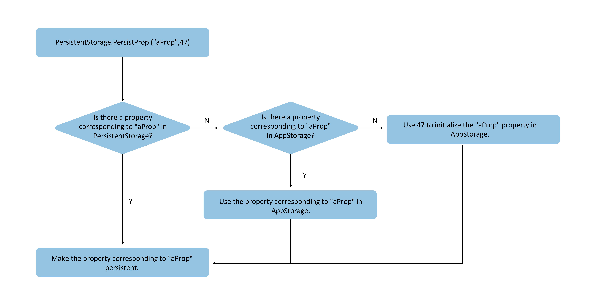

# PersistentStorage: Persisting UI State

The first two sections introduced LocalStorage and AppStorage, both of which are runtime memory. However, a common requirement in application development is to preserve selected results even after the application exits and restarts. This is where PersistentStorage comes into play.

PersistentStorage is an optional singleton object in an application. Its purpose is to persistently store selected AppStorage properties, ensuring these properties retain their values when the application restarts, matching their state at application shutdown.

PersistentStorage provides the capability to persist state variables, but it's important to note that both persistence and UI read-back functionality depend on AppStorage. Before reading this documentation, it is recommended to review: [AppStorage](cj-appstorage.md) and [PersistentStorage API Documentation](../../../../en/application-dev/reference/arkui-cj/cj-state-rendering-appstatemanagement.md#persistentstorage持久化存储ui状态).

## Overview

PersistentStorage retains selected AppStorage properties on the device disk. Applications use APIs to determine which AppStorage properties should be persisted via PersistentStorage. The UI and business logic do not directly access properties in PersistentStorage; all property access is performed through AppStorage, where changes are automatically synchronized to PersistentStorage.

PersistentStorage establishes bidirectional synchronization with properties in AppStorage. Application development typically accesses PersistentStorage through AppStorage. Additionally, there are interfaces available for managing persistent properties, but business logic always retrieves and sets properties through AppStorage.

## Constraints

PersistentStorage supports the following types and values:

- Simple types such as Bool, String, integer, float, etc.
- Objects that can be reconstructed using JSON.stringify() and JSON.parse(), though member methods within objects are not supported for persistence.

PersistentStorage does not support the following types and values:

- Nested objects (arrays of objects, object properties that are objects, etc.). This is because the framework currently cannot detect changes in nested objects (including arrays) within AppStorage, preventing write-back to PersistentStorage.

Persisting data is a relatively slow operation, so applications should avoid:

- Persisting large datasets.
- Persisting frequently changing variables.

PersistentStorage is best suited for persisting small data (preferably under 2KB). Avoid persisting large amounts of data, as PersistentStorage's disk write operations are synchronous. Large-scale data read/write operations executed synchronously on the UI thread can impact UI rendering performance. For storing large datasets, developers are advised to use database APIs.

## Usage Scenarios

### Accessing PersistentStorage-Initialized Properties from AppStorage

1. Initialize PersistentStorage:

```cangjie
PersistentStorage.persistProp("aProp",47)
```

2. Retrieve the corresponding property from AppStorage:

```cangjie
AppStorage.get<Int64>("aProp")
```

&nbsp;&nbsp;Or define it within a component:

```cangjie
@StorageLink["aProp"] var aProp : Int64 = 48
```

Complete code example:

 <!-- run -->

```cangjie
package ohos_app_cangjie_entry
import kit.ArkUI.*
import ohos.arkui.state_macro_manage.*

@Entry
@Component
class EntryView {
    let temp = PersistentStorage.persistProp("aProp",47)
    @State var message : String = "Hello World"
    @StorageLink["aProp"] var aProp : Int64 = 48
    func build() {
        Row(){
            Column(){
                Text("${this.aProp}")
                    .onClick{
                        etv=> this.aProp += 1
                    }
            }
        }
    }
}
```

- First run after a fresh application installation:
  a. Calling `persistProp` initializes PersistentStorage by first checking if "aProp" exists in the PersistentStorage local file. The result is negative since this is the first installation.
  b. Next, it checks if property "aProp" exists in AppStorage, which also returns negative.
  c. Creates a number-type property named "aProp" in AppStorage with the default value 47.
  d. PersistentStorage writes property "aProp" with value 47 to disk. Subsequent changes to "aProp" in AppStorage will be persisted.
  e. The Index component creates state variable `@StorageLink("aProp") aProp`, establishing bidirectional binding with "aProp" in AppStorage. During creation, it successfully finds "aProp" in AppStorage and uses its value 47.

**Figure 1** PersistProp Initialization Rules



- After triggering a click event:
  a. The state variable `@StorageLink("aProp") aProp` changes, causing the Text component to refresh.
  b. Variables decorated with `@StorageLink` maintain bidirectional synchronization with AppStorage, so changes to `@StorageLink("aProp") aProp` are synchronized back to AppStorage.
  c. Changes to the "aProp" property in AppStorage synchronize to all variables (unidirectional or bidirectional) bound to "aProp". In this example, no other variables are bound to "aProp".
  d. Since "aProp" is persisted, changes in AppStorage trigger PersistentStorage to write the new value to disk.

- Subsequent application launches:
  a. Executing `PersistentStorage.persistProp("aProp", 47)` first queries the "aProp" property in the PersistentStorage local file, successfully finding it.
  b. The queried value from PersistentStorage is written to AppStorage.
  c. The queried value from PersistentStorage is written to AppStorage.

### Accessing AppStorage Properties Before PersistentStorage

This example demonstrates an anti-pattern. Accessing AppStorage properties before calling `PersistentStorage.persistProp` or `persistProps` is incorrect because this sequence loses property values from the previous application run:

```cangjie
let aProp = AppStorage.setOrCreate("aProp", 47)
let temp = PersistentStorage.persistProp("aProp", 48)
```

During non-first runs, executing `AppStorage.setOrCreate("aProp", 47)` first creates property "aProp" in AppStorage as a number type with the specified default value 47. Since "aProp" is persistent, it is written back to PersistentStorage disk, overwriting any previously stored values.

`PersistentStorage.persistProp("aProp", 48)` then finds "aProp" in PersistentStorage with the value 47, which was just written via the AppStorage interface.

### Accessing AppStorage Properties After PersistentStorage

Developers can first determine whether to overwrite values previously saved in PersistentStorage. If overwriting is needed, they can then call AppStorage's interface for modification; otherwise, they can skip the AppStorage interface call.

```cangjie
let temp = PersistentStorage.persistProp("aProp", 48)
if(AppStorage.get<Int64>("aProp").getOrThrow() > 50){
    AppStorage.setOrCreate("aProp", 47)
}
```

This example reads data stored in PersistentStorage and checks if the value of "aProp" exceeds 50. If it does, the AppStorage interface is used to set it to 47.