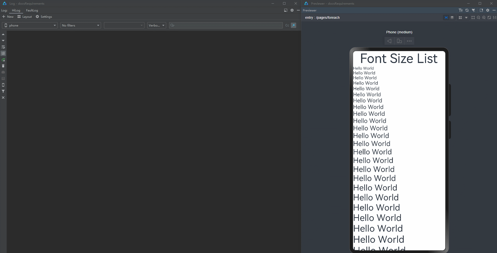
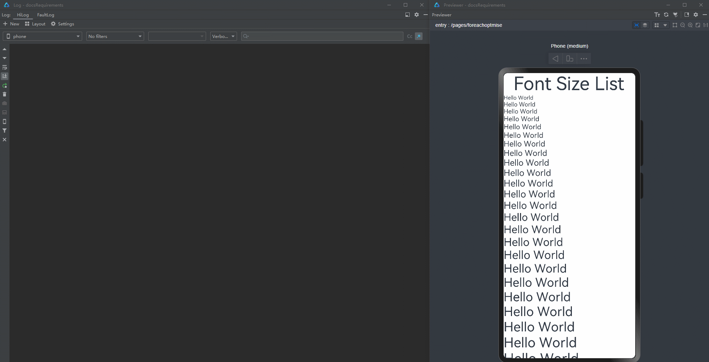

# State Management Best Practices Development Guide

<!--Del-->
> **Note:**
>
> Currently in the beta phase.
<!--DelEnd-->

Due to unfamiliarity with current state management features, many developers encounter issues like UI not refreshing or poor refresh performance when using state management for development. This document analyzes five typical scenarios from two perspectives, providing corresponding positive and negative examples to help developers learn how to properly utilize state management in development.

## Proper Use of Properties

## Combining Simple Property Arrays into Object Arrays

During development, there's often a need to set the same property for multiple components, such as Text component content, width, height, and other style information. Storing these properties in an array and using them with ForEach is a simple and convenient approach.

### Splitting Complex Large Objects into Collections of Smaller Objects

In development, sometimes a large object containing numerous style-related properties is defined and passed between parent and child components, with its properties bound to components.

### Using @Observed Decorated or State Variable Declared Class Objects for Component Binding

During development, there are "data reset" scenarios where a newly created object is assigned to an existing state variable to refresh data. If the type of the newly created object isn't properly considered, UI refresh issues may occur.

## Proper Use of ForEach/LazyForEach

### Minimizing UI Refresh Through LazyForEach's Rebuild Mechanism

### Using ObservedArrayList with ForEach

During development, object arrays are often used with [ForEach](../rendering_control/cj-rendering-control-foreach.md), but improper implementation can lead to UI not refreshing.

 <!-- run -->

```cangjie
package ohos_app_cangjie_entry

import kit.ArkUI.*
import ohos.arkui.state_macro_manage.*
import std.collection.ArrayList
import kit.PerformanceAnalysisKit.Hilog

@Observed
class TextStyles{
    @Publish
    var fontSize: Int64
}

@Entry
@Component
class EntryView {
    @State
    var styleList: ArrayList<TextStyles> = ArrayList<TextStyles>([])

    public override func aboutToAppear(){
        for(i in 1..=35){
            this.styleList.add(TextStyles(fontSize: i))
        }
    }

    func build() {
        Column {
            Text("Font Size List")
                .fontSize(50)
                .onClick({
                    evt =>
                        for(i in 0..this.styleList.size){
                            this.styleList[i].fontSize++
                        }
                        Hilog.info(0, "AppLogCj", "change font size")
                    }
                )
            List() {
                ForEach(this.styleList, {
                        item: TextStyles, _: Int64 =>
                        ListItem(){
                            Text("Hello World")
                                .fontSize(item.fontSize)
                        }
                })
            }
        }
    }
}
```



Since items generated in ForEach are constants, clicking to change item content cannot trigger UI refresh, even though logs show the item values have changed ("change font size" is printed). Therefore, ObservedArrayList needs to be used with \@Publish decorated custom class properties to achieve observable capability.

 <!-- run -->

```cangjie
package ohos_app_cangjie_entry

import kit.ArkUI.*
import ohos.arkui.state_macro_manage.*
import std.collection.ArrayList
import kit.PerformanceAnalysisKit.Hilog

@Observed
class TextStyles{
    @Publish var fontSize: Int64
}

@Entry
@Component
class EntryView {
    @State
    var styleList: ObservedArrayList<TextStyles> = ObservedArrayList<TextStyles>([])

    public override func aboutToAppear(){
        for(i in 1..= 35) {
            this.styleList.append(TextStyles(fontSize: i))
        }
    }

    func build() {
        Column {
            Text("Font Size List")
                .fontSize(50)
                .onClick({
                    evt =>
                    for(i in 0..this.styleList.size){
                        this.styleList[i].fontSize++
                    }
                    Hilog.info(0,"AppLog: info","change font size")
                })
            List(){
                ForEach(this.styleList ,{
                        item: TextStyles, _:Int64 =>
                        ListItem(){
                            Text("Hello World")
                                .fontSize(item.fontSize)
                        }
                })
            }
        }
    }
}
```



Using \@Publish decorated custom class properties gives the textStyles variable within Text components observable capability. When values in styleList are changed, the system observes that the fontSize value of each textStyles item in styleList is modified, thereby triggering UI refresh.

This represents a practical development approach for implementing refresh functionality using state management.