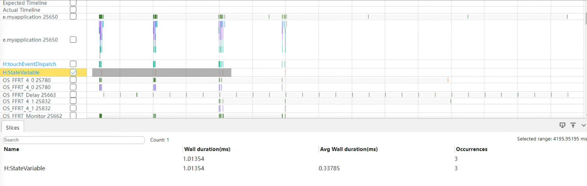
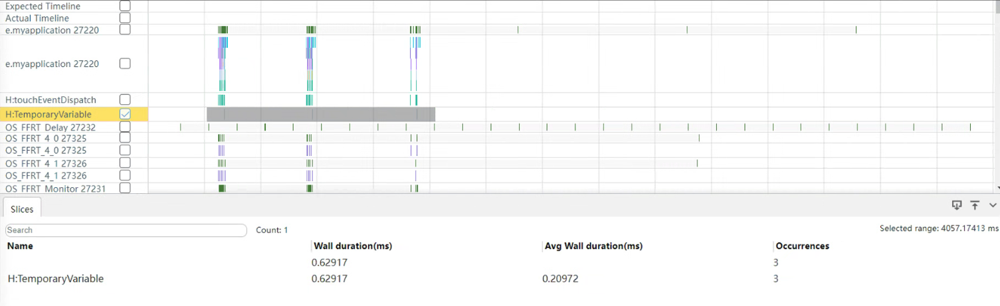

# Best Practices for State Management

<!--Del-->
> **Note:**
>
> Currently in the beta phase.
<!--DelEnd-->

To assist application developers in improving their application quality, particularly in efficient state management, this chapter presents several common inefficient development scenarios encountered when developing ArkUI applications, along with corresponding solutions. Additionally, it provides comparisons and explanations between recommended and non-recommended approaches for the same scenarios, visually demonstrating their differences. This helps developers learn how to correctly use state variables in application development for high-performance outcomes.

## Forcibly Updating Non-State Variable Associated Components Without Using State Variables

**Anti-pattern**

<!-- run -->

```cangjie
package ohos_app_cangjie_entry

import kit.ArkUI.*
import ohos.arkui.state_macro_manage.*
import kit.LocalizationKit.*
import std.collection.*
import kit.PerformanceAnalysisKit.Hilog

@Entry
@Component
class EntryView{
    @State var needsUpdate: Bool = true
    var realStateArr: ArrayList<Int64> = ArrayList<Int64>([4, 1, 3, 2])
    var realState: Color = Color(0xFFFF00)

    func updateUIArr(param: ArrayList<Int64>): ArrayList<Int64>{
        let triggerAGet: Bool = this.needsUpdate
        return param
    }

    func updateUI(param: Color): Color{
        let triggerAGet: Bool = this.needsUpdate
        return param
    }

    func build(){
        Column(space: 20){
            ForEach(this.updateUIArr(this.realStateArr), {item: Int64, _: Int64 => Text("${item}")})
            Text("add item")
            .onClick({ event =>
                // Changing realStateArr does not trigger UI view updates
                this.realStateArr.add(this.realStateArr[this.realStateArr.size - 1] + 1)

                // Trigger UI view updates
                this.needsUpdate = !this.needsUpdate
            })

            Text("chg color")
            .onClick({event =>
                // Changing realState does not trigger UI view updates
                match {
                    case this.realState.toUInt32() == Color(0xFFFF00).toUInt32() => this.realState = Color.Red
                    case this.realState.toUInt32() == Color.Red.toUInt32() => this.realState = Color(0xFFFF00)
                    case _ => Hilog.error(0, "test", "realState invalid")
                }

                // Trigger UI view updates
                this.needsUpdate = !this.needsUpdate
            })
        }
        .backgroundColor(this.updateUI(this.realState))
        .width(200).height(500)
    }
}
```

The above example has the following issues:

- The application attempts to control UI update logic, but in ArkUI, UI update logic should be implemented by the framework detecting changes in the application's state variables.
- `this.needsUpdate` is a custom UI state variable and should only be used for its bound UI components. Variables `this.realStateArr` and `this.realState` are not decorated, so their changes will not trigger UI refreshes.
- However, in this application, the user tries to update the regular variables `this.realStateArr` and `this.realState` by updating `this.needsUpdate`. This approach is unreasonable and results in poor update performance.

**Recommended Approach**

To resolve this issue, the member variables `realStateArr` and `realState` should be decorated with `@State`. Once this is done, the variable `needsUpdate` is no longer needed.

<!-- run -->

```cangjie
package ohos_app_cangjie_entry
import kit.ArkUI.*
import ohos.arkui.state_macro_manage.*
import kit.PerformanceAnalysisKit.Hilog

@Entry
@Component
class EntryView{
    @State var realStateArr: ObservedArrayList<Int64> = ObservedArrayList<Int64>([4, 1, 3, 2])
    @State var realState: Color = Color(0xFFFF00)

    func build(){
        Column(space: 20){
            ForEach(this.realStateArr, {item: Int64, _: Int64 => Text("${item}")})

            Text("add item")
            .onClick({event =>
                // Changing realStateArr triggers UI view updates
                this.realStateArr.append((this.realStateArr[this.realStateArr.size - 1] + 1))
            })

            Text("chg color")
            .onClick({event =>
                // Changing realState triggers UI view updates
                match {
                    case this.realState.toUInt32() == Color(0xFFFF00).toUInt32() => this.realState = Color.Red
                    case this.realState.toUInt32() == Color.Red.toUInt32() => this.realState = Color(0xFFFF00)
                    case _ => Hilog.error(0, "test", "realState invalid")
                }
            })
            .backgroundColor(this.realState)
            .width(200).height(500)
        }
    }
}
```

## Properly Control the Number of Components Associated with Object-Type State Variables

If a complex object is defined as a state variable, it is essential to control the number of components associated with it. When a member property of the object changes, all components associated with the object will refresh, even if they do not directly use the changed property. To avoid the performance impact of such "redundant refreshes," it is recommended to properly split the complex object and limit the number of components associated with it. For details, refer to [State Management Proper Usage Development Guide](cj-properly-use-state-management-to-develope.md).

## Avoid Frequent Reads of State Variables in Loops Such as `for` and `while`

In application development, avoid frequently reading state variables within loop logic; instead, read them outside the loop.

**Anti-pattern**

<!-- run -->

```cangjie
package ohos_app_cangjie_entry

import kit.ArkUI.*
import ohos.arkui.state_macro_manage.*
import kit.PerformanceAnalysisKit.Hilog

@Entry
@Component
class EntryView{
    @State var message: String = "message"

    func build(){
        Column(){
            Button("Click to log")
            .onClick({event=>
                for(i in 0..10 : 1){
                    Hilog.info(0, "AppLogCj", this.message)
                }
            })
            .width(90.percent)
            .backgroundColor(Color.Blue)
            .fontColor(Color.White)
            .margin(top: 10)
        }
        .justifyContent(FlexAlign.Start)
        .alignItems(HorizontalAlign.Center)
        .margin(top: 15)
    }
}
```

**Recommended Approach**

<!-- run -->

```cangjie
package ohos_app_cangjie_entry

import kit.ArkUI.*
import ohos.arkui.state_macro_manage.*
import kit.PerformanceAnalysisKit.Hilog

@Entry
@Component
class EntryView{
    @State var message: String = "message"

    func build(){
        Column(){
            Button("Click to log")
            .onClick({event=>
                let logMessage: String = this.message
                for(i in 0..10 : 1){
                    Hilog.info(0, "AppLogCj", logMessage)
                }
            })
            .width(90.percent)
            .backgroundColor(Color.Blue)
            .fontColor(Color.White)
            .margin(top: 10)
        }
        .justifyContent(FlexAlign.Start)
        .alignItems(HorizontalAlign.Center)
        .margin(top: 15)
    }
}
```

## Use Temporary Variables Instead of State Variables Where Possible

In application development, minimize direct assignments to state variables by performing data calculations with temporary variables.

When a state variable changes, ArkUI queries components dependent on that state variable and executes their update methods to render the components. By using temporary variables for calculations instead of directly manipulating state variables, ArkUI only queries and renders components once after the final state variable change, reducing unnecessary actions and improving application performance. For details on state variable behavior, refer to [@State Macro: Component Internal State](cj-macro-state.md).

**Anti-pattern**

<!-- run -->

```cangjie
package ohos_app_cangjie_entry

import kit.ArkUI.*
import ohos.arkui.state_macro_manage.*
import ohos.hi_trace_meter.HiTraceMeter

@Entry
@Component
class EntryView{
    @State var message: String = ""

    func appendMsg(newMsg: String){
        // Performance tracing
        HiTraceMeter.startTrace('StateVariable', 1)
        this.message += newMsg
        this.message += ";"
        this.message += "<br/>"
        HiTraceMeter.finishTrace('StateVariable', 1)
    }

    func build(){
        Column(){
            Button("Click to log")
            .onClick({event => this.appendMsg("Operate state variable")})
            .width(90.percent)
            .backgroundColor(Color.Blue)
            .fontColor(Color.White)
            .margin(top: 10)
        }
        .justifyContent(FlexAlign.Start)
        .alignItems(HorizontalAlign.Center)
        .margin(top: 15)
    }
}
```

Directly manipulating state variables triggers the calculation function three times, with the following runtime results:



**Recommended Approach**

<!-- run -->

```cangjie
package ohos_app_cangjie_entry

import kit.ArkUI.*
import ohos.arkui.state_macro_manage.*
import ohos.hi_trace_meter.HiTraceMeter

@Entry
@Component
class EntryView{
    @State var message: String = ""

    func appendMsg(newMsg: String){
        // Performance tracing
        HiTraceMeter.startTrace('StateVariable', 1)
        var message: String = this.message
        message += newMsg
        message += ";"
        message += "<br/>"
        this.message = message
        HiTraceMeter.finishTrace('StateVariable', 1)
    }

    func build(){
        Column(){
            Button("Click to log")
            .onClick({event => this.appendMsg("Operate state variable")})
            .width(90.percent)
            .backgroundColor(Color.Blue)
            .fontColor(Color.White)
            .margin(top: 10)
        }
        .justifyContent(FlexAlign.Start)
        .alignItems(HorizontalAlign.Center)
        .margin(top: 15)
    }
}
```

Using temporary variables instead of state variables for calculations triggers the calculation function three times, with the following runtime results:



Comparison between directly manipulating state variables and using temporary variables:

| Calculation Method | Time Consumption (Data varies by device and scenario, for reference only) | Description |
| :--- | :--- | :--- |
| Directly manipulating state variables | 1.01ms | Increases unnecessary ArkUI query and rendering actions, degrading performance |
| Using temporary variables | 0.63ms | Reduces unnecessary ArkUI actions, optimizing performance |