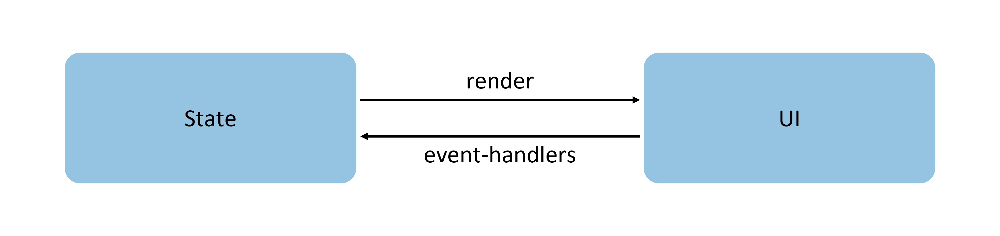

# State Management Overview

To build a dynamic and interactive interface, the concept of "state" must be introduced.

**Figure 1** Demonstration  


In the above example, user interaction with the application triggers a change in text state, which in turn causes UI rendering to update from "Hello World" to "Hello Cangjie."

In declarative UI programming frameworks, the UI is the runtime result of the program's state. Developers construct a UI model where the application's runtime states serve as parameters. When these parameters change, the UI, as the output, correspondingly updates. These runtime state changes that lead to UI re-rendering are collectively referred to as the state management mechanism in Cangjie.

Custom components can have variables, which must be decorated to become state variables. Changes to state variables trigger UI re-rendering. Without state variables, the UI can only render during initialization and will not refresh afterward. The diagram below illustrates the relationship between State and View (UI).



- **View (UI)**: UI rendering, which maps the UI descriptions within the `build` method and `@Builder` decorated methods to the interface.
- **State**: The data that drives UI updates. Users modify state data by triggering component event methods, and changes to state data cause the UI to re-render.

Before reading the state management documentation, developers should have a basic understanding of UI paradigm syntax. It is recommended to review the following topics first: Basic Syntax Overview, Declarative UI Description, and Custom Components - Creating Custom Components.

## Basic Concepts

- **State Variable**: A variable decorated with a state decorator. Changes to its value trigger UI re-rendering. Example: `@State var num: Int32 = 1`, where `@State` is the state decorator and `num` is the state variable.
- **Regular Variable**: A variable not decorated with a state decorator, typically used for auxiliary calculations. Changes to it never trigger UI updates. In the example below, `increaseBy` is a regular variable.
- **Data Source/Sync Source**: The original source of a state variable, which can synchronize with different state data. Usually refers to data passed from a parent component to a child component. In the example below, the data source is `count: 1`.
- **Named Parameter Mechanism**: The primary method for passing state variables from parent to child components. Example: `CompA(aProp: this.aProp)`.
- **Initialization from Parent Component**: The parent component uses the named parameter mechanism to pass specified parameters to the child component. The child component's default initialization values are overridden if the parent provides values. Example:

<!-- run -->

```cangjie
package ohos_app_cangjie_entry
import kit.ArkUI.*
import ohos.arkui.state_macro_manage.*

@Component
class MyComponent {
    @State var count: Int32 = 0
    private var increaseBy: Int32 = 1
    func build() {}
}
@Entry
@Component
class Parent {
    func build() {
        Column() {
            // Initialize from parent component, overriding locally defined defaults
            MyComponent(count: 1, increaseBy: 2 )
        }
    }
}
```

- **Child Component Initialization**: State variables from the parent component can be passed to initialize corresponding state variables in the child component. Example as above.
- **Local Initialization**: Assigning a value during variable declaration as the default value. Example: `@State count: Int32 = 0`.

> **Note:**
>
> Current state management features are only supported in the UI main thread and cannot be used in child threads, workers, or taskpools.

## State Management (V1)

Developers can choose to use State Management V1 for application development.

### Decorator Overview

Cangjie State Management V1 provides various decorators. By using these decorators, state variables can observe changes not only within a component but also across different component hierarchies, such as parent-child components or cross-component levels, and even observe global changes. Based on the scope of state variables, decorators can be broadly categorized as:

- **Component-Level State Decorators**: Manage state within a component, observing variable changes within the same component tree (i.e., the same page) or across different component hierarchies.
- **Application-Level State Decorators**: Manage state across the application, observing changes across different pages or even different UIAbilities, providing global state management within the application.

From the perspective of data transfer and synchronization types, decorators can also be divided into:

- **Read-Only Unidirectional Transfer**;
- **Mutable Bidirectional Transfer**.

The diagram below illustrates this. For detailed descriptions of specific decorators, refer to [Managing Component-Owned State](./cj-macro-state.md) and [Managing Application-Owned State](./cj-application-state-management-overview.md). Developers can flexibly leverage these capabilities to achieve data-UI linkage.


[Managing Component-Owned State](./cj-macro-state.md), i.e., Components-level state management in the diagram:

- [@State](./cj-macro-state.md): Variables decorated with `@State` own their component's state and can serve as unidirectional or bidirectional synchronization sources for their child components. Changes to their values trigger re-rendering of related components.
- [@Prop](./cj-macro-prop.md): Variables decorated with `@Prop` can establish unidirectional synchronization with parent components. These variables are mutable, but changes are not synchronized back to the parent.
- [@Link](./cj-macro-link.md): Variables decorated with `@Link` can establish bidirectional synchronization with parent components. Changes in child components are synchronized to the parent's data source, and parent updates are synchronized to the `@Link` variable.
- [@Provide/@Consume](./cj-macro-provide-and-consume.md): Variables decorated with `@Provide/@Consume` are used for cross-component hierarchy (multi-level components) state synchronization, bypassing the named parameter mechanism via aliases or property name binding.
- [@Observed](./cj-macro-observed-and-publish.md): Decorates a class. Classes requiring observation in nested scenarios must be decorated with `@Observed`. Alone, `@Observed` has no effect; it must be used with `@Publish`.
- [@Publish](./cj-macro-observed-and-publish.md): Variables decorated with `@Publish` receive instances of `@Observed`-decorated classes, enabling observation of nested scenarios and bidirectional synchronization with parent component data sources.

> **Note:**
>
> Only [@Observed/@Publish](./cj-macro-observed-and-publish.md) can observe nested scenarios. Other state variables can only observe the first layer. For details, refer to the "Observing Changes and Behavior" sections in each decorator chapter.

[Managing Application-Owned State](./cj-application-state-management-overview.md), i.e., Application-level state management in the diagram:

- [AppStorage](./cj-appstorage.md) is a special singleton [LocalStorage](./cj-localstorage.md) object in the application, serving as an application-level database bound to the process. It interacts with components via [@StorageProp](./cj-appstorage.md#StorageProp) and [@StorageLink](./cj-appstorage.md#StorageLink) decorators.
- AppStorage acts as the "hub" for application state, storing data that interacts with components (UI), such as persistent data [PersistentStorage](./cj-persiststorage.md) and environment variables [Environment](./cj-environment.md). The UI accesses this data through decorators or APIs provided by AppStorage.
- The framework also provides LocalStorage, where AppStorage is a special singleton. LocalStorage is an in-memory "database" for application state, typically used for page-level state sharing, and interacts with the UI via [@LocalStorageProp](./cj-localstorage.md#LocalStorageProp) and [@LocalStorageLink](./cj-localstorage.md#LocalStorageLink) decorators.

### Other State Management V1 Features

[@Watch](./cj-macro-watch.md) is used to listen for changes in state variables.