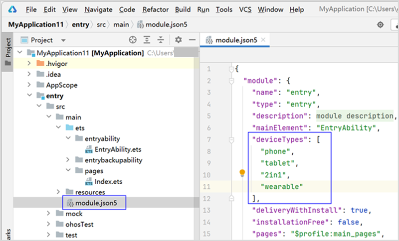

# Using the Cangjie Module in ArkTS Applications

## Overview

The Cangjie program runs on a lightweight runtime while delivering excellent performance in high-performance and high-concurrency scenarios. Cangjie supports cross-language interoperability with ArkTS, enabling the use of Cangjie modules in ArkTS applications to enhance overall application performance.

## Usage Guide

Cangjie recommends implementing the use of Cangjie modules in ArkTS applications through "declarative interoperation macros." This section provides operational guidance for this approach.

### Adding a Cangjie Module to an ArkTS Project

Supported SDK versions: API 12 and above.  
Supported device types:  
- For ArkTS (with C++) HAP modules: phone, tablet, 2in1  
- For ArkTS (with C++) HAR modules: default, phone, tablet, 2in1  

If the current HAP module supports device types other than phone, tablet, or 2in1, or if the HAR module supports device types other than default, phone, tablet, or 2in1, remove the unsupported device types from the `deviceTypes` field in the module.json5 file of the HAP or HAR module. Modify it to the supported device type format (e.g., remove the wearable device as shown in the figure below) before proceeding with the creation and insertion of the Cangjie module content.



1. As shown in the figure below, select any file in the ArkTS (with C++) HAP or HAR module, then choose **File -> New -> Cangjie(Interop)**, or right-click and select **New -> Cangjie(Interop)**.

   

2. Click the **Cangjie(Interop)** button to complete the creation and insertion of the Cangjie module content in the ArkTS (with C++) HAP or HAR module.

   

### Implementing the Cangjie Interoperation Module

After successfully inserting the Cangjie interoperation module into the ArkTS project, sample code will be automatically generated. The code logic is as follows:

1. Import the interoperation library `ark_interop` and interoperation macros.

2. Implement a Cangjie function named `addF64` and decorate it with `@Interop[ArkTS]`. A simple example of the Cangjie module is as follows:

   <!-- compile -->

   ```cangjie
   package ohos_app_cangjie_entry

   // Import the interoperation library ark_interop and interoperation macros
   internal import ohos.ark_interop.JSModule
   internal import ohos.ark_interop.JSContext
   internal import ohos.ark_interop.JSCallInfo
   internal import ohos.ark_interop.JSValue
   internal import cj_res_entry.app

   // User-defined function addF64, which takes two numbers as input and returns their sum
   @Interop[ArkTS]
   public func addF64(a: Float64, b!: Float64): Float64 {
       a + b
   }
   ```

3. Open the aforementioned Cangjie file in DevEco Studio. Right-click in the file editor and select **Generate... > Cangjie-ArkTS Interop API**. This will generate the following files:
   - In the **cangjie->types->libohos_app_cangjie_entry** directory: `Index.d.ts` declaration file and `oh_package.json5` configuration file.
   - In the **cangjie -> ark_interop_api** directory: `ark_interop_api.d.ts` declaration file and `oh_package.json5` configuration file.
   - Automatically add dependencies to the `oh-package.json5` file in the HAP or HAR module:

    > **Note:**
    >
    > The `ark_interop_api` directory is generated for compatibility with applications that need to run on OpenHarmony 5.0.x. If there are no compatibility requirements, this directory can be ignored.

   ```json
   "dependencies": {
     ...
     "libohos_app_cangjie_entry.so": "file:./src/main/cangjie/types/libohos_app_cangjie_entry",
     "libark_interop_api.so": "file:./src/main/cangjie/ark_interop_api",
     ...
   }
   ```

> **Note: The Cangjie interoperation module must not be imported by other modules. Otherwise, the imported content may be missing when ArkTS imports the interoperation module.**

### Loading the Cangjie Module in ArkTS

After implementing the Cangjie interoperation module, import the `ohos_app_cangjie_entry` module in ArkTS code to load the custom Cangjie interoperation module and call its interfaces.

```typescript
// Load the custom Cangjie interoperation module
import cjLib from "libohos_app_cangjie_entry.so"
```

### Calling Cangjie Interfaces

Once the custom Cangjie interoperation module is successfully loaded, you can call the interfaces provided by the module in the ArkTS project.

The following example demonstrates calling the `addF64` function provided by the Cangjie interoperation module in an ArkTS application:

```typescript
// Call the Cangjie interface
console.log("result " + cjLib.addF64(1, 2))
```