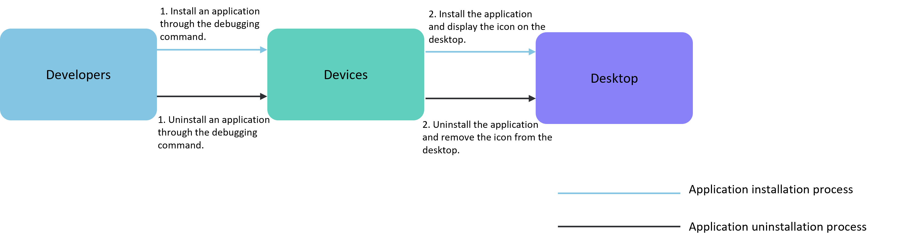
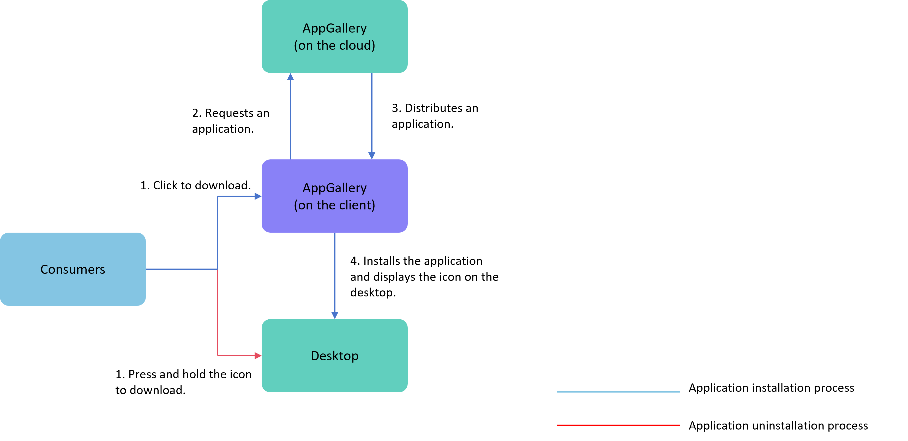

# Application Installation, Uninstallation, and Update Development Guide

This chapter introduces the installation/uninstallation process of application packages and two update methods.

## Application Package Installation and Uninstallation

Developers can install and uninstall applications using debugging commands. For installation commands, refer to the [install](../../tools/cj-bm-tool.md#installation-command-install) section in the bm tool. For uninstallation commands, refer to the [uninstall](../../tools/cj-bm-tool.md#uninstallation-command-uninstall) section in the bm tool. For details, see the [Compilation, Release, and Deployment Flowchart](./application-package-structure-stage.md#released-package-structure).

**Figure 1** Application Package Installation and Uninstallation Process (Developer)

After an application is released on the app market, end users can install and uninstall the application on their devices via the app market.

**Figure 2** Application Package Installation and Uninstallation Process (End User)

## Application Package Updates

For developers, updating an application package first requires modifying the `versionCode` field in the [app.json5 configuration file](./app-configuration-file.md#appjson5-configuration-file). After packaging with DevEco Studio, the update is released on the app market, following the same process as the initial release. For end users, after a new version is released, the application package can be updated through the following methods:

- Update via the app market: The app market notifies users about the availability of a new version, and users can proceed to upgrade via the app market (client).