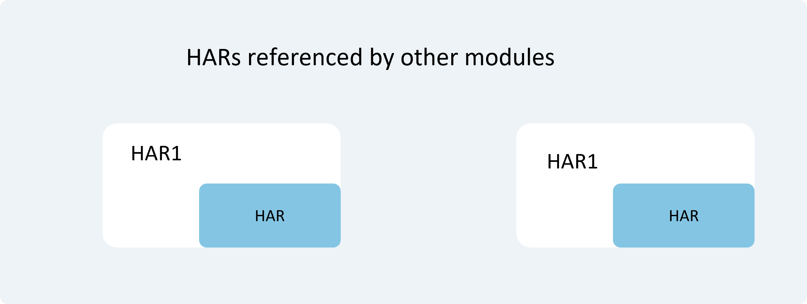

# Application Package Overview

Before developing applications based on the [Stage Model](application-configuration-file-overview-stage.md#application-configuration-file-overview-stage-model), developers need to understand fundamental concepts such as the application design mechanism and application package structure.

## Applications and Application Packages

A user application refers to a program that runs on a device's operating system and provides specific services to users, commonly referred to as an "app." The software package file corresponding to an application is called an "application package."

The system provides mechanisms for managing the development, installation, querying, updating, and uninstallation of application packages, facilitating developers in developing and managing applications. Additionally, the system abstracts differences across chip platforms (including x86/ARM, 32-bit/64-bit, etc.), ensuring that application packages can be installed and run on different chip platforms. This allows developers to focus on implementing application functionality.

## Multi-Module Design Mechanism for Applications

- **Support for Modular Development:** An application typically includes multiple features. Dividing and managing different functionalities by modules is a sound design approach. During development, developers can treat each functional module as an independent Module, which may contain source code, resource files, third-party libraries, configuration files, etc. Each Module can be compiled independently to achieve specific functionalities. This modular, loosely coupled approach to application management benefits development, maintenance, and scalability.

- **Support for Multi-Device Adaptation:** An application often needs to adapt to multiple device types. In applications designed with multiple Modules, each Module is labeled with the device types it supports. Some Modules support all device types, while others support only specific types (e.g., tablets). When distributing application packages in the app market, precise filtering and matching can be performed based on device types, enabling the rational combination and deployment of different packages to corresponding devices.

## Module Types

Modules can be categorized into two types based on usage scenarios:

- **Ability-Type Modules:** Used to implement application functionalities and features. Each Ability-type Module, after compilation, generates a file with the `.hap` suffix, called a HAP (Harmony Ability Package). A HAP can be installed and run independently and serves as the basic unit of application installation. An application may contain one or more HAPs, which are further divided into the following types:
    - **Entry-Type Module:** The main module of an application, containing the entry interface, entry icon, and primary functionalities. It compiles into an entry-type HAP. Each application distributed to the same type of device can include only one entry-type HAP or none at all.
    - **Feature-Type Module:** A dynamic feature module of an application, compiling into a feature-type HAP. An application may contain one or more feature-type HAPs or none.

- **Library-Type Modules:** Used to share code and resources. The same Library-type Module can be referenced multiple times by other Modules. Proper use of this type of Module reduces development and maintenance costs. Library-type Modules are static and generate shared packages after compilation.
    - **Static Library:** A static shared library. After compilation, it generates a file with the `.har` suffix, called a HAR (Harmony Archive).

  Characteristics of HAR Shared Packages:

  | Shared Package Type | Compilation and Runtime Behavior | Distribution and Reference Method |
  | ------------------- | -------------------------------- | --------------------------------- |
  | HAR                 | Code and resources in HAR are compiled with the referencing Module. If multiple Modules reference the same HAR, their compiled outputs will contain duplicate copies. Note: When [compiling HAR](har-package.md#compilation), it is recommended to enable obfuscation to protect code assets. | HAR can be referenced within an application or packaged and distributed independently for use by other applications. |

  **Figure 1** Schematic Diagram of HAR in an APP Package

  

## Choosing the Appropriate Package Type

The functionalities and usage scenarios of HAP and HAR are summarized and compared below:

| Module Type | Package Type | Description |
| ----------- | ------------ | ----------- |
| Ability     | [HAP](hap-package.md) | Functional module of an application, which can be installed and run independently. |
| Static Library | [HAR](har-package.md) | Static shared package, reusable at compile time.  - Supports intra-application sharing and can be distributed as a second-party (SDK) or third-party (SDK) library for use by other applications.  &ensp; - As a second-party SDK, it can be published to the [OHPM Private Repository](https://developer.huawei.com/consumer/cn/doc/harmonyos-guides/ide-ohpm-repo) for internal use within the company.  &ensp; - As a third-party SDK, it can be published to the [OHPM Central Repository](https://ohpm.openharmony.cn/) for use by other applications.  - When multiple packages (HAPs) reference the same HAR, duplicate copies of code and resources may increase the application package size.  - Note: When [compiling HAR](har-package.md#compilation), it is recommended to enable obfuscation to protect code assets. |

The supported specifications of HAP and HAR are compared below, where "√" indicates support and "×" indicates no support.

Developers can choose the appropriate package type based on specific application requirements. Subsequent chapters will provide detailed introductions on how to use [HAP](hap-package.md) and [HAR](har-package.md).

| Specification | HAP | HAR |
| ------------- | --- | --- |
| Supports declaring [UIAbility](../../application-models/cj-uiability-overview.md) components in the configuration file | √ | √ |
| Supports including resource files and `.so` files | √ | √ |
| Supports referencing other HAR files | √ | √ |
| Supports independent installation and runtime on devices | √ | × |

> **Note:**
>
> - HAR does not support circular dependencies or transitive dependencies. For details, refer to the constraints and limitations in [HAR](har-package.md#constraints-and-limitations).