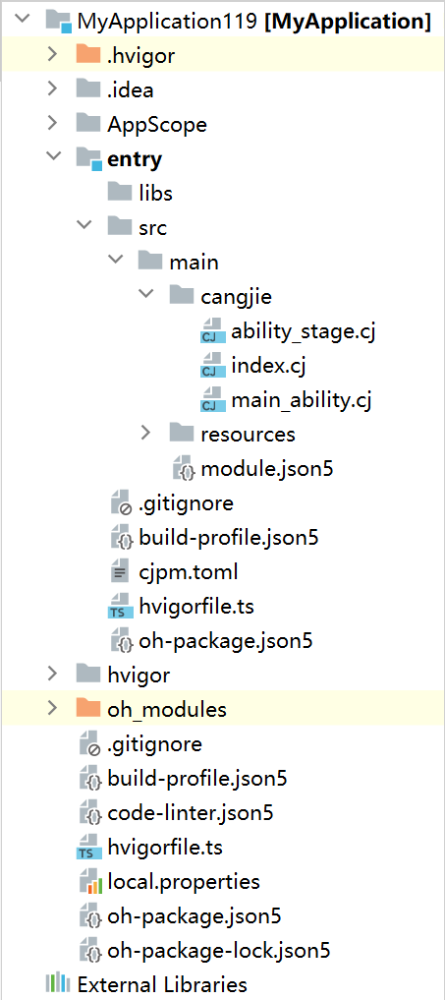
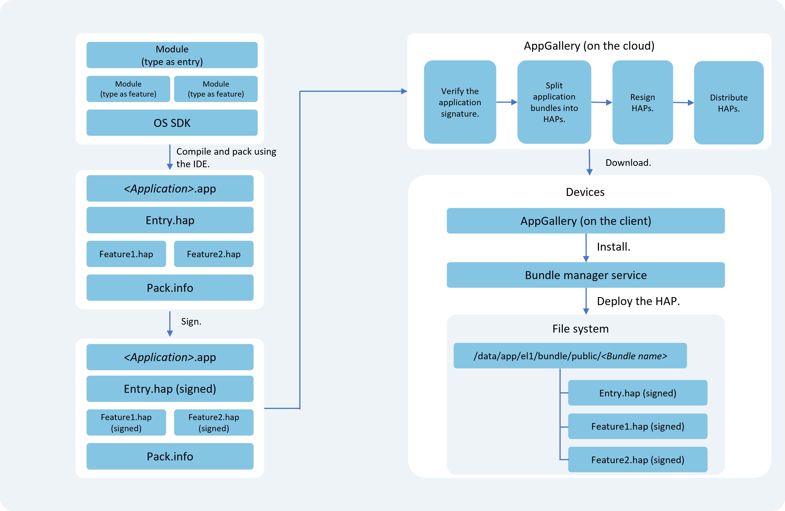

# Stage Model Application Package Structure

To provide developers with a clearer understanding of application package forms at different stages, this document introduces the application structures in development state, compilation state, and release state respectively.

## Development State Package Structure

Create a project in DevEco Studio and attempt to create multiple Modules of different types. Comparing the actual project directories with this section will help understand the application structure in development state.

**Figure 1** Project Structure Diagram (subject to actual project)

> **Note:**
>
> - The AppScope directory is automatically generated by DevEco Studio. Changing its name may cause configuration files and resources in this directory to fail loading, resulting in compilation errors. Therefore, do not modify this directory name.
> - Module directory names can be automatically generated by DevEco Studio (e.g., entry, library) or customized. For illustration purposes, Module_name is uniformly used in the following table.

The main file types and their purposes in the project structure are as follows:

| File Type   | Description |
|--------|---------------|
| Configuration Files   | Include application-level and Module-level configuration information:  - **AppScope &gt; app.json5**: [app.json5 configuration file](app-configuration-file.md#app.json5配置文件), used to declare global application configuration information such as bundle name, application name, application icon, and version number.  - **Module_name &gt; src &gt; main &gt; module.json5**: [module.json5 configuration file](module-configuration-file.md#module.json5配置文件), used to declare Module basic information, supported device types, component information, and required permissions. |
| Cangjie Source Files | **Module_name &gt; src &gt; main &gt; cangjie**: Stores Module's Cangjie source files (.cj files). |
| Resource Files   | Include application-level and Module-level resource files, supporting graphics, multimedia, strings, layout files, etc. For details, see [Resource Classification and Access](../start/ide-resource-categories-and-access.md#资源分类与访问).  - **AppScope &gt; resources**: Stores resource files required by the application.  - **Module_name &gt; src &gt; main &gt; resources**: Stores resource files required by the Module.                                                                      |
| Other Configuration Files | Used for compilation and building, including build configuration files, compilation task scripts, and dependency information.  - **build-profile.json5**: Project-level<!--add link--> or Module-level<!--add link--> build configuration file, including [application signing](https://developer.huawei.com/consumer/cn/doc/harmonyos-guides/ide-signing) and product configuration.  - **hvigorfile.ts**: Project-level or Module-level compilation task script, allowing developers to customize build tool versions and configuration parameters.  - **[oh-package.json5](https://developer.huawei.com/consumer/cn/doc/harmonyos-guides/ide-oh-package-json5)**: Stores dependency library information, including third-party libraries and shared packages. |

## Compilation State Package Structure

Different types of Modules generate corresponding HAP, HAR, and other files after compilation. The comparison between development state and compilation state views is as follows:

**Figure 2** Project Structure Views: Development State vs. Compilation State

From development state to compilation state, Module file changes include:

- **libs directory**: Cangjie source files are compiled into .so files.
- **resources directory**: Resource files from the AppScope directory are merged into the Module's resource directory. If duplicate files exist, only the AppScope directory's resources are retained.
- **Module configuration file**: Fields from the AppScope's app.json5 file are merged into the Module's module.json5 file, generating the final module.json file in the HAP.

> **Note:**
>
> When compiling HAPs, their dependent HARs are directly compiled into the HAPs.

## Release State Package Structure

Each application must contain at least one .hap file. All .hap files in an application together form a **Bundle**, whose bundleName serves as the application's unique identifier (see the bundleName tag in [app.json5 configuration file](app-configuration-file.md#app.json5配置文件)).

When publishing to an app store, the Bundle is packaged into an .app file for release, called an **App Pack** (Application Package). DevEco Studio automatically generates a **pack.info** file, which describes each HAP's attributes in the App Pack, including the APP's bundleName and versionCode, as well as the Module's name, type, and abilities.

> **Note:**
>
> - The App Pack is the basic unit for app store release but cannot be directly installed or run on devices.
> - During [application signing](https://developer.huawei.com/consumer/cn/doc/harmonyos-guides/ide-signing), cloud distribution, or device-side installation, signing, distribution, and installation are performed at the HAP level.

**Figure 3** Compilation, Release, and Deployment Flowchart

