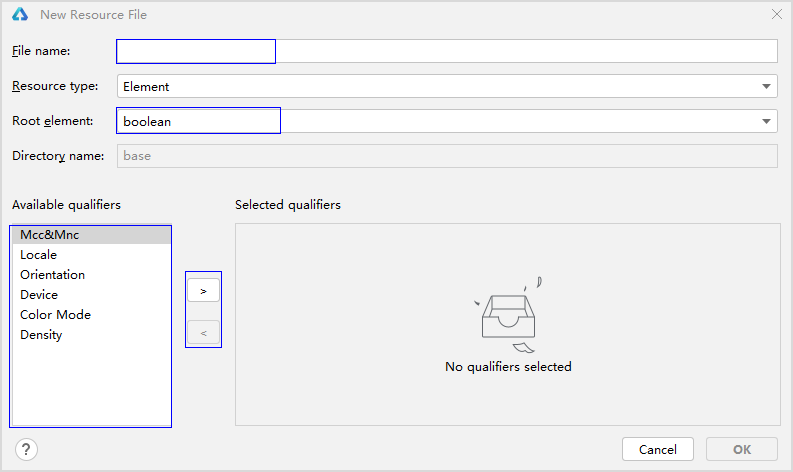
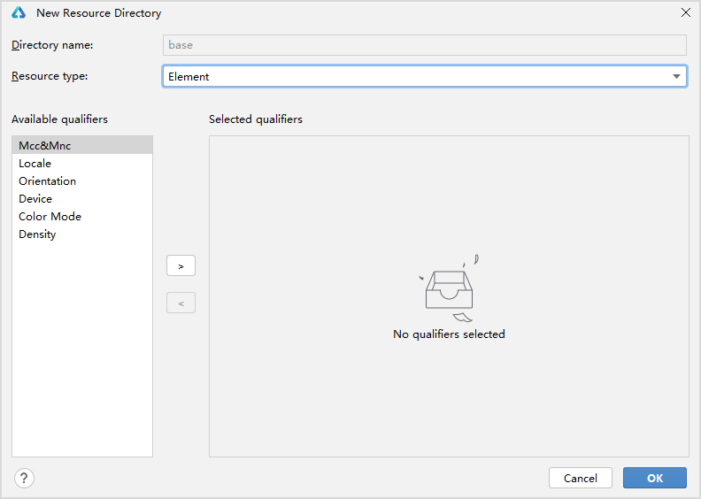

# Resource Classification and Access

During application development, resources such as colors, fonts, spacing, and images are frequently required. These resource values may vary across different devices or configurations.

- **Application Resources**: Utilizing resource file capabilities, developers can customize resources within applications and manage their behavior across different devices or configurations.
- **System Resources**: Developers directly use system-preset resource definitions (i.e., layered parameters, where the same resource ID may have different values under various configurations such as device type or dark/light mode).

## Resource Classification

Various resource files used in application development need to be stored and managed in specific subdirectories. The example below illustrates resource directories, where the `base` directory, qualifier directories, `rawfile` directory, and `resfile` directory are referred to as resource directories, while `element`, `media`, and `profile` are termed resource group directories.

> **Note:**
>
> In the stage model with multiple projects, shared resource files will be placed in the `resources` directory under `AppScope`.

Example of resource directories:

```text
resources
|---base
|   |---element
|   |   |---string.json
|   |---media
|   |   |---icon.png
|   |---profile
|   |   |---test_profile.json
|---en_US  // Default directory, prioritized when the device locale is US English
|   |---element
|   |   |---string.json
|   |---media
|   |   |---icon.png
|   |---profile
|   |   |---test_profile.json
|---zh_CN  // Default directory, prioritized when the device locale is Simplified Chinese
|   |---element
|   |   |---string.json
|   |---media
|   |   |---icon.png
|   |---profile
|   |   |---test_profile.json
|---en_GB-vertical-car-mdpi // Example of a custom qualifier directory, created by developers
|   |---element
|   |   |---string.json
|   |---media
|   |   |---icon.png
|   |---profile
|   |   |---test_profile.json
|---rawfile
|---resfile // Can freely store various resource files, created by developers
```

### Resource Directories

**Base Directory**

The `base` directory is a default directory where the subdirectory `element` stores basic elements such as strings, colors, and boolean values, while `media` and `profile` store media, animations, layout files, and other resources.

Resource files in this directory are compiled into binary files and assigned resource IDs. They are referenced by specifying the resource type (`type`) and resource name (`name`).

**Qualifier Directories**

`en_US` and `zh_CN` are the two default qualifier directories. Other qualifier directories must be created by developers as needed. The subdirectories `element`, `media`, and `profile` store basic elements like strings, colors, and boolean values, as well as media, animations, and layout files.

Similarly, resource files in these directories are compiled into binary files and assigned resource IDs. They are referenced by specifying the resource type (`type`) and resource name (`name`).

**Naming Requirements for Qualifier Directories**

Qualifier directories can be composed of one or more qualifiers representing application scenarios or device characteristics, including Mobile Country Code (MCC) and Mobile Network Code (MNC), language, script, country or region, screen orientation, device type, color mode, and screen density. Qualifiers are connected using underscores (`_`) or hyphens (`-`). Developers must adhere to the naming rules when creating qualifier directories.

- **Order of Qualifiers**: `_MCC_MNC-language_script_country_or_region-screen_orientation-device_type-color_mode-screen_density_`. Developers can select one or more qualifiers to form the directory name based on the application's usage scenarios and device characteristics.
- **Connector Rules**: Use underscores (`_`) between language, script, and country or region, as well as between MCC and MNC. For all other qualifiers, use hyphens (`-`). For example: **zh_Hant_CN**, **zh_CN-car-ldpi**.
- **Valid Values for Qualifiers**: Each qualifier must comply with the conditions specified in the qualifier value table below. Otherwise, resource files in the directory cannot be matched.

| **Qualifier Type**            | **Description and Value Rules** |
| ----------------------- | -------------------------------------------------------- |
| Mobile Country Code (MCC) and Mobile Network Code (MNC) | MCC and MNC values are derived from the device's registered network.<br>MCC can be used alone or combined with MNC using an underscore (`_`). For example: `mcc460` represents China, and `mcc460_mnc00` represents China_China Mobile.<br>For detailed value ranges, refer to <a href="https://www.itu.int/rec/T-REC-E.212">ITU-T E.212</a> (ITU standards). |
| Language | Represents the language used by the device, consisting of 2–3 lowercase letters. For example: `zh` for Chinese, `en` for English, `mai` for Maithili.<br>For detailed value ranges, refer to <a href="https://www.iso.org/iso-639-language-code">ISO 639</a> (ISO language code standard). |
| Script | Represents the script used by the device, consisting of 1 uppercase letter (initial) and 3 lowercase letters. For example: `Hans` for Simplified Chinese, `Hant` for Traditional Chinese.<br>For detailed value ranges, refer to <a href="https://www.iso.org/standard/81905.html">ISO 15924</a> (ISO script code standard). |
| Country or Region | Represents the user's country or region, consisting of 2–3 uppercase letters or 3 digits. For example: `CN` for China, `GB` for the UK.<br>For detailed value ranges, refer to <a href="https://www.iso.org/iso-3166-country-codes.html">ISO 3166-1</a> (ISO country and region code standard). |
| Screen Orientation | Represents the device's screen orientation, with the following values:<br>- `vertical`: Portrait.<br>- `horizontal`: Landscape. |
| Device Type | Represents the device type, with the following values:<br>- `car`: In-vehicle system.<br>- `tablet`: Tablet.<br>- `tv`: Smart screen.<br>- `wearable`: Wearable device. |
| Color Mode | Represents the device's color mode, with the following values:<br>- `dark`: Dark mode.<br>- `light`: Light mode. |
| Screen Density | Represents the device's screen density (in dpi), with the following values:<br>- `sdpi`: Small-scale Dots Per Inch, for devices with dpi in (0, 120].<br>- `mdpi`: Medium-scale Dots Per Inch, for devices with dpi in (120, 160].<br>- `ldpi`: Large-scale Dots Per Inch, for devices with dpi in (160, 240].<br>- `xldpi`: Extra Large-scale Dots Per Inch, for devices with dpi in (240, 320].<br>- `xxldpi`: Extra Extra Large-scale Dots Per Inch, for devices with dpi in (320, 480].<br>- `xxxldpi`: Extra Extra Extra Large-scale Dots Per Inch, for devices with dpi in (480, 640]. |

**Rawfile Directory**

Supports creating multi-level subdirectories with custom names. Various resource files can be freely placed in these directories.

Resource files in this directory are directly packaged into the application without compilation or resource ID assignment. They are referenced by specifying the file path and name.

**Resfile Directory**

Supports creating multi-level subdirectories with custom names. Various resource files can be freely placed in these directories.

Resource files in this directory are directly packaged into the application without compilation or resource ID assignment. After installation, `resfile` resources are extracted to the application sandbox path. The `resfile` resource directory can be accessed via the `Context` property `resourceDir`, and resources can be accessed by file path.

### Resource Group Directories

Resource group directories include `element`, `media`, and `profile`, which store specific types of resources.

The table below describes these directories.

| **Directory Type** | **Description** | **Resource Files** |
| ---------- | ------------------------- | --------------------------------- |
| element  | Represents element resources. Each type of data is represented by a corresponding JSON file (only file types are supported in this directory).<br>- `boolean`: Boolean<br>- `color`: Color<br>- `float`: Floating-point (range: -2^128 to 2^128)<br>- `intarray`: Integer array<br>- `integer`: Integer (range: -2^31 to 2^31-1)<br>- `plural`: Plural forms<br>- `strarray`: String array<br>- `string`: String | File names in the `element` directory should match the following. Each file can only contain data of the same type.<br>- `boolean.json`<br>- `color.json`<br>- `float.json`<br>- `intarray.json`<br>- `integer.json`<br>- `plural.json`<br>- `strarray.json`<br>- `string.json` |
| media    | Represents media resources, including non-text files such as images, audio, and video (only file types are supported in this directory).<br>Image and audio/video types are described in Tables 4 and 5. | File names can be customized, e.g., `icon.png`. |
| profile  | Represents custom configuration files, whose content can be retrieved via package management interfaces (only JSON files are supported in this directory). | File names can be customized, e.g., `test_profile.json`. |

**Media Resource Types**

Image resource types are listed below.

| Format | File Extension |
| ---- | ---------- |
| JPEG | .jpg       |
| PNG  | .png       |
| GIF  | .gif       |
| SVG  | .svg       |
| WEBP | .webp      |
| BMP  | .bmp       |

Audio and video resource types are listed below.

| Format                  | Supported File Types |
| --------------------- | -------------- |
| H.264 AVC             | .3gp           |
| Baseline Profile (BP) | .mp4           |

**Resource File Examples**

Example of `color.json`:

```json
{
    "color": [
        {
            "name": "color_hello",
            "value": "#ffff0000"
        },
        {
            "name": "color_world",
            "value": "#ff0000ff"
        }
    ]
}
```

Example of `float.json`:

```json
{
    "float":[
        {
            "name":"font_hello",
            "value":"28.0fp"
        },
    {
            "name":"font_world",
            "value":"20.0fp"
        }
    ]
}
```

Example of `string.json`:

```json
{
    "string":[
        {
            "name":"string_hello",
            "value":"Hello"
        },
        {
            "name":"string_world",
            "value":"World"
        },
        {
            "name":"message_arrive",
            "value":"We will arrive at %1$s."
        },
        {
          "name":"message_notification",
          "value":"Hello, %1$s!,You have %2$d new messages"
        }
    ]
}
```

Example of `plural.json`:

```json
{
    "plural":[
        {
            "name":"eat_apple",
            "value":[
                {
                    "quantity":"one",
                    "value":"%d apple"
                },
                {
                    "quantity":"other",
                    "value":"%d apples"
                }
            ]
        }
    ]
}
```

## Creating Resource Directories and Files

Under the `resources` directory, developers can create resource directories and resource group directories according to the qualifier naming rules and supported file types, and add specific types of resources. DevEco Studio supports creating both directories and files simultaneously, or separately.

### Creating Resource Directories and Files

Right-click the `resources` directory and select **New > Resource File** to create both a resource directory and file. Files are created in the corresponding resource group under the `base` directory by default. If a qualifier is selected, the qualifier and resource group directories are automatically generated, and the file is placed in the qualifier directory.

In the dialog, **File name** is the name of the file to be created. **Resource type** defaults to `Element`. **Root element** is the resource type. **Available qualifiers** lists qualifier directories, which can be added or removed using the arrows on the right.

The directory name is automatically generated in the format "qualifier.resource_group". For example, creating an `element` directory with the qualifier `dark` generates the directory name "dark.element".



### Creating Resource Directories

Right-click the `resources` directory and select **New > Resource Directory** to create a resource directory, defaulting to the `base` directory. If a qualifier is selected, the qualifier and resource group directories are automatically generated. After selecting the qualifier, choose the resource group type (`Element`, `Media`, or `Profile`) to create the directory.



### Creating Resource Files

Right-click the `base > element` directory and select **New > Element Resource File** to create an element resource file.


## Resource Translation Features

### Functionality

To mark strings for translation, use the `attr` attribute to specify translation scope and status. The `attr` attribute does not participate in resource compilation but only marks whether a string should be translated.

If `attr` is not configured, the default is translatable.

```json
"attr": {
  "translatable": false|true
  "priority": "code|translate|LT|customer"
}
```

**Supported Attributes in `attr`**

| **Name** | **Type** | **Description** |
| ---------- | ------------------------- | --------------------------------- |
| translatable  | boolean | Marks whether a string should be translated.<br>`true`: Requires translation.<br>`false`: Does not require translation. |
| media  | Represents media resources, including non-text files such as images, audio, and video (only file types are supported in this directory).<br>Image and audio/video types are described in Tables 4 and 5. | File names can be customized, e.g., `icon.png`. |
| priority  | string | Marks the translation status.<br>`code`: Untranslated.<br>`translate`: Translated but unverified.<br>`LT`: Verified translation.<br>`customer`: Customized by the user. |

### Usage Constraints

Translation features are enabled for the following resource types in the `base` directory: `string`, `strarray`, and `plural`.

```text
resources
|---base
|   |---element
|   |   |---string.json
|   |   |---strarray.json
|   |   |---plural.json
```

### Example

Example of `string` resource with `attr` attributes:

```json
{
  "string": [
    {
      "name": "string1",
      "value": "1",
      "attr": {
        "translatable": false
      }
    },
    {
      "name": "string2",
      "value": "Hello world!",
      "attr": {
        "translatable": true,
        "priority": "LT"
      }
    }
  ]
}
```

## Resource Access

### Application Resources

Each resource defined in the resource files is assigned a unique ID when a new project is created. The mappings between resource names and their corresponding IDs are stored in the `cj_res_entry` package of the `cj_res_entry` module, which includes two main classes: `sys` and `app`. These correspond to the system default resources and the developer-modifiable resources in the `resource` directory, respectively.

- For resources, import the resource management module in the project via `import kit.LocalizationKit.*`, and then access specific content using the format `@r(app.type.name)`. Here, `app` refers to resources defined in the `resources` directory; `type` represents the resource type or storage location; and `name` is the resource name, determined by the developer when defining the resource.

  For cases with multiple placeholders in `string.json`, access them using the format `@r(app.string.label, 'aaa', 1, 1.0)`.

- For resources in the `rawfile` directory, reference them using the format `@rawfile("filename")`. Here, `filename` is the relative path of the file under the `rawfile` directory, including the file extension, and the path must not start with "/".

- For descriptors in the `rawfile` directory, they can be referenced via the `getRawFd` interface of the resource manager. The returned value `descriptor.fd` is the file descriptor (fd) of the HAP package. In this case, accessing `rawfile` requires using `{fd, offset, length}` together.

The "Resource File Examples" under the resource group directory display the contents of `.json` files, including `color.json`, `string.json`, and `plural.json`. Before accessing application resources, familiarize yourself with the usage specifications of these `.json` files.

```cangjie
Text(@r(app.string.string_hello))
  .fontColor(@r(app.color.color_hello))
  .fontSize(@r(app.float.font_hello))

// Reference string.json resource; the second parameter of @r replaces %1$s, with the value "We will arrive at five of the clock"
Text(@r(app.string.message_arrive, "five of the clock"))
  .fontColor(@r(app.color.color_hello))
  .fontSize(@r(app.float.font_hello))

// Reference plural$ resource; the first parameter specifies the plural resource, the second specifies the quantity for singular/plural, and the third number replaces %d
// Singular value: "5 apple"; plural value: "5 apples"
Text(@r(app.plural.eat_apple, 5, 5))
  .fontColor(@r(app.color.color_hello))
  .fontSize(@r(app.float.font_hello))

Image(@r(app.media.my_background_image)) // @r reference for media resources

Image(@rawfile("test.png")) // @rawfile reference for images in the rawfile directory

Image(@rawfile("newDir/newTest.png")) // @rawfile reference for images in the rawfile directory
```

### System Resources

System resources include colors, rounded corners, fonts, spacing, strings, images, etc. By using system resources, different developers can create applications with a consistent visual style.

Developers can reference system resources using the format `@r(sys.type.resource_id)`. Here, `sys` represents system resources; `type` denotes the resource type, which can be "color", "float", "string", or "media"; and `resource_id` is the resource ID.

```cangjie
Text("Hello")
  .fontColor(@r(sys.color.ohos_id_color_emphasize))
  .fontSize(@r(sys.float.ohos_id_text_size_headline1))
  .fontFamily(@r(sys.string.ohos_id_text_font_family_medium))
  .backgroundColor(@r(sys.color.ohos_id_color_palette_aux1))

Image(@r(sys.media.ohos_app_icon))
  .border({
    color: @r(sys.color.ohos_id_color_palette_aux1),
    radius: @r(sys.float.ohos_id_corner_radius_button), width: 2
  })
  .margin({
    top: @r(sys.float.ohos_id_elements_margin_horizontal_m),
    bottom: @r(sys.float.ohos_id_elements_margin_horizontal_l)
  })
  .height(200)
  .width(300)
```

## Resource Matching

When an application uses a resource, the system prioritizes searching for the resource in the qualifier directory that matches the current device state. Only if no matching qualifier directory is found in the `resources` directory or if the resource is not found in the qualifier directory will the system search in the `base` directory. The `rawfile` directory contains raw files and does not match resources based on device state.

The rules for matching qualifier directories with device states are as follows:

- When matching resources for a device, the priority of qualifier directory matching is as follows (from highest to lowest): Mobile Country Code (MCC) and Mobile Network Code (MNC) > Region (optional combinations: language, language_script, language_country or region, language_script_country or region) > Screen orientation > Device type > Color mode > Screen density.

- If a qualifier directory includes MCC and MNC, language, script, screen orientation, device type, or color mode qualifiers, the values of these qualifiers must exactly match the current device state for the directory to participate in resource matching. For example, the qualifier directory "zh_CN-car-ldpi" cannot participate in resource matching for an "en_US" device.

For more details on application interface resource loading rules, refer to the internationalization and localization documentation.

## Limitations and Notes

Currently, resource names cannot use Cangjie language reserved keywords, such as `func` and `main`. For a list of Cangjie reserved keywords, see the [Cangjie Programming Language Development Guide - Appendix - Keywords](https://developer.huawei.com/consumer/cn/doc/cangjie-guides-V5/keyword-V5) section.