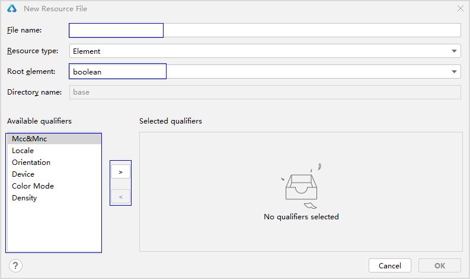
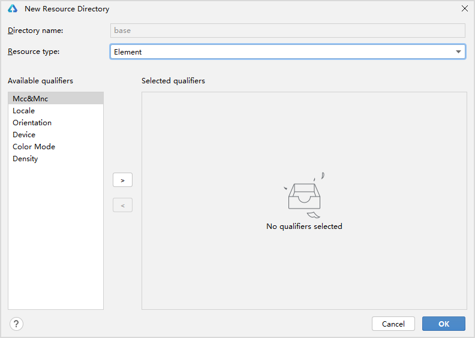
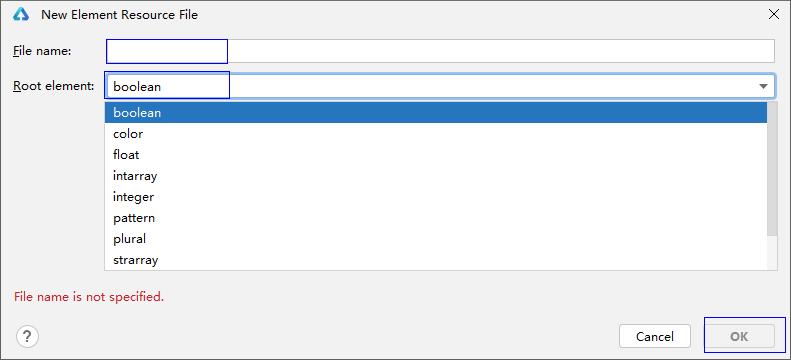

# Resource Classification and Access

During application development, resources such as colors, fonts, spacing, and images are frequently required. These resource values may vary across different devices or configurations.

- **Application Resources**: Using resource file capabilities, developers can customize resources within applications and manage their behavior across different devices or configurations.
- **System Resources**: Developers directly utilize system-preset resource definitions (i.e., layered parameters, where the same resource ID may have different values based on device type, dark/light mode, etc.).

## Resource Classification

Various resource files used in application development must be stored and managed in specific subdirectories. The example below illustrates resource directories, where `base`, qualifier directories, `rawfile`, and `resfile` are referred to as resource directories, while `element`, `media`, and `profile` are termed resource group directories.

> **Note:**
>
> In the stage model with multiple projects, shared resource files will be placed in the `resources` directory under `AppScope`.

Example of resource directory structure:

```text
resources
|---base
|   |---element
|   |   |---string.json
|   |---media
|   |   |---icon.png
|   |---profile
|   |   |---test_profile.json
|---en_US  // Default directory, prioritized when device locale is US English
|   |---element
|   |   |---string.json
|   |---media
|   |   |---icon.png
|   |---profile
|   |   |---test_profile.json
|---zh_CN  // Default directory, prioritized when device locale is Simplified Chinese
|   |---element
|   |   |---string.json
|   |---media
|   |   |---icon.png
|   |---profile
|   |   |---test_profile.json
|---en_GB-vertical-car-mdpi // Example of custom qualifier directory, created by developers
|   |---element
|   |   |---string.json
|   |---media
|   |   |---icon.png
|   |---profile
|   |   |---test_profile.json
|---rawfile
|---resfile // Freely placed resource files, created by developers
```

### Resource Directories

**Base Directory**

The `base` directory is a default directory where the secondary subdirectory `element` stores basic elements like strings, colors, and boolean values, while `media` and `profile` store media, animations, layout files, etc.

Resource files in this directory are compiled into binary files and assigned resource IDs. They are referenced by specifying the resource type (`type`) and name (`name`).

**Qualifier Directories**

`en_US` and `zh_CN` are default qualifier directories. Additional qualifier directories must be created by developers as needed. Secondary subdirectories `element`, `media`, and `profile` store basic elements and media resources.

Similarly, these files are compiled into binaries with resource IDs and referenced via type and name.

**Naming Rules for Qualifier Directories**

Qualifier directories can combine one or more qualifiers representing application scenarios or device characteristics, including Mobile Country Code (MCC), Mobile Network Code (MNC), language, script, country/region, screen orientation, device type, color mode, and screen density. Qualifiers are connected using underscores (`_`) or hyphens (`-`). Developers must adhere to naming rules when creating these directories.

- **Qualifier Combination Order**: `_MCC_MNC-language_script_country/region-orientation-deviceType-colorMode-screenDensity_`. Developers can select one or more qualifiers to form the directory name.
- **Qualifier Connection**: Language, script, and country/region are connected with underscores (`_`); MCC and MNC also use underscores. Other qualifiers use hyphens (`-`). Examples: `zh_Hant_CN`, `zh_CN-car-ldpi`.
- **Qualifier Value Ranges**: Each qualifier must comply with the conditions specified in the qualifier value table below. Otherwise, resource files cannot be matched.

| **Qualifier Type**            | **Description and Value Rules** |
| ----------------------- | -------------------------------------------------------- |
| MCC and MNC | MCC and MNC values are derived from the device's registered network.<br>MCC can be combined with MNC using an underscore (`_`) or used alone. Example: `mcc460` for China, `mcc460_mnc00` for China Mobile.<br>For detailed ranges, refer to <a href="https://www.itu.int/rec/T-REC-E.212">ITU-T E.212</a>. |
| Language | Represents the device's language type, using 2–3 lowercase letters. Examples: `zh` for Chinese, `en` for English, `mai` for Maithili.<br>For detailed ranges, refer to <a href="https://www.iso.org/iso-639-language-code">ISO 639</a>. |
| Script | Represents the device's script type, using 1 uppercase letter (initial) followed by 3 lowercase letters. Examples: `Hans` for Simplified Chinese, `Hant` for Traditional Chinese.<br>For detailed ranges, refer to <a href="https://www.iso.org/standard/81905.html">ISO 15924</a>. |
| Country/Region | Represents the user's country/region, using 2–3 uppercase letters or 3 digits. Examples: `CN` for China, `GB` for the UK.<br>For detailed ranges, refer to <a href="https://www.iso.org/iso-3166-country-codes.html">ISO 3166-1</a>. |
| Screen Orientation | Represents the device's screen orientation:<br>- `vertical`: Portrait.<br>- `horizontal`: Landscape. |
| Device Type | Represents the device type:<br>- `car`: In-vehicle systems.<br>- `tablet`: Tablets.<br>- `tv`: Smart screens.<br>- `wearable`: Wearables. |
| Color Mode | Represents the device's color mode:<br>- `dark`: Dark mode.<br>- `light`: Light mode. |
| Screen Density | Represents the device's screen density (dpi):<br>- `sdpi`: Small-scale (0–120 dpi).<br>- `mdpi`: Medium-scale (120–160 dpi).<br>- `ldpi`: Large-scale (160–240 dpi).<br>- `xldpi`: Extra-large (240–320 dpi).<br>- `xxldpi`: Extra-extra-large (320–480 dpi).<br>- `xxxldpi`: Ultra-large (480–640 dpi). |

**Rawfile Directory**

Supports multi-level subdirectories with custom names. Files are freely placed and not compiled or assigned resource IDs. Accessed via file paths and names.

**Resfile Directory**

Supports multi-level subdirectories with custom names. Files are freely placed and not compiled or assigned resource IDs. After installation, resources are extracted to the app sandbox path and accessed via `Context.resourceDir`.

### Resource Group Directories

Resource group directories include `element`, `media`, and `profile`, each storing specific resource types.

| **Directory Type** | **Description** | **Resource Files** |
| ---------- | ------------------------- | --------------------------------- |
| `element`  | Represents element resources, each data type stored in corresponding JSON files (only file types supported):<br>- `boolean`<br>- `color`<br>- `float` (-2^128 to 2^128)<br>- `intarray`<br>- `integer` (-2^31 to 2^31-1)<br>- `plural`<br>- `strarray`<br>- `string` | Filenames should match:<br>- `boolean.json`<br>- `color.json`<br>- `float.json`<br>- `intarray.json`<br>- `integer.json`<br>- `plural.json`<br>- `strarray.json`<br>- `string.json` |
| `media`    | Media resources (non-text files like images, audio, video). | Custom filenames, e.g., `icon.png`. |
| `profile`  | Custom configuration files (JSON only). | Custom filenames, e.g., `test_profile.json`. |

**Media Resource Types**

| Format | File Extensions |
| ---- | ---------- |
| JPEG | `.jpg`     |
| PNG  | `.png`     |
| GIF  | `.gif`     |
| SVG  | `.svg`     |
| WEBP | `.webp`    |
| BMP  | `.bmp`     |

Audio/Video Resource Types:

| Format                  | Supported File Types |
| --------------------- | -------------- |
| H.264 AVC             | `.3gp`         |
| Baseline Profile (BP) | `.mp4`         |

**Resource File Examples**

`color.json`:
```json
{
    "color": [
        {
            "name": "color_hello",
            "value": "#ffff0000"
        },
        {
            "name": "color_world",
            "value": "#ff0000ff"
        }
    ]
}
```

`float.json`:
```json
{
    "float":[
        {
            "name":"font_hello",
            "value":"28.0fp"
        },
    {
            "name":"font_world",
            "value":"20.0fp"
        }
    ]
}
```

`string.json`:
```json
{
    "string":[
        {
            "name":"string_hello",
            "value":"Hello"
        },
        {
            "name":"string_world",
            "value":"World"
        },
        {
            "name":"message_arrive",
            "value":"We will arrive at %1$s."
        },
        {
          "name":"message_notification",
          "value":"Hello, %1$s!,You have %2$d new messages"
        }
    ]
}
```

`plural.json`:
```json
{
    "plural":[
        {
            "name":"eat_apple",
            "value":[
                {
                    "quantity":"one",
                    "value":"%d apple"
                },
                {
                    "quantity":"other",
                    "value":"%d apples"
                }
            ]
        }
    ]
}
```

## Creating Resource Directories and Files

Under the `resources` directory, developers can create resource and qualifier directories following naming rules and add specific resource types. DevEco Studio supports creating both directories and files simultaneously or separately.

### Creating Resource Directories and Files

Right-click the `resources` directory, select **New > Resource File** to create both. Files default to the `base` directory. If qualifiers are selected, directories are auto-generated, and files are placed accordingly.



### Creating Resource Directories

Right-click the `resources` directory, select **New > Resource Directory** to create a directory (default: `base`). Selecting qualifiers auto-generates directories.



### Creating Resource Files

Right-click `base > element`, select **New > Element Resource File** to create an element resource file.



## Resource Translation Features

### Functionality

Use the `attr` attribute to mark strings for translation and their status. `attr` does not affect compilation.

Default behavior (no `attr`): Strings are translatable.

```json
"attr": {
  "translatable": false|true
  "priority": "code|translate|LT|customer"
}
```

**Supported Attributes**

| **Name** | **Type** | **Description** |
| ---------- | ------------------------- | --------------------------------- |
| `translatable`  | Boolean | Marks if a string requires translation.<br>`true`: Yes.<br>`false`: No. |
| `priority`  | String | Marks translation status:<br>`code`: Untranslated.<br>`translate`: Unverified.<br>`LT`: Verified.<br>`customer`: Custom strings. |

### Constraints

Translation features apply only to `string`, `strarray`, and `plural` resources in the `base` directory.

```text
resources
|---base
|   |---element
|   |   |---string.json
|   |   |---strarray.json
|   |   |---plural.json
```

### Example

`string.json` with `attr`:
```json
{
  "string": [
    {
      "name": "string1",
      "value": "1",
      "attr": {
        "translatable": false
      }
    },
    {
      "name": "string2",
      "value": "Hello world!",
      "attr": {
        "translatable": true,
        "priority": "LT"
      }
    }
  ]
}
```

## Resource Access

### Application Resources

Each resource in resource files is assigned a unique ID during project creation. These mappings are stored in the `cj_res_entry` module, with `sys` (system) and `app` (developer) classes.

- Access resources via `import kit.LocalizationKit.*`, then use `@r(app.type.name)`. For placeholders in `string.json`, use `@r(app.string.label, 'aaa', 1, 1.0)`.
- For `rawfile` resources, use `@rawfile("filename")` (path must not start with `/`).
- For `rawfile` descriptors, use `getRawFd` to obtain file descriptors (`{fd, offset, length}`).

Example usage:
```cangjie
Text(@r(app.string.string_hello))
  .fontColor(@r(app.color.color_hello))
  .fontSize(@r(app.float.font_hello))

Text(@r(app.string.message_arrive, "five of the clock"))
  .fontColor(@r(app.color.color_hello))
  .fontSize(@r(app.float.font_hello))

Text(@r(app.plural.eat_apple, 5, 5))
  .fontColor(@r(app.color.color_hello))
  .fontSize(@r(app.float.font_hello))

Image(@r(app.media.my_background_image))
Image(@rawfile("test.png"))
Image(@rawfile("newDir/newTest.png"))
```

### System Resources

System resources include colors, radii, fonts, spacing, strings, and images. Using these ensures consistent visual styles across apps.

Access via `@r(sys.type.resource_id)`, where `type` can be `color`, `float`, `string`, or `media`.

Example usage:
```cangjie
Text("Hello")
  .fontColor(@r(sys.color.ohos_id_color_emphasize))
  .fontSize(@r(sys.float.ohos_id_text_size_headline1))
  .fontFamily(@r(sys.string.ohos_id_text_font_family_medium))
  .backgroundColor(@r(sys.color.ohos_id_color_palette_aux1))

Image(@r(sys.media.ohos_app_icon))
  .border({
    color: @r(sys.color.ohos_id_color_palette_aux1),
    radius: @r(sys.float.ohos_id_corner_radius_button), width: 2
  })
  .margin({
    top: @r(sys.float.ohos_id_elements_margin_horizontal_m),
    bottom: @r(sys.float.ohos_id_elements_margin_horizontal_l)
  })
  .height(200)
  .width(300)
```

## Resource Matching

When accessing resources, the system prioritizes qualifier directories matching the device state. If none match, it falls back to `base`. `rawfile` does not participate in matching.

**Matching Priority**: MCC_MNC > region (language, script, country/region) > orientation > device type > color mode > screen density.

**Rules**:
- Qualifier directories must exactly match the device state (e.g., `zh_CN-car-ldpi` won't match `en_US`).
- For detailed rules, refer to internationalization and localization documentation.

## Limitations and Notes

Resource names cannot use Cangjie language reserved keywords (e.g., `func`, `main`). For a full list, see <!-- RP1 -->[Cangjie Programming Language Guide - Appendix - Keywords](https://gitcode.com/Cangjie/cangjie_docs/blob/main/docs/dev-guide/source_zh_cn/Appendix/keyword.md)<!-- RP1End -->.