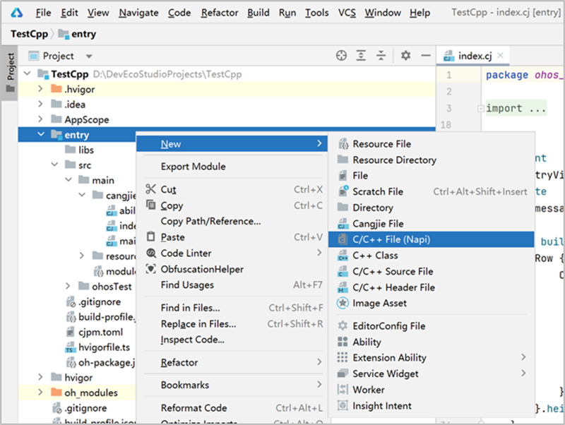
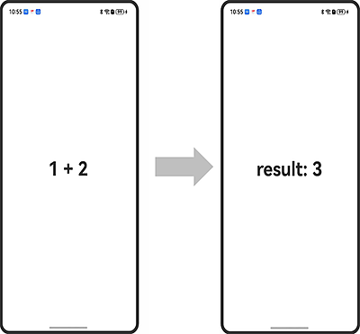

# Calling C++ Files within the Cangjie Module

> **Note:**
>
> To ensure optimal performance, this document uses **DevEco Studio 5.0.2 Release** and **DevEco Studio-Cangjie Plugin 5.0.9.100 Beta1** as examples. Click [here](https://developer.huawei.com/consumer/en/download/) to download the latest version.

This document explains how to use the DevEco Studio Cangjie plugin to call C++ files within a Cangjie module.

## Development Example

1. Create a pure Cangjie "[Cangjie] Empty Ability" project

   

2. Right-click the **entry** folder and select **New -> C/C++ File(Napi)**, as shown below:

   

   This will automatically generate the **entry > src > main > cpp > napi_init.cpp** file.

3. Open the **napi_init.cpp** file and write the C++ code. Example:

   ```cpp
   #include <stdint.h>
   #include <stdio.h>

   extern "C" int32_t sum(int32_t a, int32_t b) { return a + b; }

   extern "C" int32_t sub(int32_t a, int32_t b) {
       printf("sub\n");
       return a - b;
   }
   ```

4. Open the **entry > src > main > cangjie > index.cj** file and write the Cangjie code to call the C++ functions. Example:

   <!-- compile -->

   ```cangjie
      package ohos_app_cangjie_entry
      import kit.ArkUI.*
      import ohos.arkui.state_macro_manage.*

      foreign {
          func sum(a: Int32, b: Int32): Int32
          func sub(a: Int32, b: Int32): Int32
      }
      @Entry
      @Component
      class EntryView {
          @State
          var message: String = "1 + 2"
          func build() {
              Row {
                  Column {
                      Text(this.message)
                          .fontSize(50)
                          .fontWeight(FontWeight.Bold)
                          .onClick ({
                              evt => unsafe {
                                  this.message = "result: ${sum(1, 2)}"
                              }
                          })
                  }.width(100.percent)
              }.height(100.percent)
          }
      }
      ```

5. Add C++ dependencies in cjpm.toml. Open the **entry > cjpm.toml** file and add the following ffi.c configuration. Sync the project after configuration.

   ```toml
   [ffi]
     [ffi.c]
       [ffi.c.entry]
         path = "./libs/${ABI}"
   ```

## Running the Application on a Physical Device or Emulator

### Using a Local Physical Device

1. Connect a physical device running OpenHarmony to your computer.
2. After successful connection, go to **File > Project Structure > Project > Signing Configs**, check **Support HarmonyOS** and **Automatically generate signature**, then click **Sign In** to log in with your account. Wait for automatic signing to complete and click **OK**. See below:

   

3. Click the  button in the top-right toolbar to run. The result is shown below:

   

### Using an Emulator

OpenHarmony applications/services written in Cangjie can run on emulators provided by DevEco Studio.

1. Create a Phone-type emulator device and select it from the device list in the top-right corner of DevEco Studio.

2. By default, Cangjie projects compile for the **arm64-v8a** architecture. When using an **x86 emulator** (on **Windows/x86_64** or **macOS/x86_64**), the Cangjie project and C++ files must compile for x86_64. Add **x86_64** to **cangjieOptions/abiFilters** and **externalNativeOptions/abiFilters** in the **build-profile.json5** file of the Cangjie module. Example configuration:

    ```json
    "buildOption": { // Configuration for project build process
      "cangjieOptions": { // Cangjie-specific configuration
        "path": "./cjpm.toml", // Path to cjpm config file, providing Cangjie build configuration
        "abiFilters": ["arm64-v8a", "x86_64"] // Custom Cangjie compilation architecture; default is arm64-v8a
      }
      "externalNativeOptions": {
        "abiFilters":["arm64-v8a", "x86_64"], // Custom C++ compilation architecture; default is arm64-v8a
        "path": "./src/main/cpp/CMakeLists.txt",
        "arguments": "",
        "cppFlags": "",
      }
    }
    ```

3. Click the  button in the top-right toolbar to run. The result is the same as when using a physical device.