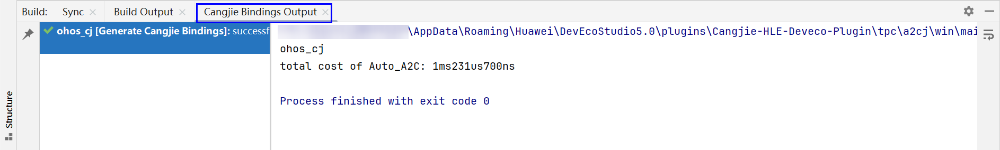

# Invoking ArkTS Third-Party Modules in Cangjie

> **Note:**
>
> To ensure operational effectiveness, this document uses **DevEco Studio 5.0.2 Release** and **DevEco Studio-Cangjie Plugin 5.0.9.100 Beta1** as examples. Click [here](https://developer.huawei.com/consumer/cn/download/) to obtain the download links for the latest versions.

This document describes how to use the DevEco Studio Cangjie plugin to invoke ArkTS third-party libraries in Cangjie code.

## Usage Example

The following demonstrates detailed steps for invoking the [lz4js](https://ohpm.openharmony.cn/#/cn/detail/lz4js) third-party library in Cangjie code.

1. Create a "[Cangjie] Hybrid Ability" project

    

2. Configure lz4js third-party library dependencies

    Add the lz4js third-party library dependency in the project-level oh-package.json5 file, then click Sync Now to download the ArkTS third-party library.

    ```json
    "dependencies": {
        ...
        "lz4js": "^0.2.0",
        "@types/lz4js": "^0.2.1"
        ...
    },
    ```

    

3. Generate Cangjie wrapper layer using the code generation tool

   a. Locate the corresponding lz4js third-party library directory under the oh_modules folder, open the .d.ts or .d.ets file in the directory, right-click in the file editor interface, and select **Generate... > Cangjie Bindings** to generate the Cangjie wrapper layer code.

   

   b. After clicking the button, a pop-up window will appear allowing you to choose between the current file or the directory containing the current file. Select **Current Directory**. The default package name for the generated Cangjie wrapper layer is the ArkTS third-party library name with a "_cj" suffix, which developers can manually modify.

   

   c. After clicking OK, a Cangjie module will be generated in the current project. The src/main/cangjie directory within this module contains the generated Cangjie wrapper layer code for the ArkTS third-party library.

   

   d. Currently, errors may occur during wrapper layer generation. If certain types or declarations cannot be correctly generated as interoperability wrapper layer code, manual modifications are required based on the prompts in the "Cangjie Bindings Output" console.

   

4. Add the generated Cangjie module dependency in Cangjie code and invoke the wrapper layer interfaces. The following example demonstrates invoking the compress interface in lz4js.

   a. Add the generated Cangjie module lz4cj dependency in the oh-package.json5 file of the entry module, then click Sync Now to automatically add the Cangjie wrapper layer dependency.

   ```json
   "dependencies": {
       ...
       "lz4cj":"file:../lz4cj"
        ...
   },
   ```

   

    b. Invoke the corresponding interfaces of the Cangjie wrapper library lz4cj in Cangjie code. The following example demonstrates invoking the compress interface in lz4js by modifying the **entry > src > main > cangjie > index.cj** file:

     ```cangjie
     //index.cj
     import lz4js.compress // Import the compress interface from the lz4cj library

     func testCJ() {
         ...
         var arr: Array<Byte>  = [
         0x04, 0x22, 0x4d, 0x18, 0x64, 0x40, 0xa7, 0x1b,
         0x00, 0x00, 0x80, 0x54, 0x68, 0x65, 0x20, 0x77,
         0x68, 0x6f, 0x6c, 0x65, 0x20, 0x77, 0x6f, 0x72,
         0x6c, 0x64, 0x20, 0x69, 0x73, 0x20, 0x65, 0x6e,
         0x64, 0x69, 0x6e, 0x67, 0x2e, 0x0a, 0x00, 0x00,
         0x00, 0x00, 0xbc, 0xa8, 0x6b, 0xc5
         ]
         let result = compress(arr)
         ...
     }
     ```

    c. Due to certain limitations in the interoperability implementation, developers must manually pass the ArkTS module object in the ArkTS code entry (e.g., Index.ets file).

    ```js
    import * as lz4js from "lz4js";
    globalThis.lz4cj = lz4js
    ```

    

    > **Note:**
    >
    > If you need to invoke functions from the lz4js/util and lz4js/xxh32 modules, you must import the corresponding module objects. Since module names cannot contain `/`, use `_` for concatenation.
    >

    ```javascript
    import * as lz4js_util from "lz4js/util";
    import * as lz4js_xxh32 from "lz4js/xxh32";
    globalThis.lz4cj_until = lz4js_util
    globalThis.lz4cj_xxh32 = lz4js_xxh32
    ```