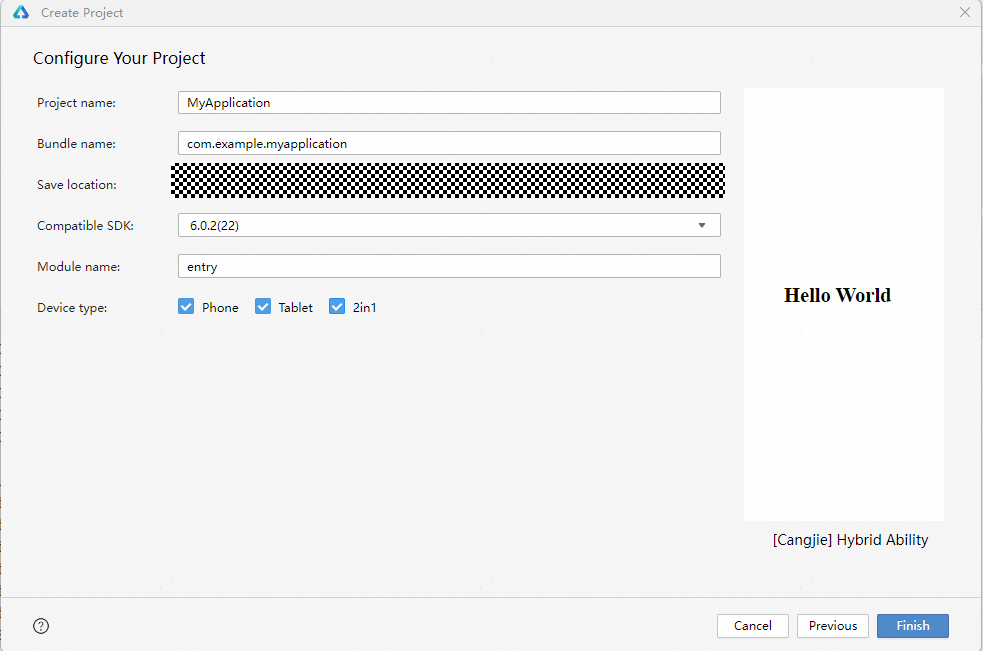

# Building Your First Cangjie Application

> **Note:**
>
> To ensure optimal performance, this document uses the **latest DevEco Studio version** as an example. Click [here](https://developer.huawei.com/consumer/cn/download/) to obtain the download link.

## Creating a Cangjie Project

1. If this is your first time opening **DevEco Studio**, click **Create Project** to create a new project. If a project is already open, select **File** > **New** > **Create Project** from the menu bar to create a new project.

2. Choose **Application** development (this document uses application development as an example; Cangjie currently does not support meta-service development), select the **[Cangjie] Empty Ability** template, and click **Next** to proceed to the configuration step.

   

3. On the project configuration page, you can modify basic project information such as the project name and storage path, or keep the default settings.

   

4. Click **Finish** to complete project creation. The tool will automatically generate basic sample code and related resources.

## Cangjie Project Directory Structure

The directory structure of a Cangjie project is as follows:

```text
Project_name
├── .hvigor
├── .idea
├── AppScope
├── entry
│    ├── libs
│    ├── src
│    │    ├── main
│    │    │    ├── cangjie
│    │    │    │    ├── ability_stage.cj
│    │    │    │    ├── index.cj
│    │    │    │    └── main_ability.cj
│    │    │    ├── resources
│    │    │    └── module.json5
│    │    └── ohosTest
│    ├── build-profile.json5
│    ├── cjpm.toml
│    ├── hvigorfile.ts
│    └── oh-package.json5
├── hvigor
│    ├── cangjie-build-support-x.y.z-cj.x.tgz
│    └── hvigor-config.json5
├── oh_modules
├── build-profile.json5
├── code-linter.json5
├── hvigorfile.ts
├── local.properties
├── oh-package.json5
└── oh-package-lock.json5
```

Key file information includes:

- **AppScope > app.json5**: Global configuration information for the application.
- **entry**: The Cangjie project module, which compiles and builds into a HAP package.
    - **src > main > cangjie**: Stores Cangjie source code.
    - **src > main > resources**: Stores resource files used by the application/service, such as graphics, multimedia, strings, and layout files. For more on resource files, see [Resource Classification and Access](../ide-resource-categories-and-access.md).
    - **src > main > module.json5**: Stage module configuration file, primarily containing HAP configuration, device-specific settings, and global application configuration.
    - **build-profile.json5**: Current module information and compilation configuration, including buildOption and targets settings.
    - **hvigorfile.ts**: Module-level build task script.
    - **cjpm.toml**: Cangjie package management configuration file.
    - **oh-package.json5**: Describes package name, version, entry file (type declaration file), and dependencies.
    - **src > ohosTest**: Stores Cangjie test source code for Instrument Test.
- **hvigor**: Stores the hvigor used by the current project.
    - **cangjie-build-support-x.y.z-cj.x.tgz**: The hvigor task package specified for Cangjie.
    - **hvigor-config.json5**: Specifies the global hvigor configuration and parameters for the project.
- **oh_modules**: Stores third-party library dependency information, including files required by the application/service.
- **build-profile.json5**: Application-level configuration, including signing and product settings.
- **hvigorfile.ts**: Application-level build task script.
- **oh-package.json5**: Primarily describes global configurations such as dependency overrides (overrides), dependency rewrites (overrideDependencyMap), and parameterized settings (parameterFile).

## Building the First Page

1. Using text components.

   After project synchronization is complete, in the **Project** window, navigate to **entry > src > main > cangjie**, open the **index.cj** file, and write the application page using the Cangjie language. For this example, which demonstrates page navigation/return using text/buttons, the layout is constructed using Row and Column components.

   ```text
   entry
   └── src
        └── main
             ├── cangjie
             │    ├── ability_stage.cj
             │    ├── index.cj
             │    └── main_ability.cj
             ├── resources
             └── module.json5
   ```

   The initial code for **index.cj** is as follows:

   ```cangjie
   // index.cj
   package ohos_app_cangjie_entry

   internal import ohos.base.LengthProp
   internal import ohos.component.Column
   internal import ohos.component.Row
   internal import ohos.component.Button
   internal import ohos.component.Text
   internal import ohos.component.CustomView
   internal import ohos.component.CJEntry
   internal import ohos.component.loadNativeView
   internal import ohos.component.FontWeight
   internal import ohos.state_manage.SubscriberManager
   internal import ohos.state_manage.ObservedProperty
   internal import ohos.state_manage.LocalStorage
   import ohos.state_macro_manage.Entry
   import ohos.state_macro_manage.Component
   import ohos.state_macro_manage.State
   import ohos.state_macro_manage.r

   @Entry
   @Component
   class EntryView {
       @State
       var message: String = "Hello World"
       func build() {
           Row {
               Column {
                   Text(this.message)
                       .fontSize(50)
                       .fontWeight(FontWeight.Bold)
                       .onClick {
                           evt => this.message = "Hello Cangjie"
                       }
               }.width(100.percent)
           }.height(100.percent)
       }
   }
   ```

2. Adding text and modifying buttons.

   On the default page, we add a Button component to respond to user clicks and navigate to another page. The **index.cj** file example is as follows:

   ```cangjie
   // index.cj
   package ohos_app_cangjie_entry

   internal import ohos.base.LengthProp
   internal import ohos.component.Column
   internal import ohos.component.Row
   internal import ohos.component.Button
   internal import ohos.component.Text
   internal import ohos.component.CustomView
   internal import ohos.component.CJEntry
   internal import ohos.component.loadNativeView
   internal import ohos.component.FontWeight
   internal import ohos.state_manage.SubscriberManager
   internal import ohos.state_manage.ObservedProperty
   internal import ohos.state_manage.LocalStorage
   import ohos.state_macro_manage.Entry
   import ohos.state_macro_manage.Component
   import ohos.state_macro_manage.State
   import ohos.state_macro_manage.r

   @Entry
   @Component
   class EntryView {
       @State
       var message: String = "Hello Cangjie"

       func build() {
           Row {
               Column() {
                   Text(this.message)
                    .fontSize(50)
                    .fontWeight(FontWeight.Bold)
                    .onClick {
                        evt => this.message = "Hello Cangjie"
                    }
                   // Add a button to respond to user clicks
                   Button("Next")
                   .onClick {
                       evt => AppLog.info("Hello Cangjie")
                   }
                   .fontSize(30)
                   .width(180)
                   .height(50)
                   .margin(top: 20)
               }.width(100.percent)
           }.height(100.percent)
       }
   }
   ```

## Building the Second Page

1. Creating the second page.

   In the **Project** window, navigate to **entry > src > main > cangjie**, right-click the **cangjie** folder, select **New > Cangjie File**, name it **second**, and click **OK**. The file directory structure is as follows:

   ```text
   entry
   └── src
        └── main
             ├── cangjie
             │    ├── ability_stage.cj
             │    ├── index.cj
             │    ├── main_ability.cj
             │    └── second.cj
             ├── resources
             └── module.json5
   ```

2. Adding text and buttons.

   Following the first page, add Text and Button components to the second page and set their styles. The **second.cj** file example is as follows:

   ```cangjie
   // second.cj
   package ohos_app_cangjie_entry

   import ohos.state_macro_manage.Entry
   import ohos.state_macro_manage.Component
   import ohos.state_macro_manage.State
   import ohos.state_macro_manage.r
   import ohos.component.Button

   @Entry
   @Component
   class Second {
       @State
       var message: String = "Hi there"

       func build() {
           Row {
               Column() {
                   Text(this.message)
                       .fontSize(50)
                       .fontWeight(FontWeight.Bold)
                   Button("Back")
                       .onClick {
                           evt => AppLog.info("Hi there")
                       }
                       .fontSize(30)
                       .width(180)
                       .height(50)
                       .margin(top: 20)
               }.width(100.percent)
           }.height(100.percent)
       }
   }
   ```

## Implementing Page Navigation

Page navigation can be achieved using the router module. The router locates the target page based on the URL to enable navigation. Import the router module to use page routing.

1. Navigating from the first page to the second page.

   On the first page, bind the onClick event to the navigation button. When clicked, the button navigates to the second page. The **index.cj** file example is as follows:

   ```cangjie
   // index.cj
   package ohos_app_cangjie_entry

   internal import ohos.base.LengthProp
   internal import ohos.component.Column
   internal import ohos.component.Row
   internal import ohos.component.Button
   internal import ohos.component.Text
   internal import ohos.component.CustomView
   internal import ohos.component.CJEntry
   internal import ohos.component.loadNativeView
   internal import ohos.component.FontWeight
   internal import ohos.state_manage.SubscriberManager
   internal import ohos.state_manage.ObservedProperty
   internal import ohos.state_manage.LocalStorage
   import ohos.state_macro_manage.Entry
   import ohos.state_macro_manage.Component
   import ohos.state_macro_manage.State
   import ohos.state_macro_manage.r
   import ohos.router.Router // Import the page routing module

   @Entry
   @Component
   class EntryView {
       @State
       var message: String = "Hello Cangjie"

       func build() {
           Row {
               Column() {
                   Text(this.message)
                    .fontSize(50)
                    .fontWeight(FontWeight.Bold)
                    .onClick {
                        evt => this.message = "Hello Cangjie"
                    }
                   // Add a button to respond to user clicks
                   Button("Next")
                   .onClick {
                       evt => Router.push(url: "Second") // Navigate to the second page

                   }
                   .fontSize(30)
                   .width(180)
                   .height(50)
                   .margin(top: 20)
               }.width(100.percent)
           }.height(100.percent)
       }
   }

   ```

2. Return from the second page to the first page.

   In the second page, bind the onClick event to the back button. When clicked, it returns to the first page. Example of the **second.cj** file:

   ```cangjie
   // second.cj
   package ohos_app_cangjie_entry

   import ohos.state_macro_manage.Entry
   import ohos.state_macro_manage.Component
   import ohos.state_macro_manage.State
   import ohos.state_macro_manage.r
   import ohos.router.Router // Import page routing module

   @Entry
   @Component
   class Second {
       @State
       var message: String = "Hi there"

       func build() {
           Row {
               Column() {
                   Text(this.message)
                       .fontSize(50)
                       .fontWeight(FontWeight.Bold)
                   Button("Back")
                       .onClick {
                           evt => Router.back(url: "EntryView") // Return to the first page
                       }
                       .fontSize(30)
                       .width(180)
                       .height(50)
                       .margin(top: 20)
               }.width(100.percent)
           }.height(100.percent)
       }
   }

   ```

## Run the Application on a Physical Device or Emulator

### Run on a Physical Device

1. Connect a physical device with OpenHarmony OS to your computer.

2. After successful connection, navigate to **File > Project Structure > Project > Signing Configs**, check **Support OpenHarmony** and **Automatically generate signature**, click **Sign In** as prompted, wait for automatic signing to complete, then click **OK**. As shown below:

   

3. In the toolbar at the top-right of the editor window, click the  button to run. The effect is as shown below:

   

### Use an Emulator

OpenHarmony applications/services written in Cangjie language support running on the emulator (Emulator) provided by DevEco Studio.

1. Create a Phone-type emulator device and select it from the device list in the top-right corner of DevEco Studio.

2. By default, Cangjie projects are compiled for the **arm64-v8a** architecture. Therefore, when using an **x86 emulator** (i.e., when the current development environment is **Windows/x86_64** or **MacOS/x86_64**), the Cangjie project and third-party libraries need to compile the x86_64 version of the so. Add "**x86_64**" to the value of **cangjieOptions/abiFilters** in the **build-profile.json5** configuration file of the Cangjie module. The specific compilation configuration is as follows:

   ```json
   "buildOption": {      // Configuration used during the project build process
     "cangjieOptions": { // Cangjie-related configurations
       "path": "./cjpm.toml", // Path to the cjpm configuration file, providing Cangjie build configurations
       "abiFilters": ["arm64-v8a", "x86_64"]   // Custom Cangjie compilation architectures; default is arm64-v8a
     }
   }
   ```

3. In the toolbar at the top-right of the editor window, click the  button to run. The effect is the same as running on a physical device.

Congratulations! You have successfully built your first Cangjie application.
```