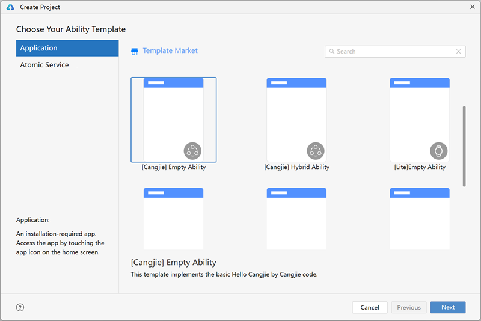
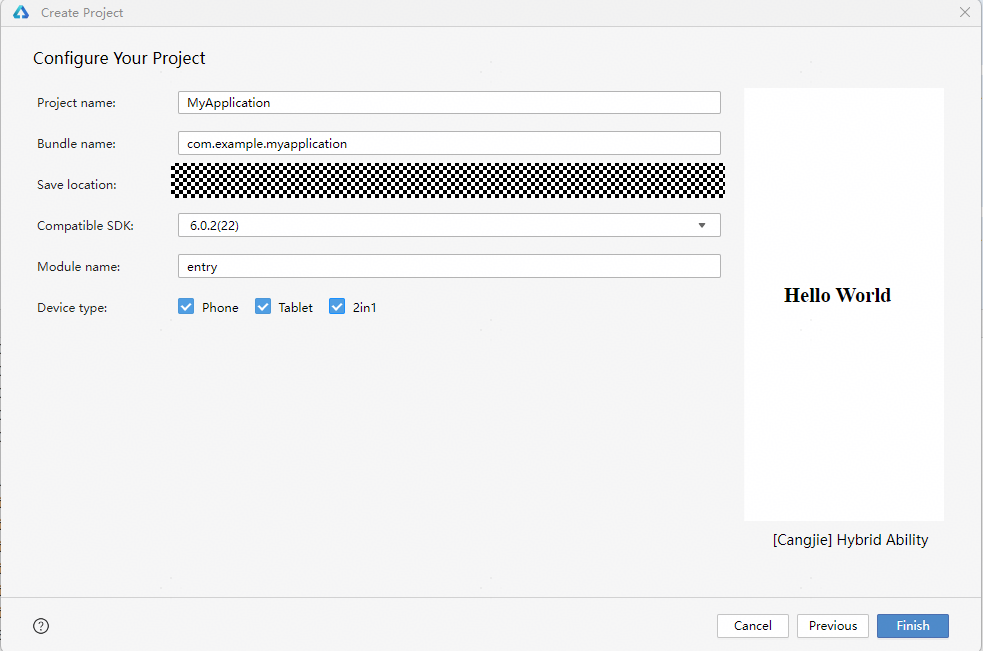
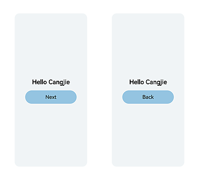

# Building Your First Cangjie Application

> **Note:**
>
> To ensure optimal performance, this guide uses the **latest DevEco Studio version** as an example. Click [here](https://developer.huawei.com/consumer/en/download/) to download.

## Creating a Cangjie Project

1. If opening **DevEco Studio** for the first time, click **Create Project** to start. If a project is already open, select **File** > **New** > **Create Project** from the menu bar.

2. Choose **Application** development (this guide focuses on application development; Cangjie currently doesn't support meta-service development). Select the **[Cangjie] Empty Ability** template and click **Next** to proceed.

   

3. On the project configuration screen, you can modify basic settings like project name and storage path or keep the defaults.

   

4. Click **Finish** to complete project creation. The IDE will automatically generate foundational sample code and related resources.

5. To build an OpenHarmony application, you need to change the `runtimeOS` field in the **build-profile.json5** file to OpenHarmony

    

## Cangjie Project Directory Structure

The Cangjie project directory structure is as follows:

```text
Project_name
├── .hvigor
├── .idea
├── AppScope
├── entry
│    ├── libs
│    ├── src
│    │    ├── main
│    │    │    ├── cangjie
│    │    │    │    ├── ability_stage.cj
│    │    │    │    ├── index.cj
│    │    │    │    └── main_ability.cj
│    │    │    ├── resources
│    │    │    └── module.json5
│    │    └── ohosTest
│    ├── build-profile.json5
│    ├── cjpm.toml
│    ├── hvigorfile.ts
│    └── oh-package.json5
├── hvigor
│    └── hvigor-config.json5
├── oh_modules
├── build-profile.json5
├── code-linter.json5
├── hvigorfile.ts
├── local.properties
├── oh-package.json5
└── oh-package-lock.json5
```

Key file descriptions:

- **AppScope > app.json5**: Global application configuration.
- **entry**: Cangjie project module that compiles into a HAP package.
    - **src > main > cangjie**: Stores Cangjie source code.
    - **src > main > resources**: Contains resource files (graphics, multimedia, strings, layouts, etc.). See [Resource Classification and Access](../ide-resource-categories-and-access.md#资源分类与访问).
    - **src > main > module.json5**: Stage module configuration including HAP settings, device-specific configurations, and global app settings.
    - **build-profile.json5**: Module-level build configurations (buildOption, targets, etc.).
    - **hvigorfile.ts**: Module-level build script.
    - **cjpm.toml**: Cangjie package management configuration.
    - **oh-package.json5**: Package metadata (name, version, entry files, dependencies).
    - **src > ohosTest**: Contains Cangjie test code for Instrument Test.
- **hvigor**: Stores project-specific hvigor configurations.
    - **hvigor-config.json5**: Global hvigor configuration and parameters.
- **oh_modules**: Stores third-party library dependencies.
- **build-profile.json5**: Application-level configurations (signing, product settings).
- **hvigorfile.ts**: Application-level build script.
- **oh-package.json5**: Global configurations (dependency overrides, parameter files).

## Building the First Page

1. Using text components.

   After project synchronization, navigate to **entry > src > main > cangjie** in the **Project** window and open **index.cj** to write your page in Cangjie. This example uses Row and Column components for layout.

   ```text
   entry
   └── src
        └── main
             ├── cangjie
             │    ├── ability_stage.cj
             │    ├── index.cj
             │    └── main_ability.cj
             ├── resources
             └── module.json5
   ```

   Initial **index.cj** code:

   <!-- compile -->

   ```cangjie
   // index.cj
   package ohos_app_cangjie_entry

   import kit.ArkUI.*
   import ohos.arkui.state_macro_manage.*

   @Entry
   @Component
   class EntryView {
       @State
       var message: String = "Hello World"
       func build() {
           Row {
               Column {
                   Text(this.message)
                       .fontSize(50)
                       .fontWeight(FontWeight.Bold)
                       .onClick ({
                           evt => this.message = "Hello Cangjie"
                       })
               }.width(100.percent)
           }.height(100.percent)
       }
   }
   ```

2. Adding text and modifying buttons.

   Add a Button component to enable page navigation. Updated **index.cj**:

   <!-- compile -->

   ```cangjie
   // index.cj
   package ohos_app_cangjie_entry

   import kit.ArkUI.*
   import ohos.arkui.state_macro_manage.*

   @Entry
   @Component
   class EntryView {
       @State
       var message: String = "Hello Cangjie"

       func build() {
           Row {
               Column() {
                   Text(this.message)
                    .fontSize(50)
                    .fontWeight(FontWeight.Bold)
                    .onClick {
                        evt => this.message = "Hello Cangjie"
                    }
                   // Add button for user interaction
                   Button("Next")
                   .onClick ({
                       evt => Hilog.info(1, "info", "Hello Cangjie")
                   })
                   .fontSize(30)
                   .width(180)
                   .height(50)
                   .margin(top: 20)
               }.width(100.percent)
           }.height(100.percent)
       }
   }
   ```

## Building the Second Page

1. Creating the second page.

   Right-click the **cangjie** folder (**entry > src > main > cangjie**), select **New > Cangjie File**, name it **second**, and click **OK**.

   ```text
   entry
   └── src
        └── main
             ├── cangjie
             │    ├── ability_stage.cj
             │    ├── index.cj
             │    ├── main_ability.cj
             │    └── second.cj
             ├── resources
             └── module.json5
   ```

2. Adding text and buttons.

   Similar to the first page, add components in **second.cj**:

   <!-- compile -->

   ```cangjie
   // second.cj
   package ohos_app_cangjie_entry

   import ohos.arkui.state_macro_manage.Entry
   import ohos.arkui.state_macro_manage.Component
   import ohos.arkui.state_macro_manage.State
   import ohos.arkui.state_macro_manage.r
   import ohos.arkui.component.Button
   import ohos.hilog.Hilog

   @Entry
   @Component
   class Second {
       @State
       var message: String = "Hi there"

       func build() {
           Row {
               Column() {
                   Text(this.message)
                       .fontSize(50)
                       .fontWeight(FontWeight.Bold)
                   Button("Back")
                       .onClick ({
                           evt => Hilog.info(1, "info", "Hi there")
                       })
                       .fontSize(30)
                       .width(180)
                       .height(50)
                       .margin(top: 20)
               }.width(100.percent)
           }.height(100.percent)
       }
   }
   ```

## Implementing Page Navigation

Page navigation uses the router module to find target pages via URLs.

1. Navigating from first to second page.

   Update **index.cj** with router functionality:

   <!-- compile -->

   ```cangjie
   // index.cj
   package ohos_app_cangjie_entry

   import kit.ArkUI.*
   import ohos.arkui.state_macro_manage.*

   @Entry
   @Component
   class EntryView {
       @State
       var message: String = "Hello Cangjie"

       func build() {
           Row {
               Column() {
                   Text(this.message)
                    .fontSize(50)
                    .fontWeight(FontWeight.Bold)
                    .onClick {
                        evt => this.message = "Hello Cangjie"
                    }
                   Button("Next")
                   .onClick ({
                       evt => getUIContext().getRouter().pushUrl(url: "Second") // Navigate to second page
                   })
                   .fontSize(30)
                   .width(180)
                   .height(50)
                   .margin(top: 20)
               }.width(100.percent)
           }.height(100.percent)
       }
   }
   ```

2. Returning from second to first page.

   Update **second.cj** with back navigation:

   <!-- compile -->

   ```cangjie
   // second.cj
   package ohos_app_cangjie_entry

   import ohos.arkui.state_macro_manage.Entry
   import ohos.arkui.state_macro_manage.Component
   import ohos.arkui.state_macro_manage.State
   import ohos.arkui.state_macro_manage.r
   import ohos.arkui.ui_context.* // Import router module

   @Entry
   @Component
   class Second {
       @State
       var message: String = "Hi there"

       func build() {
           Row {
               Column() {
                   Text(this.message)
                       .fontSize(50)
                       .fontWeight(FontWeight.Bold)
                   Button("Back")
                       .onClick ({
                           evt => Router.back(url: "EntryView") // Return to first page
                       })
                       .fontSize(30)
                       .width(180)
                       .height(50)
                       .margin(top: 20)
               }.width(100.percent)
           }.height(100.percent)
       }
   }
   ```

## Running on Device or Emulator

### Running on Physical Device

1. Connect an OpenHarmony device to your computer.

2. After successful connection, go to **File > Project Structure > Project > Signing Configs**, check **Automatically generate signature**, click **Sign In** to log in. After automatic signing completes, click **OK**.

   

3. Click the  button in the top-right toolbar to run. Expected output:

   

### Using Emulator

Cangjie applications support running on DevEco Studio's emulator.

1. Create a Phone-type emulator device and select it from the device list.

2. By default, Cangjie compiles for **arm64-v8a**. For **x86 emulators** (Windows/x86_64 or MacOS/x86_64), add "**x86_64**" to **abiFilters** in **build-profile.json5**:

   ```json
   "buildOption": {      // Build configuration
     "cangjieOptions": { // Cangjie-specific settings
       "path": "./cjpm.toml", // cjpm config path
       "abiFilters": ["arm64-v8a", "x86_64"]   // Custom architectures
     }
   }
   ```

3. Click  to run. Output matches physical device results.

Congratulations on building your first Cangjie application!