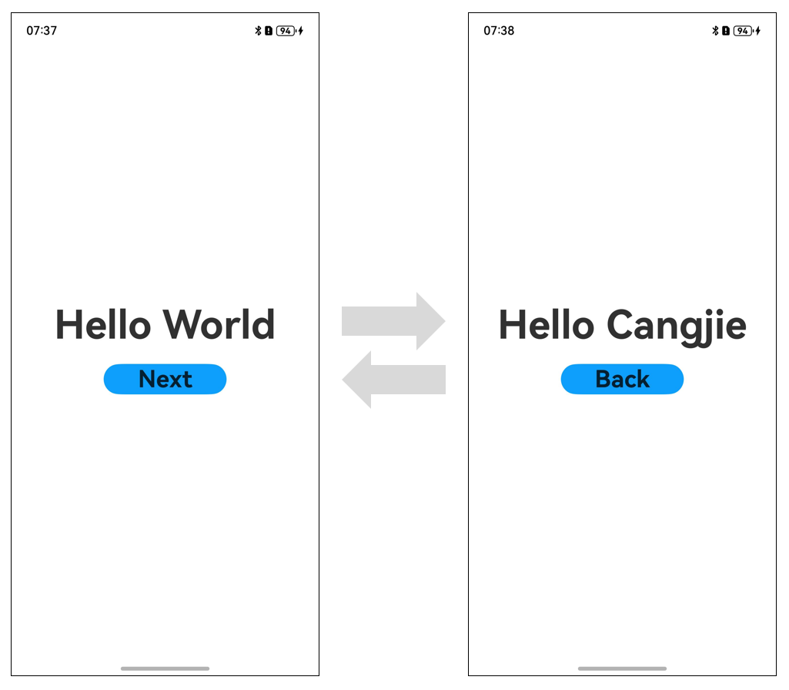

# Building Your First Cangjie & ArkTS Hybrid Application

> **Note:**
>
> To ensure optimal performance, this document uses **DevEco Studio 5.0.2 Release** and **DevEco Studio-Cangjie Plugin 5.0.7.100 Beta1** as examples. Click [here](https://developer.huawei.com/consumer/cn/download/) to download the latest versions.

This guide is intended for OpenHarmony application developers with basic knowledge of Cangjie language, ArkTS language, and UI frameworks. By building a simple hybrid application with page navigation functionality (as shown below), you'll quickly understand the main files in the project directory and familiarize yourself with the hybrid development workflow.



## Creating a Cangjie & ArkTS Hybrid Project

1. If opening **DevEco Studio** for the first time, click **Create Project**. If a project is already open, select **File** > **New** > **Create Project** from the menu bar.
2. Choose **Application** development, select the **[Cangjie] Hybrid Ability** template, then click **Next** to proceed with configuration.

   > **Note:**
   >
   > For pure Cangjie project development, select the **[Cangjie] Empty Ability** template.

   

3. On the project configuration page, keep default parameter settings.

   > **Note:**
   >
   > The minimum Compatible SDK version for Cangjie hybrid pages is 5.0.1(13).

   

4. Click **Finish**. DevEco Studio will automatically generate sample code and related resources. Wait for project creation to complete.

## Cangjie & ArkTS Hybrid Project Directory Structure

The directory structure of a Cangjie & ArkTS hybrid project is as follows:

```text
Project_name
├── .hvigor
├── .idea
├── AppScope
│    ├── resources
│    └── app.json5
├── entry
│    ├── build
│    ├── har
│    │    └── CJHyAPIRegister-v1.0.1.har
│    ├── libs
│    ├── oh_modules
│    ├── src
│    │    ├── main
│    │    │    ├── cangjie
│    │    │    │    ├── types
│    │    │    │    │    └── libohos_app_cangjie_entry
│    │    │    │    │          ├── Index.d.ts
│    │    │    │    │          └── oh-package.json5
│    │    │    │    └── index.cj
│    │    │    ├── ets
│    │    │    │    ├── entryability
│    │    │    │    ├── entrybackupability
│    │    │    │    └── pages
│    │    │    ├── resources
│    │    │    └── module.json5
│    │    ├── mock
│    │    ├── ohosTest
│    │    └── test
│    ├── build-profile.json5
│    ├── cjpm.toml
│    ├── hvigorfile.ts
│    ├── obfuscation-rules.txt
│    ├── oh-package.json5
│    └── oh-package-lock.json5
├── hvigor
│    ├── cangjie-build-support-x.y.z.tgz
│    └── hvigor-config.json5
├── oh_modules
├── build-profile.json5
├── code-linter.json5
├── hvigorfile.ts
├── local.properties
├── oh-package.json5
└── oh-package-lock.json5
```

Key file information:

- **AppScope > app.json5**: Global application configuration.
- **entry**: OpenHarmony project module that compiles into a HAP package.
    - **src > har**: Contains HAR modules for Cangjie-ArkTS interoperability.
    - **src > main > cangjie**: Stores Cangjie source code.
    - **src > main > cangjie > types**: Interoperability dependency libraries.
    - **src > main > ets**: Stores ArkTS source code.
    - **src > main > ets > entryability**: Application/service entry point.
    - **src > main > ets > entrybackupability**: Backup/restore capabilities.
    - **src > main > ets > pages**: Application/service pages.
    - **src > main > resources**: Resource files (graphics, multimedia, strings, layouts). See [Resource Classification and Access](../ide-resource-categories-and-access.md#资源分类与访问).
    - **src > main > module.json5**: Module configuration including HAP settings.
    - **build-profile.json5**: Module build configuration.
    - **cjpm.toml**: Cangjie package management configuration.
    - **hvigorfile.ts**: Module-level build scripts.
    - **oh-package.json5**: Package dependencies and metadata.
- **hvigor**:
    - **cangjie-build-support-x.y.z.tgz**: Cangjie-specific build packages.
    - **hvigor-config.json5**: Global hvigor configuration.
- **oh_modules**: Third-party library dependencies.
- **build-profile.json5**: Application-level build configuration.
- **hvigorfile.ts**: Application-level build scripts.
- **oh-package.json5**: Global dependency management.

## Building the First Page (Pure ArkTS)

1. Using Text Components

   After project synchronization, navigate to **entry > src > main > ets > pages** and open **Index.ets** to begin page development.

   For this navigation demo, we'll use Row and Column components for layout. For complex alignment scenarios, consider RelativeContainer.

   **Index.ets** example:

   ```typescript
   @Entry
   @Component
   struct Index {
     @State message: string = 'Hello World';

     build() {
       RelativeContainer() {
         Text(this.message)
           .fontSize(40)
           .fontWeight(FontWeight.Bold)
           .alignRules({
             center: { anchor: '__container__', align: VerticalAlign.Center },
             middle: { anchor: '__container__', align: HorizontalAlign.Center }
           })
       }
       .height('100%')
       .width('100%')
     }
   }
   ```

2. Adding a Button

   Add a Button component to enable page navigation. Updated **Index.ets**:

   ```typescript
   // Index.ets
   @Entry
   @Component
   struct Index {
     @State message: string = 'Hello World'

     build() {
       Row() {
         Column() {
           Text(this.message)
             .fontSize(50)
             .fontWeight(FontWeight.Bold)
           // Add navigation button
           Button() {
             Text('Next')
               .fontSize(30)
               .fontWeight(FontWeight.Bold)
           }
           .type(ButtonType.Capsule)
           .margin({
             top: 20
           })
           .backgroundColor('#0D9FFB')
           .width('40%')
           .height('5%')
         }
         .width('100%')
       }
       .height('100%')
     }
   }
   ```

## Building the Second Page (Hybrid ArkTS & Cangjie)

> **Note:**
>
> In hybrid development, Cangjie pages aren't full lifecycle pages but components embedded within ArkTS containers. Detailed hybrid UI development is covered in [Hybrid Development V2](https://developer.huawei.com/consumer/cn/doc/cangjie-references-V5/cj_appendix-hybrid-v2-V5).

1. Creating the Cangjie Page

   - Right-click **entry > src > main > cangjie**, select **New -> Cangjie HybridComponent File**. Name it **Second**, select **Cangjie** and **With ArkTS Wrapper** options:

     

   - After creation, the directory structure updates automatically:

     ```text
      entry
      └── src
           └── main
                ├── cangjie
                │    ├── second.cj
                └── ets
                     └── pages
                          └── second.ets
     ```

   - Add UI components to **second.cj**:

     ```cangjie
     // second.cj
     package ohos_app_cangjie_entry

     import ohos.base.*
     import ohos.arkui.component.*
     import ohos.hybrid_base.*
     import ohos.arkui.state_macro_manage.*
     import ohos.arkui.state_management.*

     @HybridComponentEntry
     @Component
     class Second {
         @State var msg: String = "Hello Cangjie"

         public func build() {
             Row() {
                 Column() {
                     Text(this.msg)
                         .fontSize(50)
                         .fontWeight(FontWeight.Bold)

                     Button() {
                         Text("Back")
                             .fontSize(30)
                             .fontWeight(FontWeight.Bold)
                     }
                     .shape(ShapeType.Capsule)
                     .margin(top: 20)
                     .backgroundColor(Color(0x0D9FFB))
                     .width(40.percent)
                     .height(5.percent)
                 }
                 .width(100.percent)
             }
             .height(100.percent)
         }
     }
     ```

2. Creating the ArkTS Container

   Embed the Cangjie component in ArkTS (**second.ets**):

   ```typescript
   // second.ets
   import { CJHybridComponentV2 } from '@cangjie/cjhybridview';

   @Entry
   @Component
   struct Second {
     build() {
       Row() {
         CJHybridComponentV2({
           library: "ohos_app_cangjie_entry",
           component: "Second"
         })
       }
       .height('100%')
       .width('100%')
     }
   }
   ```

3. Configuring Page Routing

   Update **main_pages.json**:

   ```json
   {
     "src": [
       "pages/Index",
       "pages/second"
     ]
   }
   ```

## Implementing Page Navigation

Use the router module for page navigation between ArkTS and hybrid pages.

1. First Page Navigation

   Updated **Index.ets** with router implementation:

   ```typescript
   // Index.ets
   import { router } from '@kit.ArkUI';
   import { BusinessError } from '@kit.BasicServicesKit';

   @Entry
   @Component
   struct Index {
     @State message: string = 'Hello World'

     build() {
       Row() {
         Column() {
           Text(this.message)
             .fontSize(50)
             .fontWeight(FontWeight.Bold)
           Button() {
             Text('Next')
               .fontSize(30)
               .fontWeight(FontWeight.Bold)
           }
           .type(ButtonType.Capsule)
           .margin({ top: 20 })
           .backgroundColor('#0D9FFB')
           .width('40%')
           .height('5%')
           .onClick(() => {
             router.pushUrl({ url: 'pages/second' }).then(() => {
               console.info('Navigation successful')
             }).catch((err: BusinessError) => {
               console.error(`Navigation failed: ${err.code}, ${err.message}`)
             })
           })
         }
         .width('100%')
       }
       .height('100%')
     }
   }
   ```

2. Hybrid Page Navigation Back

   Implement interoperability between Cangjie and ArkTS for navigation:

   - Register router functions in **index.cj**:

     ```cangjie
     // index.cj
     package ohos_app_cangjie_entry

     import ohos.base.*
     import ohos.ark_interop.*
     import ohos.ark_interop_macro.*
     import std.collection.*

     public let globalJSFunction = HashMap<String, ()->Unit>()

     @Interop[ArkTS]
     public func registerJSFunc(name: String, fn: ()->Unit): Unit {
         if (globalJSFunction.contains(name)) {
             AppLog.error("Function ${name} already registered")
             return
         }
         globalJSFunction.add(name, fn)
     }

     @Interop[ArkTS]
     public func unregisterJSFunc(name: String): Unit {
         globalJSFunction.remove(name)
     }
     ```

   - Generate .d.ts interfaces (right-click **Generate... > Cangjie-ArkTS Interop API**)

   - Updated **second.ets** with router registration:

     ```typescript
     // second.ets
     import { CJHybridComponentV2 } from '@cangjie/cjhybridview';
     import { router } from '@kit.ArkUI';
     import { BusinessError } from '@kit.BasicServicesKit';
     import cjlib from 'libohos_app_cangjie_entry.so'

     @Entry
     @Component
     struct Second {
       aboutToAppear(): void {
         cjlib.registerJSFunc('SecondPageRouterBack', () => {
           try {
             router.back()
           } catch (err) {
             let code = (err as BusinessError).code;
             let message = (err as BusinessError).message;
             console.error(`Back failed: ${code}, ${message}`)
           }
         })
       }

       aboutToDisappear(): void {
         cjlib.unregisterJSFunc('SecondPageRouterBack')
       }

       build() {
         Row() {
           CJHybridComponentV2({
             library: "ohos_app_cangjie_entry",
             component: "Second"
           })
         }
         .height('100%')
         .width('100%')
       }
     }
     ```

   - Final **second.cj** with back button implementation:

     ```cangjie
     // second.cj
     package ohos_app_cangjie_entry

     @HybridComponentEntry
     @Component
     class Second {
         // ...previous UI code...

         Button() {
             Text("Back")
         }
         // ...button styling...
         .onClick {
             let optFn = globalJSFunction.get("SecondPageRouterBack")
             if (let Some(fn) <- optFn) {
                 fn()
             } else {
                 AppLog.error("Back function not registered")
             }
         }
     }
     ```## Running the Application on a Physical Device or Emulator

### Using a Local Physical Device

1. Connect a physical device with the OpenHarmony system to your computer.
2. After the device is successfully connected, navigate to **File > Project Structure > Project > Signing Configs**, check **Support OpenHarmony** and **Automatically generate signature**, then click **Sign In** as prompted on the interface to log in with your user account. Wait for the automatic signing to complete, and click **OK**. The process is illustrated below:

    

3. In the toolbar at the top-right corner of the editing window, click the  button to run the application. The result is shown below:

    

### Using an Emulator

OpenHarmony applications/services written in the Cangjie language can run on the emulator (Emulator) provided by DevEco Studio.

1. Create a Phone-type emulator device and select it from the device list in the top-right corner of DevEco Studio.

2. By default, Cangjie projects are compiled for the **arm64-v8a** architecture. Therefore, when using an **x86 emulator** (when the current development environment is **Windows/x86_64** or **MacOS/x86_64**), the Cangjie project and third-party libraries need to be compiled for the x86_64 version. In the **build-profile.json5** configuration file of the Cangjie module, add **x86_64** to the value of **cangjieOptions/abiFilters**. The specific compilation configuration is as follows:

    ```json
    "buildOption": { // Configuration used during the project build process
      "cangjieOptions": { // Cangjie-related configurations
        "path": "./cjpm.toml", // Path to the cjpm configuration file, providing Cangjie build configurations
        "abiFilters": ["arm64-v8a", "x86_64"] // Custom Cangjie compilation architectures; the default is arm64-v8a
      }
    }
    ```

3. In the toolbar at the top-right corner of the editing window, click the  button to run the application. The result is the same as running on a physical device.

Congratulations! You have successfully built your first hybrid application using Cangjie and ArkTS.