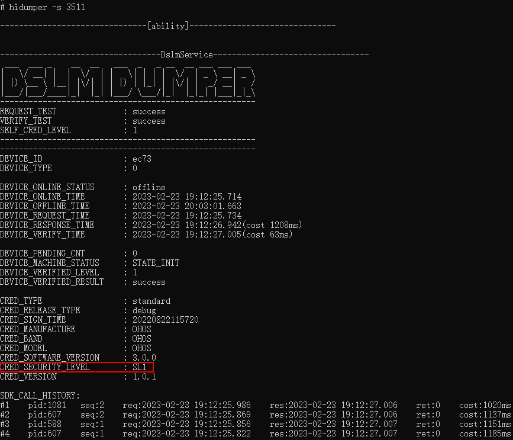

# Access Control Based on Device Classification and Data Classification

## Basic Concepts

Distributed data management implements classified and hierarchical protection for data, providing access control mechanisms based on data security labels and device security levels.

Higher data security labels and device security levels correspond to stricter encryption measures and access control policies, resulting in higher data security.

### Data Security Labels

According to data classification and hierarchical specifications, data can be divided into four security levels: S1, S2, S3, and S4.

| Risk Level | Risk Criteria | Definition | Examples |
| ---------- | ------------ | ---------- | -------- |
| Critical | S4 | Special data types defined by industry laws and regulations, involving the most private information of individuals. Leakage, tampering, destruction, or loss may cause significant adverse impacts on individuals or organizations. | Political views, religious and philosophical beliefs, trade union membership, genetic data, biometric data, health and sexual life status, sexual orientation, or device authentication credentials, personal credit card and financial information. |
| High | S3 | Leakage, tampering, destruction, or loss of data may cause severe adverse impacts on individuals or organizations. | Real-time precise location information, movement trajectories, etc. |
| Medium | S2 | Leakage, tampering, destruction, or loss of data may cause serious adverse impacts on individuals or organizations. | Detailed communication addresses, names or nicknames, etc. |
| Low | S1 | Leakage, tampering, destruction, or loss of data may cause limited adverse impacts on individuals or organizations. | Gender, nationality, user application records, etc. |

### Device Security Levels

<!--RP1-->
Based on device security capabilities (e.g., whether it has TEE, secure storage chips, etc.), device security levels are divided into five levels: SL1, SL2, SL3, SL4, and SL5. For example, development boards like rk3568 and hi3516 are low-security SL1 devices, while tablets are high-security SL4 devices.

During device networking, you can use the `hidumper -s 3511` command to check the device's security level. If no result is returned, you can manually start the corresponding process using `service_control start dslm_service` and then re-run the `hidumper` command. For example, the security level query for an rk3568 device is as follows:
<!--RP1End-->
<!--Del-->

<!--DelEnd-->

## Cross-Device Synchronization Access Control Mechanism

During cross-device data synchronization, data management enforces access control based on data security labels and device security levels. The rule is: Data can be synchronized from the local device to the peer device only if the local device's data security label does not exceed the peer device's security level; otherwise, synchronization is prohibited. The specific access control matrix is as follows:

| Device Security Level | Synchronizable Data Security Labels |
| --------------------- | ----------------------------------- |
| SL1 | S1 |
| SL2 | S1~S2 |
| SL3 | S1~S3 |
| SL4 | S1~S4 |
| SL5 | S1~S4 |

<!--RP2-->
For example, development board devices like rk3568 and hi3516 have a security level of SL1. If a database with a data security label of S1 is created, its data can be synchronized among these devices. However, databases with labels S2-S4 cannot be synchronized among these devices.
<!--RP2End-->

## Scenario Description

The access control mechanism of distributed databases ensures security during data storage and synchronization. When creating a database, the security label should be set appropriately based on data classification and hierarchical specifications to ensure consistency between the database content and its label.

## Implementing Data Classification with Key-Value Databases

Key-value databases use the `securityLevel` parameter to set the database's security level. Below is an example of creating a database with security level S1.

For specific interfaces and functionalities, refer to [Distributed Key-Value Database](../../../en/application-dev/reference/ArkData/cj-apis-distributed_kv_store.md).

> **Note:**
>
> In single-device usage scenarios, KV databases support upgrading the security level by modifying the `securityLevel` parameter during database opening. The following points should be noted for security level upgrades:
>
> * This operation is not supported for databases requiring cross-device synchronization. Databases with different security levels cannot synchronize data. For databases requiring cross-device synchronization, it is recommended to create a new database with a higher security level.
> * This operation requires closing the current database first, modifying the `securityLevel` parameter, and then reopening the database.
> * This operation only supports upgrades, not downgrades. For example, S2->S3 is allowed, but S3->S2 is not.

1. Obtain the context.

    <!-- compile -->

    ```cangjie
    // main_ability.cj
    import kit.PerformanceAnalysisKit.Hilog
    import kit.AbilityKit.{UIAbility, AbilityStage, Want, LaunchParam, LaunchReason, UIAbilityContext}

    var globalAbilityContext: Option<UIAbilityContext> = Option<UIAbilityContext>.None

    class MainAbility <: UIAbility {
        public init() {
            super()
            registerSelf()
        }

        public override func onCreate(want: Want, launchParam: LaunchParam): Unit {
            // Obtain the context
            globalAbilityContext = this.context

            match (launchParam.launchReason) {
                case LaunchReason.StartAbility => Hilog.info(0, "cangjie", "START_ABILITY")
                case _ => ()
            }
        } 
        // ...
    }
    ```

2. Create a key-value database with security level S1.

    <!-- compile -->

    ```cangjie
    // xxx.cj
    import kit.ArkData.{DistributedKVStore, KVManagerConfig}
    import ohos.business_exception.BusinessException
    import kit.AbilityKit.getStageContext
    import ohos.data.distributed_kv_store.Options as KVOptions
    import ohos.data.distributed_kv_store.SecurityLevel as KVSecurityLevel

    try {
        let context = globalAbilityContext.getOrThrow()
        let kvManagerConfig = KVManagerConfig(globalAbilityContext.getOrThrow(), "com.example.datamanagertest")
        // Create a KVManager instance
        let kvManager = DistributedKVStore.createKVManager(kvManagerConfig)
        Hilog.info(0, "cangjie", "Succeeded in creating KVManager.")

        let options = KVOptions(
            KVSecurityLevel.S1, // Set security level to S1
            createIfMissing: true,
            encrypt: true,
            backup: false,
            autoSync: false,
        )
        let kvStore = kvManager.getKVStore("storeId", options)
        Hilog.info(0, "cangjie", "getSingleKVStore success")
    } catch (e: BusinessException) {
        Hilog.error(0, "ErrorCode: ${e.code}", e.message)
    }
    // Perform other database-related operations
    // ...
    ```

## Implementing Data Classification with Relational Databases

Relational databases use the `securityLevel` parameter to set the database's security level. Below is an example of creating a database with security level S1.

For specific interfaces and functionalities, refer to [Relational Database](../../../en/application-dev/reference/ArkData/cj-apis-relational_store.md).

1. Obtain the context.

    <!-- compile -->

    ```cangjie
    // main_ability.cj
    import kit.PerformanceAnalysisKit.Hilog
    import kit.AbilityKit.{UIAbility, AbilityStage, Want, LaunchParam, LaunchReason, UIAbilityContext}

    var globalAbilityContext: Option<UIAbilityContext> = Option<UIAbilityContext>.None

    class MainAbility <: UIAbility {
        public init() {
            super()
            registerSelf()
        }

        public override func onCreate(want: Want, launchParam: LaunchParam): Unit {
            // Obtain the context
            globalAbilityContext = this.context

            match (launchParam.launchReason) {
                case LaunchReason.StartAbility => Hilog.info(0, "cangjie", "START_ABILITY")
                case _ => ()
            }
        } 
        // ...
    }
    ```

2. Create a relational database with security level S1.

    <!-- compile -->

    ```cangjie
    // xxx.cj
    import kit.ArkData.{StoreConfig, getRdbStore}
    import ohos.business_exception.BusinessException
    import ohos.data.relational_store.SecurityLevel as RelationalStoreSecurityLevel

    try {
        let context = globalAbilityContext.getOrThrow()
        let storeConfig = StoreConfig(
            RelationalStoreSecurityLevel.S1, // Set security level to S1
            name: "RdbTest.db",
        )
        let rdbStore = getRdbStore(context, storeConfig)
        Hilog.info(0, "cangjie", "getRdbStore success")
    } catch (e: BusinessException) {
        Hilog.error(0, "ErrorCode: ${e.code}", e.message)
    }
    // Perform other database-related operations
    // ...
    ```