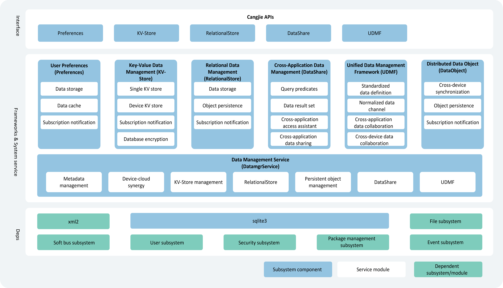

# Introduction to ArkData

## Features

ArkData (Ark Data Management) provides developers with capabilities for data storage, data management, and data synchronization. For example, contact application data can be saved to a database, offering management mechanisms for database security, reliability, and shared access, as well as supporting synchronization of contact information with smartwatches.

- **Standardized Data Definition**: Provides OpenHarmony with a unified data type standard for cross-application and cross-device scenarios, including standardized data types and data structures.
- **Data Storage**: Offers general-purpose data persistence capabilities, categorized into user preferences, key-value databases, and relational databases based on data characteristics.
- **Data Management**: Delivers efficient data management capabilities, including permission management, data backup and recovery, and a data sharing framework.
- **Data Synchronization**: Enables cross-device data synchronization, such as distributed objects supporting in-memory object sharing across devices and distributed databases supporting cross-device database access.

Databases created by applications are stored in the application sandbox. When an application is uninstalled, its databases are automatically deleted.

## Operation Mechanism

The data management module includes user preferences, key-value data management, relational data management, distributed data objects, cross-application data management, and a unified data management framework. The Interface layer provides standardized Cangjie APIs, defining component interface descriptions for developer reference. The Frameworks & System Service layer is responsible for implementing component data storage and synchronization functionalities, along with dependencies on SQLite and other subsystems.

  **Figure 1** Data Management Architecture

   <!-- ToBeReviewd -->

- **Preferences**: Provides lightweight persistent storage for configuration data and supports subscription to data change notifications. Does not support distributed synchronization; commonly used for saving application configuration information and user preferences.
- **KV-Store**: Offers read/write, encryption, manual backup, and subscription notification capabilities for key-value databases. When an application requires distributed capabilities for key-value databases, KV-Store sends synchronization requests to DatamgrService to complete cross-device data synchronization.
- **RelationalStore**: Provides CRUD (Create, Read, Update, Delete), encryption, manual backup, and subscription notification capabilities for relational databases. When an application requires distributed capabilities for relational databases, the RelationalStore component sends synchronization requests to DatamgrService to complete cross-device data synchronization.
- **DataShare**: Enables data provider (provider), data consumer (consumer), and cross-application data interaction on the same device, including CRUD operations and subscription notifications. DataShare is not bound to any specific database and can interface with relational databases, key-value databases, or even custom databases for C/C++ applications. In addition to the standard provider-consumer model, it supports silent data access, where data is accessed directly through DatamgrService without launching the provider (currently, only relational databases support silent data access).
- **UDMF (Unified Data Management Framework)**: Establishes standards for cross-application and cross-device data interaction, defining a data language for such scenarios to improve efficiency. Provides secure and standardized data pathways, supporting different levels of data access permissions and lifecycle management policies for efficient cross-application and cross-device data sharing.
- **DatamgrService**: Offers synchronization and cross-application sharing capabilities for other components, including cross-device synchronization for RelationalStore and KV-Store, as well as silent data access for DataShare providers.