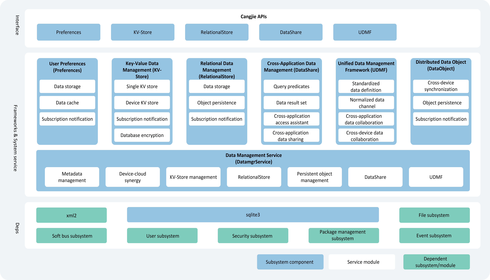

# Introduction to ArkData

## Features

ArkData (Ark Data Management) provides developers with capabilities for data storage, data management, and data synchronization. For example, contact application data can be saved to a database, offering secure, reliable, and shared access management mechanisms. It also supports synchronizing contact information with smartwatches.

- **Standardized Data Definition**: Provides OpenHarmony with unified data type standards across applications and devices, including standardized data types and data structures.
- **Data Storage**: Offers general-purpose data persistence capabilities, categorized into user preferences, key-value databases, and relational databases based on data characteristics.
- **Data Management**: Delivers efficient data management capabilities, including permission management, data backup and recovery, and data sharing frameworks.
- **Data Synchronization**: Enables cross-device data synchronization. For instance, distributed objects support memory object sharing across devices, while distributed databases facilitate cross-device database access.

Databases created by applications are stored in the application sandbox. When an application is uninstalled, its database is automatically deleted.

## Operation Mechanism

The data management module includes user preferences, key-value data management, relational data management, distributed data objects, cross-application data management, and a unified data management framework. The Interface layer provides standardized Changjie APIs, defining component interface descriptions for developer reference. The Frameworks & System Service layer implements component data storage and synchronization functionalities, along with dependencies on SQLite and other subsystems.

  **Figure 1** Data Management Architecture

   <!-- ToBeReviewd -->

- **User Preferences (Preferences)**: Provides lightweight configuration data persistence and supports subscription to data change notifications. It does not support distributed synchronization and is commonly used to store application configuration information and user preferences.
- **Key-Value Data Management (KV-Store)**: Offers read/write, encryption, manual backup, and subscription notification capabilities for key-value databases. When distributed capabilities are required, KV-Store sends synchronization requests to DatamgrService to complete cross-device data synchronization.
- **Relational Data Management (RelationalStore)**: Provides CRUD (Create, Read, Update, Delete), encryption, manual backup, and subscription notification capabilities for relational databases. For distributed capabilities, RelationalStore sends synchronization requests to DatamgrService for cross-device data synchronization.
- **Cross-Application Data Management (DataShare)**: Supports data providers (providers), data consumers (consumers), and CRUD operations with subscription notifications for cross-application data interaction on the same device. DataShare is not bound to any specific database and can interface with relational or key-value databases. For C/C++ applications, developers can even encapsulate their own databases. In addition to the standard provider-consumer model, it supports silent data access, where data is accessed directly through DatamgrService without launching the provider (currently, only relational databases support silent data access).
- **Unified Data Management Framework (UDMF)**: Establishes standards for cross-application and cross-device data interaction, defining a data language to enhance efficiency. It provides secure, standardized data pathways, supports varying levels of data access permissions and lifecycle management policies, and enables efficient data sharing across applications and devices.
- **Data Management Service (DatamgrService)**: Facilitates synchronization and cross-application sharing for other components, including cross-device synchronization for RelationalStore and KV-Store, as well as silent data access for DataShare providers.