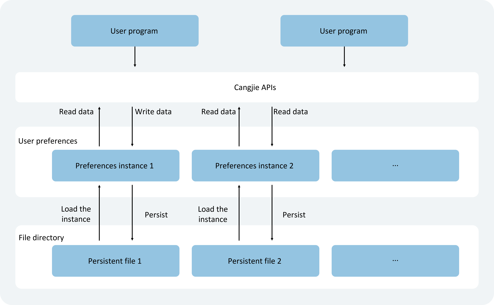

# Implementing Data Persistence Through User Preferences

<!--Del-->
> **Note:**
>
> Currently in the beta phase.
<!--DelEnd-->

## Scenario Description

User Preferences provide applications with Key-Value pair data processing capabilities, supporting lightweight data persistence, modification, and querying. When users need a globally unique storage location, User Preferences can be utilized. Preferences cache this data in memory. When users read data, it can be quickly retrieved from memory. For persistence, the `flush` interface can be used to write memory data into persistent files. As the volume of stored data increases, the memory footprint of the application also grows. Therefore, Preferences are not suitable for storing excessive data and do not support configuration encryption. Typical use cases include saving user personalization settings (e.g., font size, night mode toggle).

## Operational Mechanism

As shown in the diagram, user programs interact with preference data files through the Cangjie interface. Developers can load the contents of User Preferences persistent files into a Preferences instance. Each file uniquely corresponds to one Preferences instance, which is stored in memory via a static container until actively removed or the file is deleted.

The persistent files for application preferences are stored within the application sandbox and can be accessed via the context to obtain their path.

**Figure 1** User Preferences Operational Mechanism

 <!-- ToBeReviewd -->

## Constraints

- Preferences do not guarantee process concurrency safety, posing risks of file corruption and data loss. They are not suitable for multi-process scenarios.
- Keys must be of string type, non-empty, and no longer than 1024 bytes.
- If the value is a string, UTF-8 encoding must be used. It can be empty but must not exceed 16MB when populated.
- When storing data containing non-UTF-8 strings, use the `Uint8Array` type to avoid persistent file format errors and corruption.
- After calling `removePreferencesFromCache` or `deletePreferences`, data change subscriptions are automatically canceled. Re-subscription is required after reacquiring Preferences via `getPreferences`.
- Concurrent calls to `deletePreferences` with other interfaces across threads or processes are prohibited, as they may lead to undefined behavior.
- Memory usage increases with data volume, so storage should be lightweight. It is recommended to store no more than 10,000 entries to avoid excessive memory overhead.

## Interface Specifications

Below are key interfaces for User Preferences persistence. For more details, refer to [User Preferences](../reference/ArkData/cj-apis-preferences.md).

| Interface Name                                             | Description                                         |
| --------------------------------------------------- | ----------------------------------------------|
| `getPreferences(context: StageContext, options: PreferencesOptions): Preferences` | Obtains a Preferences instance. |
| `put(key: String, value: PreferencesValueType): Unit`   | Writes data to a Preferences instance. Use `flush` to persist. |
| `has(key: String): Bool`  | Checks if the Preferences instance contains a key-value pair for the given key (non-empty). |
| `get(key: String, defValue: PreferencesValueType): PreferencesValueType`   | Retrieves the value for a key. Returns `defValue` if the value is null or of an unexpected type. |
| `delete(key: String): Unit`  | Removes the key-value pair for the given key from the Preferences instance. |
| `flush(): Unit`   | Asynchronously persists the current Preferences instance data to a User Preferences file. |
| `on(tp: String, callback: Callback1Argument<String>): Unit` | Subscribes to data changes. The callback is triggered after `flush` when subscribed data changes. |
| `off(tp: String, callback: Callback1Argument<String>): Unit` | Unsubscribes from data changes.  |
| `deletePreferences(context: StageContext, options: PreferencesOptions): Unit` | Removes the specified Preferences instance from memory. If a persistent file exists, it is also deleted. |

## Development Procedure

1. Import modules.

    <!-- compile -->

    ```cangjie
    // xxx.cj
    import kit.ArkData.{ Preferences, PreferencesValueType, PreferencesEvent }
    import kit.ArkUI.Callback1Argument
    ```

2. Obtain a Preferences instance.

    <!-- compile -->

    ```cangjie
    // main_ability.cj
    import kit.PerformanceAnalysisKit.Hilog
    import kit.AbilityKit.{UIAbility, AbilityStage, Want, LaunchParam, LaunchReason, UIAbilityContext}
    import kit.ArkData.{ Preferences}
    import ohos.data.preferences.PreferencesOptions

    var globalAbilityContext: Option<UIAbilityContext> = Option<UIAbilityContext>.None
    var dataPreferences: Option<Preferences> = Option<Preferences>.None

    class MainAbility <: UIAbility {
        public init() {
            super()
            registerSelf()
        }

        public override func onCreate(want: Want, launchParam: LaunchParam): Unit {
            // Get context
            globalAbilityContext = this.context

            match (launchParam.launchReason) {
                case LaunchReason.StartAbility => Hilog.info(0, "cangjie", "START_ABILITY")
                case _ => ()
            }
        } 

        public override func onWindowStageCreate(windowStage: WindowStage): Unit {
            Hilog.info(0, "cangjie", "MainAbility onWindowStageCreate.")
            windowStage.loadContent("EntryView")

            let options = PreferencesOptions("myStore")
            // Obtain Preferences instance
            dataPreferences = Preferences.getPreferences(getStageContext(this.context), options)
        }
        // ...
    }
    ```

3. Write data.

    Use `put()` to save data to the cached Preferences instance. After writing, call `flush()` to persist the data if needed.

    > **Note:**
    >
    > `put()` overwrites existing values. Use `has()` to check for key existence.

    Example:

    To write data, the following packages need to be imported:

    <!-- compile -->

    ```cangjie
    // xxx.cj
    import ohos.data.preferences.PreferencesValueType
    ```

    The core code for write data is:

    <!-- compile -->

    ```cangjie
    if (dataPreferences.getOrThrow().has("startup")) {
        Hilog.info(0, "cangjie", "The key 'startup' is contained.")
    } else {
        Hilog.info(0, "cangjie", "The key 'startup' does not contain.")
        // Example: Write data when key doesn't exist
        dataPreferences.getOrThrow().put("startup", PreferencesValueType.StringData("auto"))
    }
    ```

4. Read data.

    Use `get()` to retrieve values. Returns the default value if the key is null or of an unexpected type.

    Example:

    <!-- compile -->

    ```cangjie
    // xxx.cj
    let val = dataPreferences.getOrThrow().get("startup", PreferencesValueType.StringData("default"))
    match(val) {
        case PreferencesValueType.StringData(n) => Hilog.info(0, "cangjie", "The startup's value")
        case _ => Hilog.info(0, "cangjie", "error, value not string")
    }
    ```

5. Delete data.

    Use `delete()` to remove a key-value pair:

    <!-- compile -->

    ```cangjie
    // xxx.cj
    dataPreferences.getOrThrow().delete("startup")
    ```

6. Data persistence.

    Call `flush()` to persist data after modifications:

    <!-- compile -->

    ```cangjie
    // xxx.cj
    dataPreferences.getOrThrow().flush()
    ```

7. Subscribe to data changes.

    Define a custom `Callback` for change notifications. The callback triggers after `flush()` when subscribed keys change.

    Example:

    To subscribe to data changes, the following class need to be defined:

    <!-- compile -->

    ```cangjie
    // xxx.cj
    // Custom callback
    class Callback <: Callback1Argument<String> {
        public func invoke(err: ?BusinessException, arg: String): Unit {
            Hilog.info(1, "info", "callback： ${arg.toString()}")
        }
    }
    ```

    The core code for subscribe to data changes is:

    <!-- compile -->

    ```cangjie
    let preferenceCallback = Callback()
    dataPreferences.getOrThrow().on(PreferencesEvent.PreferencesChange, preferenceCallback)
    // Change data from "auto" to "manual"
    dataPreferences.getOrThrow().put("startup", PreferencesValueType.StringData("manual"))
    Hilog.info(0, "cangjie", "Succeeded in putting the value of 'startup'.")
    dataPreferences.getOrThrow().flush()
    ```

8. Delete specific files.

    Use `deletePreferences()` to remove a Preferences instance from memory, including its persistent file (if any).

    > **Note:**
    >
    > - After calling this, the Preferences instance becomes unusable to prevent data inconsistency.
    > - Deleted data/files cannot be recovered.

    Example:

    <!-- compile -->

    ```cangjie
    // xxx.cj
    try {
        // Delete Preferences instance
        Preferences.deletePreferences(getStageContext(globalAbilityContext.getOrThrow()), "myStore")
    } catch (e: Exception) {
        Hilog.info(0, "cangjie", "delete Preferences failed")
    }
    ```