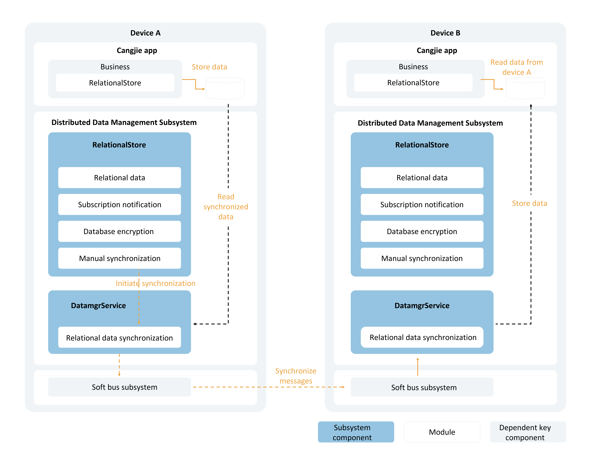

# Cross-Device Data Synchronization for Relational Databases

## Scenario Description

When an application's locally stored relational data requires cross-device synchronization, you can either migrate the table data that needs synchronization to new tables supporting cross-device functionality, or configure the tables to support cross-device synchronization immediately after creation.

## Basic Concepts

Cross-device data synchronization for relational databases enables applications to synchronize stored relational data across multiple devices.

- After creating new tables in the database, applications can designate them as distributed tables. When querying remote device databases, the distributed table names on specified remote devices can be obtained based on local table names.
- Data synchronization between devices can be achieved through two methods: pushing data from the local device to remote devices or pulling data from remote devices to the local device.

## Operation Mechanism

The underlying communication component handles device discovery and authentication, notifying upper-layer applications when devices come online. Upon receiving device online notifications, the data management service can establish encrypted data transmission channels between devices, enabling data synchronization through these channels.

### Cross-Device Data Synchronization Mechanism

   <!-- ToBeReviewd -->

After writing data to the relational database, the business logic initiates a synchronization request to the data management service.

The data management service reads the to-be-synchronized data from the application sandbox and transmits it to the data management service of other devices based on their deviceId. The remote data management service then writes the data into the same application's database.

### Data Change Notification Mechanism

Subscribers receive notifications for database insertions, deletions, and modifications. These notifications are primarily categorized into local data change notifications and distributed data change notifications.

- **Local Data Change Notification:** Applications on the local device subscribe to data change notifications and receive alerts when data is inserted, deleted, or modified in the database.
- **Distributed Data Change Notification:** Applications subscribe to notifications for data changes on other devices within the network group, receiving alerts when remote devices perform insertions, deletions, or modifications.

## Constraints

- Each application supports a maximum of 16 simultaneously open relational distributed databases.
- A single database supports registering up to 8 callbacks for data change subscriptions.
- Tables containing composite keys cannot be designated as distributed tables.

## API Description

The following interfaces support cross-device data synchronization for relational distributed databases. For more interfaces and usage details, refer to [Relational Database](../../../en/application-dev/reference/ArkData/cj-apis-relational_store.md).

| API Name | Description |
| -------- | -------- |
| setDistributedTables(tables: Array\<String>): Unit | Configures tables for distributed synchronization. |
| sync(mode: SyncMode, predicates: RdbPredicates): Array\<(String, Int32)> | Performs distributed data synchronization. |
| onDataChange(`type`: SubscribeType, callback: Callback1Argument\<Array\<String>>): Unit | Subscribes to distributed data changes. |
| offDataChange(`type`: SubscribeType, callback: Callback1Argument\<Array\<String>>): Unit | Unsubscribes from distributed data changes. |

## Development Procedure

> **Note:**
>
> Data can only be synchronized to devices with security labels not exceeding the remote device's security level. For specific rules, refer to [Cross-Device Synchronization Access Control Mechanism](cj-access-control-by-device-and-data-level.md#跨设备同步访问控制机制).

1. Import modules.

    <!-- compile -->

    ```cangjie
    import ohos.data.relational_store.SecurityLevel as RelationalStoreSecurityLevel
    import ohos.business_exception.BusinessException
    ```

2. Request permissions.

   (1) The ohos.permission.DISTRIBUTED_DATASYNC permission must be requested. For configuration details, refer to [Permission Declaration](../security/AccessToken/cj-declare-permissions.md).

   (2) User authorization must be requested via pop-up during the application's first launch. For usage details, refer to [Requesting User Authorization](../security/AccessToken/cj-request-user-authorization.md).

3. Create a relational database and configure tables requiring distributed synchronization.

    <!-- compile -->

    ```cangjie
    // main_ability.cj
    import kit.AbilityKit.{UIAbility, AbilityStage, Want, LaunchParam, LaunchReason, UIAbilityContext}
    import ohos.data.relational_store.RdbStore
    import kit.ArkData.{StoreConfig, getRdbStore, RdbPredicates}
    import kit.ArkUI.{WindowStage}

    var rdbStore: Option<RdbStore> = Option<RdbStore>.None

    class MainAbility <: UIAbility {
        public init() {
            super()
            registerSelf()
        }

        public override func onCreate(want: Want, launchParam: LaunchParam): Unit {
            match (launchParam.launchReason) {
                case LaunchReason.StartAbility => Hilog.info(0, "cangjie", "START_ABILITY")
                case _ => ()
            }
        }

        public override func onWindowStageCreate(windowStage: WindowStage): Unit {
            Hilog.info(0, "cangjie", "MainAbility onWindowStageCreate.")
            windowStage.loadContent("EntryView")

            let storeConfig = StoreConfig(
                RelationalStoreSecurityLevel.S3, // Database security level
                name: "RdbTest.db", // Database filename
                
            )

            try {
                let store = getRdbStore(this.context, storeConfig)
                store.executeSql("CREATE TABLE EMPLOYEE(ID int NOT NULL, NAME varchar(255) NOT NULL, AGE int, SALARY float NOT NULL, CODES Bit NOT NULL, PRIMARY KEY (Id))")
                store.setDistributedTables(['EMPLOYEE'])
                rdbStore = store
                // Subsequent data operations can be performed
            } catch (e: BusinessException) {
                Hilog.error(0, "ErrorCode: ${e.code}", e.message)
            }
            // ...
        }
    }
    ```