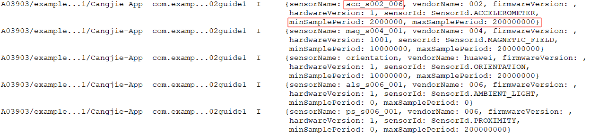
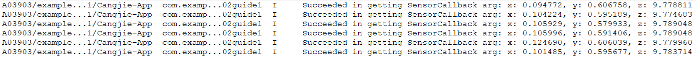
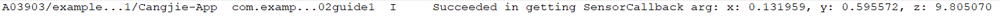

# Sensor Development Guide (Cangjie)

## Scenario Description

When a device needs to acquire sensor data, the sensor module can be utilized. For example: subscribing to orientation sensor data to perceive the current device orientation, or subscribing to step counter sensor data to track user step counts.

For detailed API documentation, refer to [Sensor API](../../../../en/application-dev/reference/SensorServiceKit/cj-apis-sensor.md).

## Interface Specifications

| Name | Description |
| -------- | -------- |
| on\<T>(\`type\`:SensorId, callback:Callback1Argument\<T>, option:?SensorOptions):Unit where T <: Response | Continuously monitors sensor data changes. |
| once\<T>(\`type\`:SensorId, callback:Callback1Argument\<T>):Unit where T <: Response | Acquires a single sensor data change. |
| off(\`type\`: SensorId, callback!: ?CallbackObject = None): Unit | Unregisters sensor data monitoring. |
| getSensorList():Array\<Sensor> | Retrieves all sensor information on the device. |

## Development Procedure

The development procedure is demonstrated using the accelerometer sensor (ACCELEROMETER) as an example.

1. Import modules.

    <!-- compile -->

    ```cangjie
    import kit.ArkUI.{BusinessException, Callback1Argument}
    import kit.SensorServiceKit.*
    ```

2. Query all supported sensor parameters on the device.

    <!-- compile -->

    ```cangjie
    try {
        let sensors = getSensorList()
        for (index in 0..sensors.size) {
            AppLog.info("{sensorName: ${sensors[index].sensorName}, vendorName: ${sensors[index].vendorName}, firmwareVersion: ${sensors[index].firmwareVersion}, \n hardwareVersion: ${sensors[index].hardwareVersion}, sensorId: ${sensors[index].sensorId}, \n minSamplePeriod: ${sensors[index].minSamplePeriod}, maxSamplePeriod: ${sensors[index].maxSamplePeriod}}")
        }
    } catch (e: BusinessException) {
        AppLog.error("Failed to get sensor list. Code: ${e.code}, message: ${e.message}")
    }
    ```

    

    The minimum sampling period supported by this sensor is 2,000,000 nanoseconds, and the maximum sampling period is 200,000,000 nanoseconds. Different sensors support varying sampling period ranges. The interval should be set within the sensor's supported range—values exceeding the maximum will default to the maximum, while values below the minimum will default to the minimum. Smaller values result in more frequent data reporting but higher power consumption.

3. Verify that the required permissions are configured. For permission requirements of different sensors, refer to [Sensor Development Overview](./cj-sensor-overview.md#constraints-and-limitations). For configuration details, see [Declaring Permissions](../../security/AccessToken/cj-declare-permissions.md). To request permissions, refer to [Requesting User Authorization](../../security/AccessToken/cj-request-user-authorization.md).

4. Register monitoring. Sensor call results can be monitored via either the on() or once() interface.

   Using the on() interface enables continuous sensor monitoring, with the sensor reporting interval set to 100,000,000 nanoseconds.

    <!-- compile -->

    ```cangjie
    // Custom callback
    class SensorCallback <: Callback1Argument<AccelerometerResponse>
    {
        init() {}
        public func invoke(arg: AccelerometerResponse): Unit {
            AppLog.info("Succeeded in getting SensorCallback arg: x: ${arg.x}, y: ${arg.y}, z: ${arg.z}")
        }
    }

    func onExample() {
        let callback = SensorCallback()
        try {
            // The development steps for periodic sensors and instantaneous sensors are the same. 
            // The difference is that periodic sensors collect and output data at preset fixed time intervals defined by the option, whereas instantaneous sensors collect and output data when triggered by specific events, unaffected by the option.
            on(SensorId.ACCELEROMETER, callback, option: SensorOptions(SensorNumber(100000000)))
        } catch (e: BusinessException) {
            AppLog.error("Sensor on error code: ${e.code}, message: ${e.message}")
        }
    }
    ```

    

   Using the once() interface enables single-event sensor monitoring.

    <!-- compile -->

    ```cangjie
    // Custom callback
    class SensorCallback <: Callback1Argument<AccelerometerResponse>
    {
        init() {}
        public func invoke(arg: AccelerometerResponse): Unit {
            AppLog.info("Succeeded in getting SensorCallback arg: x: ${arg.x}, y: ${arg.y}, z: ${arg.z}")
        }
    }

    func onceExample() {
        try {
            let callback = SensorCallback()
            once(SensorId.ACCELEROMETER, callback)
        } catch (e: BusinessException) {
            AppLog.error("Sensor once error code: ${e.code}, message: ${e.message}")
        }
    }
    ```

    

5. Cancel continuous monitoring.

    <!-- compile -->

    ```cangjie
    func offExample() {
        try {
            // Unregister all callbacks for SensorId.ORIENTATION
            off(SensorId.ACCELEROMETER)
        } catch (e: BusinessException) {
            AppLog.error("Sensor off error code: ${e.code}, message: ${e.message}")
        }
    }
    ```

## Notes

The development of sensors is similar to the aforementioned accelerometer ACCELEROMETER. It should be noted that sensors are categorized into periodic sensors and instantaneous sensors based on their data collection methods. Periodic sensors collect and output data at preset fixed intervals, such as the ambient temperature sensor AMBIENT_TEMPERATURE. After subscription, the sensor reports data according to the designed time intervals. Periodic sensors include GRAVITY, AMBIENT_TEMPERATURE, HUMIDITY, BAROMETER, and others. Instantaneous sensors collect and output data only when triggered by specific events, such as the pedometer sensor PEDOMETER, which reports when there is a change in step count. Instantaneous sensors include HALL, PROXIMITY, WEAR_DETECTION, PEDOMETER, and PEDOMETER_DETECTION.