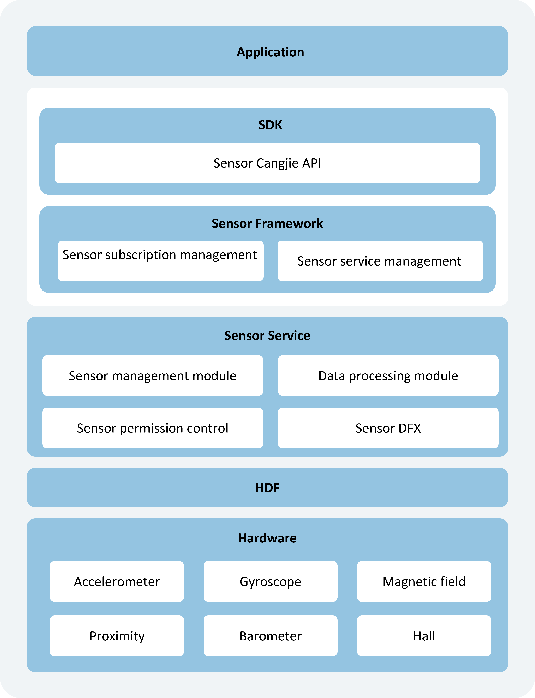

# Sensor Development Overview

## Sensor Types

System sensors are device abstractions that allow applications to access underlying hardware sensors. By utilizing the [Sensor interface](../../../../en/application-dev/reference/SensorServiceKit/cj-apis-sensor.md), developers can query device sensors, subscribe to sensor data, and develop various applications with customized algorithms based on sensor data, such as compasses, fitness trackers, and games.

| Sensor Type                  | Description               | Notes                                                         | Primary Applications                                   |
| --------------------------- | ------------------ | ------------------------------------------------------------ | ------------------------------------------ |
| ACCELEROMETER               | Accelerometer       | Measures acceleration (including gravitational acceleration) applied to the device along three physical axes (x, y, and z), unit: m/s². | Detects motion states.                             |
| ACCELEROMETER_UNCALIBRATED  | Uncalibrated Accelerometer | Measures uncalibrated acceleration (including gravitational acceleration) applied to the device along three physical axes (x, y, and z), unit: m/s². | Estimates acceleration bias.                       |
| LINEAR_ACCELEROMETER        | Linear Accelerometer   | Measures linear acceleration (excluding gravitational acceleration) applied to the device along three physical axes (x, y, and z), unit: m/s². | Detects linear acceleration along each axis.           |
| GRAVITY                     | Gravity Sensor         | Measures gravitational acceleration applied to the device along three physical axes (x, y, and z), unit: m/s². | Measures gravitational force.                             |
| GYROSCOPE                   | Gyroscope Sensor       | Measures the device's angular velocity of rotation along three physical axes (x, y, and z), unit: rad/s. | Measures rotational angular velocity.                         |
| GYROSCOPE_UNCALIBRATED      | Uncalibrated Gyroscope Sensor | Measures the device's uncalibrated angular velocity of rotation along three physical axes (x, y, and z), unit: rad/s. | Measures rotational angular velocity and bias estimation.               |
| SIGNIFICANT_MOTION          | Significant Motion Sensor   | Detects whether the device is undergoing significant motion along three physical axes (x, y, and z); a value of 1 indicates significant motion, while 0 indicates none. | Detects significant device motion.           |
| PEDOMETER_DETECTION         | Pedometer Detection Sensor   | Detects user walking steps; a value of 1 indicates walking motion, while 0 indicates no motion. | Detects user walking actions.             |
| PEDOMETER                   | Pedometer Sensor       | Counts user walking steps.                                         | Provides step count data.               |
| AMBIENT_TEMPERATURE         | Ambient Temperature Sensor     | Measures ambient temperature, unit: Celsius (°C).            | Measures environmental temperature.                             |
| MAGNETIC_FIELD              | Magnetic Field Sensor         | Measures the ambient geomagnetic field along three physical axes (x, y, z), unit: μT. | Creates compass applications.                               |
| MAGNETIC_FIELD_UNCALIBRATED | Uncalibrated Magnetic Field Sensor   | Measures the uncalibrated ambient geomagnetic field along three physical axes (x, y, z), unit: μT. | Estimates geomagnetic bias.                         |
| HUMIDITY                    | Humidity Sensor         | Measures relative humidity in the environment, expressed as a percentage (%).            | Monitors dew point, absolute humidity, and relative humidity.             |
| BAROMETER                   | Barometer Sensor       | Measures ambient air pressure, unit: hPa or mbar.       | Measures environmental air pressure.                             |
| ORIENTATION                 | Orientation Sensor         | Measures the device's rotation angles around all three physical axes (z, x, y), unit: rad. | Measures three rotation angles for screen orientation.              |
| ROTATION_VECTOR             | Rotation Vector Sensor     | Measures the device's rotation vector; a composite sensor derived from accelerometer, magnetic field sensor, and gyroscope data. | Detects device orientation relative to the East-North-Up coordinate system.         |
| PROXIMITY                   | Proximity Sensor       | Measures the proximity or distance of visible objects relative to the device display.               | Determines device position during calls.                   |
| AMBIENT_LIGHT               | Ambient Light Sensor       | Measures ambient light intensity around the device, unit: lux.                            | Automatically adjusts screen brightness or detects screen obstructions. |
| HEART_RATE                  | Heart Rate Sensor         | Measures user heart rate.                                         | Provides user health data.               |
| WEAR_DETECTION              | Wear Detection Sensor     | Detects whether the device is being worn.                                           | Determines if a wearable device is being worn.             |
| HALL                        | Hall Sensor         | Detects magnetic attraction around the device.                               | Enables device flip cover mode.                           |

## Operational Mechanism

Sensors consist of four modules: Sensor API, Sensor Framework, Sensor Service, and HDF layer.

**Figure 1** Sensor Architecture

- **Sensor API**: Provides fundamental sensor APIs, including querying sensor lists, subscribing/unsubscribing to sensor data, and executing control commands, simplifying application development.
- **Sensor Framework**: Manages sensor subscriptions, creates/destroys data channels, and handles communication with SensorService.
- **Sensor Service**: Implements HD_IDL layer data reception, parsing, and distribution; manages foreground/background policies, device sensors, and permission control.
- **HDF Layer**: Selects strategies for different FIFOs and frequencies, and adapts to various devices.

## Constraints and Limitations

1. For the sensors listed below, developers must request corresponding permissions to access sensor data.

   | Sensor  | Permission Name  | Sensitivity Level  | Description  |
   | ------- | -------- | -------- | ---------- |
   | Accelerometer, Uncalibrated Accelerometer, Linear Accelerometer | ohos.permission.ACCELEROMETER  | system_grant | Allows applications to read accelerometer data, including: accelerometer, uncalibrated accelerometer, and linear accelerometer. |
   | Gyroscope, Uncalibrated Gyroscope    | ohos.permission.GYROSCOPE   | system_grant | Allows applications to read gyroscope data, including: gyroscope and uncalibrated gyroscope. |
   | Pedometer        | ohos.permission.ACTIVITY_MOTION  | user_grant   | Allows applications to read user motion states, such as detecting movement or counting steps. |
   | Heart Rate Sensor         | ohos.permission.READ_HEALTH_DATA | user_grant   | Allows applications to read user health data, such as heart rate.  |

2. Sensor data subscription and unsubscription interfaces must be called in pairs. Developers must call the unsubscription interface to stop data reporting when sensor data is no longer needed.