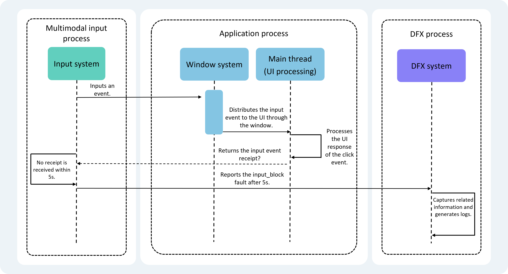
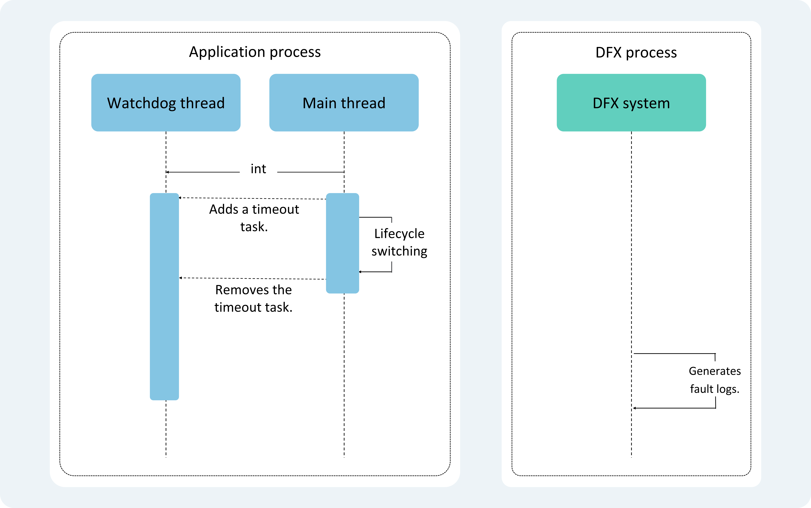

# Analyzing AppFreeze (Application Not Responding)

Users may experience unresponsive clicks or application freezes during usage. When such conditions persist beyond a certain time threshold, they are defined as Application Not Responding (appfreeze) incidents. The system provides mechanisms to detect appfreeze events and generates appfreeze logs for application development analysis.

> **Note:**
>
> This document applies only to applications using the Stage model. Before analyzing logs based on this document, developers should possess foundational knowledge about Cangjie's operation in the system, C++ program stack information, and a basic understanding of relevant application subsystems.

## AppFreeze Detection Capabilities

Currently, appfreeze detection monitors from the following dimensions. Understanding these principles is highly beneficial for developers to locate and analyze appfreeze faults.

| Fault Type | Description |
| ---------- | ----------- |
| THREAD_BLOCK_6S | Application main thread execution timeout due to stagnation. |
| APP_INPUT_BLOCK | User input response timeout. |
| LIFECYCLE_TIMEOUT | Ability lifecycle transition timeout. |

### THREAD_BLOCK_6S - Main Thread Execution Timeout

This fault indicates that the application's main thread is either stalled or overloaded with tasks, affecting task execution fluency and user experience.

Detection principle: The application's watchdog thread periodically inserts liveness checks into the main thread and implements a timeout reporting mechanism in its own thread. If a liveness check isn't executed within 3 seconds, a THREAD_BLOCK_3S warning event is reported. If it remains unexecuted for 6 seconds, a THREAD_BLOCK_6S main thread execution timeout event is reported. These two events combine to generate the THREAD_BLOCK appfreeze log.

Detection principle illustrated below:

### APP_INPUT_BLOCK - User Input Response Timeout

This fault occurs when user click events remain unresponsive beyond a specified time limit, severely impacting user experience.

Detection principle: When a user clicks an application button, the input system sends a click event to the application side. If no response acknowledgment is received within the timeout period, this fault is reported.

Detection principle illustrated below:



### Lifecycle Transition Timeout

Lifecycle transition timeout refers to the[Ability lifecycle](../application-models/cj-uiability-lifecycle.md#uiability-component-lifecycle) transition exceeding time limits.

This fault occurs during lifecycle transitions, affecting the switching between Abilities within the current application.

Detection principle: By monitoring different lifecycle transition processes, timeout tasks are inserted into the watchdog thread at transition start points and removed upon completion. Failure to remove tasks within the fixed timeframe triggers fault reporting.

Lifecycle transition timeouts consist of combined LIFECYCLE_HALF_TIMEOUT and LIFECYCLE_TIMEOUT events. LIFECYCLE_HALF_TIMEOUT serves as a warning event for LIFECYCLE_TIMEOUT, capturing binder information.



Different lifecycles have varying timeout thresholds:

| Lifecycle | Timeout Threshold |
| --------- | ------------------ |
| Load | 10s |
| Terminate | 10s |
| Connect | 3s |
| Disconnect | 0.5s |
| Foreground | 5s |
| Background | 3s |

## AppFreeze Log Analysis

Appfreeze faults require combined analysis of appfreeze logs and continuous hilog streams.

The current example provides only one analysis method. Developers should conduct specific analysis based on actual issues.

### Log Header Information

| Field | Description |
| ----- | ----------- |
| Reason | Appfreeze cause, corresponding to [AppFreeze Detection Capabilities](#appfreeze-detection-capabilities). |
| PID | Process ID at fault occurrence, used to search related process information in continuous logs. |
| PACKAGE_NAME | Application process package name. |

```text
============================================================
Device info:OpenHarmony 3.2
Build info:OpenHarmony 4.0.5.3
Module name:com.xxx.xxx
Version:1.0.0
Pid:1561
Uid:20010039
Reason:LIFECYCLE_TIMEOUT
sysfreeze:LIFECYCLE_TIMEOUT LIFECYCLE_TIMEOUT at 20230317170653
>>>>>>>>>>>>>>>>>>>>>>>>>>>>>>>>>>>>>>>>>>>
DOMAIN:AAFWK
STRINGID:LIFECYCLE_TIMEOUT
TIMESTAMP:2023/XX/XX/XX-XX:XX:XX:XX
PID:1561
UID:20010039
PACKAGE_NAME:com.xxx.xxx
PROCESS_NAME:com.xxx.xxx
MSG:ablity:EntryAbility background timeout
```

### Common Log Body Information

All three log types contain the following sections, searchable by "Key Information Fields":

| Key Information Fields | Description |
| ---------------------- | ----------- |
| EVENTNAME | Appfreeze cause or component events forming appfreeze detection. |
| TIMESTAMP | Event reporting timestamp during fault. Combined with timeout thresholds from [AppFreeze Detection Capabilities](#appfreeze-detection-capabilities), helps narrow log search scope. |
| PID | Process ID during fault, used with timestamp and timeout to search process information. |
| PACKAGE_NAME | Application process package name. |
| MSG | Dump information or explanatory messages during fault (detailed later). |
| BinderCatcher | Inter-process communication information showing long wait times. |
| PeerBinder Stacktrace | Stack traces from peer processes involved in appfreeze. |
| cpuusage | System-wide CPU usage during the period. |
| memory | Process memory usage during the period. |

> **Note:**
>
> Under high system load, low-overhead stack capture methods or timeout situations may lose function symbols and build-id information.

MSG field primarily contains appfreeze causes and information about task accumulation in the application's main thread queue:

- Currently running tasks and their start times: Significant time gaps from log timestamps indicate these tasks as primary appfreeze events.
- Historical task timing: Helps determine if excessive historical tasks with prolonged execution prevent timely new task responses.
- Pending unexecuted tasks.

**Current Process Stack Example:**

Search for PID to find application stack information. The following example shows window IPC communication stalling during event transmission to the system.

```text
OpenStacktraceCatcher -pid==1561 packageName is com.example.myapplication
Result: 0 ( no error )
Timestamp:2017-08-0817:06:53.000
Pid:1561
Uid:20010039
Process name:com.example.myapplication
Tid:1561,Name:i.myapplication
#00 pc 0017888c /system/lib/libark_jsruntime.so
#01 pc 00025779 /system/lib/platformsdk/libipc_core.z.so(OHOS:BinderConnector:WriteBinder(unsigned Long,void*)+56)
#02 pc 000265a5 /system/lib/platformsdk/libipc_core.z.so(OHOS:BinderInvoker:TransactWithDriver(bool)+216)
#03 pc 0002666f /system/lib/platformsdk/libipc_core.z.so(OHOS:BinderInvoker:StartWorkLoop()+18)
#04 pc 000270a9 /system/lib/platformsdk/libipc_core.z.so(OHOS:BinderInvoker:JoinThread(bool)+32)
#05 pc 00023783 /system/lib/platformsdk/libipc_core.z.so(OHOS:IPCWorkThread:ThreadHandler(void*)+290)
#06 pc 00e1c6f7 /system/lib/libace.z.so
#07 pc 0091bbdd /system/lib/libace.z.so
#08 pc 0092fd9d /system/lib/libace.z.so
#09 pc 0092fa5f /system/lib/libace.z.so
#10 pc 0092cd6b /system/lib/libace.z.so
#11 pc 009326a9 /system/lib/libace.z.so
#12 pc 0093054b /system/lib/libace.z.so
#13 pc 009324f3 /system/lib/libace.z.so
#14 pc 003989e1 /system/lib/libace.z.so
#15 pc 0045dd4b /system/lib/libace.z.so
#16 pc 00d24fef /system/lib/libace.z.so
#17 pc 0041e6e9 /system/lib/libace.z.so
#18 pc 0000b4d9 /system/lib/platformsdk/libeventhandler.z.so(OHOS:AppExecFwk:EventHandler:DistributeEvent(std::__h:unique_ptr<0 #19 pc 00012829 /system/lib/platformsdk/libeventhandler.z.so))
#20 pc 00011841 /system/lib/platformsdk/libeventhandler.z.so(OHOS:AppExecFwk:EventRunner:Run()+64)
#21 pc 00054a8b /system/lib/libappkit_native.z.so(OHOS:AppExecFwk:MainThread:Start()+278)
#22 pc 00011503 /system/bin/appspawn
#23 pc 0001141f /system/bin/appspawn
#24 pc 0000ee97 /system/bin/appspawn
```

**BinderCatcher Example:**

Search for PID to identify inter-process communication partners and synchronous wait durations.

This example shows process 1561 waiting over 10 seconds for response from process 685.

```text
PeerBinderCatcher -pid==1561 Layer_==0

BinderCatcher --
    1561:1561 to 685:0 code 0 wait:10.366245919 s
    1329:1376 to 487:794 code 0 wait:0.12070041 s

pid   context  request  started  max  ready free_async_space
1561   binder    0       3       16     4       520192
544    binder    0       4       16     5       520192
1104   binder    0       1       16     2       520192
1397   binder    0       1       16     3       520192
...
```

**PeerBinder Stacktrace Example:**

Shows stack trace of peer appfreeze process 685.

```text
PeerBinder Stacktrace --

PeerBinderCatcher start catcher stacktrace for pid 685
Result: 0 ( no error )
Timestamp:2017-08-0817:06:55.000
Pid:685
Uid:1000
Process name:wifi_manager_service
Tid:658,Name:wifi_manager_service
#00 pc 000669f0 /system/lib/ld-musl-arm.so.1
#01 pc 000c60cc /system/lib/ld-musl-arm.so.1
#02 pc 000c5040 /system/lib/ld-musl-arm.so.1
#03 pc 000c6818 /system/lib/ld-musl-arm.so.1(__pthread_cond_timedwait_time64+596)
#04 pc 000bd058 /system/lib/libc++.so
#05 pc 0008592c /system/lib/ld-musl-arm.so.1(ioctl+72)
#06 pc 00025779 /system/lib/platformsdk/libipc_core.z.so(OHOS:BinderConnector:WriteBinder(unsigned long,void*)+56)
#07 pc 000265a5 /system/lib/platformsdk/libipc_core.z.so(OHOS:BinderInvoker:TransactWithDriver(bool)+216)
#08 pc 0002666f /system/lib/platformsdk/libipc_core.z.so(OHOS:BinderInvoker:StartWorkLoop()+18)
#09 pc 000270a9 /system/lib/platformsdk/libipc_core.z.so(OHOS:BinderInvoker:JoinThread(bool)+32)
#10 pc 00023783 /system/lib/platformsdk/libipc_core.z.so(OHOS:IPCWorkThread:ThreadHandler(void*)+290)
#11 pc 0007b4d9 /system/lib/platformsdk/libeventhandler.z.so
#12 pc 00072829 /system/lib/platformsdk/libeventhandler.z.so
#13 pc 00071841 /system/lib/platformsdk/libeventhandler.z.so(OHOS:AppExecFwk:EventRunner:Run()+64)
#14 pc 00094a8b /system/lib/libappkit_native.z.so(OHOS:AppExecFwk:MainThread:Start()+278)

Tid:1563,Name:IPC_0_1563
#00 pc 0009392c /system/lib/ld-musl-arm.so.1(ioctl+72)
#01 pc 00025779 /system/lib/platformsdk/libipc_core.z.so(OHOS:BinderConnector:WriteBinder(unsigned long,void*)+56)
```

**cpuusage Example:**

System-wide CPU information.

```text
Load average: 2.87 / 1.45 / 0.58; the cpu load average in 1 min,5 min and 15 min
CPU usage from 2023-03-10 17:06:53 to 2023-03-10 17:06:53
Total: 29%; User Space: 28%; Kernel Space: 1%; iowait: 6%; irq: 0%; idle: 62%
Details of Processes:
    PID     Total Usage     User Space     Kernel Space     Page Fault Minor     Page Fault Major      Name
    1561       23%            23%              0%               9985                  26            i.myapplication
    527        1%             1%               0%               3046                  9             hidumper_servic
    242        1%             1%               0%               69799                 280           hiview
```

**memory Example:**

Current process memory information.

```text
-------------------------------------------[memory]----------------------------------------
                 Pss      Shared   Shared   Private  Private   Swap   SwapPss   Heap  Heap
                 Total    CLean    Dirty    CLean    Dirty     Total  Total     Size  Alloc
                 (kB)     (kB)     (kB)     (kB)      (kB)     (kB)    (kB)     (kB)  (kB)
-------------------------------------------------------------------------------------------
guard             0        0         0       0         0         0      0        0      0
native heap      185       0        180      0        160        0      0        0      0
AnonPage other   17881    12        12376    88       15948      0      0        0      0
stack            292       0        0        0        292        0      0        0      0
.S0              5053     63408     4172     1812     2640       0      0        0      0
.ttf             1133     3092      0        4        0          0      0        0      0
dev              10       0         108      8        0          0      0        0      0
FilePage other   121      556       8        0        4          0      0        0      0
------------------------------------------------------------------------------------------
Total            34675    67068     16844    1912     19044      0      0        0      0
```

### Log Body Specific Information (Main Thread AppFreeze Timeout)

Logs with Reason THREAD_BLOCK_6S. As explained in [Main Thread AppFreeze Timeout](#thread_block_6s-main-thread-execution-timeout), THREAD_BLOCK consists of THREAD_BLOCK_3S and THREAD_BLOCK_6S components. Comparing both logs helps accurately determine whether appfreeze results from genuine freezes or excessive task loads.

THREAD_BLOCK_3S appears in the log's first part, followed by THREAD_BLOCK_6S. Search for both events using the EVENTNAME field.

Both events contain MSG fields displaying main thread task queue status at respective timestamps, revealing queuing situations.

The example log shows an event from 05:06:18.145 persisting in the Low priority queue through both THREAD_BLOCK_3S and THREAD_BLOCK_6S reports, indicating main thread appfreeze rather than task overload.

Since THREAD_BLOCK_6S represents main thread appfreeze, focus stack analysis on the main thread (thread ID matching process ID). The example stack traces show execution progressing from ArkUI controls to CJ runtime, confirming appfreeze in CJ code. Identical stack traces at 3S and 6S timestamps confirm CJ-related appfreeze unrelated to task quantity.

THREAD_BLOCK_3S:

```text
start time:2017/08/08-17:06:24:380
DOMAIN = AAFWK EVENTNAME THREAD_BLOCK_3S
TIMESTAMP = 2017/08/08-17:06:24:363
PID = 1561
UID = 20010039
TID = 1566
PACKAGE_NAME com.example.myapplication
PROCESS_NAME com.example.myapplication
eventLog_action pb:1 eventLog_interval 10
MSG = App main thread is not response!EventHandler dump begin curTime:2017-08-08 05:06:24.362
  Event runner (Thread name =Thread ID 1561)is running
  Current Running:start at 2017-08-08 05:06:18.145,Event send thread 1561,send time =2017-08-08 05:06:18.145,handle time =2017-08-08 05:
  Immediate priority event queue information:
  Total size of Immediate events 0
  High priority event queue information:
  No.1 Event send thread 1561,send time 2017-08-08 05:06:18.039,handle time 2017-08-08 05:06:21.539,task name [anr_handler.cpp(Send Total size of High events 1)]
  Low priority event queue information:
  No.1:Event{send thread=1566,send time=2017-08-0805:06:21.062,handle time=2017-08-0805:06:21.062,id=1}
  Total size of Low events 1
  Idle priority event queue information:
  Total size of Idle events 0
  Total event size :2

 Timestamp: 2017-08-0817:06:24.4142447784
 Pid: 1561
 Uid: 20010039
 Process name: com.example.myapplication
 Tid:1561 Name:i.myapplication
```text
 at anonymous entry (D:/project/MyApplication_test/entry/build/default/intermediates/loader_out/default/ets/pages/Index_.js:0:1)
   #00 pc 0017909c /system/lib/libark_jsruntime.so
   #01 pc 00177ebb /system/lib/libark_jsruntime.so
   #02 pc 0024b4bb /system/lib/libark_jsruntime.so
   #03 pc 00fbed23 /system/lib/libace.z.so
   #04 pc 00d8208f /system/lib/libace.z.so
   ...
```

THREAD_BLOCK_6S:

```text
start time: 2017/08/08-17:06:27:299
DOMAIN = AAFWK
EVENTNAME THREAD_BLOCK_6S
TIMESTAMP = 2017/08/08-17:06:27:292
PID = 1561
UID = 20010039
TID = 1566
PACKAGE_NAME com.example.myapplication
PROCESS NAME com.example.myapplication eventLog_action cmd:c,cmd:m,tr,k:SysRqFile
eventLog_interval 10
MSG = App main thread is not responding! EventHandler dump begin curTime:2017-08-08 05:06:27.291
  Event runner (Thread name = Thread ID =1561) is running
  Current Running: start at 2017-08-08 05:06:18.144, Event {send thread 1561, send time =2017-08-08 05:06:18.145, handle time =2017-08-08 05:
  Immediate priority event queue information:
  Total size of Immediate events 0
  High priority event queue information:
  No.1 Event send thread 1561, send time 2017-08-08 05:06:18.039, handle time 2017-08-08 05:06:21.539, task name [arr_handler.cpp(Se Total size of High events 1
  Low priority event queue information:
  No.1: Event{send thread=1566, send time=2017-08-08 05:06:21.062, handle time=2017-08-08 05:06:21.062, id=1}
  No.2 Event send thread 1566, send time 2017-08-08 05:06:24.369, handle time 2017-08-08 05:06:24.369, id =1
  Total size of Low events 2
  Idle priority event queue information:
  Total size of Idle events 0
  Total event size 3

Timestamp:2017-08-08 17:0k:27,4142447784
Pid:1561
Uid:20010039
Process name:com.example.myapplication
Tid:1561 Name:i.myapplication
  at anonymous entry (D:/project/MyApplication_test/entry/build/default/intermediates/loader_out/default/ets/pages/Index_.js:0:1)
  #00 pc 00178dcc /system/lib/libark_jsruntime.so
  #01 pc 00177ebb /system/lib/libark_jsruntime.so
  #02 pc 0024b4bb /system/lib/libark_jsruntime.so(panda:FunctionRef:Call(panda:ecmascript:EcmaVM const*, panda:Local<panda:JSValueRef>, par
  #03 pc 00fbed23 /system/lib/libace.z.so
  #04 pc 00d8208f /system/lib/libace.z.so
  #05 pc 00d7af1b /system/lib/libace.z.so
```

Then check the flow logs to identify which code section the application is currently executing.

Generally, you can analyze the [General Log Information](#General-Log-Information) content to determine if there are issues such as peer communication appfreeze, high system CPU consumption causing application unresponsiveness, memory leaks, or excessive memory usage preventing task execution.

### Specific Log Information (User Input Response Timeout)

The Reason is APP_INPUT_BLOCK, indicating that a user click event took more than 5 seconds to receive feedback.

The MSG information explains this event: the user's input was not responded to.

For APP_INPUT_BLOCK log information, refer to [General Log Information](#General-Log-Information) for analysis. It should be noted that in most cases, unresponsiveness to user input is likely accompanied by main thread appfreeze. You can compare the three stacks and two BinderCatcher information from both logs. If there is no main thread appfreeze log, it might indicate that there were numerous fragmented events before the input event. These fragmented events may not individually cause main thread appfreeze, but their quantity could delay the response to user input.

### Specific Log Information (Lifecycle Switch Timeout)

Logs with Reason LIFECYCLE_TIMEOUT, like THREAD_BLOCK_6S and THREAD_BLOCK_3S, contain two events: LIFECYCLE_HALF_TIMEOUT and LIFECYCLE_TIMEOUT.

The MSG indicates which lifecycle has timed out.

The example shows that LIFECYCLE_TIMEOUT occurs when the Ability times out while switching to the background. You can refer to the timeout duration mentioned in [Lifecycle Switch Timeout](#Lifecycle-Switch-Timeout) to locate flow logs and other information.

LIFECYCLE_TIMEOUT:

```text
DOMAIN:AAFWK
STRINGID:LIFECYCLE
TIMEOUT TIMESTAMP:2023/03/10-17:06:53:65
PID:1561
UID:20010039
PACKAGE_NAME:com.example.myapplication
PROCESS_NAME:com.example.myapplication
MSG:ability:EntryAbility background timeout
```

For other log information, refer to [General Log Information](#General-Log-Information) for analysis. It should be noted that lifecycle switches often coincide with main thread appfreeze. You can compare the three stacks and two BinderCatcher information from both logs.

## Application Exit

The application will be killed to ensure recoverability when the following faults occur:

| Fault Type | Description |
| -------- | -------- |
| THREAD_BLOCK_6S | Application main thread appfreeze timeout. |
| APP_INPUT_BLOCK | User input response timeout. |
| LIFECYCLE_TIMEOUT | Ability lifecycle switch timeout. |

## Troubleshooting Steps and Approach

To diagnose application unresponsiveness issues, developers first need to collect relevant logs. Then, based on the basic problem information recorded in the logs, they can use hilog and trace to pinpoint the exact location where the unresponsiveness occurred.

### Collecting Logs

Application unresponsiveness logs are fault logs managed by the FaultLog module, along with Native process crashes, cj application crashes, and system process exceptions. Logs can be collected through the following methods:

- Method 1: Collect logs via DevEco Studio.

    DevEco Studio gathers device fault logs and archives them under FaultLog.

- Method 2: Subscribe via the hiAppEvent interface.

    hiAppEvent provides fault subscription interfaces for various fault events. For details, see [HiAppEvent Introduction](./cj-hiappevent-intro.md).

<!--Del-->

- Method 3: Collect logs via shell in ROOT mode.

    Application unresponsiveness logs start with "appfreeze-" and are generated in the device's "/data/log/faultlog/faultlogger/" directory. The filename format is "appfreeze-application package name-application UID-millisecond timestamp.log".

    

<!--DelEnd-->

### Confirming Basic Information

#### Obtain basic information such as the process ID directly causing appfreeze and whether it was in the foreground

```text
Generated by HiviewDFX@OpenHarmony
============================================================
Device info:HUANEI Mate 60 Pro
Build info:ALN-AL00 x.x.x.xx(XXXXXXX)
Fingerprint:ef8bd28f8b57b54656d743b546efa73764c77866a65934bd96f2678f886813b7
Module name:com.xxx.xxx
Version:1.2.2.202
VersionCode:1002002202
PreInstalled:Yes
Foreground:No   --> Whether in foreground
Pid:15440
Uid:20020029
Reason:THREAD BLOCK 6S
appfreeze: com.xxx.xxx THREAD_BLOCK 6S at 20240410164052
DisplayPowerInfo:powerState: AWAKE
>>>>>>>>>>>>>>>>>>>>>>>>>>>>>>>>>>>>>>>>>>>
```

#### Obtain the timestamp when the fault occurred

Fault reporting timestamp.

```text
>>>>>>>>>>>>>>>>>>>>>>>>>>>>>>>>>>>>>>>>
DOMAIN:AAFWK
STRINGID: THREAD BLOCK 6S
TIMESTAMP: 2024/04/10-16:40:52:743   --> Fault reporting timestamp
PID:15440
UID:20020029
PACKAGE NAME:com.xxx.xxx
PROCESS NAME:com.xxx.xxx
****************************************
```

Summary table of detection durations for different fault types and scenarios.

| THREAD_BLOCK_6S |APP_INPUT_BLOCK|LIFECYCLE_TIMEOUT|
| -------- |--------|--------|
|Foreground apps: 6s <br> Background apps: 3s * 5 + 6s = 21s | 5s | Load: 10s <br> Active: 5s <br> Inactive: 0.5s <br> Terminate: 10s <br> Connect: 3s <br> Disconnect: 0.5s <br> Restart: 5s <br> Foreground: 5s <br> Background: 3s |

> **Note:**
>
> - THREAD_BLOCK_3S / LIFECYCLE_HALF_TIMEOUT detection duration is half of THREAD_BLOCK_6S / LIFECYCLE_TIMEOUT, at warning level, and does not generate separate logs; THREAD_BLOCK_6S / LIFECYCLE_TIMEOUT are error level and include logs from both the full and half detection durations.
> - For foreground apps, THREAD_BLOCK_3S can trigger subsequent THREAD_BLOCK_6S events.
> - Background apps have a counter backgroundReportCount_= 0. THREAD_BLOCK_3S increments this counter, and only after accumulating to 5 (i.e., 5 consecutive THREAD_BLOCK_3S events without resetting the counter) will THREAD_BLOCK_6S be reported. Thus, background app THREAD_BLOCK_3S and THREAD_BLOCK_6S detection durations are 18s and 21s, respectively.

By subtracting the detection duration from the fault reporting timestamp, you can determine the exact time when the fault occurred.

### Viewing eventHandler Information

Developers can search for "mainHandler dump is" in the logs to find eventHandler dump information.

1. dump begin curTime & Current Running.

    ```text
    mainHandler dump is:
    EventHandler dump begin curTime: 2024-08-08 12:17:43.544      --> Dump start time
    Event runner (Thread name = , Thread ID = 35854) is running   --> Running thread information
    Current Running: start at 2024-08-08 12:17:16.629, Event { send thread = 35882, send time = 2024-08-08 12:17:16.628, handle time = 2024-08-08 12:17:16.629, trigger time = 2024-08-08 12:17:16.630, task name = , caller = xx }  
    --> trigger time --> Task start time
    ```

    Current task runtime = dump begin curTime - trigger time. In this example, the current task has run for 27s.

    If the task runtime > fault detection duration, the currently running task is likely causing appfreeze and should be investigated.

    If the task runtime is short, the current task is just one of many running on the main thread during the detection period. The primary delay may not be this task, so check the longest recent task (in History event queue information). This scenario often occurs when thread congestion prevents watchdog scheduling.

2. History event queue information.

    ```text
    Current Running: start at 2024-08-08 12:17:16.629, Event { send thread = 35882, send time = 2024-08-08 12:17:16.628, handle time = 2024-08-08 12:17:16.629, trigger time = 2024-08-08 12:17:16.630, task name = , caller = [extension_ability_thread.cpp(ScheduleAbilityTransaction:393)]}
    History event queue information:
    No. 0 : Event { send thread = 35854, send time = 2024-08-08 12:17:15.525, handle time = 2024-08-08 12:17:15.525, trigger time = 2024-08-08 12:17:15.527, completeTime time = 2024-08-08 12:17:15.528, priority = High, id = 1 }
    No. 1 : Event { send thread = 35854, send time = 2024-08-08 12:17:15.525, handle time = 2024-08-08 12:17:15.525, trigger time = 2024-08-08 12:17:15.527, completeTime time = 2024-08-08 12:17:15.527, priority = Low, task name = MainThread:SetRunnerStarted }
    No. 2 : Event { send thread = 35856, send time = 2024-08-08 12:17:15.765, handle time = 2024-08-08 12:17:15.765, trigger time = 2024-08-08 12:17:15.766, completeTime time = 2024-08-08 12:17:15.800, priority = Low, task name = MainThread:LaunchApplication }
    No. 3 : Event { send thread = 35856, send time = 2024-08-08 12:17:15.767, handle time = 2024-08-08 12:17:15.767, trigger time = 2024-08-08 12:17:15.800, completeTime time = 2024-08-08 12:17:16.629, priority = Low, task name = MainThread:LaunchAbility }
    No. 4 : Event { send thread = 35854, send time = 2024-08-08 12:17:15.794, handle time = 2024-08-08 12:17:15.794, trigger time = 2024-08-08 12:17:16.629, completeTime time = 2024-08-08 12:17:16.629, priority = IDEL, task name = IdleTime:PostTask }
    No. 5 : Event { send thread = 35852, send time = 2024-08-08 12:17:16.629, handle time = 2024-08-08 12:17:16.629, trigger time = 2024-08-08 12:17:16.629, completeTime time = , priority = Low, task name =  }
    ```

    Identify time-consuming tasks from the historical task queue during the fault period. Tasks with empty CompleteTime time are current tasks.

    Task runtime = CompleteTime time - trigger time.

    Filter out high-runtime tasks and investigate their execution.

3. VIP priority event queue information.

    ```text
    VIP priority event queue information:
    No. 1 : Event { send thread = 3205, send time = 2024-08-07 04:11:15.407, handle time = 2024-08-07 04:11:15.407, task name = ArkUIWindowInjectPointerEvent, caller = [task_runner_adapter_impl.cpp(PostTask:33)]}
    No. 2 : Event { send thread = 3205, send time = 2024-08-07 04:11:15.407, handle time = 2024-08-07 04:11:15.407, task name = ArkUIWindowInjectPointerEvent, caller = [task_runner_adapter_impl.cpp(PostTask:33)]}
    No. 3 : Event { send thread = 3205, send time = 2024-08-07 04:11:15.407, handle time = 2024-08-07 04:11:15.407, task name = ArkUIWindowInjectPointerEvent, caller = [task_runner_adapter_impl.cpp(PostTask:33)]}
    No. 4 : Event { send thread = 3961, send time = 2024-08-07 04:11:15.408, handle time = 2024-08-07 04:11:15.408, task name = MMI::OnPointerEvent, caller = [input_manager_impl.cpp (OnPointerEvent:493)]}
    No. 5 : Event { send thread = 3205, send time = 2024-08-07 04:11:15.408, handle time = 2024-08-07 04:11:15.408, task name = ArkUIWindowInjectPointerEvent, caller = [task_runner_adapter_impl.cpp(PostTask:33)]}
    No. 6 : Event { send thread = 3205, send time = 2024-08-07 04:11:15.409, handle time = 2024-08-07 04:11:15.409, task name = ArkUIWindowInjectPointerEvent, caller = [task_runner_adapter_impl.cpp(PostTask:33)]}
    No. 7 : Event { send thread = 3205, send time = 2024-08-07 04:11:15.409, handle time = 2024-08-07 04:11:15.409, task name = ArkUIWindowInjectPointerEvent, caller =Therefore, it is clear that the app is frozen. By decompiling to obtain the corresponding code lines and examining the code context, the issue can be resolved.

2. Stuck on an IPC request.

    ```text
    Tid:53616, Name:xxx
    # 00 pc 0000000000171c1c /system/lib/ld-musl-aarch64.so.1(ioctl+176)(b168f10a179cf6050a309242262e6a17)
    # 01 pc 0000000000006508 /system/lib64/chipset-pub-sdk/libipc_common.z.so(OHOS::BinderConnector::WriteBinder(unsigned long, void*)+100)(1edec25445c569dd1093635c1da3bc0a) --> binder appfreeze
    # 02 pc 000000000004d500 /system/lib64/platformsdk/libipc_core.z.so(OHOS::BinderInvoker::TransactWithDriver(bool)+296)(6151eca3b47aa2ab3e378e6e558b90f3)
    # 03 pc 000000000004c6c0 /system/lib64/platformsdk/libipc_core.z.so(OHOS::BinderInvoker::WaitForCompletion(OHOS::MessageParcel*, int*)+128)(6151eca3b47aa2ab3e378e6e558b90f3)
    # 04 pc 000000000004c304 /system/lib64/platformsdk/libipc_core.z.so(OHOS::BinderInvoker::SendRequest(int, unsigned int, OHOS::MessageParcel&, OHOS::MessageParcel&, OHOS::MessageOption&)+348)(6151eca3b47aa2ab3e378e6e558b90f3)
    # 05 pc 00000000000319ac /system/lib64/platformsdk/libipc_core.z.so(OHOS::IPCObjectProxy::SendRequestInner(bool, unsigned int, OHOS::MessageParcel&, OHOS::MessageParcel&, OHOS::MessageOption&)+124)(6151eca3b47aa2ab3e378e6e558b90f3)
    # 06 pc 0000000000031cfc /system/lib64/platformsdk/libipc_core.z.so(OHOS::IPCObjectProxy::SendRequest(unsigned int, OHOS::MessageParcel&, OHOS::MessageParcel&, OHOS::MessageOption&)+184)(6151eca3b47aa2ab3e378e6e558b90f3)
    # 07 pc 0000000000023c7c /system/lib64/libipc.dylib.so(<ipc::remote::obj::RemoteObj>::send_request+268)(7006cb5520edc22f64d04df86cb90152)
    # 08 pc 000000000000b904 /system/lib64/libasset_sdk.dylib.so(<asset_sdk::Manager>::send_request+48)(4073ec22b58b83f79883d5fc8102ce77)
    # 09 pc 000000000000b600 /system/lib64/libasset_sdk.dylib.so(<asset_sdk::Manager>::query+156)(4073ec22b58b83f79883d5fc8102ce77)
    # 10 pc 0000000000006d94 /system/lib64/libasset_sdk_ffi.z.so(query_asset+116)(9a309896092ba014c878289a54688679)
    # 11 pc 0000000000006740 /system/lib64/module/security/libasset_napi.z.so((anonymous namespace)::NapiQuerySync(napi_env__*, napi_callback_info__*) (.cfi)+220)(ef7afe850712e4822f085ed0ac184e8a)
    # 12 pc 0000000000034408 /system/lib64/platformsdk/libace_napi.z.so(panda::JSValueRef ArkNativeFunctionCallBack<true>(panda::JsiRuntimeCallInfo*)+220)(f271f536a588ef9d0dc5328c70fce511)
    ```

3. The warning/error stacks are consistent, with the top of the stack being the business synchronous execution code.

    The warning/error stacks are both:

    ```text
    Tid:14727, Name:xxx
    # 00 pc 00000000001c4c60 /system/lib/ld-musl-aarch64.so.1(pread+72)(b168f10a179cf6050a309242262e6a17)
    # 01 pc 0000000000049154 /system/lib64/platformsdk/libsqlite.z.so(unixRead+180)(48485aa23da681fc87d8dc0b4be3e34c)
    # 02 pc 0000000000053e98 /system/lib64/platformsdk/libsqlite.z.so(readDbPage+116)(48485aa23da681fc87d8dc0b4be3e34c)
    # 03 pc 0000000000053d48 /system/lib64/platformsdk/libsqlite.z.so(getPageNormal+864)(48485aa23da681fc87d8dc0b4be3e34c)
    # 04 pc 00000000000757a0 /system/lib64/platformsdk/libsqlite.z.so(getAndInitPage+216)(48485aa23da681fc87d8dc0b4be3e34c)
    # 05 pc 0000000000077658 /system/lib64/platformsdk/libsqlite.z.so(moveToLeftmost+164)(48485aa23da681fc87d8dc0b4be3e34c)
    # 06 pc 000000000006aa34 /system/lib64/platformsdk/libsqlite.z.so(sqlite3VdbeExec+34532)(48485aa23da681fc87d8dc0b4be3e34c)
    # 07 pc 000000000002e424 /system/lib64/platformsdk/libsqlite.z.so(sqlite3_step+644)(48485aa23da681fc87d8dc0b4be3e34c)
    # 08 pc 00000000000b1a70 /system/lib64/platformsdk/libnative_rdb.z.so(FillSharedBlockOpt+408)(5e8443def4695e8c791e5f847035ad9f)
    # 09 pc 0000000000082a94 /system/lib64/platformsdk/libnative_rdb.z.so(OHOS::NativeRdb::SqliteStatement::FillBlockInfo(OHOS::NativeRdb::SharedBlockInfo*) const+76)(5e8443def4695e8c791e5f847035ad9f)
    # 10 pc 00000000000b4214 /system/lib64/platformsdk/libnative_rdb.z.so(OHOS::NativeRdb::SqliteSharedResultSet::ExecuteForSharedBlock(OHOS::AppDataFwk::SharedBlock*, int, int, bool)+236)(5e8443def4695e8c791e5f847035ad9f)
    ```

    Further confirmation can be made by combining [trace](#combine-trace) to determine if the single top-of-stack function logic being called has timed out.

4. Instantaneous stacks, where the warning/error stacks are inconsistent.

    Warning stack:

    ```text
    Tid:3108, Name:xxx
    # 00 pc 0000000000146e2c /system/lib/ld-musl-aarch64.so.1(open64+224)(b168f10a179cf6050a309242262e6a17)
    # 01 pc 0000000000014600 /system/lib64/chipset-pub-sdk/libextractortool.z.so(OHOS::AbilityBase::ZipFileReader::init()+600)(c4893935af8fc8cb36569be5ccdebfa9)
    # 02 pc 0000000000014144 /system/lib64/chipset-pub-sdk/libextractortool.z.so(OHOS::AbilityBase::ZipFileReader::CreateZipFileReader(std::__h::basic_string<char, std::__h::char_traits<char>, std::__h::allocator<char>> const&)+392)(c4893935af8fc8cb36569be5ccdebfa9)
    # 03 pc 000000000000f724 /system/lib64/chipset-pub-sdk/libextractortool.z.so(OHOS::AbilityBase::ZipFile::Open()+728)(c4893935af8fc8cb36569be5ccdebfa9)
    # 04 pc 000000000000a808 /system/lib64/chipset-pub-sdk/libextractortool.z.so(OHOS::AbilityBase::Extractor::Init()+124)(c4893935af8fc8cb36569be5ccdebfa9)
    # 05 pc 000000000000c4a4 /system/lib64/chipset-pub-sdk/libextractortool.z.so(OHOS::AbilityBase::ExtractorUtil::GetExtractor(std::__h::basic_string<char, std::__h::char_traits<char>, std::__h::allocator<char>> const&, bool&, bool)+596)(c4893935af8fc8cb36569be5ccdebfa9)
    # 06 pc 00000000000391e4 /system/lib64/platformsdk/libglobal_resmgr.z.so(OHOS::Global::Resource::GetIndexData(char const*, std::__h::unique_ptr<unsigned char [], std::__h::default_delete<unsigned char []>>&, unsigned long&)+284)(5c4263e737507b4a8f2ee7196a152dbd)
    # 07 pc 0000000000038590 /system/lib64/platformsdk/libglobal_resmgr.z.so(OHOS::Global::Resource::HapResource::LoadFromHap(char const*, std::__h::shared_ptr<OHOS::Global::Resource::ResConfigImpl>&, bool, bool, unsigned int const&)+80)(5c4263e737507b4a8f2ee7196a152dbd)
    # 08 pc 00000000000384e8 /system/lib64/platformsdk/libglobal_resmgr.z.so(OHOS::Global::Resource::HapResource::Load(char const*, std::__h::shared_ptr<OHOS::Global::Resource::ResConfigImpl>&, bool, bool, unsigned int const&)+364)(5c4263e737507b4a8f2ee7196a152dbd)
    # 09 pc 000000000002f118 /system/lib64/platformsdk/libglobal_resmgr.z.so(OHOS::Global::Resource::HapManager::AddResourcePath(char const*, unsigned int const&)+280)(5c4263e737507b4a8f2ee7196a152dbd)
    # 10 pc 000000000002efdc /system/lib64/platformsdk/libglobal_resmgr.z.so(OHOS::Global::Resource::HapManager::AddResource(char const*, unsigned int const&)+52)(5c4263e737507b4a8f2ee7196a152dbd)
    ```

    Error stack:

    ```text
    Tid:3108, xxx
    # 00 pc 00000000003e13cc /system/lib64/platformsdk/libark_jsruntime.so(panda::ecmascript::JSObject::GetProperty(panda::ecmascript::JSThread*, panda::ecmascript::JSHandle<panda::ecmascript::JSTaggedValue> const&, panda::ecmascript::JSHandle<panda::ecmascript::JSTaggedValue> const&, panda::ecmascript::JSShared::SCheckMode)+164)(13376099388381a01b166c00a8af99fb)
    # 01 pc 00000000003d5518 /system/lib64/platformsdk/libark_jsruntime.so(panda::ecmascript::JSIterator::IteratorStep(panda::ecmascript::JSThread*, panda::ecmascript::JSHandle<panda::ecmascript::JSTaggedValue> const&)+228)(13376099388381a01b166c00a8af99fb)
    # 02 pc 0000000000570fa8 /system/lib64/platformsdk/libark_jsruntime.so(panda::ecmascript::RuntimeStubs::StArraySpread(unsigned long, unsigned int, unsigned long)+592)(13376099388381a01b166c00a8af99fb)
    # 03 pc 00000000002d53c0 /system/lib64/module/arkcompiler/stub.an(RTStub_CallRuntime+40)
    # 04 at doTask (product/phone/build/default/cache/default/default@CompileArkTS/esmodule/release/staticcommon/launchercommon/src/main/ets/db/RdbTaskPool.ts:1:1)
    # 05 at update (product/phone/build/default/cache/default/default@CompileArkTS/esmodule/release/staticcommon/launchercommon/src/main/ets/db/RdbTaskPool.ts:1:1)
    # 06 at updateAppNameByAbilityInfoAndType (product/phone/build/default/cache/default/default@CompileArkTS/esmodule/release/staticcommon/launchercommon/src/main/ets/db/RdbStoreManager.ts:12:1)
    # 07 at anonymous (product/phone/build/default/cache/default/default@CompileArkTS/esmodule/release/staticcommon/launchercommon/src/main/ets/model/AppModel.ts:0:1)
    # 08 pc 0000000000304a94 /system/lib64/platformsdk/libark_jsruntime.so(panda::ecmascript::InterpreterAssembly::Execute(panda::ecmascript::EcmaRuntimeCallInfo*)+144)(13376099388381a01b166c00a8af99fb)
    # 09 pc 0000000000201d84 /system/lib64/platformsdk/libark_jsruntime.so(panda::ecmascript::builtins::BuiltinsPromiseJob::PromiseReactionJob(panda::ecmascript::EcmaRuntimeCallInfo*)+348)(13376099388381a01b166c00a8af99fb)
    # 10 pc 00000000002d6e14 /system/lib64/module/arkcompiler/stub.an(RTStub_AsmInterpreterEntry+208)
    ```

    In this case, the stack was captured during the thread's execution without any discernible pattern, indicating that the thread is not frozen. For scenarios where the thread is busy, further analysis should combine [trace](#combine-trace) and hilog to determine the specific operational context of the application and optimize accordingly.

### Viewing Binder Information

Timing for capturing binder information: For fault types involving semi-periodic detection, binder information is captured after a warning event is generated; for other types, it is captured after a block event.

1. Obtain the binder call chain.

    ```text
    PeerBinderCatcher -- pid==35854 layer_ == 1
    BinderCatcher --
        35854:35854 to 52462:52462 code 3 wait:27.185154163 s frz_state:3          -> 35854:35854 to 52462:53462 code 3 wait:27.185154163 s
        ...
        52462:52462 to 1386:0 code 13 wait:24.733640622 s frz_state:3              -> 52462:52462 to 1386:0 code 13 wait:24.733640622 s
    ```

    The above example serves as a reference: Starting from the main thread of the faulty process, there exists a call chain relationship of 35854:35854 -> 52462:52462 -> 1386:0. Investigate the blocking cause on the peer process by analyzing its stack information.

2. Thread ID is 0.

    This indicates that the application is in an IPC_FULL state, meaning all IPC threads of the application are in use with no idle threads available to fulfill the current request, resulting in a block. For example, in the case of the 1386 process above, refer to its stack analysis:

    ```text
    pid     context     request   started    max     ready   free_async_space

    35862    binder      0          2        16       2         519984

    35854    binder      0          2        16       3         520192

    35850    binder      0          2        16       3         520192

    13669    binder      0          1        16       3         520192

    ...

    1386     binder      1          15       16       0         517264                 -> binderInfo

    1474     binder      0          2        16       4         520192
    ```

    Here, the 1386 process shows 0 threads in the ready state, confirming the above explanation. This suggests that all other IPC threads of the process may be blocked, requiring analysis to determine why they are not being released. Common scenarios include: one IPC thread holding a lock and blocking, causing other threads to wait for the lock (appfreeze).

    Another scenario is the exhaustion of free_async_space, preventing new IPC threads from having sufficient buffer space to complete requests. Note that both synchronous and asynchronous requests consume this value. A typical scenario is a large number of asynchronous requests within a short timeframe.

3. Excessively small waitTime.

    waitTime represents the duration of the current IPC communication. If this value is significantly shorter than the fault detection duration, it is reasonable to conclude that the current IPC request is not the root cause of the appfreeze.
    A typical scenario is when the application's main thread makes multiple IPC requests in a short period, with the cumulative request duration being too long, leading to a fault.

    Investigation directions:

    - Determine whether a single request falls within the expected duration (e.g., an interface with a specification of 20ms abnormally taking 1s). Investigate the reasons for the interface's underperformance.
    - Assess whether the frequent invocation scenario on the application side is reasonable.

4. No call relationship, stack is an IPC stack.

    Determine whether it is a transient stack, i.e., whether the warning/block stacks are consistent. Possible scenarios include: the warning stack being an IPC stack while the block stack is another transient stack, indicating that the IPC request had already ended by the time the binder was captured, and the IPC request duration was not long.

    It is worth noting that binder information is not captured in real-time at the moment of the fault; there is a certain delay. For fault types involving semi-periodic detection, binder capture is relatively accurate, with most captures completed within the fault timeframe. For other fault types, delayed reporting may result in capturing non-current binder information.

    Of course, combining [trace](#combining-trace) analysis provides a more intuitive view of binder duration.

### Combining hilog

#### DFX-related logs

1. Fault reporting (reportEvent).

    

2. Stack capture (signal: 35).

    

3. Background application detection (reported after 5 attempts), around 21s.

    

4. Recording the kill reason.

    

5. APPFREEZE killing the application (appfreeze).

    

#### General analysis steps

Determine the reporting [time point](#obtaining-the-fault-occurrence-time-point) based on the fault logs, then infer the start time of the appfreeze based on the specific fault type scenario. Analyze the hilog logs for the corresponding timeframe to determine the running state of the application's threads:

- No log output from the application: The appfreeze occurred at the last logged interface call.

   

   

   For example, in the above case: The APP_INPUT_BLOCK type was reported at 07:24:08.167, and the application's main thread stopped logging after 07:24:01.581. Investigate whether the timeout occurred in FormManagerService:

   [form_mgr_proxy.cpp(GetFormsInfoByApp:1128)] logic.

- Frequent log output from the application: Analyze the scenario represented by the output and its reasonableness.

   

   For example, in the above case: The process was outputting extensively before being killed by APP_FREEZE. The ImageEffect domain should investigate whether this logging is normal.

### Combining trace

Possible scenarios include:

1. Each small segment of business logic does not take long, but the process runs very densely over a long period, occupying the main thread entirely.

    

    

    The above case shows: PriviewArea::updateShotComponent (updating components) -> animator (executing animations) -> dense animation execution lasting 9.2s.

    The thread is busy executing a certain business logic in a loop. Analyze each small segment of business logic:

    - If it does not match the business scenario (e.g., frequent calls should not occur here), analyze the business code to determine why it is executing in a loop.
    - If it matches the business scenario, analyze whether each small segment of business logic exceeds the expected duration and why the performance does not meet design specifications.

2. The process times out while executing a specific function interface.

    

    The above case shows: The OHOS::AppExecFwk::FormMgrAdapter::GetFormsInfoByApp interface took 8s to execute.