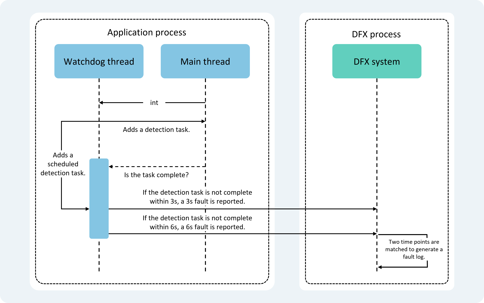
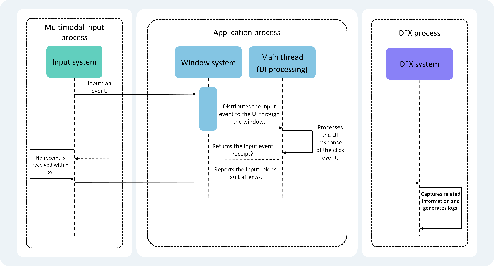
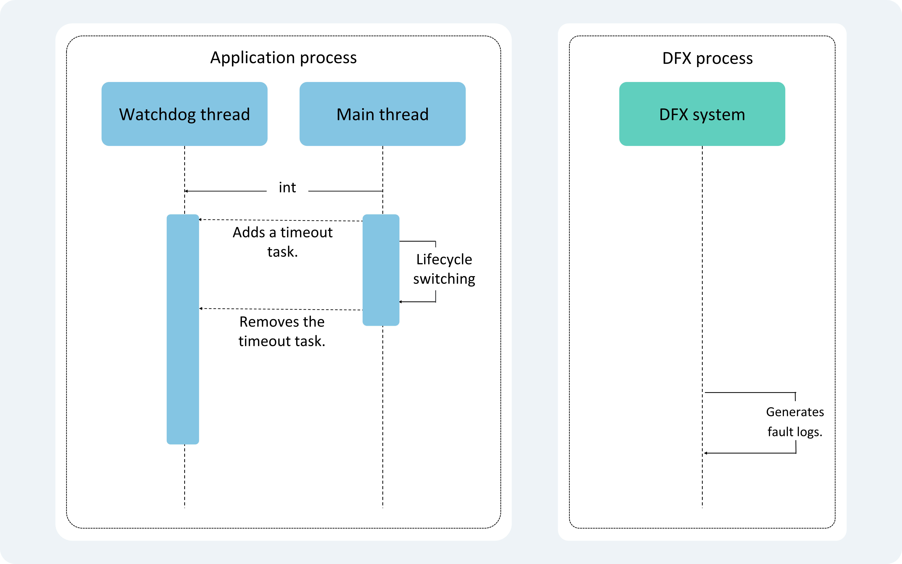
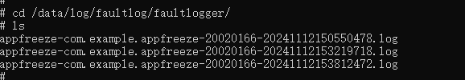
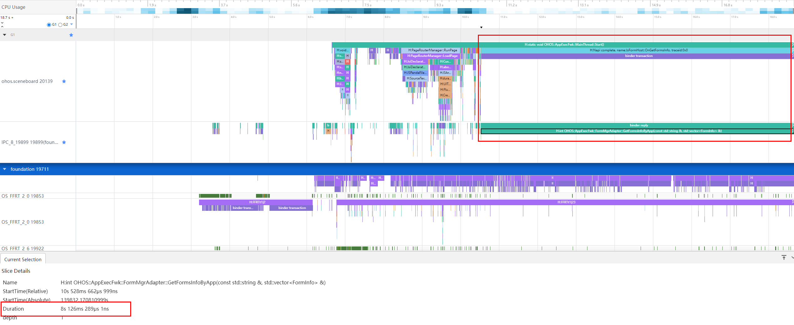

# Analyzing AppFreeze (Application Not Responding)

Users may encounter unresponsive clicks or application freezes during usage. If such conditions persist beyond a certain time limit, they are defined as Application Not Responding (appfreeze). The system provides mechanisms to detect appfreeze incidents and generates appfreeze logs for application development analysis.

> **Note:**
>
> This document applies only to applications using the Stage model. Before analyzing logs based on this document, developers should have foundational knowledge of Cangjie's operation in the system, C++ program stack information, and a basic understanding of application-related subsystems.

## AppFreeze Detection Capabilities

Currently, appfreeze detection monitors from the following dimensions. Understanding these principles is highly beneficial for developers to locate and analyze appfreeze issues.

| Fault Type | Description |
| -------- | -------- |
| THREAD_BLOCK_6S | Main thread execution timeout due to stagnation. |
| APP_INPUT_BLOCK | User input response timeout. |
| LIFECYCLE_TIMEOUT | Ability lifecycle transition timeout. |

### THREAD_BLOCK_6S - Main Thread Execution Timeout

This fault indicates that the application's main thread is either stalled or overloaded with tasks, affecting task execution smoothness and user experience.

Detection principle: The application's watchdog thread periodically inserts liveness checks into the main thread and implements a timeout reporting mechanism in its own thread. If a liveness check isn't executed within 3 seconds, a THREAD_BLOCK_3S warning event is reported; if it remains unexecuted for 6 seconds, a THREAD_BLOCK_6S main thread execution timeout event is reported. These two events combine to generate the THREAD_BLOCK appfreeze log.

Detection principle illustrated below:



### APP_INPUT_BLOCK - User Input Response Timeout

This fault occurs when user click events remain unresponsive beyond a specified time limit, severely impacting user experience.

Detection principle: When a user clicks a button in the application, the input system sends a click event to the application side. If no response acknowledgment is received within the timeout period, this fault is reported.

Detection principle illustrated below:



### Lifecycle Transition Timeout

Lifecycle transition timeout refers to [Ability lifecycle](../application-models/cj-uiability-lifecycle.md#uiability-component-lifecycle) transition timeout.

This fault occurs during lifecycle transitions, affecting the switching of Abilities within the current application.

Detection principle: By capturing different lifecycle transition processes, a timeout task is inserted into the watchdog thread at the start of a lifecycle transition and removed upon completion. If not removed within the fixed time, a fault is reported.

Lifecycle transition timeout consists of two combined events: LIFECYCLE_HALF_TIMEOUT (as a warning event for LIFECYCLE_TIMEOUT) to capture binder information, and LIFECYCLE_TIMEOUT.



Different lifecycles have varying timeout durations:

| Lifecycle | Timeout Duration |
| -------- | -------- |
| Load | 10s |
| Terminate | 10s |
| Connect | 3s |
| Disconnect | 0.5s |
| Foreground | 5s |
| Background | 3s |

## AppFreeze Log Analysis

Appfreeze faults require combined analysis of appfreeze logs and continuous hilog logs.

The following example provides only an analytical approach. Developers should adapt their analysis based on specific issues.

### Log Header Information

| Field | Description |
| -------- | -------- |
| Reason | Appfreeze cause, corresponding to [AppFreeze Detection Capabilities](#appfreeze-detection-capabilities). |
| PID | Process ID at fault occurrence, used to search for related process information in continuous logs. |
| PACKAGE_NAME | Application process package name. |

```text
============================================================
Device info:OpenHarmony 3.2
Build info:OpenHarmony 4.0.5.3
Module name:com.xxx.xxx
Version:1.0.0
Pid:1561
Uid:20010039
Reason:LIFECYCLE_TIMEOUT
sysfreeze:LIFECYCLE_TIMEOUT LIFECYCLE_TIMEOUT at 20230317170653
>>>>>>>>>>>>>>>>>>>>>>>>>>>>>>>>>>>>>>>>>>>
DOMAIN:AAFWK
STRINGID:LIFECYCLE_TIMEOUT
TIMESTAMP:2023/XX/XX/XX-XX:XX:XX:XX
PID:1561
UID:20010039
PACKAGE_NAME:com.xxx.xxx
PROCESS_NAME:com.xxx.xxx
MSG:ablity:EntryAbility background timeout
```

### Common Log Body Information

All three log types contain the following sections, which can be located by searching for "Key Information Fields":

| Key Information Fields | Description |
| -------- | -------- |
| EVENTNAME | Appfreeze cause or constituent events of appfreeze detection. |
| TIMESTAMP | Time when the fault was reported. Combined with timeout durations from [AppFreeze Detection Capabilities](#appfreeze-detection-capabilities), this helps narrow down log review timeframes in continuous logs. |
| PID | Process ID at fault occurrence, used with timestamp and timeout to search for related process information. |
| PACKAGE_NAME | Application process package name. |
| MSG | Dump information or explanatory details at fault occurrence (explained later). |
| BinderCatcher | Inter-process communication (IPC) call information showing prolonged call waits. |
| PeerBinder Stacktrace | Stack traces of peer processes related to the current process if they experience appfreeze. |
| cpuusage | System-wide CPU usage during the period. |
| memory | Memory usage of the current process at the time. |

> **Note:**
>
> Under high system load, low-overhead methods for capturing call stacks or stack traces may lose function symbols and build-id information.

The MSG field primarily includes the reason for appfreeze reporting and information about task accumulation in the application's main thread queue.

Main thread queue task accumulation details include:
- Currently running task and its start time: If significantly different from the log reporting time, this task is likely the primary appfreeze event.
- Historical task times: Helps determine if excessive historical tasks with prolonged execution times delay new task responses.
- Pending unexecuted tasks.

**Current Process Stack Example:**

Search for the PID to locate application stack information. The following stack example shows the window stalled at IPC communication while sending an event to the system.

```text
OpenStacktraceCatcher -pid==1561 packageName is com.example.myapplication
Result: 0 ( no error )
Timestamp:2017-08-0817:06:53.000
Pid:1561
Uid:20010039
Process name:com.example.myapplication
Tid:1561,Name:i.myapplication
#00 pc 0017888c /system/lib/libark_jsruntime.so
#01 pc 00025779 /system/lib/platformsdk/libipc_core.z.so(OHOS:BinderConnector:WriteBinder(unsigned Long,void*)+56)
#02 pc 000265a5 /system/lib/platformsdk/libipc_core.z.so(OHOS:BinderInvoker:TransactWithDriver(bool)+216)
#03 pc 0002666f /system/lib/platformsdk/libipc_core.z.so(OHOS:BinderInvoker:StartWorkLoop()+18)
#04 pc 000270a9 /system/lib/platformsdk/libipc_core.z.so(OHOS:BinderInvoker:JoinThread(bool)+32)
#05 pc 00023783 /system/lib/platformsdk/libipc_core.z.so(OHOS:IPCWorkThread:ThreadHandler(void*)+290)
#06 pc 00e1c6f7 /system/lib/libace.z.so
#07 pc 0091bbdd /system/lib/libace.z.so
#08 pc 0092fd9d /system/lib/libace.z.so
#09 pc 0092fa5f /system/lib/libace.z.so
#10 pc 0092cd6b /system/lib/libace.z.so
#11 pc 009326a9 /system/lib/libace.z.so
#12 pc 0093054b /system/lib/libace.z.so
#13 pc 009324f3 /system/lib/libace.z.so
#14 pc 003989e1 /system/lib/libace.z.so
#15 pc 0045dd4b /system/lib/libace.z.so
#16 pc 00d24fef /system/lib/libace.z.so
#17 pc 0041e6e9 /system/lib/libace.z.so
#18 pc 0000b4d9 /system/lib/platformsdk/libeventhandler.z.so(OHOS:AppExecFwk:EventHandler:DistributeEvent(std::__h:unique_ptr<0 #19 pc 00012829 /system/lib/platformsdk/libeventhandler.z.so))
#20 pc 00011841 /system/lib/platformsdk/libeventhandler.z.so(OHOS:AppExecFwk:EventRunner:Run()+64)
#21 pc 00054a8b /system/lib/libappkit_native.z.so(OHOS:AppExecFwk:MainThread:Start()+278)
#22 pc 00011503 /system/bin/appspawn
#23 pc 0001141f /system/bin/appspawn
#24 pc 0000ee97 /system/bin/appspawn
```

**BinderCatcher Information Example:**

Search for the PID to identify IPC communication partners and synchronous wait durations.

This example shows process 1561 waiting over 10 seconds for a response from process 685.

```text
PeerBinderCatcher -pid==1561 Layer_==0

BinderCatcher --
    1561:1561 to 685:0 code 0 wait:10.366245919 s
    1329:1376 to 487:794 code 0 wait:0.12070041 s

pid   context  request  started  max  ready free_async_space
1561   binder    0       3       16     4       520192
544    binder    0       4       16     5       520192
1104   binder    0       1       16     2       520192
1397   binder    0       1       16     3       520192
...
```

**PeerBinder Stacktrace Information Example:**

This example shows stack traces for the peer appfreeze process 685.

```text
PeerBinder Stacktrace --

PeerBinderCatcher start catcher stacktrace for pid 685
Result: 0 ( no error )
Timestamp:2017-08-0817:06:55.000
Pid:685
Uid:1000
Process name:wifi_manager_service
Tid:658,Name:wifi_manager_service
#00 pc 000669f0 /system/lib/ld-musl-arm.so.1
#01 pc 000c60cc /system/lib/ld-musl-arm.so.1
#02 pc 000c5040 /system/lib/ld-musl-arm.so.1
#03 pc 000c6818 /system/lib/ld-musl-arm.so.1(__pthread_cond_timedwait_time64+596)
#04 pc 000bd058 /system/lib/libc++.so
#05 pc 0008592c /system/lib/ld-musl-arm.so.1(ioctl+72)
#06 pc 00025779 /system/lib/platformsdk/libipc_core.z.so(OHOS:BinderConnector:WriteBinder(unsigned long,void*)+56)
#07 pc 000265a5 /system/lib/platformsdk/libipc_core.z.so(OHOS:BinderInvoker:TransactWithDriver(bool)+216)
#08 pc 0002666f /system/lib/platformsdk/libipc_core.z.so(OHOS:BinderInvoker:StartWorkLoop()+18)
#09 pc 000270a9 /system/lib/platformsdk/libipc_core.z.so(OHOS:BinderInvoker:JoinThread(bool)+32)
#10 pc 00023783 /system/lib/platformsdk/libipc_core.z.so(OHOS:IPCWorkThread:ThreadHandler(void*)+290)
#11 pc 0007b4d9 /system/lib/platformsdk/libeventhandler.z.so
#12 pc 00072829 /system/lib/platformsdk/libeventhandler.z.so
#13 pc 00071841 /system/lib/platformsdk/libeventhandler.z.so(OHOS:AppExecFwk:EventRunner:Run()+64)
#14 pc 00094a8b /system/lib/libappkit_native.z.so(OHOS:AppExecFwk:MainThread:Start()+278)

Tid:1563,Name:IPC_0_1563
#00 pc 0009392c /system/lib/ld-musl-arm.so.1(ioctl+72)
#01 pc 00025779 /system/lib/platformsdk/libipc_core.z.so(OHOS:BinderConnector:WriteBinder(unsigned long,void*)+56)
```

**cpuusage Information Example:**

System-wide CPU information.

```text
Load average: 2.87 / 1.45 / 0.58; the cpu load average in 1 min,5 min and 15 min
CPU usage from 2023-03-10 17:06:53 to 2023-03-10 17:06:53
Total: 29%; User Space: 28%; Kernel Space: 1%; iowait: 6%; irq: 0%; idle: 62%
Details of Processes:
    PID     Total Usage     User Space     Kernel Space     Page Fault Minor     Page Fault Major      Name
    1561       23%            23%              0%               9985                  26            i.myapplication
    527        1%             1%               0%               3046                  9             hidumper_servic
    242        1%             1%               0%               69799                 280           hiview
```

**memory Information Example:**

Current process memory information.

```text
-------------------------------------------[memory]----------------------------------------
                 Pss      Shared   Shared   Private  Private   Swap   SwapPss   Heap  Heap
                 Total    CLean    Dirty    CLean    Dirty     Total  Total     Size  Alloc
                 (kB)     (kB)     (kB)     (kB)      (kB)     (kB)    (kB)     (kB)  (kB)
-------------------------------------------------------------------------------------------
guard             0        0         0       0         0         0      0        0      0
native heap      185       0        180      0        160        0      0        0      0
AnonPage other   17881    12        12376    88       15948      0      0        0      0
stack            292       0        0        0        292        0      0        0      0
.S0              5053     63408     4172     1812     2640       0      0        0      0
.ttf             1133     3092      0        4        0          0      0        0      0
dev              10       0         108      8        0          0      0        0      0
FilePage other   121      556       8        0        4          0      0        0      0
------------------------------------------------------------------------------------------
Total            34675    67068     16844    1912     19044      0      0        0      0
```

### Log Body Specific Information (Main Thread AppFreeze Timeout)

Logs with Reason THREAD_BLOCK_6S. As explained in [Main Thread AppFreeze Timeout](#thread_block_6s-main-thread-execution-timeout), THREAD_BLOCK consists of THREAD_BLOCK_3S and THREAD_BLOCK_6S. Comparing both logs helps determine whether the issue is appfreeze or excessive tasks causing unresponsiveness.

THREAD_BLOCK_3S appears earlier in the log, followed by THREAD_BLOCK_6S. Search for both events using the EVENTNAME field.

Both events contain MSG fields showing main thread task queue status at their respective timestamps, revealing queuing patterns.

This example shows a Low priority queue task from 05:06:18.145 persisting through both THREAD_BLOCK_3S and THREAD_BLOCK_6S reports, indicating main thread appfreeze isn't caused by task overload.

Since THREAD_BLOCK_6S indicates main thread appfreeze, focus on the main thread stack (thread ID matches process ID). The example stack traces show execution stalled in Cangjie code from ArkUI controls, with identical 3S and 6S stack positions confirming Cangjie appfreeze unrelated to task quantity.

THREAD_BLOCK_3S:

```text
start time:2017/08/08-17:06:24:380
DOMAIN = AAFWK EVENTNAME THREAD_BLOCK_3S
TIMESTAMP = 2017/08/08-17:06:24:363
PID = 1561
UID = 20010039
TID = 1566
PACKAGE_NAME com.example.myapplication
PROCESS_NAME com.example.myapplication
eventLog_action pb:1 eventLog_interval 10
MSG = App main thread is not response!EventHandler dump begin curTime:2017-08-08 05:06:24.362
  Event runner (Thread name =Thread ID 1561)is running
  Current Running:start at 2017-08-08 05:06:18.145,Event send thread 1561,send time =2017-08-08 05:06:18.145,handle time =2017-08-08 05:
  Immediate priority event queue information:
  Total size of Immediate events 0
  High priority event queue information:
  No.1 Event send thread 1561,send time 2017-08-08 05:06:18.039,handle time 2017-08-08 05:06:21.539,task name [anr_handler.cpp(Send Total size of High events 1)]
  Low priority event queue information:
  No.1:Event{send thread=1566,send time=2017-08-0805:06:21.062,handle time=2017-08-0805:06:21.062,id=1}
  Total size of Low events 1
  Idle priority event queue information:
  Total size of Idle events 0
  Total event size :2

 Timestamp: 2017-08-0817:06:24.4142447784
 Pid: 1561
 U### Obtaining Logs

Application Not Responding (ANR) logs are a type of fault log managed by the FaultLog module, alongside Native process crashes, CJ application crashes, and system process exceptions. These logs can be obtained through the following methods:

- **Method 1**: Obtain logs via DevEco Studio.

    DevEco Studio collects device fault logs and archives them under the FaultLog directory.

- **Method 2**: Subscribe via the hiAppEvent interface.

    hiAppEvent provides fault subscription interfaces for various fault events. For details, refer to [HiAppEvent Introduction](./cj-hiappevent-intro.md).

<!--Del-->

- **Method 3**: Obtain logs via shell in ROOT mode.

    ANR logs are prefixed with `appfreeze-` and are generated in the device path `/data/log/faultlog/faultlogger/`. The filename format is `appfreeze-<package_name>-<UID>-<millisecond_timestamp>.log`.

    

<!--DelEnd-->

### Confirming Basic Information

#### Retrieve the process ID directly causing the ANR and basic information such as whether it was in the foreground.

```text
Generated by HiviewDFX@OpenHarmony
============================================================
Device info: HUAWEI Mate 60 Pro
Build info: ALN-AL00 x.x.x.xx(XXXXXXX)
Fingerprint: ef8bd28f8b57b54656d743b546efa73764c77866a65934bd96f2678f886813b7
Module name: com.xxx.xxx
Version: 1.2.2.202
VersionCode: 1002002202
PreInstalled: Yes
Foreground: No   --> Whether it was in the foreground
Pid: 15440
Uid: 20020029
Reason: THREAD BLOCK 6S
appfreeze: com.xxx.xxx THREAD_BLOCK 6S at 20240410164052
DisplayPowerInfo: powerState: AWAKE
>>>>>>>>>>>>>>>>>>>>>>>>>>>>>>>>>>>>>>>>>>>
```

#### Retrieve the timestamp of the fault occurrence.

Fault reporting timestamp.

```text
>>>>>>>>>>>>>>>>>>>>>>>>>>>>>>>>>>>>>>>>
DOMAIN: AAFWK
STRINGID: THREAD BLOCK 6S
TIMESTAMP: 2024/04/10-16:40:52:743   --> Fault reporting timestamp
PID: 15440
UID: 20020029
PACKAGE NAME: com.xxx.xxx
PROCESS NAME: com.xxx.xxx
****************************************
```

Summary table of detection durations for different fault types and scenarios.

| THREAD_BLOCK_6S | APP_INPUT_BLOCK | LIFECYCLE_TIMEOUT |
| -------- | -------- | -------- |
| Foreground app: 6s <br> Background app: 3s * 5 + 6s = 21s | 5s | Load: 10s <br> Active: 5s <br> Inactive: 0.5s <br> Terminate: 10s <br> Connect: 3s <br> Disconnect: 0.5s <br> Restart: 5s <br> Foreground: 5s <br> Background: 3s |

> **Note:**
>
> - The detection duration for `THREAD_BLOCK_3S` / `LIFECYCLE_HALF_TIMEOUT` is half of `THREAD_BLOCK_6S` / `LIFECYCLE_TIMEOUT`, classified as a warning level and not reported separately. `THREAD_BLOCK_6S` / `LIFECYCLE_TIMEOUT` is an error level, consolidating logs for both the full and half-duration faults.
> - For foreground apps, `THREAD_BLOCK_3S` can trigger subsequent `THREAD_BLOCK_6S` events.
> - Background apps have a counter `backgroundReportCount_ = 0`. A `THREAD_BLOCK_3S` event increments this counter, and only after accumulating 5 times (i.e., 5 consecutive `THREAD_BLOCK_3S` events without resetting the counter) will a `THREAD_BLOCK_6S` event be reported. Thus, the detection durations for `THREAD_BLOCK_3S` and `THREAD_BLOCK_6S` in background apps are 18s and 21s, respectively.

By subtracting the detection duration from the fault reporting timestamp, the exact time of the fault occurrence can be determined.

### Viewing eventHandler Information

Developers can search for `mainHandler dump is` in the logs to find eventHandler dump information.

1. **Dump begin curTime & Current Running**.

    ```text
    mainHandler dump is:
    EventHandler dump begin curTime: 2024-08-08 12:17:43.544      --> Start dump time
    Event runner (Thread name = , Thread ID = 35854) is running   --> Running thread information
    Current Running: start at 2024-08-08 12:17:16.629, Event { send thread = 35882, send time = 2024-08-08 12:17:16.628, handle time = 2024-08-08 12:17:16.629, trigger time = 2024-08-08 12:17:16.630, task name = , caller = xx }  
    --> trigger time --> Task start time
    ```

    Current task runtime = `dump begin curTime` - `trigger time`. In the example, the task runtime reaches 27s.

    - If the task runtime > fault detection duration, the current task is likely the cause of the ANR and should be investigated.
    - If the task runtime is short, the current task is just one of many tasks running on the main thread during the detection interval. The primary cause may not be this task, and it is recommended to check the longest-running recent task (in `History event queue information`). This scenario often occurs when thread congestion prevents watchdog scheduling.

2. **History event queue information**.

    ```text
    Current Running: start at 2024-08-08 12:17:16.629, Event { send thread = 35882, send time = 2024-08-08 12:17:16.628, handle time = 2024-08-08 12:17:16.629, trigger time = 2024-08-08 12:17:16.630, task name = , caller = [extension_ability_thread.cpp(ScheduleAbilityTransaction:393)]}
    History event queue information:
    No. 0 : Event { send thread = 35854, send time = 2024-08-08 12:17:15.525, handle time = 2024-08-08 12:17:15.525, trigger time = 2024-08-08 12:17:15.527, completeTime time = 2024-08-08 12:17:15.528, priority = High, id = 1 }
    No. 1 : Event { send thread = 35854, send time = 2024-08-08 12:17:15.525, handle time = 2024-08-08 12:17:15.525, trigger time = 2024-08-08 12:17:15.527, completeTime time = 2024-08-08 12:17:15.527, priority = Low, task name = MainThread:SetRunnerStarted }
    No. 2 : Event { send thread = 35856, send time = 2024-08-08 12:17:15.765, handle time = 2024-08-08 12:17:15.765, trigger time = 2024-08-08 12:17:15.766, completeTime time = 2024-08-08 12:17:15.800, priority = Low, task name = MainThread:LaunchApplication }
    No. 3 : Event { send thread = 35856, send time = 2024-08-08 12:17:15.767, handle time = 2024-08-08 12:17:15.767, trigger time = 2024-08-08 12:17:15.800, completeTime time = 2024-08-08 12:17:16.629, priority = Low, task name = MainThread:LaunchAbility }
    No. 4 : Event { send thread = 35854, send time = 2024-08-08 12:17:15.794, handle time = 2024-08-08 12:17:15.794, trigger time = 2024-08-08 12:17:16.629, completeTime time = 2024-08-08 12:17:16.629, priority = IDEL, task name = IdleTime:PostTask }
    No. 5 : Event { send thread = 35852, send time = 2024-08-08 12:17:16.629, handle time = 2024-08-08 12:17:16.629, trigger time = 2024-08-08 12:17:16.629, completeTime time = , priority = Low, task name =  }
    ```

    Identify time-consuming tasks within the fault occurrence interval from the historical task queue. Tasks with empty `CompleteTime time` are current tasks.

    Task runtime = `CompleteTime time` - `trigger time`.

    Filter out high-runtime tasks and investigate their execution.

3. **VIP priority event queue information**.

    ```text
    VIP priority event queue information:
    No. 1 : Event { send thread = 3205, send time = 2024-08-07 04:11:15.407, handle time = 2024-08-07 04:11:15.407, task name = ArkUIWindowInjectPointerEvent, caller = [task_runner_adapter_impl.cpp(PostTask:33)]}
    No. 2 : Event { send thread = 3205, send time = 2024-08-07 04:11:15.407, handle time = 2024-08-07 04:11:15.407, task name = ArkUIWindowInjectPointerEvent, caller = [task_runner_adapter_impl.cpp(PostTask:33)]}
    No. 3 : Event { send thread = 3205, send time = 2024-08-07 04:11:15.407, handle time = 2024-08-07 04:11:15.407, task name = ArkUIWindowInjectPointerEvent, caller = [task_runner_adapter_impl.cpp(PostTask:33)]}
    No. 4 : Event { send thread = 3961, send time = 2024-08-07 04:11:15.408, handle time = 2024-08-07 04:11:15.408, task name = MMI::OnPointerEvent, caller = [input_manager_impl.cpp (OnPointerEvent:493)]}
    No. 5 : Event { send thread = 3205, send time = 2024-08-07 04:11:15.408, handle time = 2024-08-07 04:11:15.408, task name = ArkUIWindowInjectPointerEvent, caller = [task_runner_adapter_impl.cpp(PostTask:33)]}
    No. 6 : Event { send thread = 3205, send time = 2024-08-07 04:11:15.409, handle time = 2024-08-07 04:11:15.409, task name = ArkUIWindowInjectPointerEvent, caller = [task_runner_adapter_impl.cpp(PostTask:33)]}
    No. 7 : Event { send thread = 3205, send time = 2024-08-07 04:11:15.409, handle time = 2024-08-07 04:11:15.409, task name = ArkUIWindowInjectPointerEvent, caller = [task_runner_adapter_impl.cpp(PostTask:33)]}
    No. 8 : Event { send thread = 3205, send time = 2024-08-07 04:11:15.409, handle time = 2024-08-07 04:11:15.409, task name = ArkUIWindowInjectPointerEvent, caller = [task_runner_adapter_impl.cpp(PostTask:33)]}
    No. 9 : Event { send thread = 3205, send time = 2024-08-07 04:11:15.410, handle time = 2024-08-07 04:11:15.410, task name = ArkUIWindowInjectPointerEvent, caller = [task_runner_adapter_impl.cpp(PostTask:33)]}
    ...
    ```

    To ensure timely user response, tasks in the user input event chain are high-priority. These tasks are system-created and typically record the transmission process from user input → screen → window → ArkUI → application. They are unrelated to third-party applications and require no additional attention from developers.

4. **High priority event queue information**.

    ```text
    High priority event queue information:
    No. 1 : Event { send thread = 35862, send time = 2024-08-08 12:17:25.526, handle time = 2024-08-08 12:17:25.526, id = 1, caller = [watchdog.cpp(Timer:156)]}
    No. 2 : Event { send thread = 35862, send time = 2024-08-08 12:17:28.526, handle time = 2024-08-08 12:17:28.526, id = 1, caller = [watchdog.cpp(Timer:156)]}
    No. 3 : Event { send thread = 35862, send time = 2024-08-08 12:17:31.526, handle time = 2024-08-08 12:17:31.526, id = 1, caller = [watchdog.cpp(Timer:156)]}
    No. 4 : Event { send thread = 35862, send time = 2024-08-08 12:17:34.530, handle time = 2024-08-08 12:17:34.530, id = 1, caller = [watchdog.cpp(Timer:156)]}
    No. 5 : Event { send thread = 35862, send time = 2024-08-08 12:17:37.526, handle time = 2024-08-08 12:17:37.526, id = 1, caller = [watchdog.cpp(Timer:156)]}
    No. 6 : Event { send thread = 35862, send time = 2024-08-08 12:17:40.526, handle time = 2024-08-08 12:17:40.526, id = 1, caller = [watchdog.cpp(Timer:156)]}
    No. 7 : Event { send thread = 35862, send time = 2024-08-08 12:17:43.544, handle time = 2024-08-08 12:17:43.544 ,id = 1, caller = [watchdog.cpp(Timer:156)]}
    Total size of High events : 7
    ```

    Watchdog tasks are in this priority queue, observed to be sent every 3s.

    Compare `warning`/`block` events to observe the movement of watchdog tasks in the queue.

    **Warning**:

    ```text
    High priority event queue information:
    No. 1 : Event { send thread = 35862, send time = 2024-08-08 12:17:25.526, handle time = 2024-08-08 12:17:25.526, id = 1, caller = [watchdog.cpp(Timer:156)]}
    No. 2 : Event { send thread = 35862, send time = 2024-08-08 12:17:28.526, handle time = 2024-08-08 12:17:28.526, id = 1, caller = [watchdog.cpp(Timer:156)]}
    No. 3 : Event { send thread = 35862, send time = 2024-08-08 12:17:31.526, handle time = 2024-08-08 12:17:31.526, id = 1, caller = [watchdog.cpp(Timer:156)]}
    No. 4 : Event { send thread = 35862, send time = 2024-08-08 12:17:34.530, handle time = 2024-08-08 12:17:34.530, id = 1, caller = [watchdog.cpp(Timer:156)]}
    Total size of High events : 4
    ```

    **Block**:

    ```text
    High priority event queue information:
    No. 1 : Event { send thread = 35862, send time = 2024-08-08 12:17:25.526, handle time = 2024-08-08 12:17:25.526, id = 1, caller = [watchdog.cpp(Timer:156)]}
    No. 2 : Event { send thread = 35862, send time = 2024-08-08 12:17:28.526, handle time = 2024-08-08 12:17:28.526, id = 1, caller = [watchdog.cpp(Timer:156)]}
    No. 3 : Event { send thread = 35862, send time = 2024-08-08 12:17:31.526, handle time = 2024-08-08 12:17:31.526, id = 1, caller = [watchdog.cpp(Timer:156)]}
    No. 4 : Event { send thread = 35862, send time = 2024-08-08 12:17:34.530, handle time = 2024-08-08 12:17:34.530, id = 2. Process execution timeout on a function interface.

    

    The case shown above demonstrates: The execution time of the OHOS::AppExecFwk::FormMgrAdapter::GetFormsInfoByApp interface reached 8 seconds.