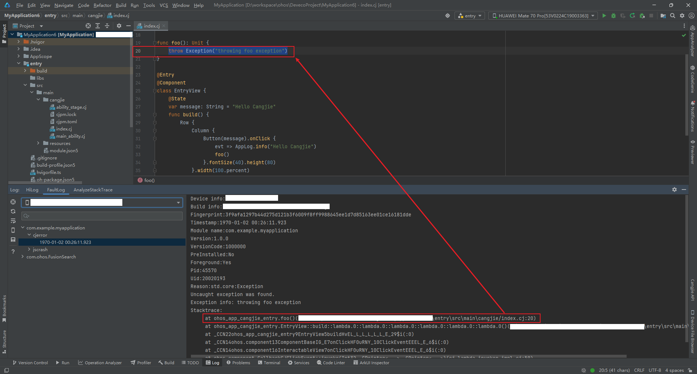

# Cangjie Crash Analysis

When an uncaught Cangjie exception causes an application to terminate unexpectedly, the application crashes upon throwing the uncaught exception and generates corresponding `Crash` log files. Developers can use these error logs to identify the code location that triggered the crash and analyze the root cause.

## Cangjie Crash Log Specifications

The following describes the meaning of each field in the `Crash` log.

```text
Device info:XXXXXX                        // Device information  
Build info:XXX-XXXX X.X.X.XX(XXXXXXXX)    // Build information  
Module name:com.example.myapplication     // Module name  
Version:1.0.0                             // Version number  
Pid:45570                                 // Process ID  
Uid:0                                     // User ID  
Reason:std.core:Exception                 // Crash reason  
Uncaught exception was found.  
Exception info: throwing foo exception    // Exception information  
Stacktrace:                               // Exception call stack  
    at ohos_app_cangjie_entry.foo()(entry\src\main\cangjie/index.cj:20)  
```

## Cangjie Crash Exception Scenarios  

In Cangjie, exception classes include `Error` and `Exception`:  

- The `Error` class describes internal system errors and resource exhaustion errors during Cangjie runtime. Applications should not throw this type of error. If an internal error occurs, the user should be notified, and the program should terminate safely.  

- The `Exception` class describes logical errors or I/O errors during program execution, such as array out-of-bounds or attempting to open a non-existent file. These exceptions need to be caught and handled in the program. For common exception types, refer to <!-- RP1 -->[Common Runtime Exceptions](https://gitcode.com/Cangjie/cangjie_docs/blob/main/docs/dev-guide/source_zh_cn/error_handle/common_runtime_exceptions.md)<!-- RP1End -->.  

## Problem Diagnosis Approach  

### Obtaining Logs  

Process crash logs are a type of fault log managed by the `FaultLogger` module, along with application non-response logs and crashes. They can be obtained through the following methods:  

1. **Via DevEco Studio**  

    `DevEco Studio` collects process crash logs from the device path `/data/log/faultlog/faultlogger/` and archives them under `FaultLog`. Cangjie process crash logs are archived under the `cjerror` type in `FaultLog`. For details on obtaining logs, refer to [FaultLog](https://developer.huawei.com/consumer/en/doc/harmonyos-guides/ide-fault-log).  

2. **Via the `hiAppEvent` Interface Subscription**  

    `hiAppEvent` provides fault subscription interfaces to subscribe to various fault events. For details, see [`HiAppEvent` Introduction](./cj-hiappevent-intro.md).  

### Root Cause Analysis  

Cangjie `Crash` issues can be analyzed by examining the exception information and call stack in the fault log to locate the source code and derive preliminary conclusions.  

- For `Error` class exceptions, the call stack has limited reference value, and root cause identification is complex. It requires analysis combining code logic, memory usage, parameter configuration, and tools provided in `DevEco Studio`.  

- For `Exception` class exceptions, most cases are caused by logical errors in the code. The call stack can directly locate the problematic code, and reviewing the code logic is usually sufficient.  

## Case Studies  

### Error Class Case Analysis  

`Error` class issues are typically exceptions thrown by the Cangjie runtime when it detects internal system errors or resource exhaustion.  

Common exceptions encountered by developers include:  

1. `OutOfMemoryError`: Thrown by the runtime when memory is insufficient.  
2. `StackOverflowError`: Thrown by the runtime when the Cangjie thread stack overflows.  

#### Case 1: Out of Memory Exception  

Source code of the case:  

<!-- compile -->  

```cangjie  
var bigArray = Array<Rune>(1024 * 1024 * 60, repeat: r'a')  
func foo(): Unit {  
    var smallArray = Array<Rune>(1024 * 1024 * 5, repeat: r'a')  
}  

@Entry  
@Component  
class EntryView {  
    @State  
    var message: String = "Hello Cangjie"  
    func build() {  
        Row {  
            Column {  
                Button(message).onClick ({  
                    evt => Hilog.info(1, "info", "Hello Cangjie")  
                    foo()  
                }).fontSize(40).height(80)  
            }.width(100.percent)  
        }.height(100.percent)  
    }  
}  
```  

1. Obtain the `Crash` log and confirm the direct cause of the crash based on the reason and exception information.  

    Key content of the `Crash` log:  

    ```text  
    Reason:std.core:OutOfMemoryError  
    Uncaught exception was found.  
    Exception info: [none]  
    Stacktrace:  
        at ohos_app_cangjie_entry.foo()(entry\src\main\cangjie/index.cj:24)  
        at ohos_app_cangjie_entry.EntryView::build::lambda.0::lambda.0::lambda.0::lambda.0::lambda.0::lambda.0()(entry\src\main\cangjie/index.cj:38)  
        at _CCN22ohos_app_cangjie_entry9EntryView5buildHvEL_L_L_L_L_L_E_29$i(:0)  
        at _CCN14ohos.component13ComponentBaseIG_E7onClickHF0uRNY_10ClickEventEEEL_E_6$i(:0)  
        at _CCN14ohos.component16InteractableView7onClickHF0uRNY_10ClickEventEEEL_E_6$i(:0)  
        at ohos.arkui.component.CallbackCJClickEvent::invoke(Int32, CPointer<...>, CPointer<...>)(cj_lambda_invoker_impl.cj:50)  
        at ohos.ffi.ohosFFICJCallbackInvoker(Int64, Int32, CPointer<...>, CPointer<...>)(ffi_callback.cj:172)  
    ```  

    The direct cause of the crash is an out-of-memory exception.  

2. Analyze the root cause.  

    For `OutOfMemoryError`, the call stack has limited reference value because memory exhaustion can occur anywhere, and the exception point may simply be where the remaining memory was exhausted.  

    To analyze the root cause of `OutOfMemoryError`, consider the following aspects:  

    - **Memory usage**: Use the `Profiler` tool in `DevEco Studio` to analyze memory consumption.  
    - **Code logic**: Review the business code in combination with the call stack and heap usage to verify correctness. If the logic is correct, consider optimizing the code based on heap usage.  
    - **Parameter configuration**: Verify whether the `cjHeapSize` configuration matches the current business scenario.  

### Exception Class Case Analysis  

`Exception` class issues are typically Cangjie exceptions thrown by developers or the Cangjie standard library.  

These issues currently fall into two scenarios:  

1. If the application encounters an unresolvable fault that requires terminating the current business, consider throwing a Cangjie exception to terminate the business and generate a fault log.  
2. When using interfaces from Cangjie standard library modules that may throw exceptions, use the `try-catch` mechanism or add protective checks to avoid terminating the current business.  

#### Case 1: Developer Throws a Custom Cangjie Exception to Terminate the Program  

Developers can throw Cangjie exceptions using the following code:  

<!-- compile -->  

```cangjie  
throw Exception("throwing exception")  
```  

Alternatively, inherit from the built-in `Exception` or its subclasses to define custom exceptions. For custom exception implementation, refer to <!-- RP2 -->[Defining Exceptions](https://gitcode.com/Cangjie/cangjie_docs/blob/main/docs/dev-guide/source_zh_cn/error_handle/exception_overview.md)<!-- RP2End -->.  

For such issues, the fault log's call stack can directly locate the specific code line.  

  

Further review the context to analyze the issue.  

#### Case 2: Crash Due to Unhandled Exception Thrown by Cangjie Standard Library  

This section uses `NoneValueException` as an example to demonstrate the process of analyzing Cangjie `Crash` issues.  

Source code of the case:  

<!-- compile -->  

```cangjie  
import std.collection.*  

func foo() {  
    let map = HashMap<String, Int64>([("a", 0), ("b", 1), ("c", 2)])  
    println(map["d"])  
}  
@Entry  
@Component  
class EntryView {  
    @State  
    var message: String = "Hello Cangjie"  
    func build() {  
        Row {  
            Column {  
                Button(message).onClick ({  
                    evt => Hilog.info(1, "info","Hello Cangjie")  
                    foo()  
                }).fontSize(40).height(80)  
            }.width(100.percent)  
        }.height(100.percent)  
    }  
}  
```  

1. Obtain the `Crash` log and confirm the direct cause of the crash.  

    Key content of the `Crash` log:  

    ```text  
    Reason:std.core:NoneValueException  
    Uncaught exception was found.  
    Exception info: Value does not exist!  

    Stacktrace:  
        at _CNac10ArrayDequeIG_E4growHl.exception_outlined_func.10(std/collection/array_deque.cj:160)  
        at std.collection.HashMap<...>::[](T0)(std/collection/hash_map.cj:835)  
        at ohos_app_cangjie_entry.foo()(entry\src\main\cangjie/index.cj:22)  
        at ohos_app_cangjie_entry.EntryView::build::lambda.0::lambda.0::lambda.0::lambda.0::lambda.0::lambda.0()(entry\src\main\cangjie/index.cj:35)  
        at _CCN22ohos_app_cangjie_entry9EntryView5buildHvEL_L_L_L_L_L_E_29$i(:0)  
        at _CCN14ohos.component13ComponentBaseIG_E7onClickHF0uRNY_10ClickEventEEEL_E_6$i(:0)  
        at _CCN14ohos.component16InteractableView7onClickHF0uRNY_10ClickEventEEEL_E_6$i(:0)  
        at ohos.arkui.component.CallbackCJClickEvent::invoke(Int32, CPointer<...>, CPointer<...>)(cj_lambda_invoker_impl.cj:50)  
        at ohos.ffi.ohosFFICJCallbackInvoker(Int64, Int32, CPointer<...>, CPointer<...>)(ffi_callback.cj:172)  
    ```  

    The direct cause of the crash is an uncaught `NoneValueException`.  

2. Locate the source code based on the call stack in the `Crash` log.  

    Review the call stack from top to bottom. The first two frames show the standard library (`std` module) throwing the exception, and the frame above `std` points to the source code location.  

    The analysis reveals the exception occurs at line 22 in the `foo` function, related to `HashMap` subscript access.  

    The problematic code:  

    <!-- compile -->  

    ```cangjie  
    func foo() {  
        let map = HashMap<String, Int64>([("a", 0), ("b", 1), ("c", 2)])  
        println(map["d"])  
    }  
    ```  

3. Analyze the exception code to determine the root cause.  

    The context shows the exception occurs because the `key` `d` does not exist in `map`.  

    For complex code, use debugging tools in `DevEco Studio` to analyze the program.  

4. Solution.  

    Based on the analysis, modify the source code. Add a protective check for the `key` existence before accessing `HashMap`.  

    Modified `foo` function:  

    <!-- compile -->  

    ```cangjie  
    func foo() {  
       let map = HashMap<String, Int64>([("a", 0), ("b", 1), ("c", 2)])  
       if (map.contains("d")) {  
           println(map["d"])  
       }  
    }  
    ```