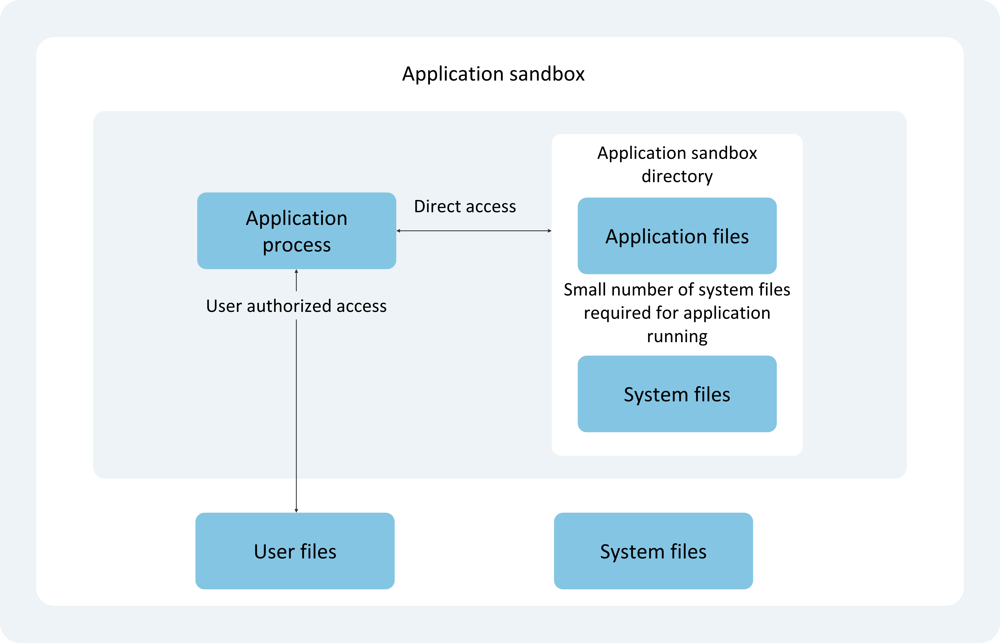
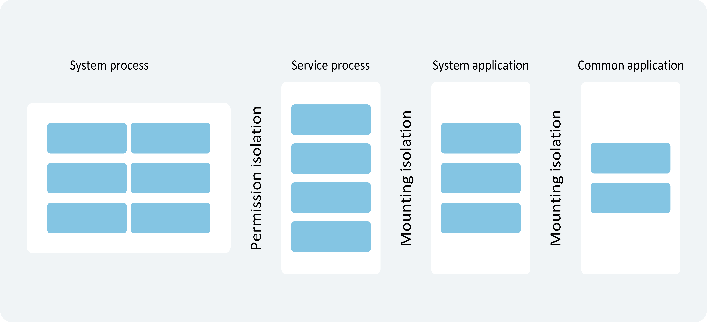
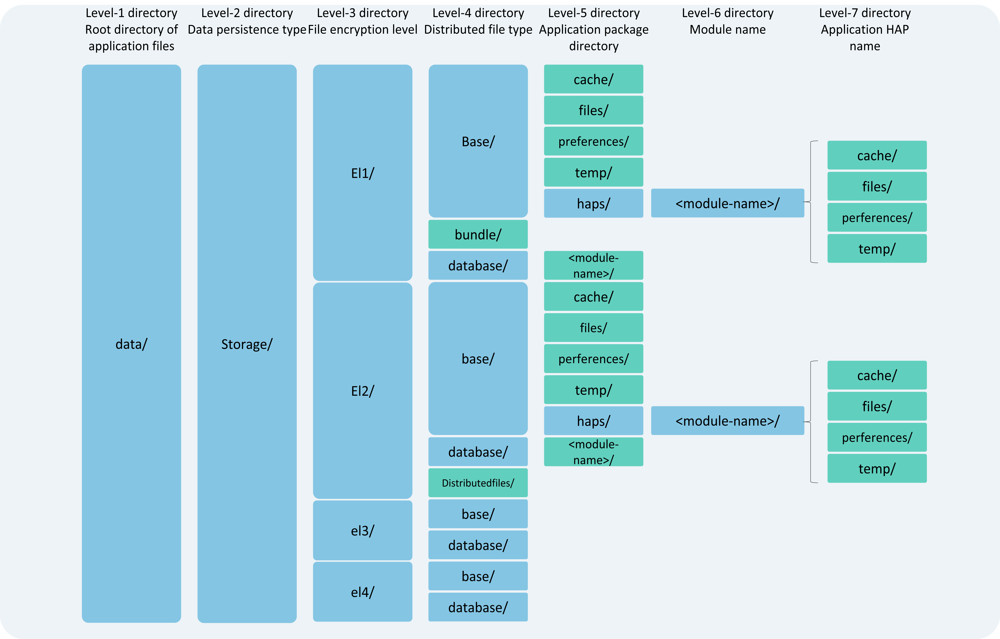

# Application Sandbox Directory

The application sandbox is an isolation mechanism designed for security protection, preventing data from being accessed via malicious path traversal. Under this sandbox protection mechanism, the directory scope visible to an application is referred to as the "Application Sandbox Directory."

- For each application, the system maps a dedicated "Application Sandbox Directory" in the internal storage space. It is a collection consisting of the "[Application File Directory](#application-file-directory-and-application-file-path)" and a subset of system files (a small number of system files essential for the application's operation).

- The application sandbox restricts the data scope visible to the application. Within the "Application Sandbox Directory," an application can only see its own application files and a limited number of system files (essential for its operation). Consequently, files from this application are also invisible to other applications, thereby safeguarding the security of application files.

- Applications can save and manage their own application files in the "Application File Directory." System files and their directories are read-only to applications. If an application needs to access [user files](./cj-user-file-overview.md), it must do so through specific APIs and obtain corresponding user authorization.

The following diagram illustrates the file access scope and methods under the application sandbox.

## Application Sandbox Directory and Application Sandbox Path

Under the application sandbox protection mechanism, applications cannot determine the location or existence of data directories belonging to other applications or users outside their own application file directory. Additionally, the visible directory scope of all applications is isolated through permission restrictions and file path mounting, forming an independent path view that masks the actual physical paths.

- As shown below, from the perspective of a regular application (also called a third-party application), not only is the scope of visible directories and files limited, but the visible directory and file paths also differ from those seen by system processes or other processes. The path of a specific file or directory within the "Application Sandbox Directory" visible to a regular application is called the "Application Sandbox Path." <!--RP1-->
- The developer's `hdc shell` environment is equivalent to the system process perspective. Therefore, the "Application Sandbox Path" differs from the actual physical path seen when debugging with the `hdc` tool. For specific mappings, refer to [Correspondence Between Application Sandbox Path and Actual Physical Path](#correspondence-between-application-sandbox-path-and-actual-physical-path). <!--RP1End-->
- The actual physical path and the sandbox path are not in a 1:1 mapping relationship. The sandbox path is always fewer than the physical paths visible from the system process perspective. Some physical paths visible from the debugging process perspective have no corresponding paths in the application sandbox directory.

## Application File Directory and Application File Path

As mentioned earlier, the "Application Sandbox Directory" is divided into two categories: the application file directory and the system file directory.

The visible scope of the system file directory to applications is predefined by the OpenHarmony system, and developers do not need to focus on it.

Here, we primarily introduce the application file directory, as shown in the diagram below. The path of a specific file or directory within the application file directory is called the application file path. Each file path under the application file directory has distinct attributes and characteristics.

> **Note:**
>
> - Avoid directly using path strings composed of directory names above the fourth level in the diagram, as this may lead to compatibility issues in future application versions due to changes in application file paths.
> - Application file paths, including but not limited to those highlighted in green in the diagram, should be obtained through the `Context` property. Refer to `Context` context acquisition and the aforementioned application file path retrieval.

1. **First-level directory `data/`**: Represents the application file directory.

2. **Second-level directory `storage/`**: Represents the persistent file directory for the application.

3. **Third-level directory `el1/~el5/`**: Represents different file encryption types.

    **EL1 (Encryption Level 1):**
     - Provides basic security capabilities for all files on the device. Files protected by EL1 can be accessed without requiring user authentication after the device boots. Unless necessary, this method is not recommended.
     - If ciphertext is directly stolen from the device storage medium, attackers cannot decrypt it offline.

    **EL2 (Encryption Level 2):**
     - Builds upon EL1 by adding file protection capabilities after the first authentication. After the device boots, files protected by EL2 can only be accessed after the user completes the first authentication. These files remain accessible as long as the device is not powered off. This method is recommended as the default for applications.
     - If the device is lost after shutdown, attackers cannot read files protected by EL2.

    **EL3 (Encryption Level 3):**
     - Similar in overall capability to EL4, but unlike EL4, new files can be created while the screen is locked, though they cannot be read. Unless necessary, this method is not required.

    **EL4 (Encryption Level 4):**
     - Builds upon EL2 by adding file protection capabilities when the device is locked. Data protected by EL4 cannot be accessed while the screen is locked. Unless necessary, this method is not required.
     - If the device is stolen while locked, attackers cannot read files protected by EL4.

    **EL5 (Encryption Level 5):**
     - Builds upon EL2 by adding file protection capabilities when the device is locked. After the screen is locked, under certain conditions, data protected by EL5 cannot be accessed, but new files can still be created and modified. Unless necessary, this method is not required.
     - By default, EL5-related directories are not generated. Access to E-class encrypted databases requires specific permissions. For details, refer to [Usage of E-Class Encrypted Databases](../database/cj-data-reliability-security-overview.md).

   > **Note:**
   >
   > Unless otherwise required, applications should store data in the `el2` encrypted directory to maximize data security. However, for certain scenarios where application files need to be accessible before the user's first authentication (e.g., clocks, alarms, wallpapers), these files must be stored in the device-level encrypted area (`el1`).
   >
   > Developers can monitor the [COMMON_EVENT_USER_UNLOCKED](../../../en/application-dev/reference/BasicServicesKit/cj-apis-common_event_manager.md#static-const-common_event_user_unlocked) event to detect when the user completes the first authentication.

4. **Fourth- and fifth-level directories:**
    - The `ApplicationContext` can retrieve the application file paths for the `distributedfiles` directory or subdirectories under `base` such as `files`, `cache`, `preferences`, and `temp`. Application-wide information can be stored in these directories.
    - The `AbilityContext`, `AbilityStageContext`, and `ExtensionContext` can retrieve HAP-level application file paths. HAP information can be stored in these directories. Files stored here will be deleted when the HAP is uninstalled and will not affect files in the App-level directory. During development, an application may contain one or more HAPs. For details, refer to [Stage Model Application Package Structure](../cj-start/basic-knowledge/application-package-structure-stage.md).

    The following table describes the application file paths and their lifecycles.

   | Directory Name      | Context Property Name | Type               | Description |
   | ------------------- | --------------------- | ------------------ | ----------- |
   | `bundle`           | `bundleCodeDir`       | Installation File Path | Directory where the HAP resource package of the installed App resides; cleaned upon application uninstallation. Do not concatenate paths to access resource files. Use the [Resource Management API](../../../en/application-dev/reference/LocalizationKit/cj-apis-resource_manager.md) instead. Can store application code resource data, including installed HAP resource packages, reusable library files, and plugin resources. Data stored here can be used for dynamic loading. |
   | `base`             | N/A                   | Local Device File Path | Directory for storing persistent data on the local device, with subdirectories like `files/`, `cache/`, `temp/`, and `haps/`; cleaned upon application uninstallation. |
   | `database`         | `databaseDir`         | Database Path | Directory for storing files managed by the distributed database service under `el2` encryption; cleaned upon application uninstallation. Only for storing private database data, such as database files. Suitable for distributed database-related files. |
   | `distributedfiles` | `distributedFilesDir` | Distributed File Path | Directory for storing distributed files under `el2` encryption. Files placed here can be directly accessed across devices in a distributed manner; cleaned upon application uninstallation. For storing data in distributed scenarios, such as multi-device shared files, backups, and group collaboration files. |
   | `files`            | `filesDirectory`      | General Application File Path | Default directory for long-term file storage in the device's internal storage; cleaned upon application uninstallation. For storing any private data, such as persistent user files, images, media files, and logs. Ensures data remains private, secure, and persistent. |
   | `cache`            | `cacheDir`            | Application Cache File Path | Directory for caching downloaded files or regeneratable cache files in the device's internal storage. Files here may be automatically cleaned if the cache quota is exceeded or system space is low. Users may also trigger cleanup via system storage management apps. Applications should verify file existence and decide whether to re-cache; cleaned upon application uninstallation. For storing cache data, such as offline data, image caches, database backups, and temporary files. Avoid storing critical data here as it may be auto-cleaned. |
   | `preferences`      | `preferencesDir`      | Application Preferences File Path | Directory for storing configuration or preference data via database APIs in the device's internal storage; cleaned upon application uninstallation. See [Data Persistence via User Preferences](../database/cj-data-persistence-by-preferences.md). For storing small amounts of preference data, such as configuration files. |
   | `temp`             | `tempDir`             | Application Temporary File Path | Directory for files generated and needed only during application runtime in the device's internal storage; cleaned after the application exits. For storing temporary data, such as database caches, image caches, temporary logs, and downloaded installation packages. Data here can be deleted after use. |

## Correspondence Between Application Sandbox Path and Actual Physical Path

When reading or writing files in the application sandbox path, the operations are mapped to the actual physical paths of application files. The correspondence between application sandbox paths and actual physical paths is shown in the table below.

Here, `<USERID>` represents the current user ID, starting from 100 and incrementing, and `<EXTENSIONPATH>` represents `moduleName-extensionName`.

| Application Sandbox Path          | Physical Path         |
| --------------------------------- | --------------------- |
| `/data/storage/el1/bundle`           | Application installation package directory:  `/data/app/el1/bundle/public/<PACKAGENAME>` |
| `/data/storage/el1/base`             | Application `el1`-level encrypted data directory:  - For non-independent sandbox applications: `/data/app/el1/<USERID>/base/<PACKAGENAME>`  - For Extension applications running in independent sandboxes: `/data/app/el1/<USERID>/base/+extension-<EXTENSIONPATH>+<PACKAGENAME>` |
| `/data/storage/el2/base`             | Application `el2`-level encrypted data directory:  - For non-independent sandbox applications: `/data/app/el2/<USERID>/base/<PACKAGENAME>`  - For Extension applications running in independent sandboxes: `/data/app/el2/<USERID>/base/+extension-<EXTENSIONPATH>+<PACKAGENAME>` |
| `/data/storage/el1/database`         | Application `el1`-level encrypted database directory:  - For non-independent sandbox applications: `/data/app/el1/<USERID>/database/<PACKAGENAME>`  - For Extension applications running in independent sandboxes: `/data/app/el1/<USERID>/database/+extension-<EXTENSIONPATH>+<PACKAGENAME>` |
| `/data/storage/el2/database`         | Application `el2`-level encrypted database directory:  - For non-independent sandbox applications: `/data/app/el2/<USERID>/database/<PACKAGENAME>`  - For Extension applications running in independent sandboxes: `/data/app/el2/<USERID>/database/+extension-<EXTENSIONPATH>+<PACKAGENAME>` |
| `/data/storage/el2/distributedfiles` | `/mnt/hmdfs/<USERID>/account/merge_view/data/<PACKAGENAME>` |