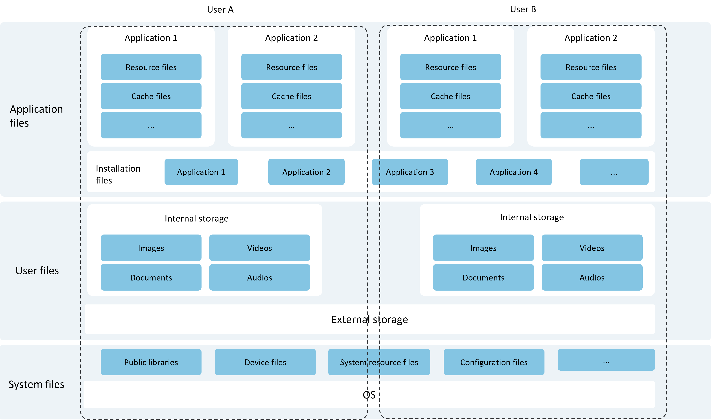

# Introduction to Core File Kit

<!--Del-->
> **Note:**
>
> Currently in the beta phase.
<!--DelEnd-->

Core File Kit (File Foundation Service) provides developers with a set of capabilities to access and manage application files and user files. It helps users efficiently manage, search, and back up various types of files, enabling them to easily meet diverse file management requirements.

## Overview of Core File Kit

In the Core File Kit suite, files are classified into the following categories based on ownership, as illustrated in the file classification model diagram below:

- [Application Files](./cj-app-file-overview.md): Files owned by applications, including installation files, resource files, cache files, etc.

- [User Files](./cj-user-file-overview.md): Files owned by users logged into the terminal device, including private images, videos, audio, documents, etc.

- System Files: Other files unrelated to applications or users, including public libraries, device files, system resource files, etc. These files do not require developer management and are not covered in this document.

Based on the storage location (data source location) managed by the file system, the file system classification model is as follows:

- Local File System: Provides file access capabilities for local devices or external storage devices (e.g., USB drives, external hard disks). The local file system is the most basic file system and is not covered in detail here.

**Figure 1** File Classification Model Diagram

## Usage Scenarios

Common usage scenarios for Core File Kit:

- Application file access and sharing.
- Application data backup and recovery.
- Selecting and saving user files.
- Cross-device file access and sharing capabilities.

## Capabilities

- Supports access operations such as viewing, creating, reading, writing, deleting, moving, copying, and retrieving attributes for application files.
- Supports uploading application files to network servers and downloading network resource files to local application directories.
- Supports retrieving the storage space size of the current application, the remaining space of a specified file system, and the total space of a specified file system.
- Supports sharing files between applications and using files shared by other applications.
- Supports application integration with data backup and recovery. After integration, applications can customize backup and recovery framework behavior by modifying configuration files, including whether to allow backup/recovery and which data to back up.
- Provides a [User File Access Framework](#user-file-access-framework) for developers to access and manage user files, such as selecting and saving user files.
- Supports cross-device file access and copying capabilities.

## Highlights/Features

- **Sandbox Isolation**: Accesses and manages application files. For each application, the system maps a dedicated "[Application Sandbox Directory](./cj-app-sandbox-directory.md#application-sandbox-directory)" in the internal storage space, which consists of the "[Application File Directory](./cj-app-sandbox-directory.md#application-file-directory-and-application-file-path)" and a subset of system files (essential for application operation). Key advantages:
    - **Isolation**: The application sandbox provides a fully isolated environment, enabling secure access to application files.
    - **Security**: The application sandbox minimizes the visible data range for applications, protecting file security.
- **Application Sharing**: Applications can share files via URI (Uniform Resource Identifier) or FD (File Descriptor). Key advantages:
    - **Portability**: Simplifies file sharing between applications, eliminating the need for users to switch between apps, improving efficiency.
    - **Efficiency**: Faster file transfers between applications, reducing time wasted on multiple jumps and waits.
    - **Data Consistency**: Ensures data integrity and consistency during transfers, preventing corruption or loss.
    - **Security**: Protects files from unauthorized access or tampering. File authorization further enhances security.

## Framework Principles

### Application File Access Framework

The application file access framework is implemented through basic file operation interfaces ([ohos.file_fs](../reference/CoreFileKit/cj-apis-file_fs.md)). Developers do not need to understand the internal implementation. For details, refer to [Interface Description](./cj-app-file-access.md#interface-description).

### User File Access Framework

The User File Access Framework (File Access Framework) provides developers with a foundational framework to access and manage user files. Leveraging OpenHarmony's ExtensionAbility component mechanism, it offers unified methods and interfaces for accessing user files.

**Figure 2** User File Access Framework Diagram

- System or third-party applications (i.e., file access clients) can access user files, such as selecting a photo or saving documents, by launching the "File Picker Application."

- **FilePicker**: A pre-installed system application that enables file access clients to select and save files without requiring any permissions.

- **FileManager**: Device developers can also develop their own file picker or file manager applications as needed. <!--RP1--><!--RP1End-->

- The main functional modules of the File Access Framework (User File Access Framework) are as follows:
    - **File Access Helper**: Provides APIs for file managers and file pickers to access user files.
    - **File Access ExtensionAbility**: Offers file access framework capabilities, consisting of the internal file management service (UserFileManager) and external file management service (ExternalFileManager), to implement corresponding file access functions.
        - **UserFileManager**: Internal file management service, implemented based on the File Access ExtensionAbility framework, manages files on built-in storage devices.
        - **ExternalFileManager**: External file management service, implemented based on the File Access ExtensionAbility framework, manages files on external storage devices.

## Relationship with Related Kits

**Ability Kit**: The User File Access Framework in Core File Kit relies on the Extension basic capabilities provided by Ability Kit and is managed by the Ability Kit service scheduler.