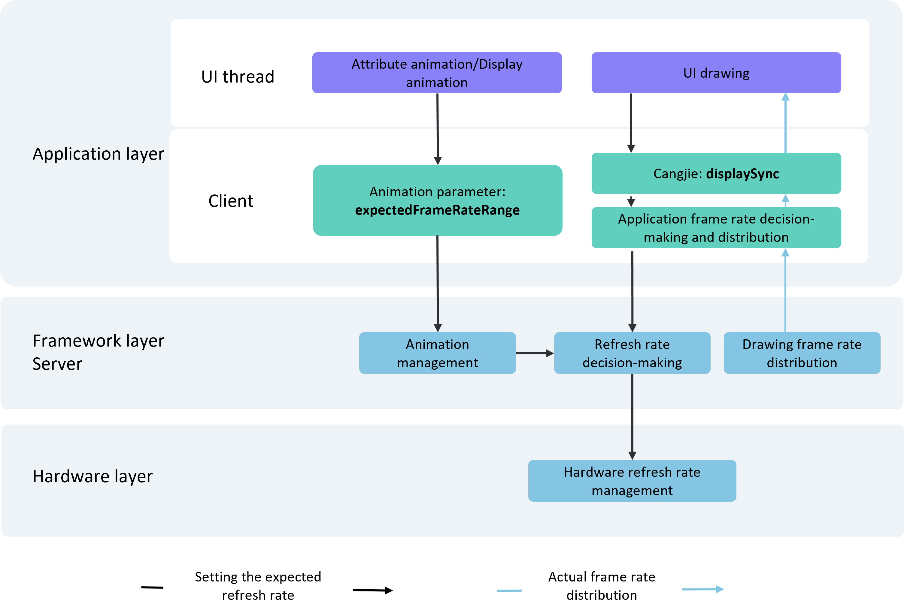

# Introduction to Variable Frame Rate

<!--Del-->
> **Note:**
>
> Currently in the beta phase.
<!--DelEnd-->

With the continuous evolution of device screens, current mainstream devices adopt LTPO screens, which support switching screen refresh rates between multiple levels.

For rapidly changing content such as shooting games and interactive animations, higher display frame rates result in smoother visuals but correspondingly higher power consumption.

For slowly changing content such as game lobbies or clock update animations, where the screen update frequency is lower, using relatively lower display frame rates does not cause noticeable lag for users while maintaining lower power consumption.

Based on the variable frame rate capability of display content, devices equipped with LTPO screens can achieve a balance between performance experience and power consumption.

OpenHarmony supports variable frame rate capability. Developers can leverage the benefits of variable frame rate features in terms of power efficiency by using variable frame rate APIs for related business development.

## Usage Scenarios

The variable frame rate capability allows developers to customize frame rates for application businesses. Common usage scenarios include:

- Configuring frame rate property parameters for property animations/display animations for animation rendering. For details, see [Requesting Animation Rendering Frame Rate](./cj-displaysync-animation.md).

## Operation Mechanism

Variable frame rate provides a basic frame rate configuration and capability for animation components and UI rendering in application development. After developers set valid expected rendering frame rates, the system collects the requested frame rates, makes decisions, and distributes them. The rendering pipeline then performs frequency division to meet the developers' expected frame rates as much as possible.

As shown in the figure above, various UIs (animation components and UI rendering) at the application layer can connect to the frame control system through corresponding variable frame rate APIs (`expectedFrameRateRange` and `displaySync`). The frame control system collects the expected rendering frame rates set by the UIs and participates in the system-wide refresh rate decision-making at the framework layer. The server distributes the rendering frame rates based on the decided refresh rate results, passing them down to various UIs at the application layer. Meanwhile, the hardware layer also completes the refresh rate switching of hardware components based on the system-wide refresh rate decision results.

## Constraints and Limitations

The expected frame rate values set by developers do not represent the final actual results, as they are constrained by system power-performance limitations and hardware capabilities of screen refresh rates.