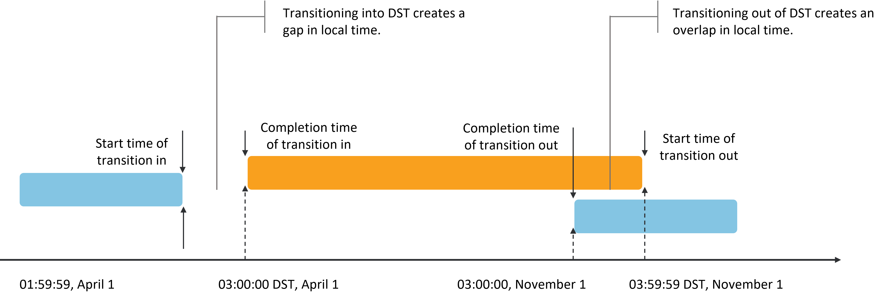

# Daylight Saving Time (DST) Transition

## Feature Description

Daylight Saving Time (DST) is a system designed to conserve energy by artificially adjusting local time. During summer months when daylight arrives earlier, clocks are advanced by one hour to encourage people to wake up and go to bed earlier, thereby reducing lighting usage and saving electricity.

## Implementation Principle

The system is configured with DST transition rules. When local time reaches the transition point, the system automatically implements the time change. If an application retrieves and displays time through standard timestamp interfaces (e.g., Date()), it will synchronously display DST-adjusted time at the transition moment.

**DST Transition Rules:**

1. Calculating daily hours  
   The total hours in a day change on DST transition dates, not always being 24 hours. On the day DST begins, a full day contains 23 hours; on the day DST ends, it contains 25 hours.

   To calculate the hour difference between the same wall-clock time before and after DST transition:

   <!-- run -->
   <!-- compile -->

   ```cangjie
   // index.cj
   import kit.LocalizationKit.*

   let calendar: Calendar = getCalendar('zh-Hans')
    calendar.setTimeZone('Europe/London')
    calendar.set(2021, 2, 27, hour: 16, minute: 0, second: 0) // Time before DST starts
    let startTime: Float64 = calendar.getTimeInMillis()
    calendar.set(2021, 2, 28, hour: 16, minute: 0, second: 0) // Time during DST period
    let finishTime: Float64 = calendar.getTimeInMillis()
    let hours: Float64 = (finishTime - startTime) / 3600000.0 // hours = 23.0
   ```

2. Data storage and display  
   When storing and displaying data according to local DST rules, special handling is required for time gaps and overlaps caused by DST transitions.

   - Spring forward creates a 1-hour gap (e.g., 1:59:59 → 3:00:00)
   - Fall back creates a 1-hour overlap (e.g., 3:59:59 → 3:00:00)

   It's recommended to add DST indicators when displaying local time during DST periods.

   

3. Time data storage and transmission  
   For time data storage and transmission, using Coordinated Universal Time (UTC) or Greenwich Mean Time (GMT) is recommended to avoid information loss or anomalies caused by DST transitions.