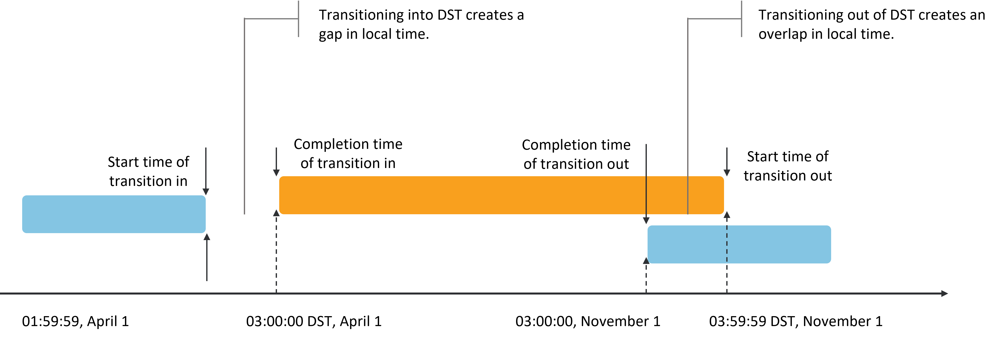

# Daylight Saving Time (DST) Transition

## Feature Description

Daylight Saving Time is a system artificially established to conserve energy by adjusting local time, where clocks are set forward by one hour during the summer months when daylight arrives earlier. This encourages people to wake up and go to bed earlier, reducing lighting usage and thereby saving electricity.

## Implementation Principle

The system is configured with DST transition rules. When local time reaches the transition point, the change occurs automatically. If an application retrieves and displays time through standard timestamp interfaces (e.g., `Date()`), it will synchronously display DST-adjusted time at the transition moment.

**DST Transition Rules:**

1. Calculating the number of hours in a day.  
   The total hours in a day change on DST transition days and are not always 24 hours. On the day DST begins, a full day consists of 23 hours; on the day DST ends, a full day consists of 25 hours.  

   To calculate the hour difference between the same wall-clock time before and after DST transition, refer to the following sample code:  

   <!-- run -->  

   ```cangjie  
   import kit.LocalizationKit.*  

   let calendar: Calendar = getCalendar('zh-Hans')  
    calendar.setTimeZone('Europe/London')  
    calendar.set(2021, 2, 27, hour: 16, minute: 0, second: 0) // Time before DST starts  
    let startTime: Float64 = calendar.getTimeInMillis()  
    calendar.set(2021, 2, 28, hour: 16, minute: 0, second: 0) // Time during DST period  
    let finishTime: Float64 = calendar.getTimeInMillis()  
    let hours: Float64 = (finishTime - startTime) / 3600000.0 // hours = 23.0  
   ```  

2. Storing and displaying data.  
   When storing and displaying data according to local DST rules, it is necessary to handle time gaps and overlaps caused by DST transitions.  

   - **Spring Forward (DST Start):** Creates a 1-hour gap (e.g., 1:59:59 → 3:00:00).  
   - **Fall Back (DST End):** Creates a 1-hour overlap (e.g., 3:59:59 → 3:00:00).  

   For local time displays during DST, it is recommended to include a DST indicator.  

     

3. Storing and transmitting time data.  
   It is recommended to use Coordinated Universal Time (UTC or GMT) for storing and transmitting time data to avoid information loss or anomalies caused by DST transitions.