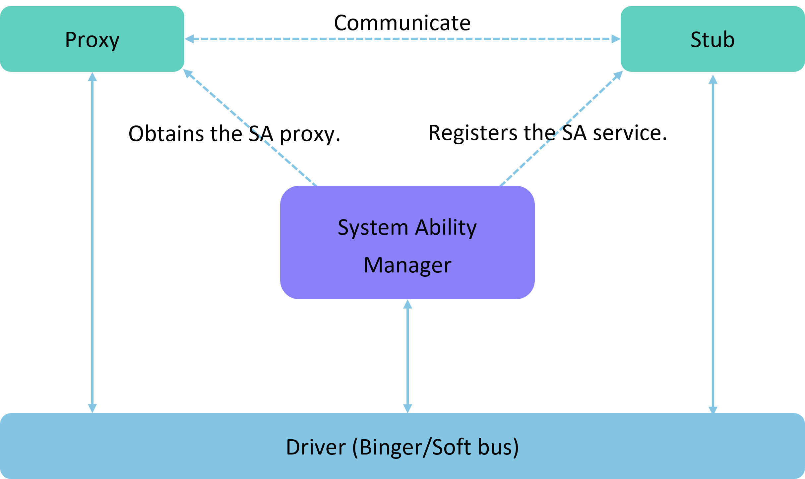

# Introduction to IPC Kit  

## Basic Concepts  

**IPC**: Inter-Process Communication within a device  

**RPC**: Remote Procedure Call between devices  

IPC/RPC is used to achieve cross-process communication. The difference lies in that IPC uses the Binder driver for intra-device cross-process communication, while RPC employs the soft bus driver for inter-device cross-process communication. The need for cross-process communication arises because each process has its own independent resources and memory space, preventing other processes from arbitrarily accessing them. IPC/RPC is designed to overcome this limitation.  

> **Note:**  
>  
> The Stage model cannot directly use the IPC and RPC described in this document. Below are typical usage scenarios for IPC and RPC:  
>  
> - **IPC** is typically used in background services, where an application's background service provides cross-process service invocation capabilities via the IPC mechanism.  
> - **RPC** is commonly employed in multi-device collaboration scenarios, enabling remote interface calls and data transfer through the RPC mechanism.  

## Implementation Principle  

> **Note:**  
>  
> - **Client**: The end requesting services, referred to as the client.  
> - **Server**: The end providing services, referred to as the server.  
>  
> In the IPC Kit, **Proxy** often denotes the service requester (client), while **Stub** represents the service provider (server). Subsequent documentation will not elaborate further on Proxy and Stub.  

IPC and RPC generally adopt the **Client-Server** model. During usage, the requesting client process obtains a **Proxy** of the server process and uses this proxy to read/write data for inter-process communication. More specifically:  
1. The client first creates a proxy object for the server, which mirrors the server's functionality. To access a method in the server, the client simply invokes the corresponding method in the proxy object. The proxy then forwards the request to the server.  
2. The server processes the received request and returns the result to the proxy object via the driver.  
3. Finally, the proxy object relays the result back to the client.  

Typically, the **Stub** registers **System Abilities (SA)** with the **System Ability Manager (SAMgr)**, which manages these SAs and provides relevant interfaces to clients. To communicate with a specific SA, the client must first obtain its **Proxy** object from SAMgr and then use this proxy for communication.  

During the entire communication process:  
- If **IPC** is used, it relies on the **Binder driver**.  
- If **RPC** is used, it depends on the **soft bus driver**.  

As illustrated below:  

  

## Constraints and Limitations  

- For cross-process communication on a single device, the maximum data transfer size is **200KB**. For larger data volumes, use [Anonymous Shared Memory](../reference/IPCKit/cj-apis-rpc.md#class-ashmem).  

- **RPC does not support** subscribing to death notifications for anonymous Stub objects (Stub objects not registered with SAMgr).  

- **Cross-device Proxy objects cannot be passed back** to the device where their corresponding Stub object resides. In other words, a Proxy object pointing to a remote Stub cannot undergo secondary cross-process transfer within the local device.